# 003：开始使用Llama2模型 🚀

在本节课中，我们将学习如何开始使用Llama2模型。你将有机会亲自尝试Llama2模型，并探索一些提示它的方法。我们将重点介绍如何格式化输入提示，以及如何通过调整参数来控制模型的输出。

## 概述


Llama2模型的一个独特之处在于，在将输入提示发送给模型之前，需要对其进行格式化。我们将使用一种称为“指令标签”的推荐格式化方法。在本节中，你将要求Llama2帮助你为朋友写一张生日贺卡。

## 访问Llama2模型

在本课程中，我们创建了一个辅助函数，可以向任何Llama模型发起API调用。你可以将Llama模型视为你的个人助手，并让它帮助你为朋友写一张生日贺卡。

首先，让我们编写一个简单的提示，告诉Llama模型为我的朋友Andrew写一张生日贺卡。

```python
prompt = "Help me write a birthday card for my dear friend Andrew."
```

然后，我们调用辅助函数`llama`，并传入这个提示，最后打印出响应。

```python
response = llama(prompt)
print(response)
```

很好！它写出了一张不错的生日贺卡，并且称呼了我的朋友Andrew。

## 工作原理

现在我们来讨论一下这是如何工作的。你刚刚写了一个提示“帮我写一张生日贺卡”，并将其发送给了Llama模型。它返回了一张写好的生日贺卡。

那么，这个过程是如何发生的呢？刚才我们使用的是托管API服务。服务提供商托管并运行着Llama模型。当你调用辅助函数时，它会通过互联网向该服务发送一个API请求。服务将你的提示输入到Llama模型中，模型输出这张生日贺卡，然后托管服务通过互联网将该响应发送回给你。

托管API服务使得访问多个模型变得容易。在这个例子中，你刚刚提示的是拥有70亿参数的小型模型，但稍后你将看到，你也可以访问中型、大型模型以及Code Llama模型。

由于Llama模型是开放商业使用的，另一个选择是在你自己的云环境（如Amazon Web Services、Microsoft Azure或Google Cloud）上自行托管模型。第三个选择是，至少对于小型Llama模型的压缩版本，你可以直接下载模型并在你自己的个人电脑上运行。

重点是，由于Llama2是开放商业使用的，你有多种方式来访问Llama模型。不过，推荐使用托管API服务，部分原因是这种方式更容易上手，并且可以轻松地在多个模型之间切换。

## 托管API服务示例

目前有许多公司托管Llama模型，包括Amazon Bedrock、Anyscale、Google Cloud、Azure等等。在本课程中，你使用的是Together AI来访问Llama模型。Together AI目前允许你访问所有Llama2模型的变体，包括小型、中型、大型以及Code Llama模型。

## 提示格式化方法

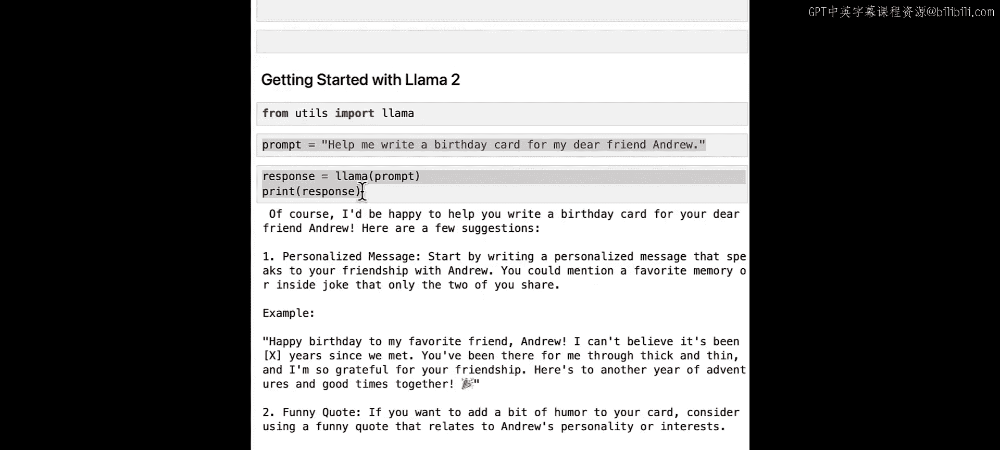

我想提醒你注意的是，在使用Llama模型时，推荐格式化提示的方法。提示在开头和结尾被指令标签包围。这些指令标签使用方括号，并且结束指令标签包含一个斜杠。

你使用的辅助函数被编写为在提示发送给模型之前，自动为你添加这些指令标签。让我们看一下代码，以便更清楚地了解这一点。

我们的辅助函数有一个参数，你可以设置它，以便在提示发送给模型之前查看实际格式化后的提示。让我们试一下。

```python
# 复制之前的提示
prompt = "Help me write a birthday card for my dear friend Andrew."
# 调用函数，并设置参数以显示格式化后的提示
response, formatted_prompt = llama(prompt, show_prompt=True)
print(formatted_prompt)
```

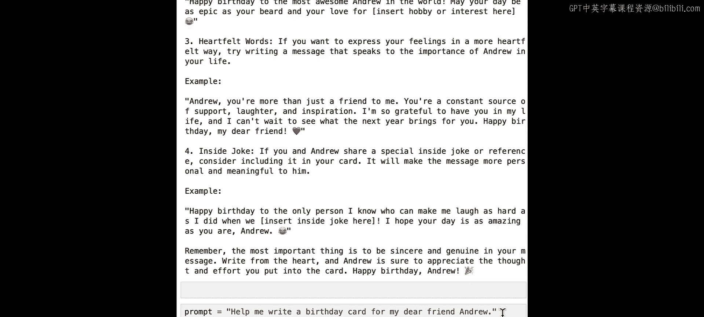

它输出了提示，你现在可以看到原始提示被开始和结束指令标签包围。它还会打印出你刚刚使用的模型。

## 聊天模型与基础模型

记得课程前面提到过，有常规的非聊天Llama模型，也有Llama聊天模型。对于大多数用例，我们推荐使用Llama聊天模型，而不是基础模型。

让我们通过询问每个模型“法国的首都是什么”来看看会发生什么。辅助函数允许你明确选择使用哪个Llama模型。默认情况下，辅助函数使用拥有70亿参数的小型聊天模型，但为了清晰起见，我们在这里明确设置它。

```python
# 使用聊天模型
response = llama("What is the capital of France?", model="llama-2-7b-chat")
print(response)
```

它说法国的首都是巴黎，这很好。现在让我们修改API调用，选择基础模型。

```python
# 使用基础模型
response = llama("What is the capital of France?", model="llama-2-7b", add_instructions=False)
print(response)
```

它没有回答我们关于法国首都的问题。相反，它问了我们关于其他国家首都的类似问题。基础模型学习根据前面的单词来预测下一个单词。当它看到“法国的首都是什么”时，一个合乎逻辑的延续就是询问其他国家首都的类似问题。

请记住，基础模型没有被训练来理解指令标签。因此，在使用基础模型时，不推荐添加指令标签。如果你好奇，可以在这里暂停视频，将`add_instructions`变量设置为`True`，看看会发生什么。

总之，我们推荐使用Llama 2模型的聊天版本，例如`llama-2-7b-chat`。

## 温度参数

如果你正在构建一个LLM应用程序，并且希望应用程序在给定相同输入提示的情况下提供一致的响应，那么你可以将温度设置为`0`，以使Llama模型的行为具有确定性。

默认情况下，本课程的辅助函数将温度设置为`0`。这意味着如果你给模型相同的提示两次，每次你都可以预期得到几乎相同的响应。

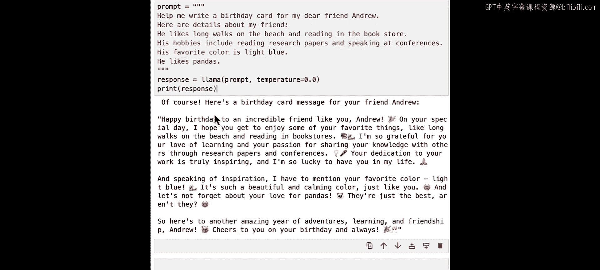

现在，我们将添加更多细节，使生日贺卡更个性化地针对我的朋友Andrew。

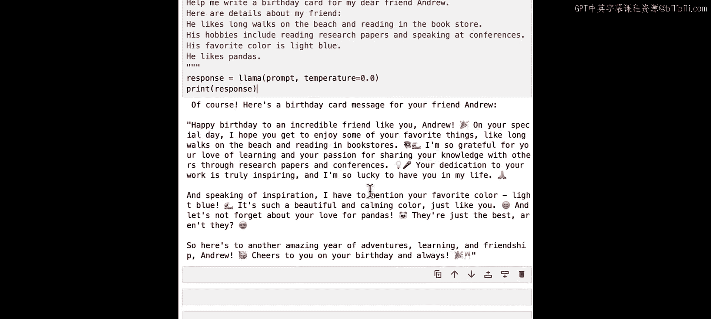

```python
prompt = """
Help me write a birthday card for my friend Andrew.
Here are details about my friend.
He likes long walks on the beach and reading in the bookstore.
His hobbies include researching papers and speaking at conferences.
His favorite color is light blue, and he likes pandas.
"""
response = llama(prompt, temperature=0)
print(response)
```

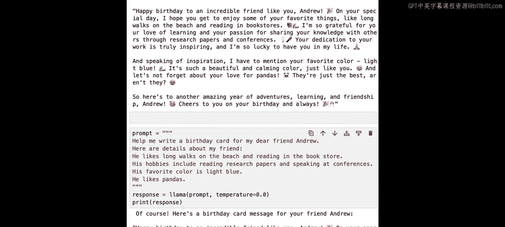

你得到了一个响应。让我们再次运行它，看看是否得到完全相同的响应。

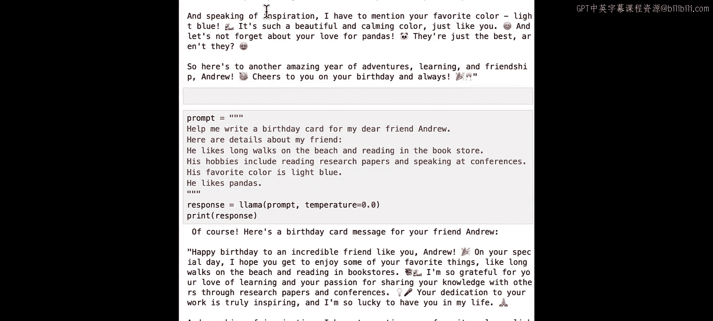

```python
response2 = llama(prompt, temperature=0)
print(response2)
```

它们很可能是相同的。现在我们知道如何通过将温度设置为`0`来从Llama模型获得一致的、确定性的输出。

## 增加温度以获得变化

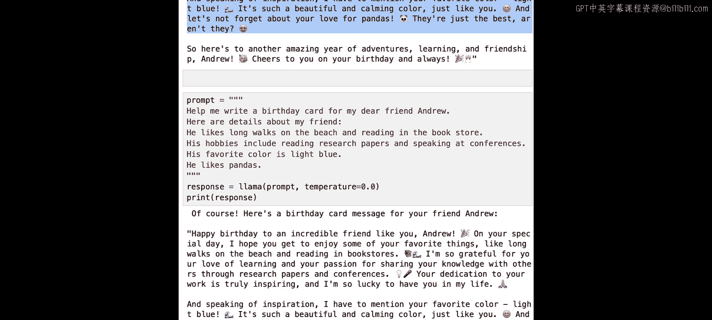

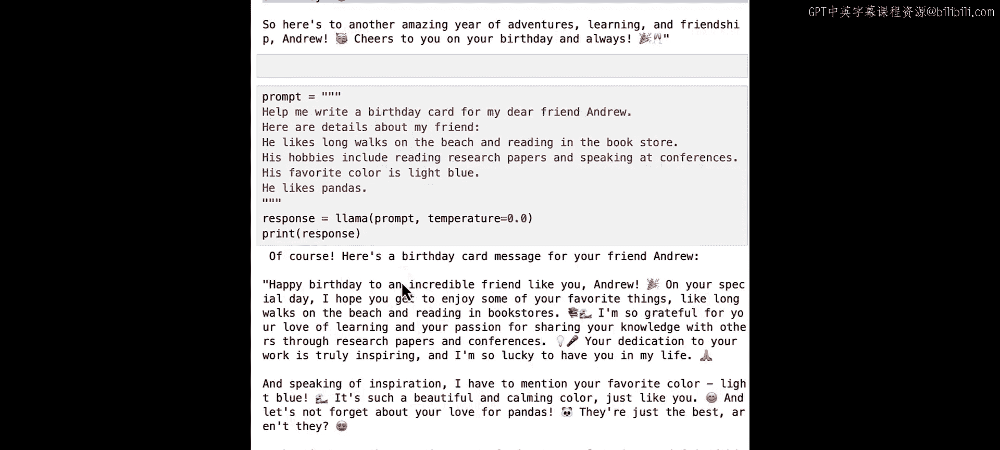

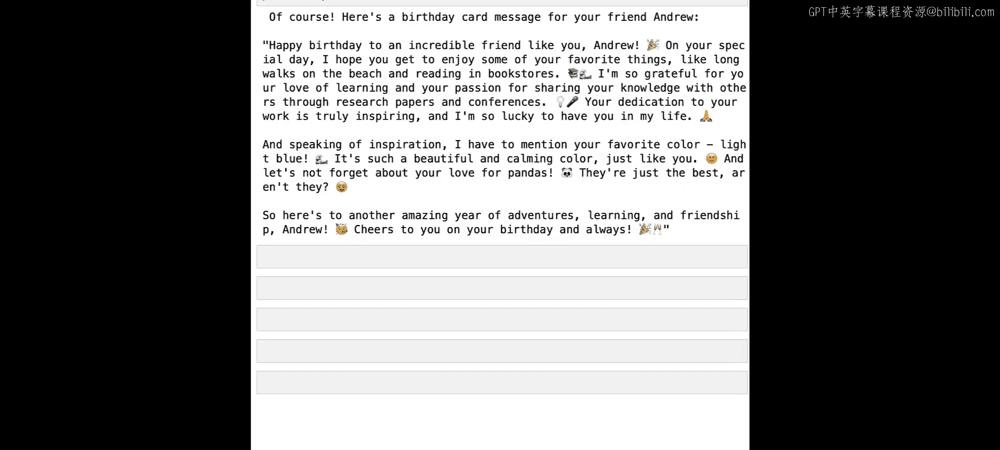

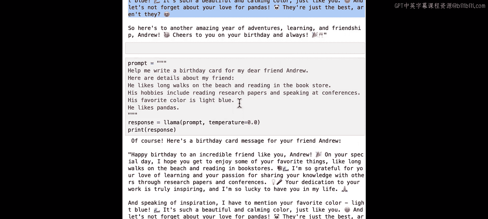

对于需要更多变化的用例，例如头脑风暴笑话，你可以将温度增加到`1.0`，以获得更随机和非确定性的输出。让我们提高温度，看看会发生什么。

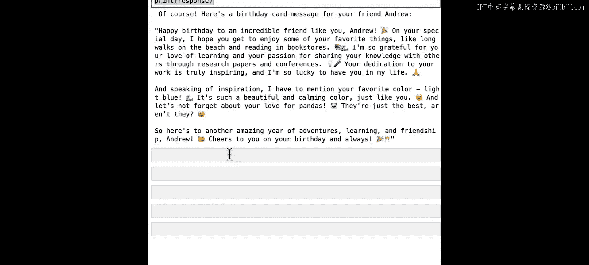

```python
response = llama(prompt, temperature=0.9)
print(response)
```

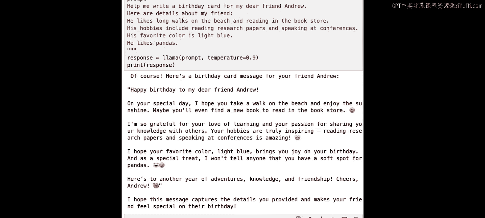

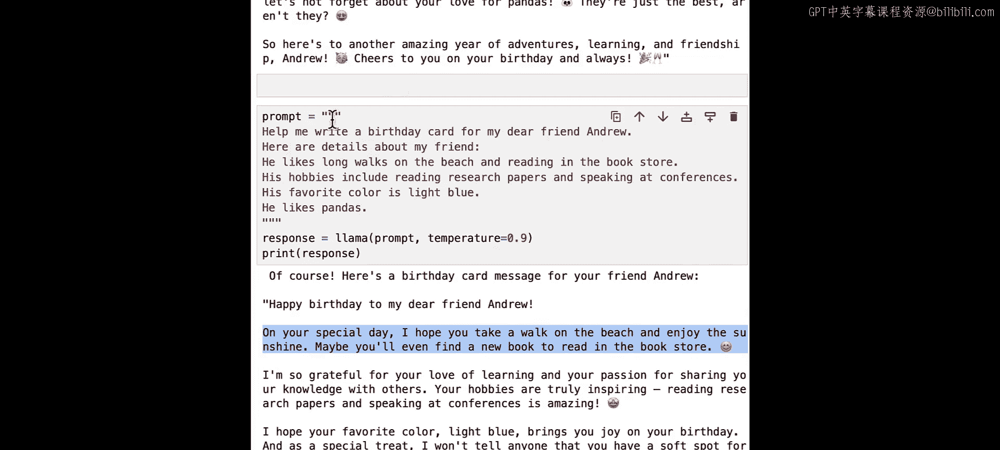

它给了我们一个回复。现在我将再次运行这个，看看响应是否会改变。理想情况下，它应该改变，因为我们将温度设置为了大于零。

```python
response2 = llama(prompt, temperature=0.9)
print(response2)
```

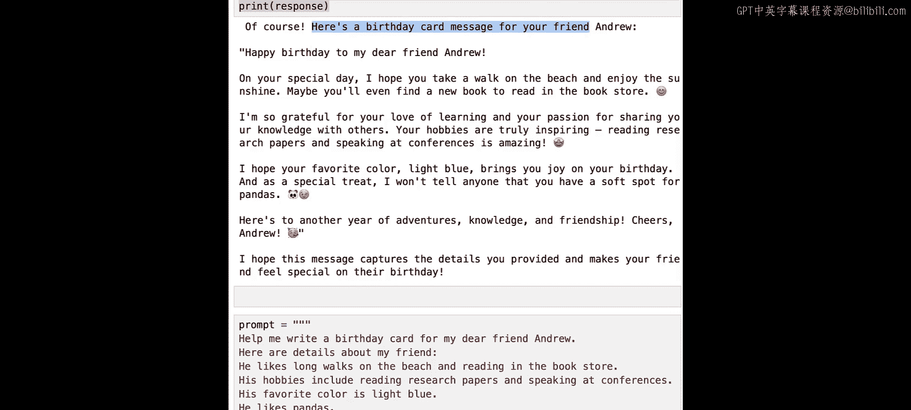

正如你所看到的，随着你改变温度，你可能会得到不同类型的响应。如果你想要一致的响应，请将温度设置为`0`。如果你想要更多变化，请将温度增加到`1.0`。

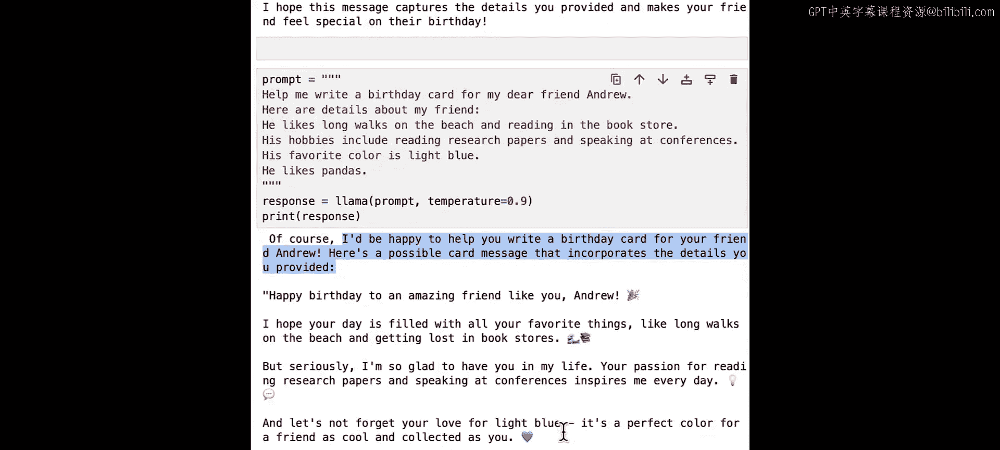

## 最大令牌数

你可以选择希望模型的输出响应有多长。辅助函数默认将`max_tokens`设置为`1024`。一个令牌可以是一个单词，通常是一个完整单词的一部分，平均一个令牌大约是四分之三个单词。因此，`1024`个令牌大约是`768`个单词。

让我们通过将`max_tokens`设置为`20`来减少模型的输出响应长度，看看会发生什么。

```python
response = llama(prompt, max_tokens=20)
print(response)
```

请注意，设置较小的令牌数并不会让模型给出更简洁的完整答案，它只是在中途停止了回答。

## 令牌限制

Llama2模型，像其他大型语言模型一样，对它们可以接收的输入令牌数量以及输出响应中的令牌数量有限制。

让我们给模型一个非常长的输入。在这种情况下，是一本名为《绒毛兔》的儿童书中的一些文本。你将要求它为你总结那本书。

```python
# 假设`velveteen_rabbit_text`包含了很长的文本
prompt = f"Give me a summary of the following text in 50 words:\n{velveteen_rabbit_text}"
response = llama(prompt)
print(response)
```

发生了什么？模型没有给出响应，而是返回了这个错误消息，指出输入令牌加上最大新令牌（即输出响应令牌的数量）必须小于或等于`4097`个令牌。它进一步指出有`3974`个输入令牌和`1024`个最大新令牌（输出令牌）。

让我们把这两个数字加起来：`3974 + 1024 = 4998`个令牌，这超过了Llama模型可以处理的`4097`个最大令牌数。

对于Llama 2，输入提示加上输出响应的总和最多可以是`4097`个令牌。这在实践中意味着什么？这意味着如果你有一个非常大的输入提示，你得到的输出响应就会更小。同样，如果你要求一个很长的输出响应，那么你可能需要注意你的输入提示有多长。

让我们看看是否能在`4097`个令牌的限制内，以便我们仍然可以总结那本书。我们可以减少辅助函数中的`max_tokens`。`max_tokens`默认设置为`1024`，但我们可以选择其他值。

回想一下，输入提示有`3974`个令牌。让我们计算一下：`4097 - 3974 = 123`。这意味着我们还剩下`123`个令牌可用于模型的响应。让我们将`max_tokens`设置为`123`。

```python
response = llama(prompt, max_tokens=123)
print(response)
```

这起作用了。我们得到了一个输出响应，而不是错误消息。请注意，由于我们将`max_tokens`设置为`123`，输出响应相当短，限制在`123`个令牌内。

让我们检查一下，如果你将输出响应设置为长于`123`个令牌会发生什么。如果你将`max_tokens`设置为`124`会发生什么？

```python
response = llama(prompt, max_tokens=124)
print(response)
```

我们得到了一个错误消息，这是预期的。在课程的后面，你将看到一组可以处理超过这些Llama模型令牌长度20倍的Llama模型。

## 后续问题

如果你像与人聊天一样与Llama模型聊天，你可能会问一个后续问题或提出请求。让我们看看如果你要求它在生日贺卡中添加一个细节会发生什么。

```python
# 首先获取初始响应
prompt1 = "Help me write a birthday card for my friend Andrew. He likes pandas."
response1 = llama(prompt1)
print(response1)

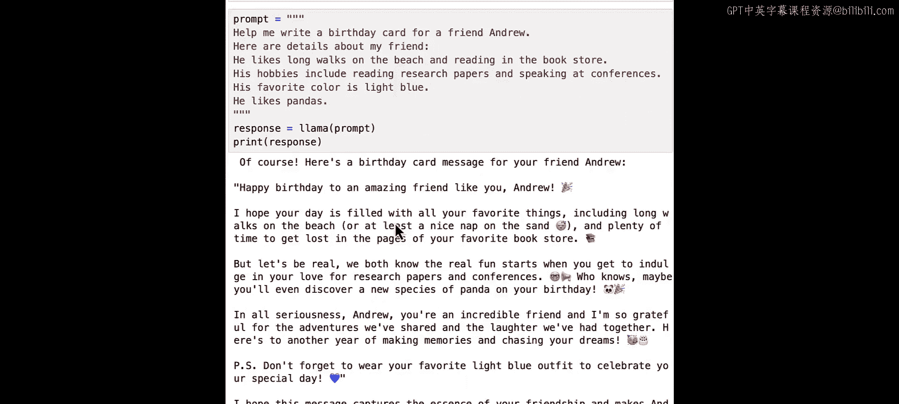

# 然后问后续问题
prompt2 = "Oh, he also likes teaching. Can you rewrite it to include that?"
response2 = llama(prompt2)
print(response2)
```

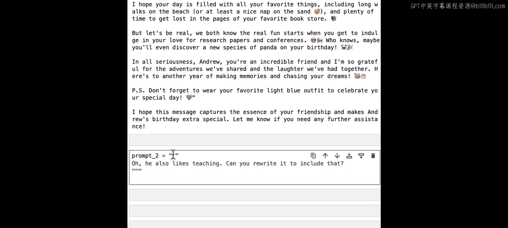

我们可以看到，LLM的回答对Andrew和他的其他爱好、兴趣没有任何记忆。它也不记得我们要求它写一张生日贺卡。在下一课中，你将看到我们如何处理这个问题，以给模型提供适当的上下文。

现在，尝试让模型帮助你完成其他写作任务。也许你可以请它帮你起草一封发送给客服的电子邮件，询问你有关某个产品的问题；或者你可能需要一些帮助，为你在朋友婚礼上发表的演讲写稿子。

## 总结

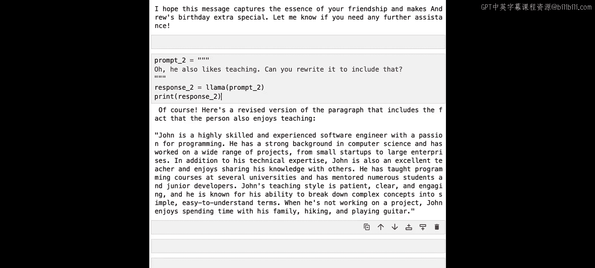

在本节课中，我们一起学习了如何开始使用Llama2模型。我们介绍了如何通过托管API服务访问模型，以及如何正确格式化提示（使用指令标签）。我们比较了聊天模型和基础模型的不同行为，并推荐使用聊天模型。我们还探讨了如何通过调整`temperature`参数来控制输出的随机性和一致性，以及如何通过设置`max_tokens`来控制输出长度。最后，我们了解了模型的令牌限制，并尝试了提出后续问题。这些基础知识将帮助你更有效地与Llama2模型进行交互。