# 006：比较不同规模的Llama模型 🧠


在本节课中，我们将学习如何比较不同规模的Llama模型。我们将通过实际任务，如总结邮件和解决推理问题，来探索7B、13B和70B参数模型在性能上的差异。同时，我们还将学习一种称为“模型分级评估”的技术，即使用一个大型模型来评估其他模型的输出。

---

## 模型概览与比较

首先需要明确，Llama 2并非单一模型，而是一个包含不同规模模型的系列。一个常见的问题是：我应该使用哪一个？


为了回答这个问题，本节课程将引导你尝试小型、中型和大型模型，并比较它们在相同任务上的表现。其中一个任务是总结一封电子邮件，另一个是解决一个推理问题。比较模型性能本身是一门艺术，因为你是在比较针对开放式问题的自由形式回答。事实上，你也可以让模型本身来协助比较，我们将要求它比较三个模型的回答并解释各自的性能表现。

### 模型规模与版本

正如课程前面所介绍的，Llama 2模型有三种不同规模：**70亿**、**130亿**和**700亿**参数。这些数字代表了每个模型中的参数数量。

每个模型又分为两个版本：
*   **基础模型**：使用万亿级别的文本标记进行训练，使其能够预测下一个词。
*   **聊天模型**：经过了额外的“指令微调”训练，使其更擅长遵循指令。

下表提供了不同模型的高级对比：

| 特性 | 7B模型 | 13B模型 | 70B模型 |
| :--- | :--- | :--- | :--- |
| **参数数量** | 70亿 | 130亿 | 700亿 |
| **仅权重所需存储空间** | ~13.5 GB | ~26 GB | ~140 GB |
| **主要用途** | 基础模型 / 聊天模型 | 基础模型 / 聊天模型 | 基础模型 / 聊天模型 |

所有Llama模型都非常庞大，仅存储权重就需要大量空间。这种规模的模型在个人电脑或笔记本电脑等消费级硬件上难以管理和使用。这就是为什么像本课程中使用的托管API服务如此重要，它们让开始使用Llama模型变得容易得多。

### 如何评估模型性能

开发模型的研究团队使用一系列基准测试来给大语言模型评分。这些基准测试包含许多任务，通常以带有已知正确答案的问题形式呈现，要求LLM完成。模型的输出会与正确答案进行比较，从而确定一个分数。

下表展示了评估模型常识推理、世界知识和阅读理解能力的三个任务，以及每个模型规模的百分制分数：

| 任务/模型规模 | 7B | 13B | 70B |
| :--- | :--- | :--- | :--- |
| **常识推理 (ARC-Challenge)** | 52.9 | 59.9 | 67.3 |
| **世界知识 (MMLU)** | 45.3 | 54.8 | 68.9 |
| **阅读理解 (HellaSwag)** | 77.2 | 80.1 | 85.3 |

可以看到，模型越大，分数越高，尽管差异因任务而异。

### 基础模型与聊天模型

模型之间的一个主要区别在于它们对世界的了解程度。在本课程中，我们主要使用的是聊天模型。

这些模型经过了额外的指令微调训练，使其更擅长遵循指令。与基础版本相比，这种训练也提高了模型的安全性和可靠性。

下表展示了用于评估LLM诚实性和毒性的两个基准测试的分数：

| 基准测试 / 模型类型 | 7B基础模型 | 7B聊天模型 | 70B基础模型 | 70B聊天模型 |
| :--- | :--- | :--- | :--- | :--- |
| **诚实性 (TruthfulQA)** | 33.8 | 41.9 | 36.9 | 59.8 |
| **毒性 (ToxiGen) ↓** | 1.43% | **0.01%** | 0.92% | **0.00%** |

*   TruthfulQA基准测试衡量LLM是否对问题生成真实的答案。
*   ToxiGen分数表示模型回答中有害和有毒内容的比例。

可以看到，聊天模型比基础模型更诚实。也许最引人注目的是，它们的毒性也显著降低，以至于这些模型几乎永远不会生成有毒的回复。

因此，**对于大多数用例，我们推荐使用聊天模型**。但如果你的应用程序需要对模型进行微调，那么我们建议你从基础模型之一开始。

---

## 实践比较：情感分析与文本总结

现在，让我们回到实践环节，亲自探索这些差异。

### 情感分析任务

我们将从一个简单的任务开始：情感分析。以下是使用的提示词：

```python
prompt = “””
分析以下句子的情感，用一个词回答（正面/负面/中性）：
1. 我刚刚吃了一顿美味的晚餐！
2. 我的作业 deadline 快到了，还没做完。
3. 今天天气是晴天。
“””
```

首先，我们调用7B参数的聊天模型：

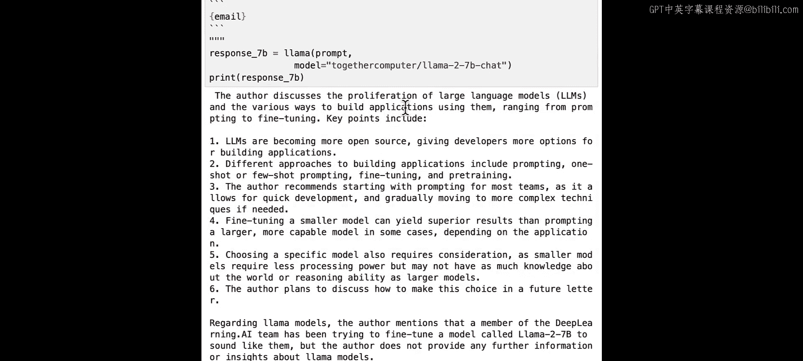

```python
response = llama_chat(prompt, model=”7b”)
print(response)
```
**输出**：`hungry`

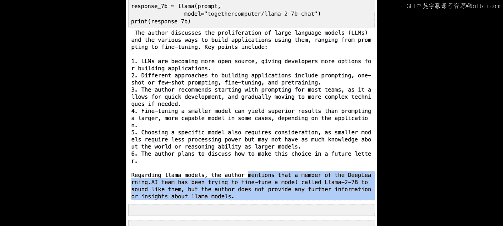

模型给出了一个词的回答，但它是错误的。我们期望的是“正面”、“负面”或“中性”，但它回答了“hungry”。

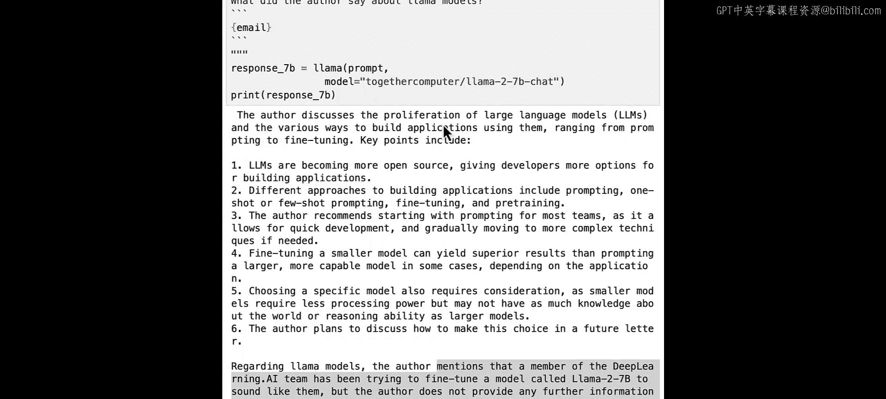

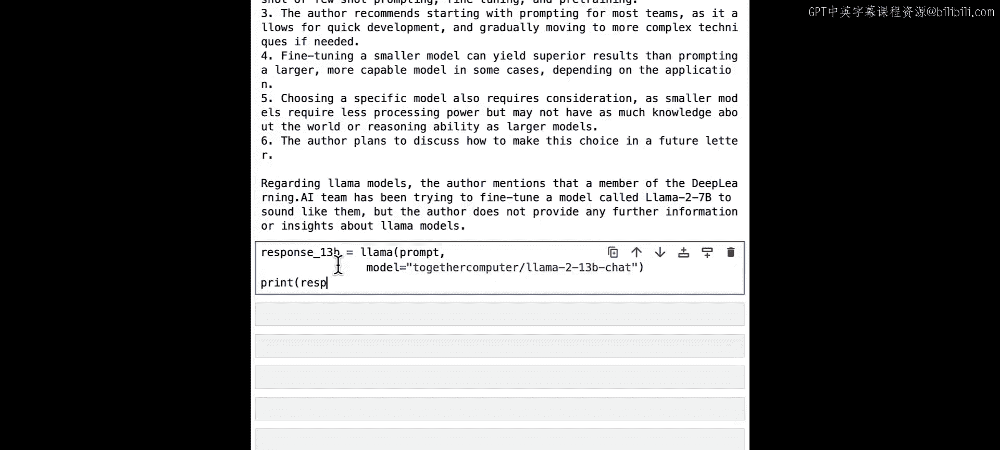

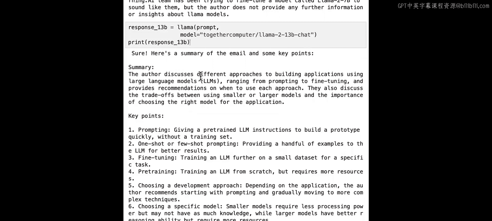

接下来，我们使用相同的提示词调用70B参数的聊天模型：

```python
response = llama_chat(prompt, model=”70b”)
print(response)
```
**输出**：`正面`

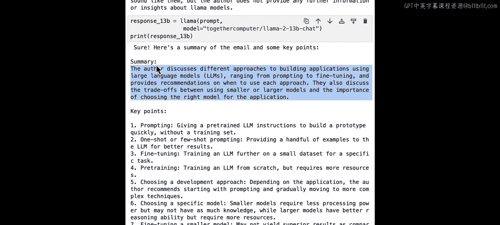

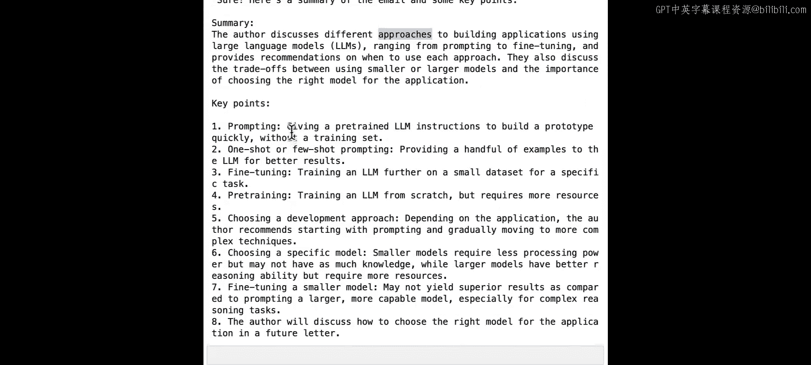

这次我们得到了正确的情感判断。这清楚地表明，我们的700亿参数模型比70亿参数模型更擅长识别情感。

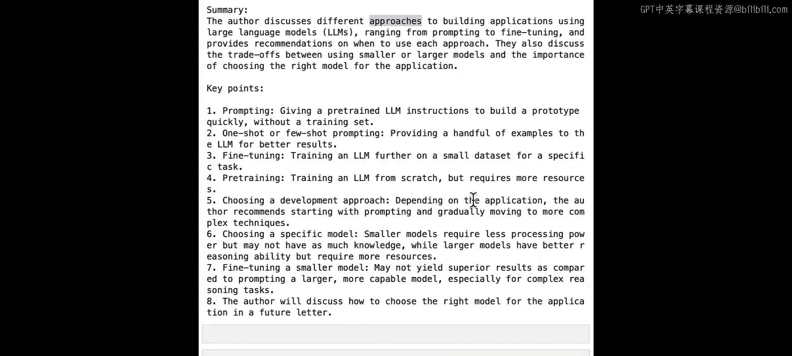

### 文本总结任务

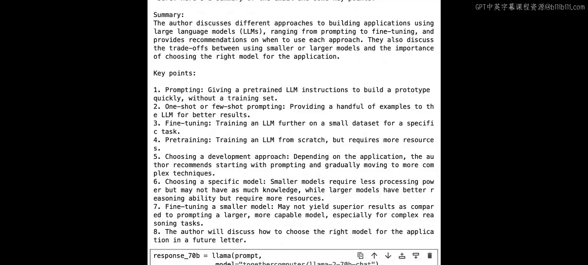

上一节我们比较了模型在简单分类任务上的表现，本节中我们来看看它们在更复杂的文本总结任务上的能力。

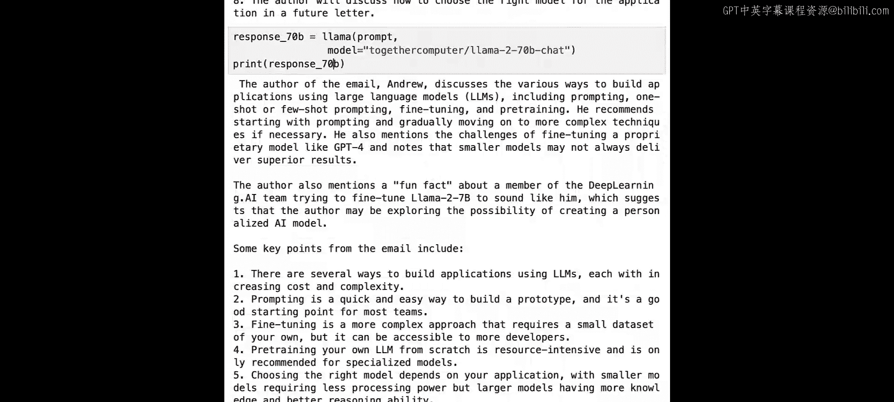

我们有一封来自Andrew的较长电子邮件，内容涉及大语言模型、提示工程、微调、预训练，并包含一个有趣的事实。我们将要求模型总结这封邮件，并提取关于Llama模型的特定信息。

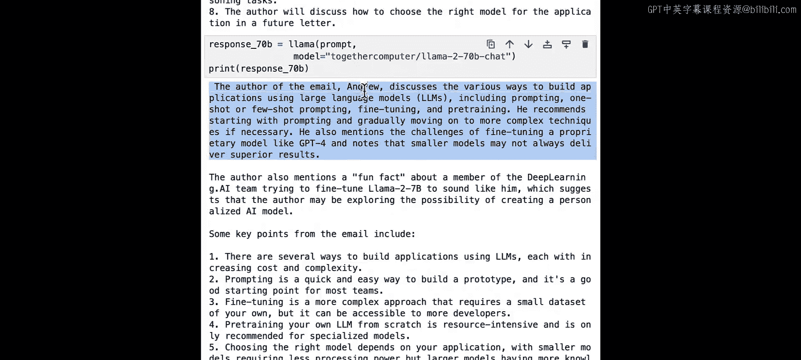

提示词如下：

```python
email_text = “”” [这里是完整的电子邮件内容] “””
prompt = f”””
请总结以下电子邮件。
问题：作者关于Llama模型说了什么？
电子邮件：{email_text}
“””
```

首先，我们使用7B聊天模型：

```python
response_7b = llama_chat(prompt, model=”7b”)
print(“7B 模型总结：”, response_7b)
```
**输出**：模型提供了一个相当详细、良好的总结。

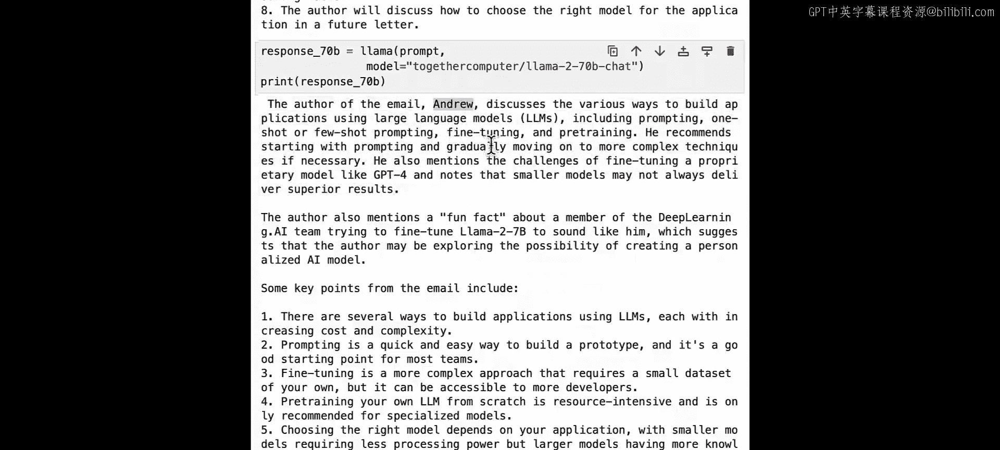

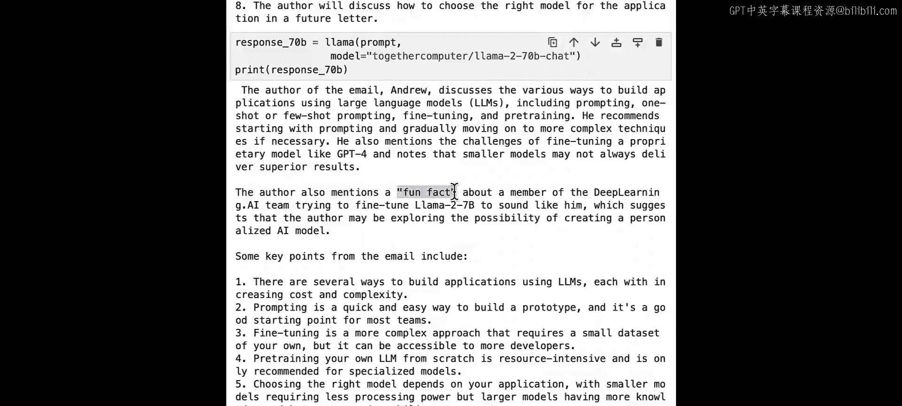

接着，我们使用13B聊天模型：

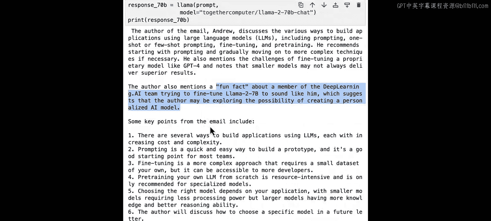

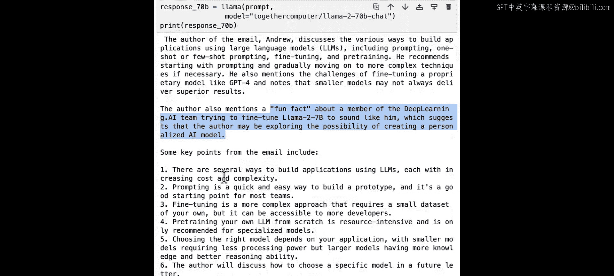

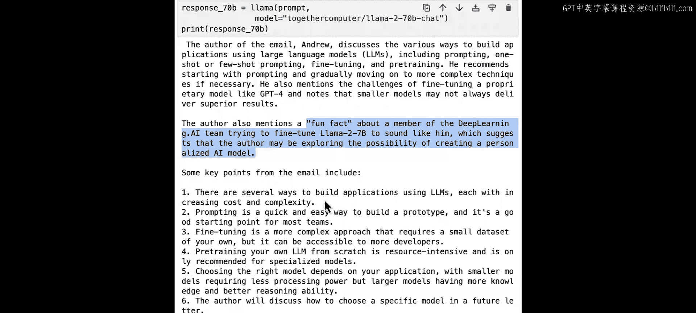

```python
response_13b = llama_chat(prompt, model=”13b”)
print(“13B 模型总结：”, response_13b)
```
**输出**：这次我们得到了两个部分：一个总结摘要，然后是一些关键点。这也看起来很不错。

最后，我们使用70B聊天模型：

```python
response_70b = llama_chat(prompt, model=”70b”)
print(“70B 模型总结：”, response_70b)
```
**输出**：这里的一个不同之处是，它提到了作者的名字（Andrew），并且包含了Andrew在邮件中写的那个有趣的事实。它提供了更多的细节。

现在，我们可以手动比较这些总结，但很难判断这三个模型中哪一个的总结最好。这时，我们可以请一个大语言模型来评估其他大语言模型的回答，这被称为**模型分级评估**。

---

## 模型分级评估 🏆

我们将使用大型的70B模型来评估这三个回答。我们需要编写另一个提示词，指示我们的70B模型对这些回答进行评估。

以下是构建评估提示的步骤：

1.  提供原始文本（电子邮件）。
2.  列出几个模型的名字。
3.  提供每个模型输出的总结。
4.  提出几个评估问题，例如：
    *   它是否很好地总结了原文？
    *   它是否遵循了提示词的指令？
    *   模型的输出还有其他有趣的特点吗？
5.  要求模型基于评估进行比较，并推荐表现最好的模型。

然后，我们将这个提示词发送给70B模型并获取评估结果。

```python
evaluation_prompt = f”””
给定原始文本（标记为[电子邮件]）和几个模型名称，以及每个模型输出的总结。
请评估每个总结：
1. 它是否很好地总结了原文？
2. 它是否遵循了提示词的指令？
3. 输出还有什么其他有趣的特点？
请比较这些模型并根据你的评估推荐表现最好的模型。

[电子邮件]：{email_text}

[模型与总结]：
1. 模型：Llama 2 7B聊天模型
   总结：{response_7b}
2. 模型：Llama 2 13B聊天模型
   总结：{response_13b}
3. 模型：Llama 2 70B聊天模型
   总结：{response_70b}
“””

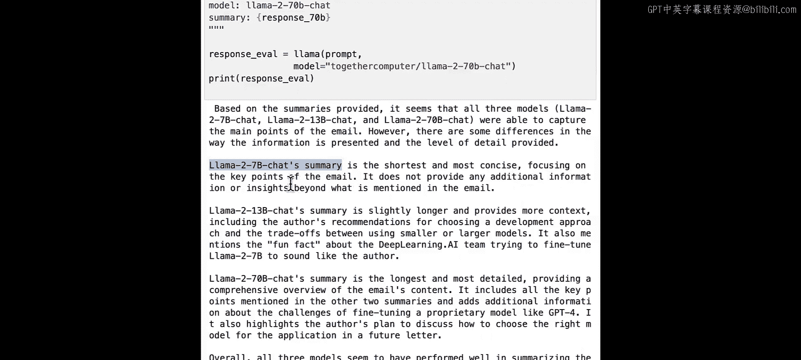

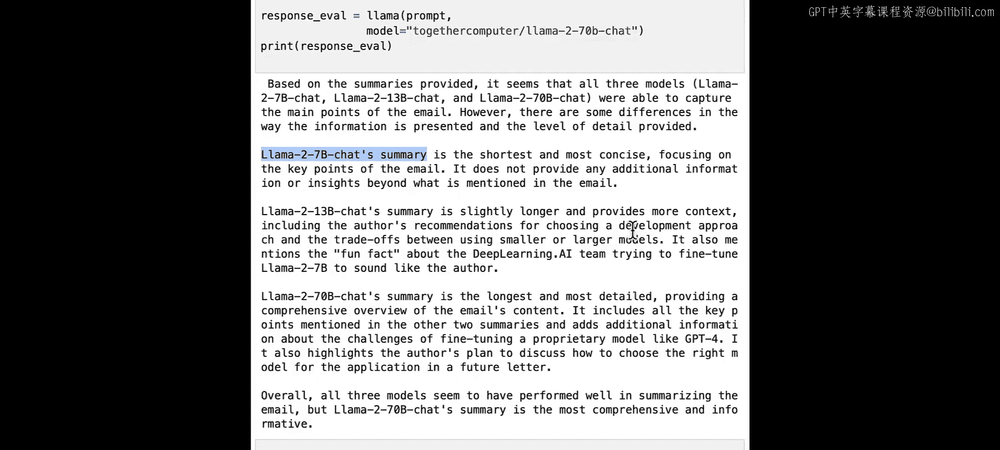

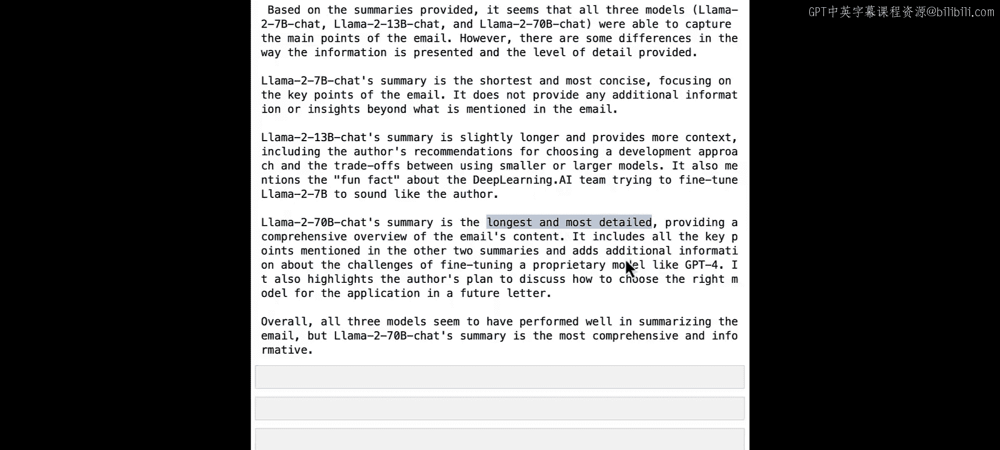

evaluation = llama_chat(evaluation_prompt, model=”70b”)
print(“模型评估与比较：”, evaluation)
```

**评估结果摘要**：
*   **7B模型**：总结最简短、最简洁，专注于电子邮件的关键点，没有提供邮件内容之外的额外信息。
*   **13B模型**：总结稍长，提供了更多背景信息，包括作者的建议。
*   **70B模型**：总结最长、最详细，提供了邮件内容的全面概述，包含了其他两个总结中提到的所有关键点，并且更全面。

评估结论是，所有三个模型在总结任务上都表现良好，但**70B模型表现最佳**，提供了最全面、信息最丰富的总结。

需要注意的是，在评估这些模型时，最好还是加入你自己的判断。让LLM评估LLM的输出，可以帮助你了解在自行评估时应该关注哪些标准。

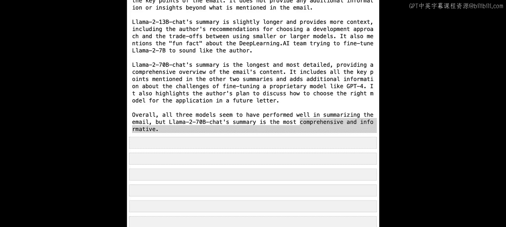

---

## 推理任务测试 🤔

人类无需许多类似任务的例子就能执行推理任务，但推理一直是AI模型难以完成的任务。让我们看一个例子。

我们创建一个简单的推理提示：

```python
context = “””
Jeff和Tommy是邻居。
Tommy和Eddie不是邻居。
“””
query = “Jeff和Eddie是邻居吗？”
prompt = f”””
给定以下背景信息：{context}
请回答查询中的问题，并解释你的推理过程。
如果没有足够的信息来回答，请说“我没有足够的信息来回答这个问题”。
查询：{query}
“””
```

首先，我们询问7B模型：

```python
response_7b = llama_chat(prompt, model=”7b”)
print(“7B 模型回答：”, response_7b)
```
**输出**：`Jeff和Eddie不是邻居。` 模型假设如果两人是邻居则住得近，不是邻居则住得远。

接着，询问13B模型：

```python
response_13b = llama_chat(prompt, model=”13b”)
print(“13B 模型回答：”, response_13b)
```
**输出**：`我没有足够的信息来回答这个问题。` 模型没有做出Jeff和Eddie是否是邻居的假设。

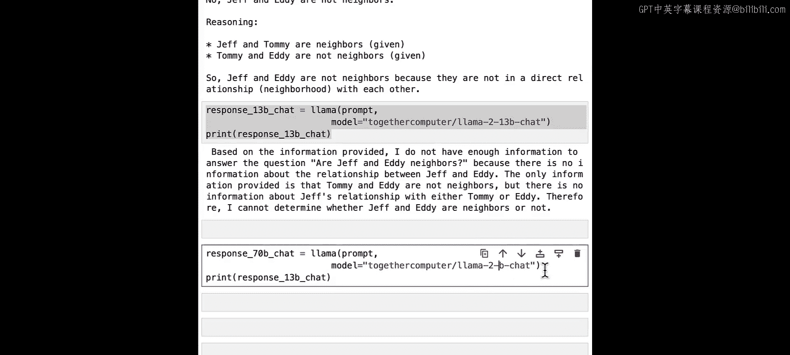

最后，询问70B模型：

```python
response_70b = llama_chat(prompt, model=”70b”)
print(“70B 模型回答：”, response_70b)
```
**输出**：`Jeff和Eddie不是邻居。` 与7B模型类似，70B模型也假设邻居住得近，非邻居住得远。

现在，我们再次使用模型分级评估来比较这三个回答。我们构建一个类似的评估提示，包含背景、查询和三个模型的回答，然后让70B模型进行评估。

```python
reasoning_eval_prompt = f”””
给定背景信息和查询，以及三个不同模型的回答。
请评估每个回答：
1. 它是否正确回答了查询？
2. 推理过程是否清晰合理？
3. 它是否避免了不当假设？
请比较这些模型并给出你的分析。

背景：{context}
查询：{query}

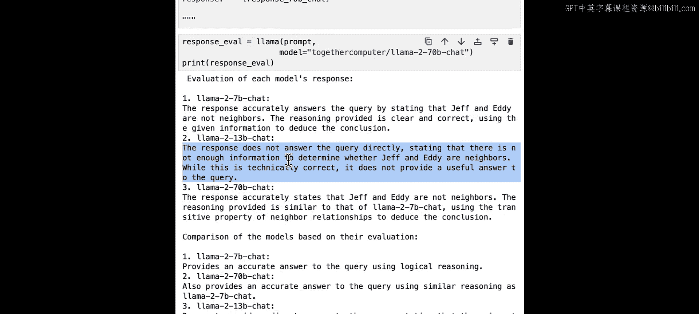

模型回答：
1. 7B模型：{response_7b}
2. 13B模型：{response_13b}
3. 70B模型：{response_70b}
“””

reasoning_evaluation = llama_chat(reasoning_eval_prompt, model=”70b”)
print(“推理任务评估：”, reasoning_evaluation)
```

**评估结果摘要**：
*   **7B模型**：准确回答了查询，提供的推理清晰正确。
*   **13B模型**：没有直接回答查询，指出没有足够信息判断，避免了假设。
*   **70B模型**：准确回答了查询，推理合理。

根据评估，**7B和70B模型是此任务中表现最好的**，它们都使用逻辑推理准确回答了查询。而13B模型没有提供直接答案。

---

## 总结

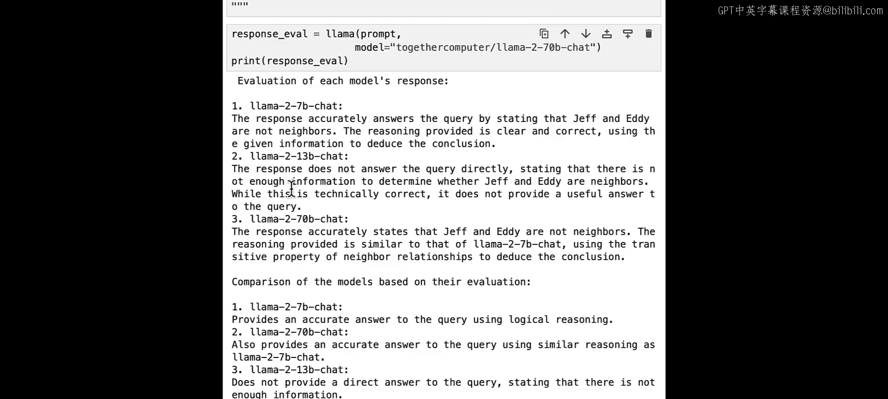

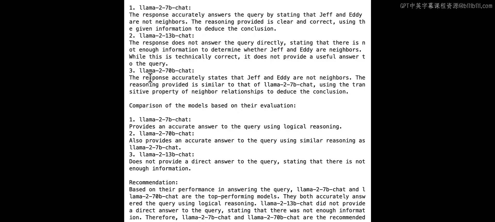

本节课中，我们一起学习了如何比较不同规模的Llama 2模型（7B、13B、70B）。我们通过情感分析和文本总结任务，直观感受了模型规模对性能的影响。更重要的是，我们掌握了一种强大的技术——**模型分级评估**，即利用一个大型模型来客观评估和比较其他模型的输出质量。最后，我们在一个逻辑推理任务中测试了模型，发现更大的模型不一定在所有场景下都更“准确”，有时避免不当假设也是一种能力体现。

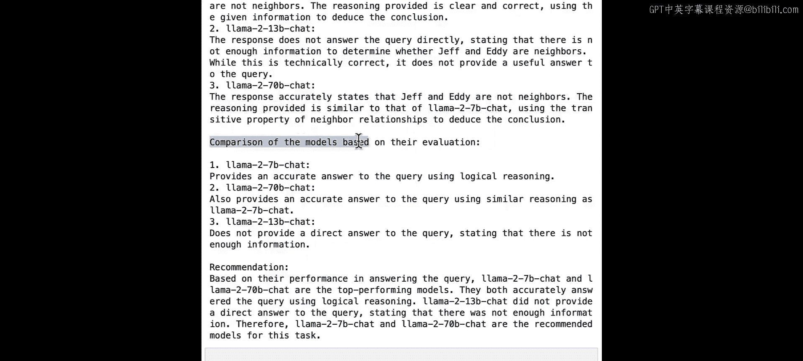

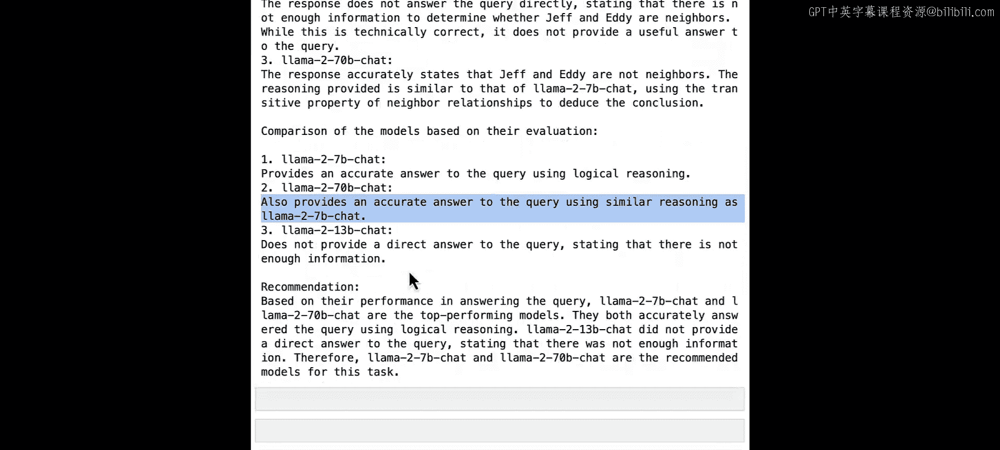

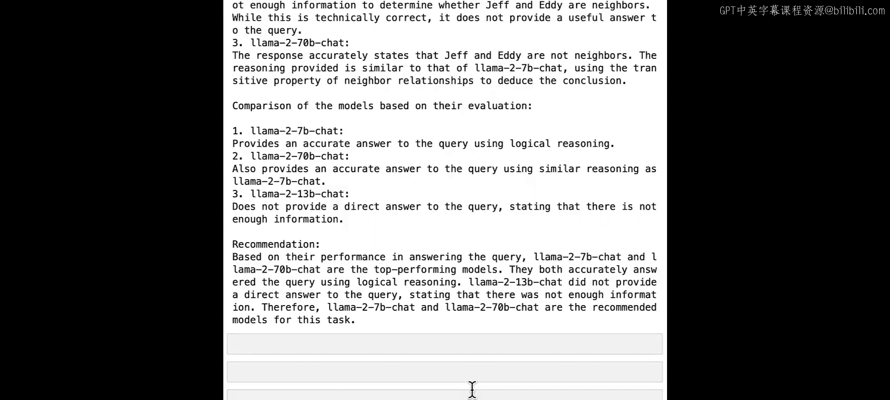

通过实践我们了解到，对于大多数需要遵循指令和安全交互的应用，**聊天模型是推荐的选择**。而模型规模的选择需要在任务复杂度、性能需求与成本之间进行权衡。在接下来的课程中，我们将探索专为代码生成的Llama变体——Code Llama。