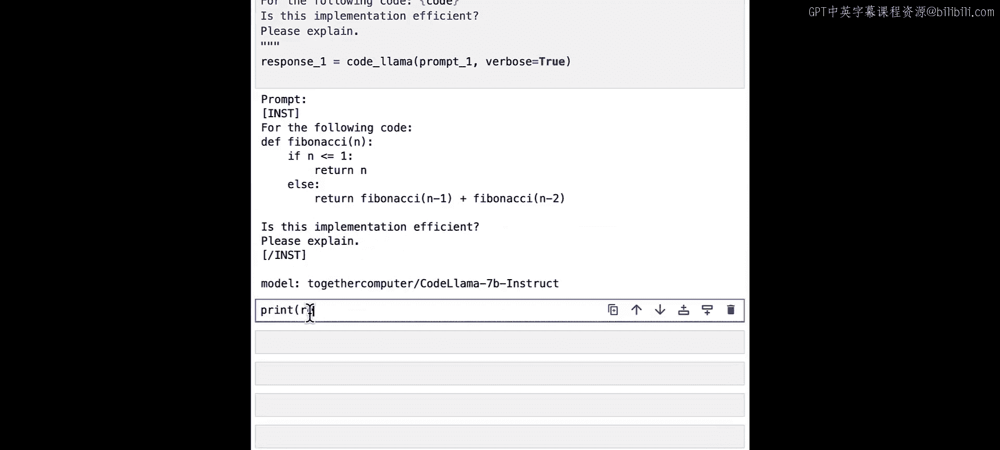
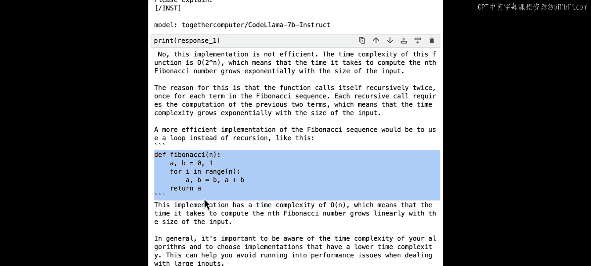
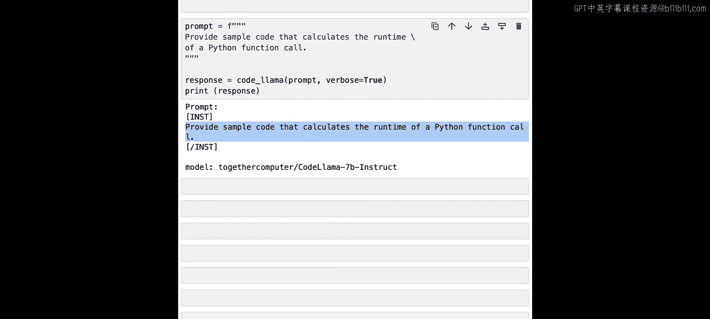
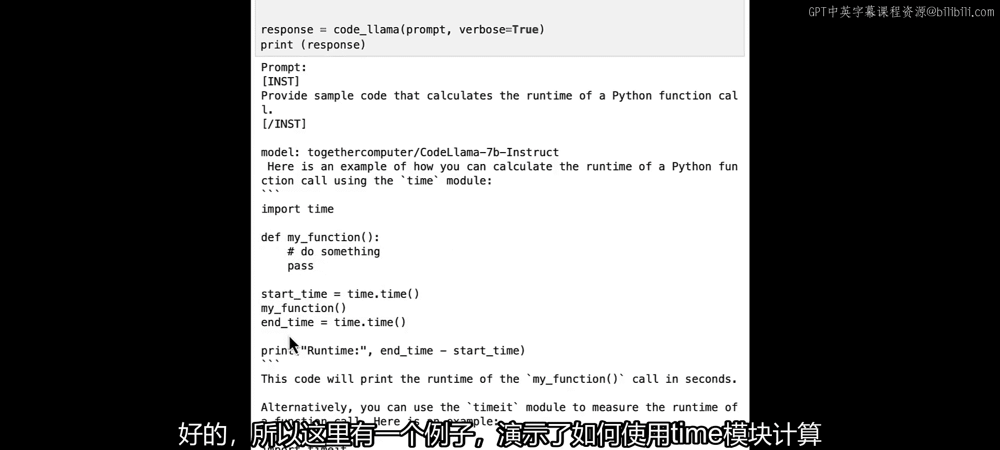
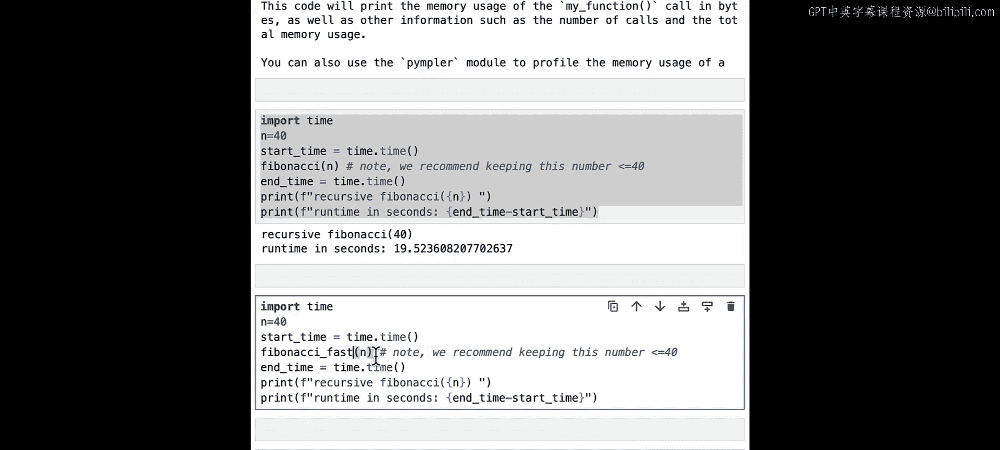
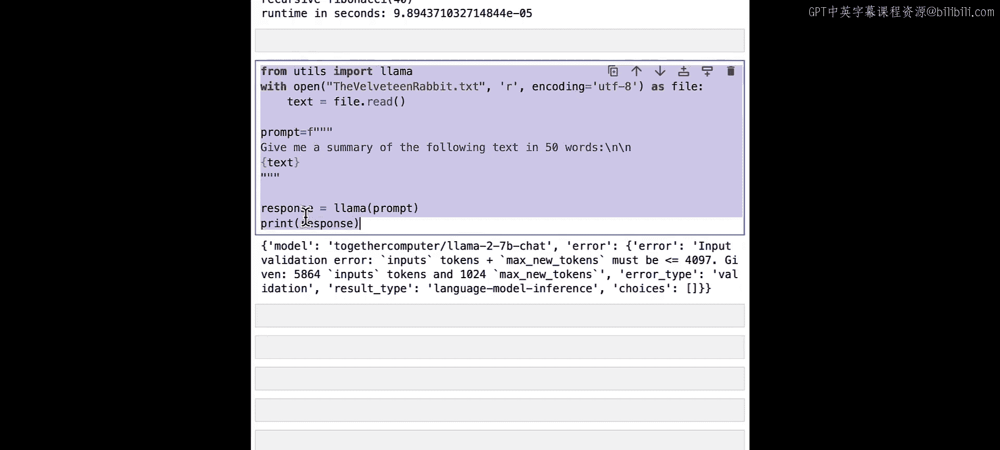
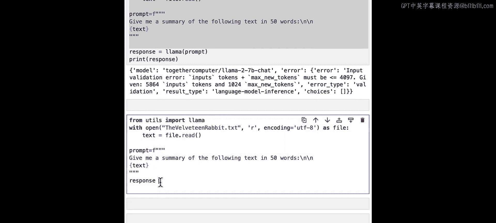
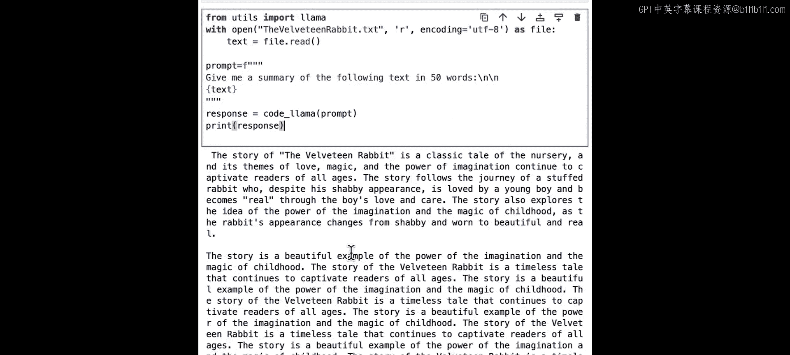

# 007：代码Llama模型 🦙💻

在本节课中，我们将学习专为代码任务设计的Llama模型——**Code Llama**。我们将了解它的不同变体、核心功能以及如何有效地使用它来编写、调试和解释代码。

---

## 概述


Code Llama是一系列专门用于处理代码的Llama 2模型变体。无论你是经验丰富的软件工程师还是编程新手，都可以使用Code Llama来协助编写、调试和解释代码。它的一个重要优势是拥有比常规Llama模型大20倍以上的输入文本容量，这意味着你可以将整个程序发送给它进行审查。即使你不编写代码，但需要一个能处理大量文本的模型，也可以考虑使用Code Llama，因为它同样能胜任非代码任务。

---

## Code Llama模型系列

上一节我们介绍了Code Llama的基本概念，本节中我们来看看它的具体模型构成。

Code Llama模型是基于本课程中一直使用的Llama 2模型进行变体开发的。这些模型经过了额外的专门训练，使其在编写、分析和调试计算机代码方面非常有用。需要注意的是，目前最大的Code Llama模型是340亿参数，而不是700亿。

通过不同的微调组合，创建了三种类型的Code Llama模型：
*   **基础Code Llama模型**：通用的代码模型。
*   **Code Llama指令模型**：擅长根据你提供的指令生成代码。
*   **Code Llama Python模型**：在Python语言上进行了额外的训练。如果你只使用Python编程，这是理想的选择。

所有Code Llama模型都可以通过Together AI API服务使用。你可以使用这里提供的名称来指定要使用的模型，我们也会在笔记中提供这些名称，以便你尝试不同的模型并比较结果。如果你使用其他API服务，请务必查阅其文档以了解如何指定模型选择。

---

## 提示结构

与Llama 2聊天模型类似，Code Llama模型也期望提示以特定方式构建。

如果你使用的是**Code Llama指令模型**，你需要像本课程前面所做的那样，用指令标签包裹你的提示。你需要将提示放在一对`[INST]`和`[/INST]`标签中。

另外两种Code Llama模型（基础Code Llama和Code Lama Python）则**不需要**在提示中使用任何标签。你可以直接包含提示文本本身。

---

## 实践：从计算到代码生成

在笔记本中尝试这些模型，并探索使用Code Llama的最佳实践。

正如我们在前几课中看到的，首先需要从`llama`包中导入`Llama`。这里我们使用`llama`包中的一个新函数`code_llama`，它默认使用最小的70亿参数Code Llama模型。

让我们从一个简单的数学问题开始，看看Code Llama表现如何。

```python
# 定义两个列表
temp_min = [50, 52, 48, 47, 49, 51, 46, 45, 44, 43, 42, 41]
temp_max = [60, 62, 58, 57, 59, 61, 56, 55, 54, 53, 52, 51]

# 构建提示
prompt = f"""
Minimum temperatures: {temp_min}
Maximum temperatures: {temp_max}
Which day has the lowest temperature?
"""
```

我们创建了一个提示，传入两个列表（最低温度和最高温度），然后询问模型哪一天的温度最低。模型需要遍历这些列表并告诉我们答案。

运行后，输出显示“最低温度是47度”。但检查列表后发现，存在比47度更低的温度（42度），所以这个答案不正确。

与其换用更大的模型，不如让Code Llama为我们编写一些代码来帮助回答这个问题。我们将用自然语言要求Code Llama编写一个Python代码，用于计算`temp_min`列表的最小值和`temp_max`列表的最大值。

```python
prompt2 = f"""
Write Python code that can calculate the minimum of the list `temp_min` and the maximum of the list `temp_max`.
"""
```

它成功编写了Python代码。代码定义了一个函数`get_min_max`，传入两个列表，并返回`temp_min`的最小值和`temp_max`的最大值。它还为我们编写了测试用例，这很棒。

现在，让我们尝试运行这段代码。

```python
# 复制模型生成的代码并运行
def get_min_max(temp_min, temp_max):
    return min(temp_min), max(temp_max)

result = get_min_max(temp_min, temp_max)
print(result)  # 输出: (42, 65)
```

它得到了42，这看起来是我们第一个列表中的最小值，是正确的。然后它得到了65，这似乎是第二个列表中的最高数字。因此，它能够生成代码，并且我们能够验证并运行这段代码。

所以，与其要求Llama直接进行数学计算，不如要求它编写能帮助你进行相同计算的代码，这样可能更容易、更可靠。

---

## 代码补全功能

Code Llama模型的一个强大用例是**代码补全**，即使用模型来完成你已在提示中开始的局部代码。Code Llama为此目的接受一个特殊的标记——填充标记，用尖括号之间的单词`<FILL>`表示。

你可以在提示中使用填充标记来指示模型应该完成你已有的任何代码。使用此标记的提示的一般格式如下：你从编写一些代码开始（可以是单行或多行），然后在希望模型为你完成代码的任何地方包含`<FILL>`标记。

让我们看一个简单的例子。

```python
prompt3 = """
[INST]
def star_rating(n):
    \"\"\"Return a rating given the number n, where n is an integer from 1 to 5.\"\"\"
    if n == 1:
        rating = "Poor"
    elif n == 2:
        rating = "Fair"
    elif n == 3:
        rating = "Good"
    elif n == 4:
        rating = "Very Good"
    <FILL>
    return rating
[/INST]
"""
```

我们定义了一个函数`star_rating`，并为n=1到4的情况提供了评级，然后在n=5的地方放置了`<FILL>`标记，期望Code Llama填充该部分的代码。

运行后，我们可以看到`<FILL>`标记被替换成了`elif n == 5: rating = "Excellent"`。前后的代码仍然保留，看起来它正确地填充了代码，同时保留了之前和之后提供的代码。

---

## 代码编写、调试与优化

我们的Code Llama模型可以做很多事情：编写代码、调试代码、解释代码以及使我们的代码更高效。

让我们看看如何编写斐波那契数列。如果你不知道什么是斐波那契数列，不用担心。这个数列是一个数字列表，其中每个数字（从第三个开始）是前两个数字的和（例如，0, 1, 1, 2, 3, 5, 8...）。我们将编写一个函数来计算第n个斐波那契数。这是一个经典的计算机科学问题，用于演示低效的算法如何耗费大量资源。

让我们从一个简单的提示开始，用自然语言要求Code Llama编写这个函数。

```python
prompt4 = """
[INST]
Write a Python function to calculate the nth Fibonacci number.
[/INST]
"""
```

Code Llama为我们编写了整个函数。它使用了递归（即函数调用自身）。它还提供了测试用例。例如，传入6（第六个数），根据数列0, 1, 1, 2, 3, 5, 8，答案是8，与测试用例的输出一致。

如果你没有接触过递归，不必担心。这种实现方法在算法入门课程中通常会学到。这种看似优雅的数学计算方法，即使对现代计算机来说，运行起来也可能需要很长时间。但有一个更好的方法来实现它。让我们看看如何使这段代码更高效。

首先，我们将获取生成的代码，然后创建一个新的提示，询问模型这段特定的代码是否高效，并请它解释。

```python
inefficient_code = """
def fibonacci(n):
    if n <= 0:
        return 0
    elif n == 1:
        return 1
    else:
        return fibonacci(n-1) + fibonacci(n-2)
"""

prompt5 = f"""
[INST]
For the following code:
{inefficient_code}
Is this implementation efficient? Please explain.
[/INST]
"""
```

模型正确地回答，它最初建议的递归方法是低效的，并正确解释了原因。有趣的是，它还提供了一个更高效的实现方案。



为什么LLM首先输出了低效的版本？很可能是因为这种递归实现在解释高效算法重要性的课程材料中非常常见，以至于计算斐波那契数的递归版本在Llama 2模型（可能大多数其他LLM也是如此）的训练数据中出现的频率很高。

让我们检查两种实现，看看它们是否有效。我们将复制第一种（递归）实现和第二种（高效）实现，并比较它们的运行时间。

首先，我们让Code Llama编写一个计算Python函数调用运行时间的代码。



```python
prompt6 = """
[INST]
Write code to calculate the runtime of a Python function call.
[/INST]
"""
```

它给出了使用`time`模块计算运行时的示例。我们可以用它来测试哪个函数更高效。



我们设置n=40（计算第40个斐波那契数），然后分别用递归函数和高效函数进行计算并计时。

```python
import time



# 测试递归函数
start = time.time()
result_slow = fibonacci(40) # 假设这是递归函数
end = time.time()
print(f"递归函数耗时: {end - start:.2f} 秒")

# 测试高效函数 (例如迭代法)
def fibonacci_fast(n):
    if n <= 1:
        return n
    a, b = 0, 1
    for _ in range(2, n + 1):
        a, b = b, a + b
    return b

start = time.time()
result_fast = fibonacci_fast(40)
end = time.time()
print(f"高效函数耗时: {end - start:.6f} 秒")
```

递归函数运行了大约19秒，而高效函数只用了不到一秒就运行完毕。可以看到，高效函数的速度显著快于递归函数。

---



## 超长上下文窗口

Code Llama可以接收更长的文本。它的输入提示容量比常规Llama模型大20倍以上。如果你是一名软件开发人员，这意味着你可以上传整个应用程序的代码并要求模型进行审查。但即使你不编写代码，也可以利用这个更长的上下文窗口来完成其他任务。

你可能记得在本课程前面部分，常规Llama模型无法总结《绒布小兔子》的文本，因为它超过了4096个令牌的输入窗口限制，导致错误。

现在，让我们要求Code Llama执行相同的任务，看看结果如何。我们将使用Code Llama来处理之前导致常规Llama出错的相同长文本。

```python
# 假设long_text是《绒布小兔子》的长文本内容
# 之前对llama模型的调用会失败
# response = llama(long_text) # 会报错

# 使用code_llama处理
response = code_llama(long_text)
```





我们得到了一个响应。因此，如果你的任务（无论是编码任务还是非编码任务）需要输入比常规Llama模型能处理的更多的文本，你可以尝试使用Code Llama。



---

## 总结


本节课中我们一起学习了Code Llama，一个专为代码相关任务设计的强大Llama模型系列。我们了解了它的三种主要变体（基础模型、指令模型和Python专用模型），并掌握了其提示结构的要求。通过实践，我们探索了如何使用Code Llama生成代码、进行代码补全、调试和优化代码（例如将低效的递归斐波那契函数优化为迭代版本）。最后，我们认识到Code Llama拥有超长的上下文窗口，使其能够处理远大于常规模型的文本，这不仅对代码审查有用，也适用于其他需要处理大量文本的任务。到目前为止，你已经见识了许多不同的Llama 2和Code Llama模型。当前Llama模型家族中剩下的主要组件之一是Llama Guard，它是Purple Llama的两个主要组成部分之一，我们将在下一课中学习。