# 009：辅助函数代码详解 🧩

在本节课中，我们将深入剖析之前课程中一直使用的那个便捷的辅助函数内部是如何工作的。我们将一步步地解读其代码，了解它如何与Together AI的API进行交互，并最终获取模型的响应文本。

## 概述

之前我们使用了一个封装好的辅助函数来调用Llama 2模型。本节我们将拆解这个“黑箱”，详细讲解其内部每一步操作，包括如何设置API请求、处理响应数据以及提取最终的文本输出。理解这个过程有助于你未来构建自己的API调用逻辑。

## 代码逐步解析

以下是辅助函数内部代码的详细步骤分解。

### 1. 设置API端点与密钥 🔑

首先，代码定义了访问Together AI API的URL地址。

```python
url = "https://api.together.xyz/v1/chat/completions"
```

接着，代码运行一段程序从本地计算机安全地获取API密钥。这里使用了`dotenv`库来管理敏感信息。

```python
import os
from dotenv import load_dotenv
load_dotenv()
api_key = os.getenv("TOGETHER_API_KEY")
```

**注意**：在课程环境中，出于安全考虑，打印出的`api_key`变量并非真实的密钥。如果你想在自己的计算机上使用此服务，需要前往Together AI官网注册账户并获取专属的API密钥。

获取密钥后，将其放入请求头（headers）字典中，并设置内容类型。

```python
headers = {
    "Authorization": f"Bearer {api_key}",
    "Content-Type": "application/json"
}
```

### 2. 构建请求数据 📦

接下来，需要选择要使用的模型并构建提示词。这里选择了较小的7B参数版本的Llama 2 Chat模型。

```python
model = "togethercomputer/llama-2-7b-chat"
```

然后，构建你的提示词，并为其添加上下文指令标签。

```python
prompt = "[INST] 请写一首关于春天的诗。 [/INST]"
```

设置生成文本的参数，例如“温度”（控制随机性）和最大生成长度。

```python
temperature = 0.7
max_tokens = 1024
```

最后，将模型、提示词和参数整合到一个名为`data`的Python字典中。

```python
data = {
    "model": model,
    "prompt": prompt,
    "temperature": temperature,
    "max_tokens": max_tokens
}
```

### 3. 发送请求并接收响应 📡

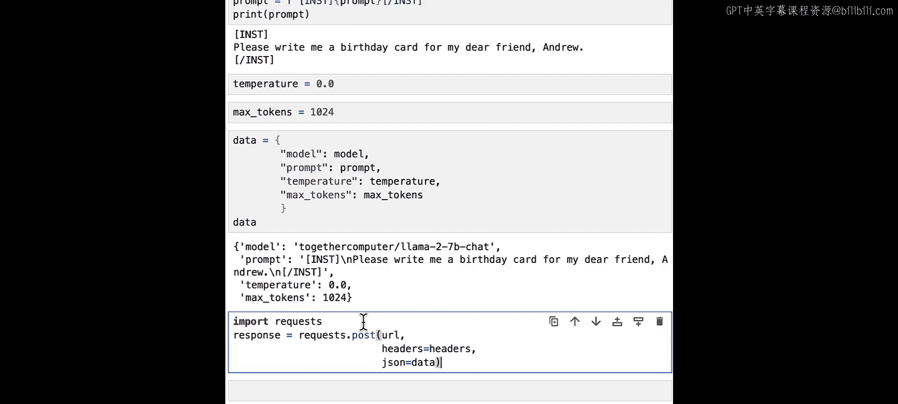

现在，将URL、请求头和请求数据传入`requests`库的`post`函数中。这个函数调用负责将你的提示词以及模型选择等信息通过互联网发送到托管的API服务。

```python
import requests
response = requests.post(url, headers=headers, json=data)
```

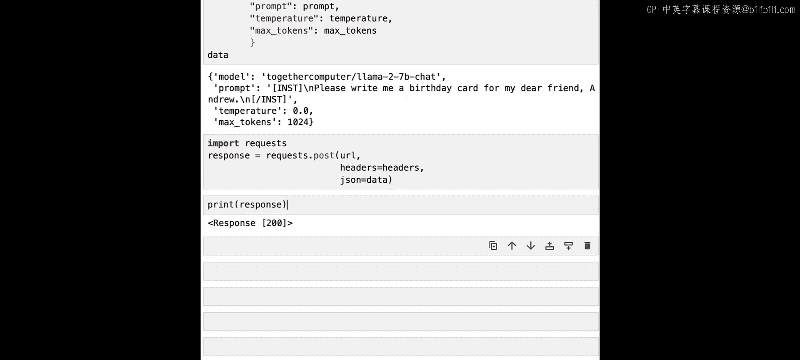

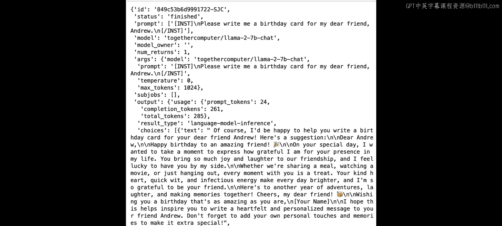

让我们打印出原始的响应对象。

```
<Response [200]>
```

初始的响应对象信息有限。为了查看具体内容，我们需要调用其`.json()`方法，将响应解析为Python字典。

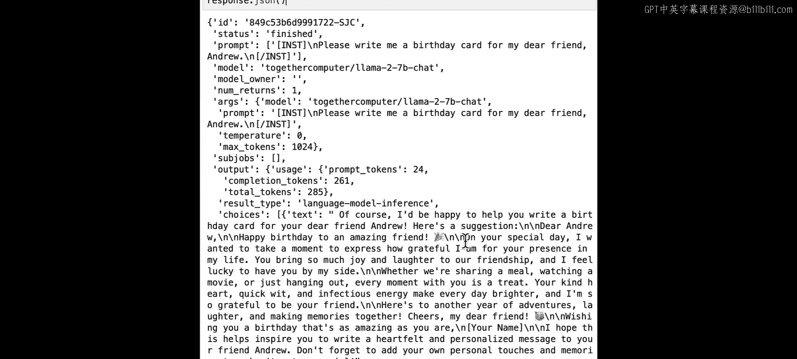

```python
response_dict = response.json()
print(response_dict)
```

解析后的输出是一个结构复杂的字典，可能难以阅读。但仔细观察，你会发现生成的文本存储在`output`这个键下。

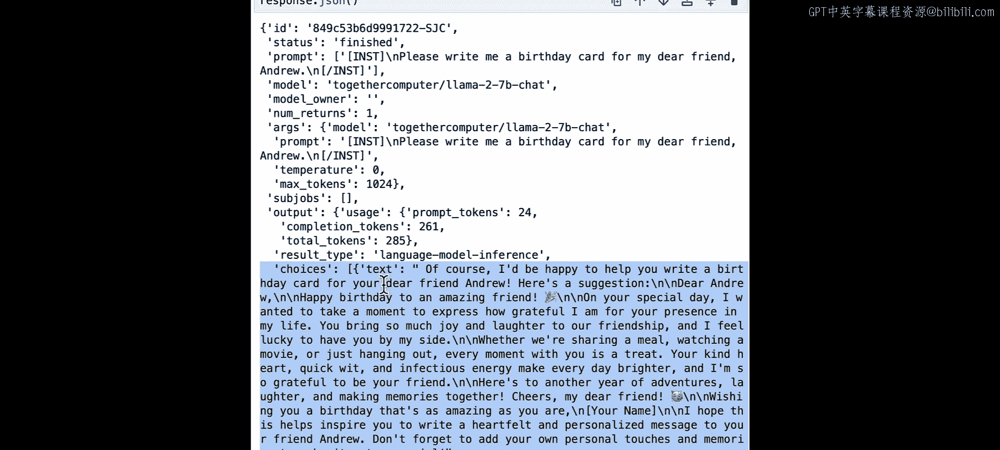

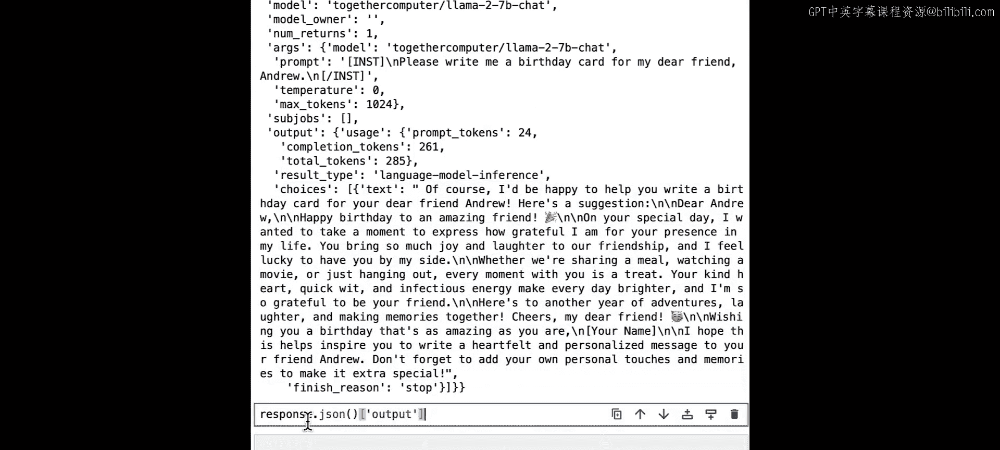

### 4. 提取生成的文本 📄

为了获取文本，我们需要逐层访问这个嵌套的字典结构。

首先，访问`output`键。

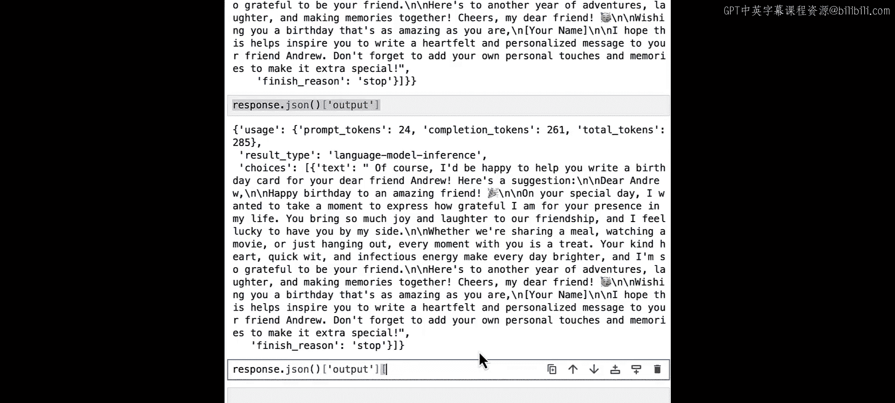

```python
output = response_dict['output']
```

输出仍然是一个字典。其中包含一个名为`choices`的键，我们需要访问它。


```python
choices = output['choices']
```

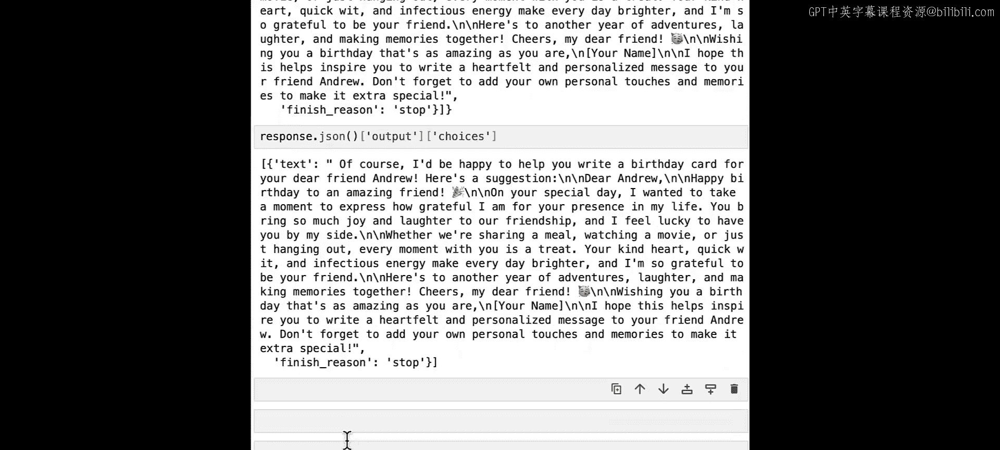

`choices`是一个Python列表。我们可以确认它是否只包含一个项目。

```python
print(isinstance(choices, list))
print(len(choices))
```

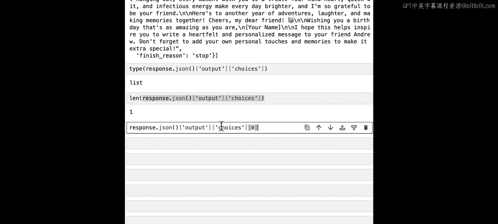

然后，我们获取这个列表中的第一个（索引为0）也是唯一的一个项目。

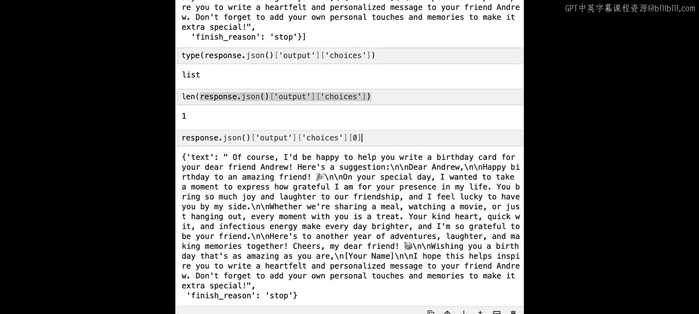

```python
first_choice = choices[0]
```

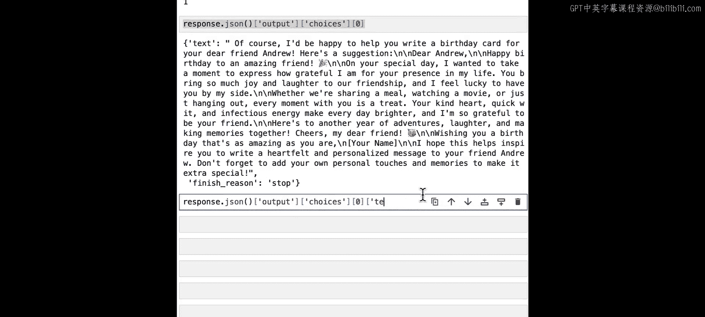

最后，从这个项目字典中访问`text`键，即可得到模型生成的最终文本。

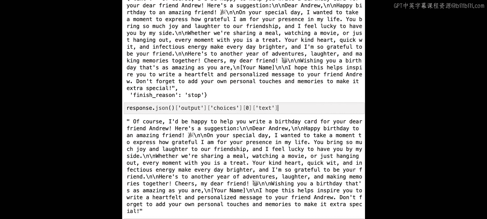

```python
generated_text = first_choice['text']
print(generated_text)
```

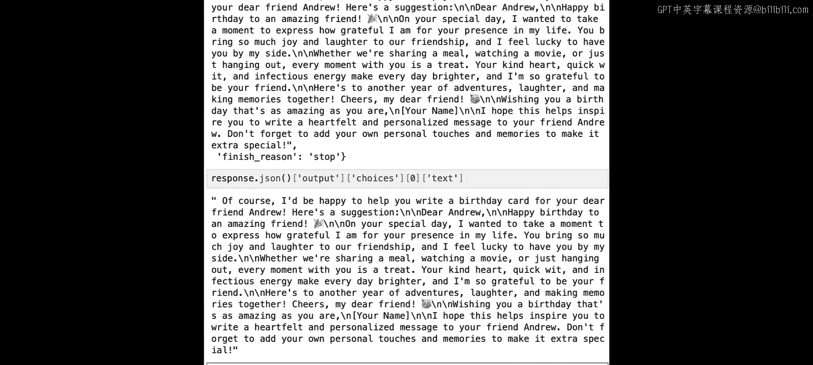

至此，我们成功提取出了模型生成的文本。这个过程与你之前使用的辅助函数的输出结果完全一致。

## 总结

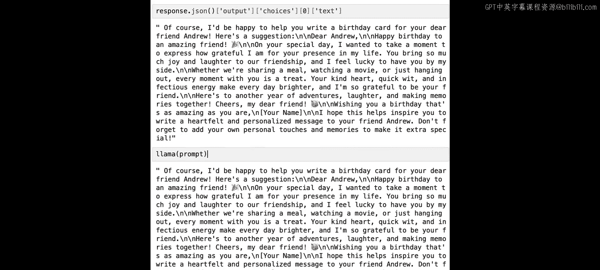

本节课中，我们一起详细拆解了调用Llama 2 API的辅助函数内部代码。我们学习了从设置API端点和密钥、构建包含模型和参数的请求数据、发送POST请求，到逐步解析复杂的JSON响应并最终提取出生成文本的完整流程。理解这些底层步骤，将为你未来灵活使用和自定义大语言模型API打下坚实的基础。