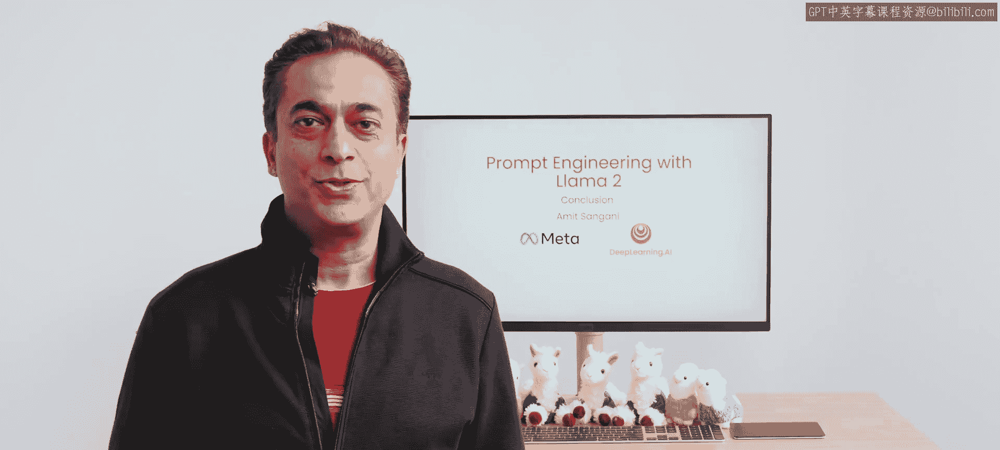
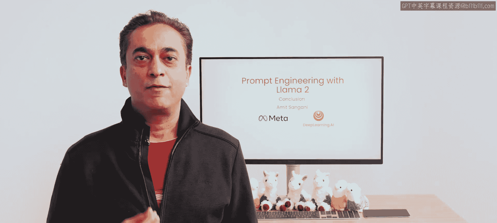
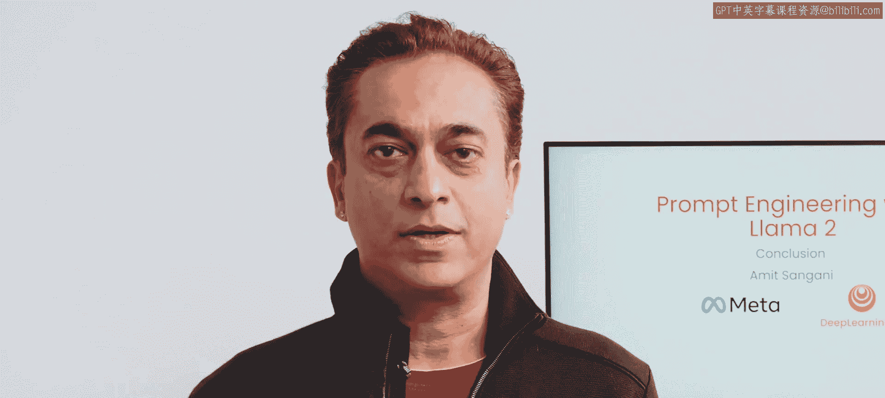
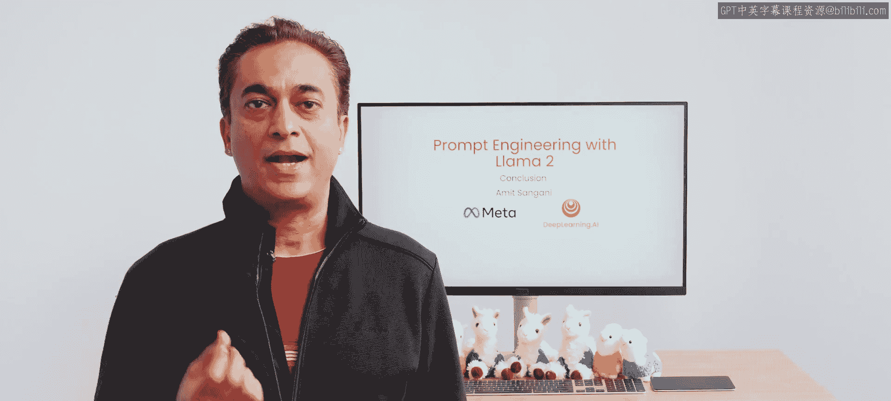
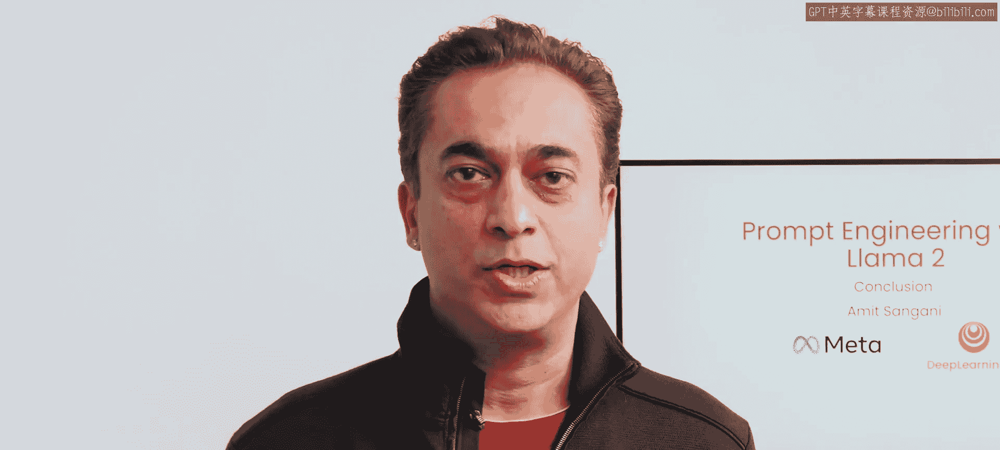
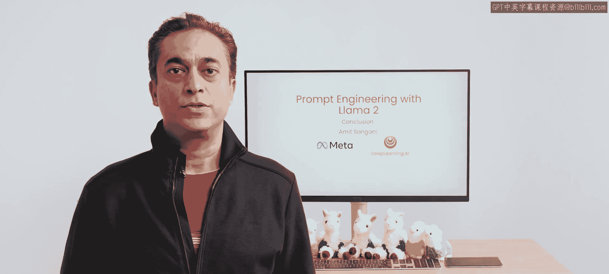
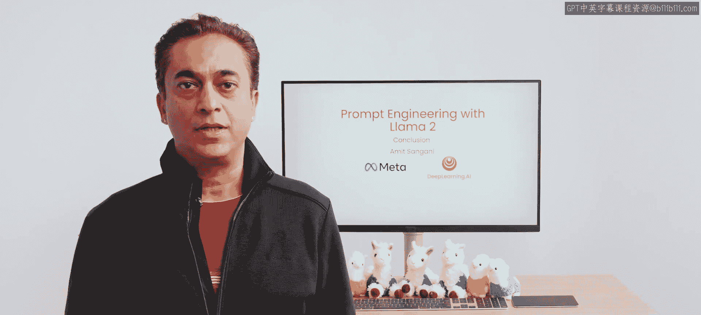
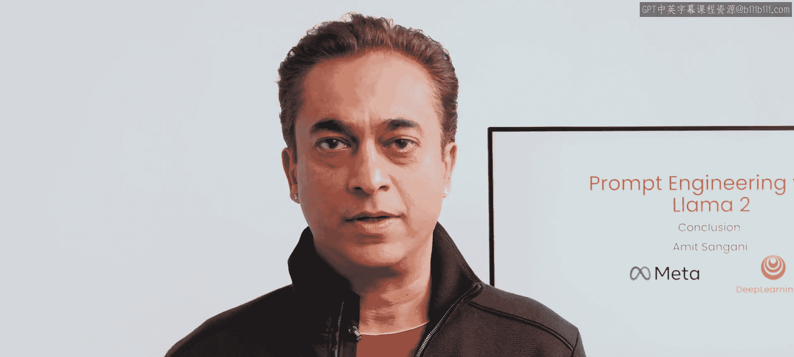
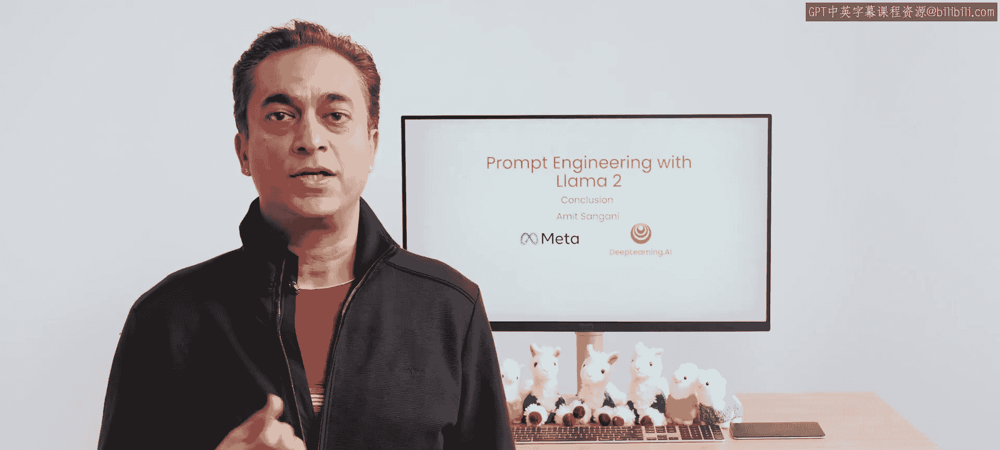
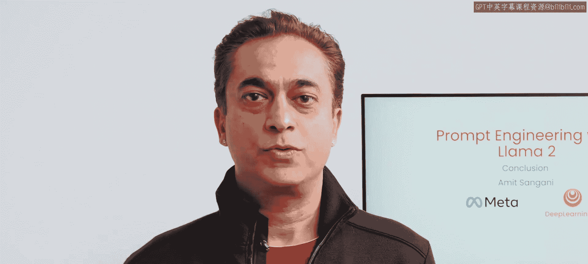

# 010：课程总结 🎉

在本节课中，我们将回顾整个课程的核心内容，总结您所学到的关于Llama模型的关键技能与实践。

感谢您坚持学习到课程的最后一节。希望您在了解Llama模型的过程中收获了许多乐趣，并且对在日常生活和工作中尝试使用Llama模型感到兴奋。

## 课程内容回顾

以下是我们在课程中共同完成的主要实践任务：

*   **创意写作与提示格式化**：您为朋友撰写了生日贺卡，并按照推荐方式，使用指令和起始标签来格式化您的提示。
*   **互动对话与建议获取**：您向模型咨询有趣的活动建议，并运用多轮对话的提示方法，使您能够提出后续问题。
*   **文本分析与总结**：您对短信进行了情感分类，并总结了一封电子邮件，同时应用了提示工程的最佳实践。

## 核心提示工程技术

上一节我们回顾了具体任务，本节中我们来看看贯穿这些任务的核心提示工程技术。

*   **上下文学习**：您通过提供期望模型如何回应的示例来引导模型，这种方法被称为**上下文学习**。
*   **思维链推理**：您应用并定义了**思维链推理**，通过要求模型“逐步思考”来提升其复杂问题解答能力。

## 模型比较与高级应用

掌握了基础技术后，我们进一步探索了不同模型的能力与特性。

接下来，您在相同任务上比较了小型（7B）、中型（13B）和大型（70B）的Llama模型。您甚至提示大型模型去比较和评估这三个模型的性能。

您向Code Llama寻求帮助，用于编写、学习和定义代码。您甚至利用了Code Llama超长的上下文窗口，来执行需要接收非常长提示的非编码任务。

最后，您使用Llama Guard检查了餐厅评论以确保其安全性。Llama Guard是致力于AI安全的Purple Llama项目的一部分。

## 模型许可与社区

所有Llama模型均可通过开放的商业许可证免费使用。这意味着您可以在您的应用程序中使用任何Llama模型，而无需担心许可限制。您拥有微调模型、将其托管在您的基础设施中以及转售微调后模型的灵活性。

最后，我在Meta的同事和我都非常希望听到您关于Llama的反馈以及您在工作中使用它的经验。Llama模型是为AI社区打造的，因此您的反馈和贡献将帮助所有其他使用这些模型的开发者同行。

若想获取更多关于使用这些模型进行有趣实践的灵感，请查看我们的Llama recipes GitHub代码库。

再次感谢您的参与。我真诚地希望您能运用在本课程中学到的知识，构建出一些出色的应用程序。

---

**本节课中我们一起学习了**：Llama2提示工程课程的全面总结，回顾了从基础提示格式化、上下文学习、思维链推理，到模型比较、Code Llama应用及AI安全工具Llama Guard等一系列核心技能与实践。我们明确了Llama模型的开放许可优势，并鼓励将所学知识应用于实际项目开发中。