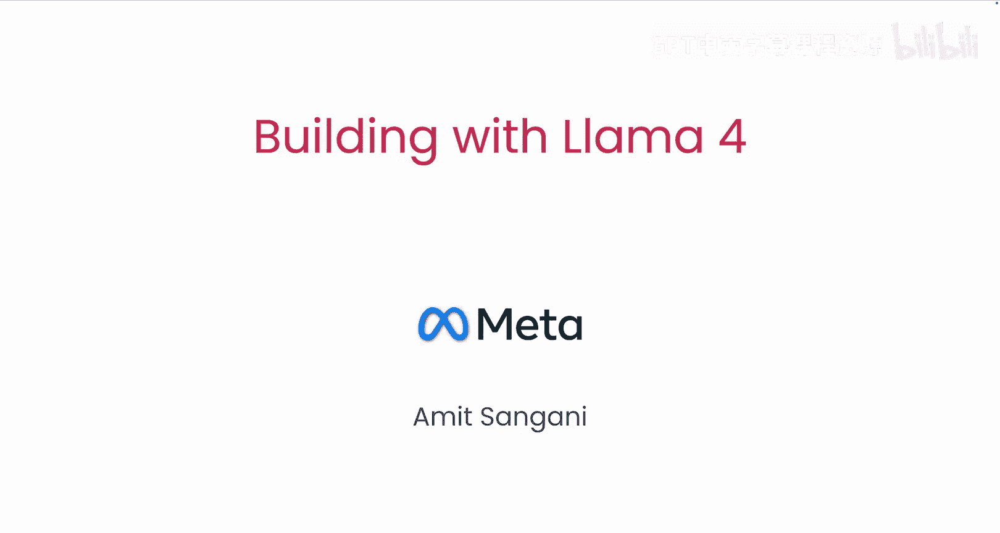
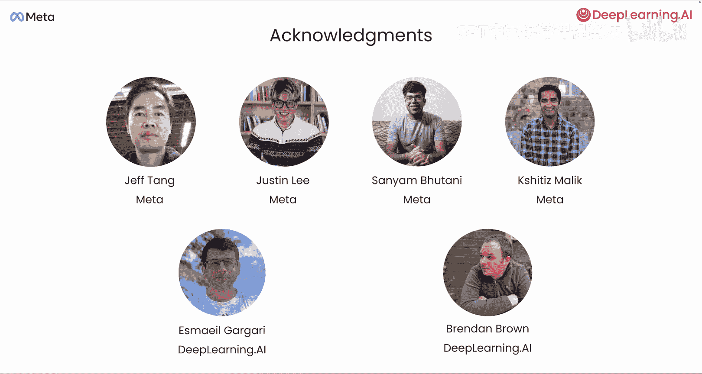

# 001：课程介绍与概述 🚀

在本节课中，我们将学习吴恩达《基于 Llama 4 的应用构建》课程的第一部分。我们将了解 Llama 4 模型家族的核心特性、新发布的工具，以及本课程的学习目标。

欢迎来到《基于 Llama 4 的应用构建》课程。本课程由 Meta 的 AI 团队工程总监 Amin Sanghani 与 Meer 和 Toy 合作创建。Llama 系列开源模型已经帮助全球众多开发者构建了 AI 应用。

现在，借助 Llama 4 的专家混合模型，您会发现部署比以往更加容易。您还可以通过处理多张图像来实现更先进的多模态理解，甚至执行图像定位任务。新的 Llama 4 模型还拥有更大的上下文窗口，例如 Maverick 模型支持 100 万令牌，而 Scout 模型则支持高达 1000 万令牌，这对于分析大型代码库等任务非常有用。

最后，您将了解随 Llama 4 一同发布的新软件工具，即用于优化提示词和生成合成数据的工具。

确实如此，Andrew。Llama 4 现在提供了原生多模态模型，并在我们的 Scout 模型中支持真正长达 1000 万令牌的上下文。

在本课程中，您将通过 Meta 的官方 API 以及其他推理提供商，获得使用 Llama 4 的实践经验。您将构建能够推理视觉内容、检测物体并精确回答图像定位问题的应用程序。

接下来，您将学习如何利用长上下文处理整本书籍和研究论文，而无需对数据进行分块处理。Meta 还推出了 Llama Tools，这是一个不断增长的开源工具集合，旨在帮助开发者利用 Llama 模型构建更强大的应用。

在本课程中，您还将使用两个最新的 Llama 工具进行构建。首先是 **Llama 提示优化器**，它能自动改进您的提示词。其底层使用了 DSPy 优化器。您需要在包含问题和期望回答的数据集上指定一个评估指标，提示优化器将根据该指标自动优化您的提示词。

其次将是 **Llama 合成数据工具包**，它允许您以多种格式摄取、创建、整理和保存高质量的训练数据。在此版本中，它简化了为微调创建数据集所需的手动工作。

许多人共同努力制作了本课程。我要感谢 Meta 的 Jeff Tang、Justin、Sanen Bhutanni 和 Shati Malik，以及 DeepLearning.AI 的 Esmal Gegari 和 Brendan Brown。

下一节课是 Llama 4 和 Llama API 的概述。Meta AI 研究团队的 Shati Malik 将加入我们，解释 Llama 4 的架构。特别是，下一课将技术性地描述 Llama 4 的专家混合架构，并解释为何对于任何输入，只有一小部分参数是活跃的，这也是其服务效率极高的原因。我们将在下一个视频中学习这些内容。

---

本节课中，我们一起学习了《基于 Llama 4 的应用构建》课程的介绍部分。我们了解了 Llama 4 在**多模态理解**、**长上下文处理**（如 `context_window = 10M tokens`）以及新工具（如提示优化器和合成数据工具包）方面的核心优势，并明确了本课程将通过实践项目帮助您掌握这些能力。下一节，我们将深入探讨 Llama 4 的模型架构。