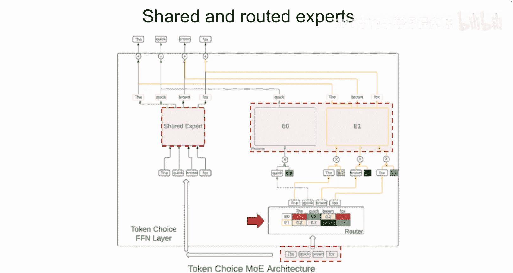
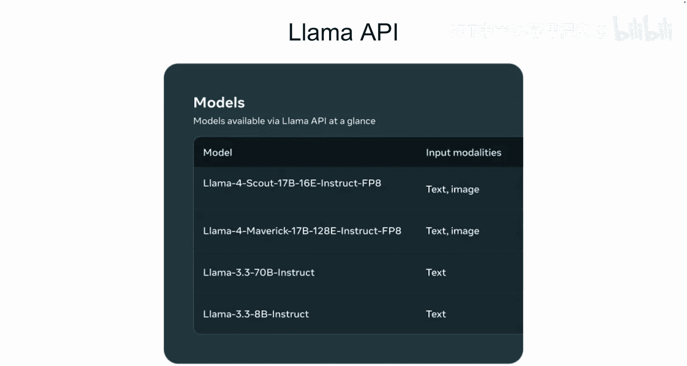
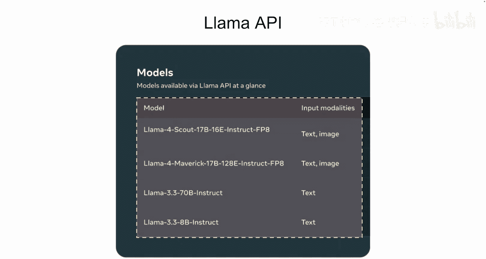
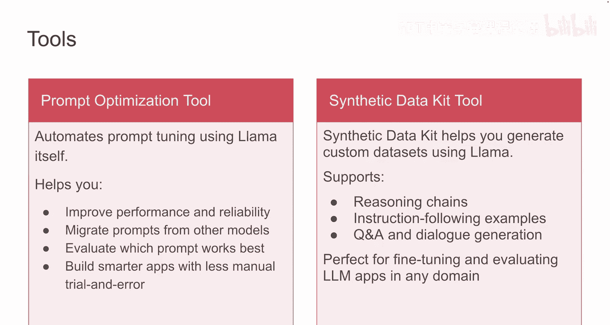

# 002：Llama 4 模型概览 🚀

在本节课中，我们将学习 Llama 模型如何从 Llama 2 演进到最新发布的 Llama 4 模型。我们还将邀请 Meta AI 研究团队的一名成员来深入解释 Llama 4 的架构。

## 概述：Llama 模型的演进之路

Llama 最初是 Meta 旗下 FAIR 实验室的一个快速推进的研究项目，早期专注于形式数学。但团队很快发现了经过良好训练的小型模型的潜力，这直接促成了 Llama 模型的发布，并自此在研究和工业界推动了显著的创新。

上一节我们回顾了 Llama 的起源，本节中我们来看看其后续发展。

## Llama 3 与多模态能力

Llama 模型的下一代在行业基准测试中表现出色，并通过 Llama 3 引入了强大的新能力。Meta 增加了用于图像推理的多模态模型，以及可以在边缘设备上运行的轻量级模型。这些模型包括视觉模型（11B 和 90B 参数版本）以及更小的纯文本模型（1B 和 3B 参数版本）。

Llama 3.3 带来了更高的效率，其 70B 参数的指令微调模型在质量上已经能够与 Llama 3.1 中参数大得多的 405B 模型相媲美。

## 进入 Llama 4 新时代

现在，随着 Llama 4 的发布，我们进入了一个新阶段。它包含两个强大的专家混合模型：
*   **Llama 4 Scout**：一个 170 亿参数的模型，拥有 16 个专家，针对速度和成本进行了优化。
*   **Llama 4 Maverick**：一个 170 亿参数的模型，拥有 128 个专家，提供顶级的性能。

Llama 4 模型通过**早期融合**设计实现了原生多模态能力。这意味着它从一开始就可以在单个统一模型中接受文本和视觉输入。

在实践中，这意味着文本标记和视觉派生的标记在输入层就被结合起来，并由同一个 Transformer 主干网络联合处理，而不是拥有独立的编码器-解码器路径。早期融合是一个重大进步，因为它使我们能够利用大量未标记的文本、图像和视频数据对模型进行联合预训练。此外，Llama 4 中的视觉编码器也得到了改进。

## Llama 3 与 Llama 4 模型对比

以下是一页 Llama 3 与 Llama 4 模型的对比。Llama 4 的主要改进包括：
*   **上下文长度**：Llama 4 Maverick 支持 100 万令牌，Llama 4 Scout 支持 1000 万令牌，而 Llama 3.1 及后续 Llama 3 模型为 128K。
*   **支持语言**：官方支持的语言从 Llama 3 的 8 种扩展到 Llama 4 的 12 种。

这里你可以看到 Llama 4 的模型卡片，显示了其 12 种官方支持的语言、170 亿激活参数、激活与非激活专家的总参数量以及最大上下文长度。

接下来，Sha 将更深入地讲解 Llama 4 的架构。

## Llama 4 架构深入解析

感谢 Amit。Llama 4 是一个**专家混合模型**。MoE 是大语言模型中常用的一种架构。

随着我们增加模型的参数数量或容量，通常会看到更好的性能，因为模型可以对标记执行更复杂的转换。然而，在密集模型中，更多的参数也意味着训练和推理期间的成本更高。

MoE 模型通过使用**条件计算**来帮助解决这个问题，它能在保持计算成本可控的同时提升模型质量。它们仅为每个标记激活总参数中的一小部分，这减少了一个标记所需的计算量，同时仍保留了模型容量。

任何 MoE 模型的一个关键部分是**门控网络**，也称为路由器。路由器决定给定标记激活哪些专家。路由机制的选择对模型性能起着核心作用。

一个 Transformer 有两种主要的层类型：**注意力层**和**前馈网络层**。计算成本通常由 FFN 层主导。按照惯例，Llama 4 的 MoE 架构仅在 FFN 层中使用条件计算，注意力层则与密集模型保持一致。

Llama 4 中的 MoE 层包含几个路由专家和一个共享专家。所有标记都会经过共享专家。每个标记也恰好会经过一个路由专家。Scout 有 16 个路由专家，而 Maverick 有 128 个。在 Scout 中，所有 FFN 层都是 MoE 层；而 Maverick 则在密集层和 MoE 层之间交替，以减少模型中的总参数量。

让我们通过一个例子来看看一个标记序列是如何被 Llama 4 中的 MoE 层处理的。假设我们有一个共享专家和两个路由专家，序列包含四个标记：“The”、“quick”、“brown”、“fox”。

1.  **路由**：标记首先进入路由器，决定哪个标记将被分配给哪个路由专家。我们为每个标记和路由专家的组合计算一个路由器亲和度分数。标记被发送到路由器分数最高的路由专家，并且该标记的激活值也会乘以路由器亲和度分数。在示例中，标记“The”、“brown”和“fox”前往路由专家 1，而标记“quick”前往路由专家 0。
2.  **共享路径**：所有标记也都会经过共享专家。
3.  **合并输出**：最后，共享专家和路由专家的输出被加在一起，产生 MoE 层的最终输出。

以上是对 Llama 4 架构的简要概述。如果你有兴趣了解更多，可以查看我们的博客。现在交回给 Amit。

## Llama API 与开发工具

感谢 Sha 的讲解。Llama API 提供了一种简单快捷的方式来使用 Llama 模型并进行构建。为了便于集成，我们提供了轻量级的 Python 和 TypeScript SDK。这些 SDK 允许开发者快速将 API 连接到他们的应用程序。

使用 Llama API，你可以基于最新的 Llama 模型进行构建，包括 Llama 4 Scout、Llama 3 的 8B、70B 模型等。我们还引入了两个新的 Llama 工具。

以下是两个核心工具的介绍：

*   **提示词优化工具**：这是一个能自动为 Llama 模型优化提示词的工具。它能将适用于其他大语言模型的提示词，转化为针对 Llama 模型在性能和可靠性上进行优化的提示词。你将在第 6 课中看到它的工作原理。
*   **Meta Synthetic Data Kit**：你将在本课程中使用的另一个工具。你将学习如何使用此工具创建自己的高质量数据。当你正在进行模型微调或测试，但手头没有完美的数据集时，这尤其有用。在课程后期，你将能够生成问答对、推理步骤和其他格式的数据。

在下一课中，你将开始使用 Llama API 进行构建。我们下节课见。

## 总结

本节课中，我们一起学习了 Llama 模型从研究项目到行业领先模型的演进历程，重点剖析了 Llama 4 引入的专家混合架构及其原生多模态的早期融合设计。我们还了解了 Llama API 及其配套的提示词优化与合成数据工具，为后续的实际应用开发奠定了基础。