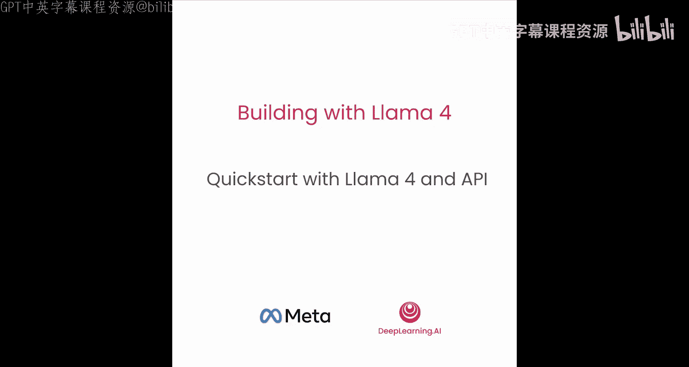
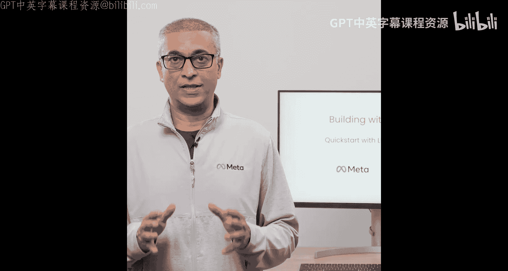
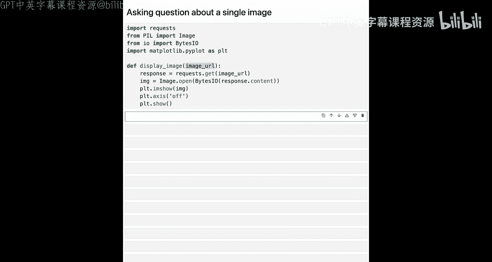
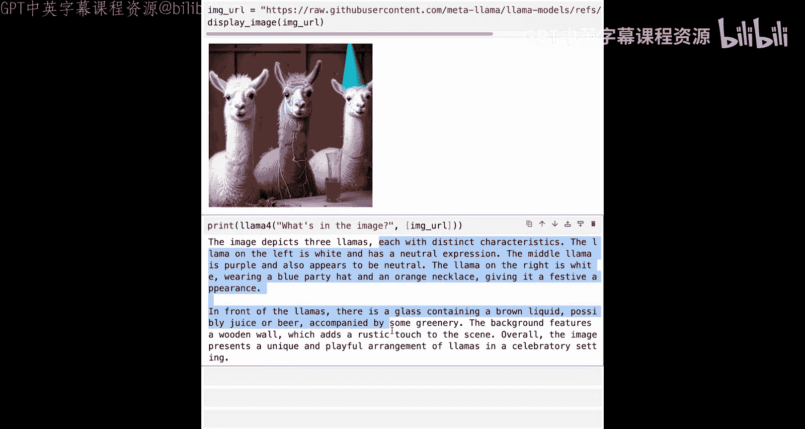
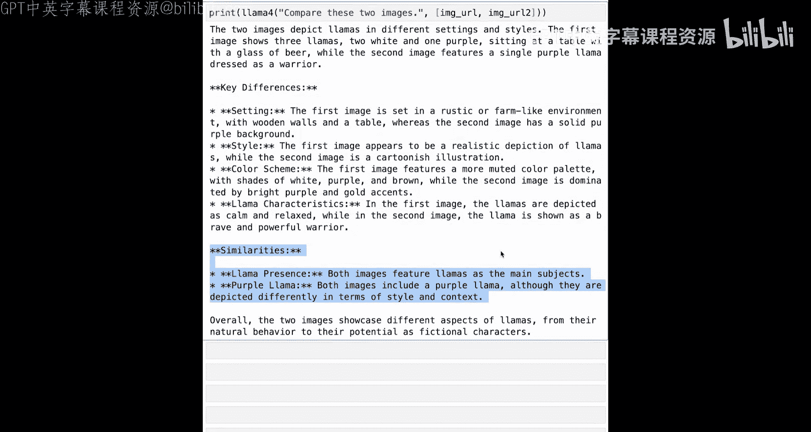
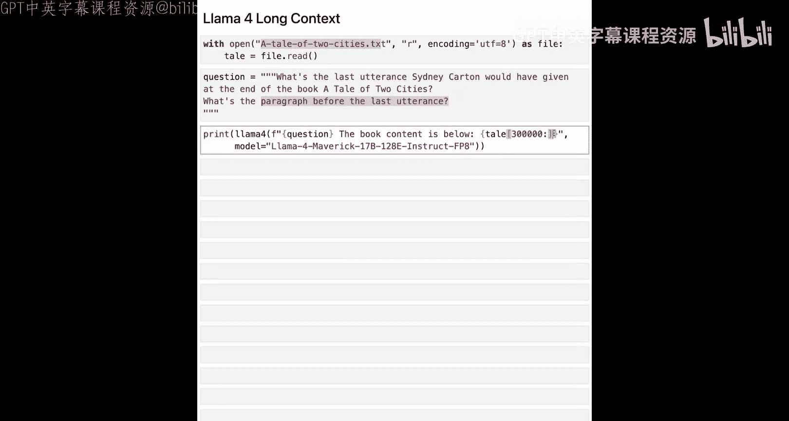
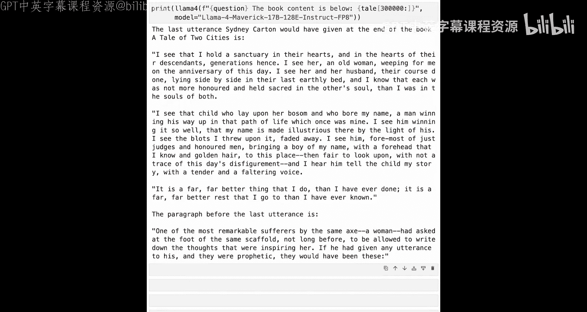
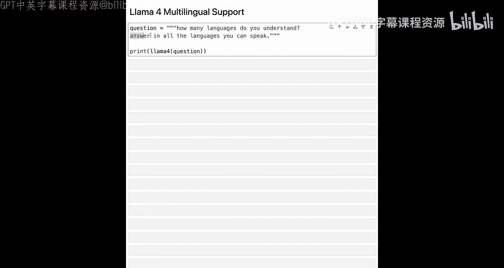
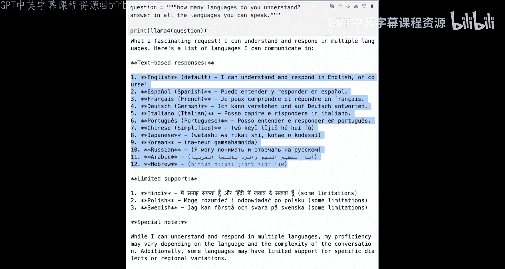
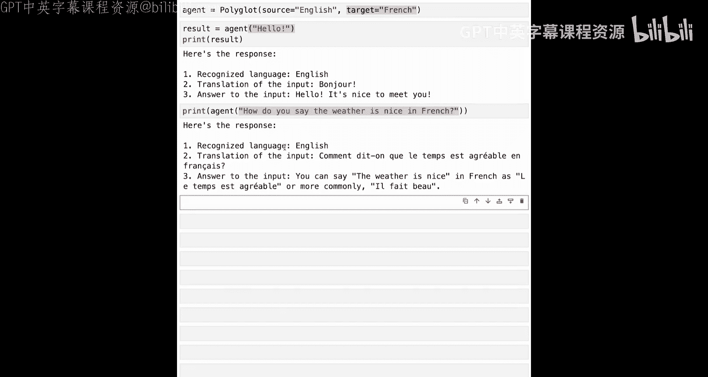

# 003：Llama 4 与 API 快速入门 🚀



在本节课中，我们将学习如何通过 Meta 的官方 API 快速开始使用 Llama 4。我们将了解如何设置 API 客户端、发送提示词、处理文本和图像输入，并构建一个支持多语言的翻译聊天机器人。



## 导入密钥与库

首先，我们需要导入 API 密钥和必要的库。使用 Llama API 需要一个 API 密钥和一个基础 URL。在本课程环境中，这些密钥已预先设置好，无需额外操作。

我们需要导入 Llama API 客户端。为了便于后续多次调用，我们将创建一个辅助函数。

```python
def llama_4_function(prompt, image_urls=None, model="llama-4-sc"):
    # 根据提示词和图像URL构建内容
    content = [{"type": "text", "text": prompt}]
    if image_urls:
        for url in image_urls:
            content.append({"type": "image_url", "image_url": {"url": url}})

    # 创建 Llama API 客户端
    client = LlamaClient(api_key=API_KEY, base_url=BASE_URL)

    # 构建并发送消息
    messages = [{"role": "user", "content": content}]
    response = client.chat.completions.create(model=model, messages=messages, temperature=0)

    # 返回响应
    return response.choices[0].message.content
```

## 首次调用 API

现在，让我们调用这个函数，要求 Llama 4 用三句话简要介绍 AI 的历史。

```python
response = llama_4_function("Give me a brief history of AI in three sentences.")
print(response)
```

以下是得到的响应：
> 人工智能的历史可以追溯到20世纪50年代，当时艾伦·图灵提出了“图灵测试”的概念。随后，专家系统和机器学习在80年代和90年代兴起。进入21世纪后，深度学习和大数据的结合推动了AI技术的飞速发展，催生了像Llama这样的大型语言模型。

## 与 OpenAI 客户端库的兼容性

Llama API 也兼容 OpenAI 客户端库，这使得在不同 API 之间切换非常顺畅。让我们使用 OpenAI 兼容库重新创建上述函数。

```python
import openai

def llama_4_function_openai(prompt, image_urls=None, model="llama-4-sc"):
    # 配置 OpenAI 客户端以使用 Llama API
    client = openai.OpenAI(api_key=API_KEY, base_url=BASE_URL)

    # 构建内容（与之前相同）
    content = [{"type": "text", "text": prompt}]
    if image_urls:
        for url in image_urls:
            content.append({"type": "image_url", "image_url": {"url": url}})

    # 发送请求
    response = client.chat.completions.create(model=model, messages=[{"role": "user", "content": content}], temperature=0)
    return response.choices[0].message.content
```

使用相同的提示词调用此函数，由于温度设置为 0，我们将得到完全相同的确定性响应。

## 图像理解能力

上一节我们介绍了纯文本交互，本节中我们来看看 Llama 4 的图像理解能力。你可以向 `llama_4_function` 传递图像 URL 并询问关于图像的问题。

首先，创建一个显示图像的函数。

```python
from IPython.display import Image, display

def display_image(url):
    display(Image(url=url))
```

让我们使用一张羊驼（Llama）的图片进行测试。

```python
image_url = "https://example.com/llama_image.jpg"
display_image(image_url)

prompt = "What's in this image?"
response = llama_4_function(prompt, image_urls=[image_url])
print(response)
```

响应描述了图像中有三只羊驼以及图像的其他内容。

## 多图像处理





与 Llama 3.2 不同，Llama 4 原生支持处理多张图像，在最多五张图像的评估中表现良好。让我们使用两张不同的羊驼图片。

```python
image_url_1 = "https://example.com/llama1.jpg"
image_url_2 = "https://example.com/llama2.jpg"
display_image(image_url_1)
display_image(image_url_2)

prompt = "Compare these two images."
response = llama_4_function(prompt, image_urls=[image_url_1, image_url_2])
print(response)
```

响应会指出两张图片都描绘了羊驼，并列出关键差异和一些相似之处。在下一课中，我们将探索更多图像用例。

## 超长上下文处理



Llama 4 Maverick 和 Sc 模型分别支持高达 100 万和 1000 万 tokens 的上下文长度，这比之前的 Llama 模型有巨大提升。让我们用一本约 19.3 万 tokens 的免费电子书《双城记》来测试。

以下是我们的问题：“这本书结尾的最后一句台词是什么？它前面的一段是什么？”

我们将使用 Llama 4 Maverick 模型，并传入书籍的最后 30 万个字符。

```python
# 假设 `long_text` 包含了书籍最后30万个字符
long_text = get_last_300k_chars("tale_of_two_cities.txt")
prompt = f"{long_text}\n\nQuestion: What is the last utterance at the end of the book and also the paragraph before that?"
response = llama_4_function(prompt, model="llama-4-maverick")
print(response)
```



模型能够从超长上下文中准确找到并回答这个问题。在后面的课程中，我们将处理更多长上下文用例。



## 多语言理解与翻译

Llama 4 的另一项主要能力是其在 12 种语言间的文本理解。让我们先问问它懂多少种语言，并要求它用所有掌握的语言回答。

```python
prompt = "How many languages do you understand? Please answer in all the languages you speak."
response = llama_4_function(prompt)
print(response)
```



响应列出了 Llama 4 能够理解的 12 种语言。



现在，让我们利用这个能力构建一个快速的多语言翻译聊天机器人。

以下是构建多语言聊天机器人的代码。它接收源语言和目标语言，并构建相应的系统指令。

```python
def polyglot_chatbot(source_lang, target_lang):
    # 构建系统提示词
    system_message = f"""
    You are a real-time translator.
    1. Recognize the language of the user's input. The source language is {source_lang}.
    2. Translate the user's input to {target_lang}.
    3. Respond to the user's query in the recognized source language ({source_lang}).
    Always format your response as:
    Recognized Language: [Language]
    Translation: [Translated text in {target_lang}]
    Response: [Your response in {source_lang}]
    """

    # 使用 OpenAI 兼容客户端
    client = openai.OpenAI(api_key=API_KEY, base_url=BASE_URL)

    def chat(user_input):
        messages = [
            {"role": "system", "content": system_message},
            {"role": "user", "content": user_input}
        ]
        response = client.chat.completions.create(model="llama-4-sc", messages=messages, temperature=0.7)
        return response.choices[0].message.content

    return chat
```

让我们以英语为源语言、法语为目标语言来使用这个翻译器。

```python
translator = polyglot_chatbot("English", "French")
print(translator("Hello!"))
```

输出可能类似于：
> Recognized Language: English
> Translation: Bonjour !
> Response: Hello to you too!

让我们再问一个问题。

```python
print(translator("What is the weather like today?"))
```

输出：
> Recognized Language: English
> Translation: Quel temps fait-il aujourd'hui ?
> Response: I am an AI and cannot access real-time weather data. You might want to check a weather website or app.

你可以自由尝试使用其他语言组合来测试这个翻译聊天机器人。

## 总结



本节课中，我们一起学习了如何快速入门 Llama 4 API。我们涵盖了设置客户端、进行文本和图像对话、利用其超长上下文能力以及构建多语言翻译应用。在下一课中，我们将深入探讨几个关于图像理解和图像接地的精彩用例。