# 004：图像理解与推理 🖼️

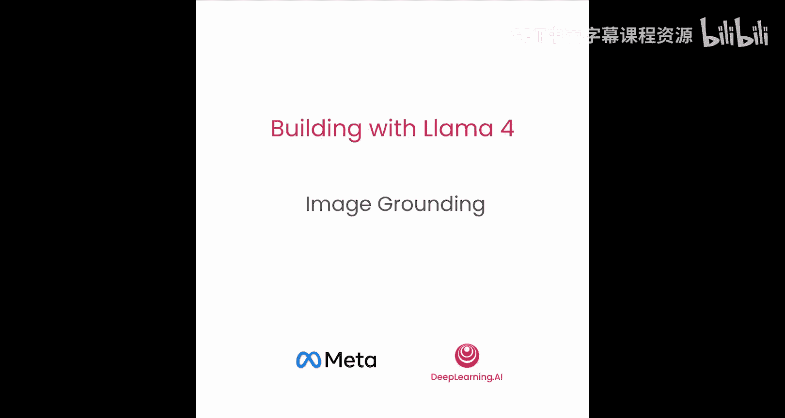

在本节课中，我们将学习如何使用 Llama 4 进行图像理解与推理。我们将通过多个实际案例，从识别图像中的物体到根据界面截图生成代码，全面探索 Llama 4 的多模态能力。

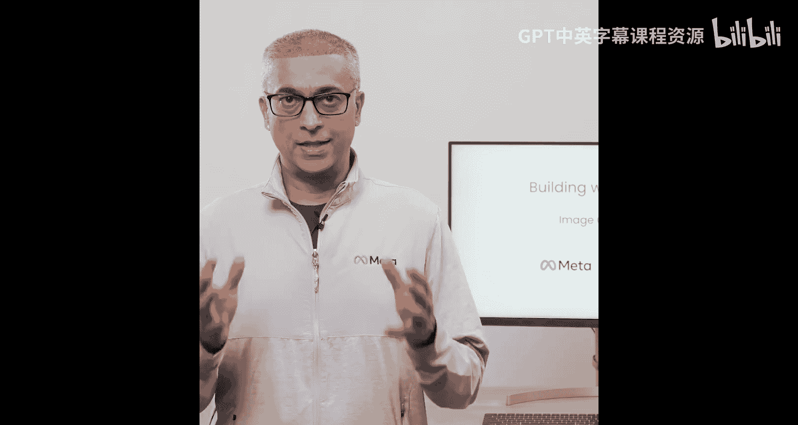

## 概述：Llama 4 的多模态能力

上一节我们介绍了 Llama 4 的基本文本处理功能。本节中，我们来看看它如何处理视觉信息。

Llama 4、Sc 和 Maverick 模型被设计为能够同时处理语言和视觉输入。这意味着它们可以像理解文本一样，理解和推理图像内容。这解锁了广泛的应用场景，从回答关于图像的问题，到描述场景或识别物体。

**图像定位**是 Llama 4 的一个突出特性。它指的是将提示词的部分内容与图像中的特定区域关联起来。这允许模型提供更精确的答案，尤其是在问题涉及空间关系时，例如询问“右上角有什么”或“在有许多工具的图片中，测量工具在哪里”。Llama 4 可以找到物体并返回其边界框的坐标。

在本次实践中，我们将探索几个图像推理的应用场景：
*   对一张有许多工具的图片进行图像定位。
*   分析 PDF 文件中的表格。
*   根据用户界面截图生成代码。
*   解决一个数学谜题。
*   分析计算机屏幕。

## 准备工作：加载 API 与辅助函数

首先，我们需要加载 API 密钥并设置环境。在本实验中，除了 Llama API，我们还将通过 Together AI 使用 Llama 4。为此，你需要 Llama 的基础 URL 和 Together AI 的 API 密钥。这些在 DeepLearning.AI 平台上已经为你预先配置好了，因此你无需额外申请密钥即可运行这些笔记本。

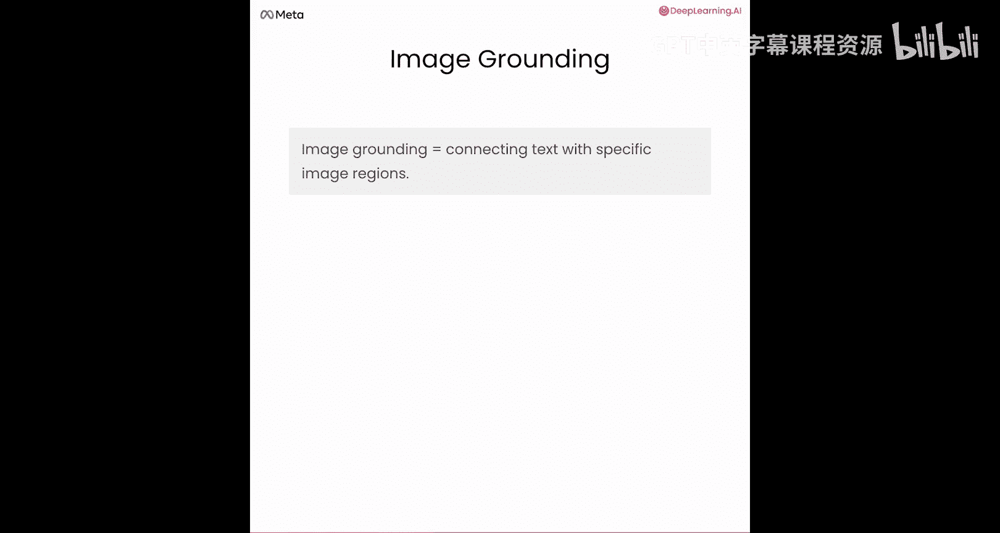

现在，让我们加载两个函数：`llama4_api` 和 `llama4_together`。`llama4_together` 函数与你之前课程中实现的 `llama4` 函数非常相似。区别在于，它导入的是 `together` 库，并创建 Together AI 客户端，传入你的 Together AI API 密钥，其余部分保持不变。

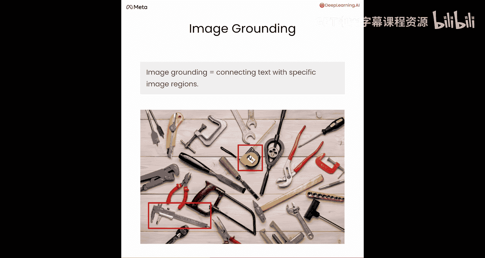

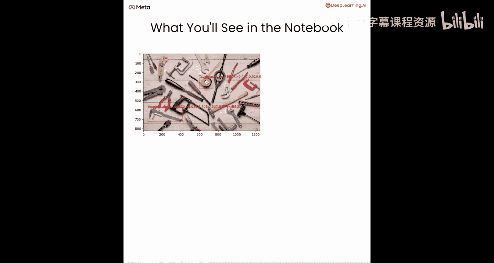

大多数推理服务提供商（如 Together AI）通常期望图像数据以 Base64 字符串的形式嵌入，而不是直接放在请求负载中。因此，我们使用一个辅助函数来获取图像路径并返回其 Base64 编码。

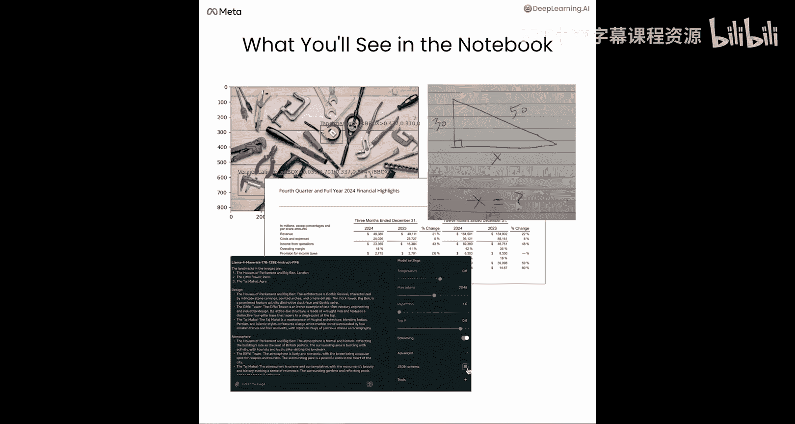

```python
# 示例：将图像转换为 Base64
import base64

def image_to_base64(image_path):
    with open(image_path, "rb") as image_file:
        return base64.b64encode(image_file.read()).decode('utf-8')
```

## 应用一：图像定位与物体识别 🧰

图像定位是计算机视觉和自然语言处理中的一项基本任务，涉及识别图像中与给定文本描述相对应的特定物体或区域。让我们看看 Llama 4 如何对这张有许多工具的图片进行图像定位。

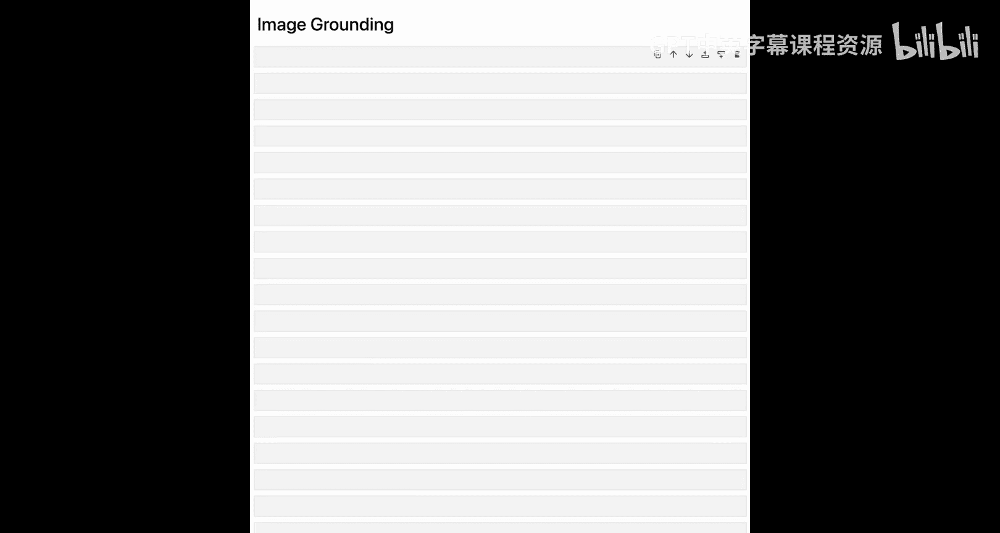

以下是我们的提示词：“图片中哪些工具可以用来测量长度？为每个识别出的物品提供边界框。”

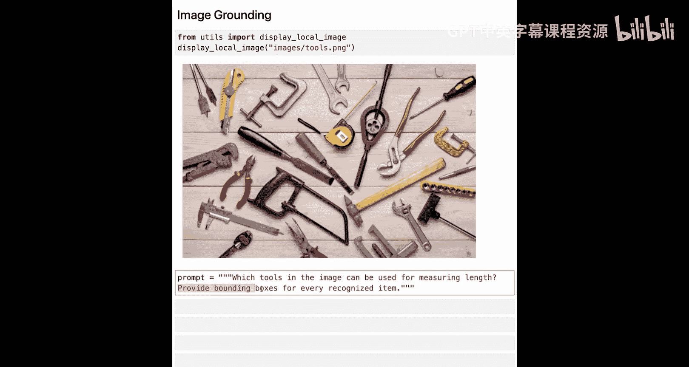

你可以将工具的 PNG 图像转换为 Base64，并将其与提示词一起传递给 `llama4` 函数。模型返回了两个用于测量长度的物品，以及每个物品的边界框坐标。


需要注意的是，边界框值代表的是图像中边界框的归一化坐标。要获得实际的像素坐标，你需要将这些归一化值乘以图像的宽度和高度。


在工具文件中，我们有两个辅助函数：`parse_output` 和 `draw_bounding_boxes`。第一个函数解析 Llama 的输出，提取边界框坐标；第二个函数在图像上绘制边界框，以便可视化结果。

让我们再次将图像和提示词传递给 Llama，保存结果，然后将模型输出传递给 `parse_output` 函数以获取工具坐标和描述。最后，将其与原始图像一起传递给 `draw_bounding_boxes` 函数查看结果。这是我们的图像，两个用于测量的工具周围绘制了边界框，并标注了每个工具的名称及其边界框坐标。

## 应用二：分析 PDF 文档中的表格 📊

接下来，我们将使用 Llama 分析 PDF 文档中的表格。我们可以通过两种方式实现：一是将表格转换为文本，然后基于文本向 Llama 提问；二是直接使用表格的图像来提示 Llama。让我们看看这两种方法并进行比较。

这是一个 PDF 文件，其中包含我们想要提问的表格。为了将 PDF 转换为文本，我们可以使用一个辅助函数，它接收文件并提取返回其文本内容。让我们将 PDF 文件传递给 `pdf_to_text` 函数以获取其文本。

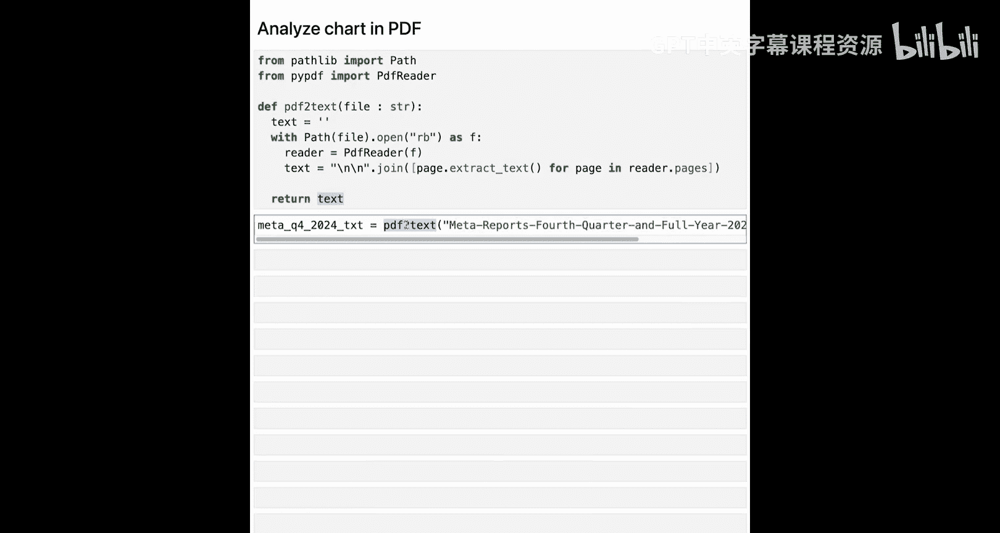

让我们查看报告中这个表格转换后的文本。


我们可以在文本中搜索“第四季度和2024全年财务”，定位到相关段落。

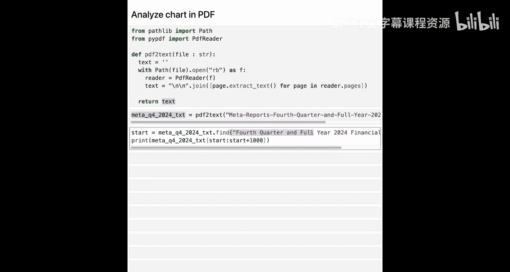

这就是包含表格的文本。

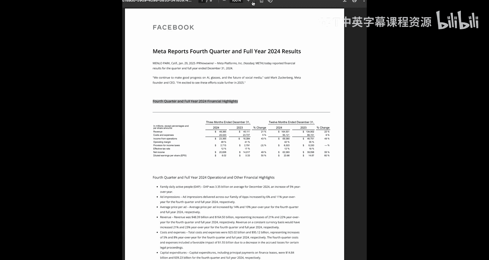

现在，让我们使用报告文本来询问 Llama 关于 2024 年运营利润率的问题。得到的回答是：“2024年的运营利润率为42%”，这是正确的。


现在，让我们使用保存为图像的表格来重复这个操作。


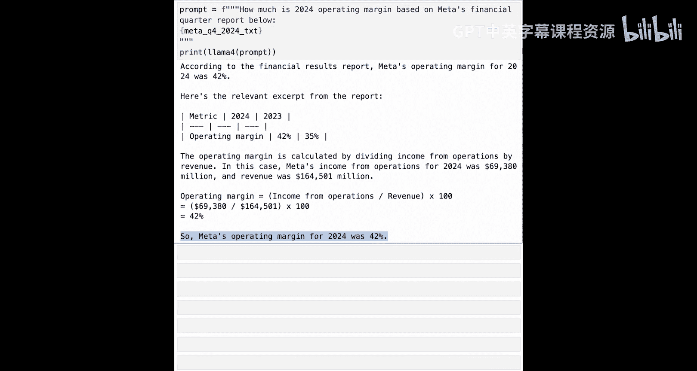
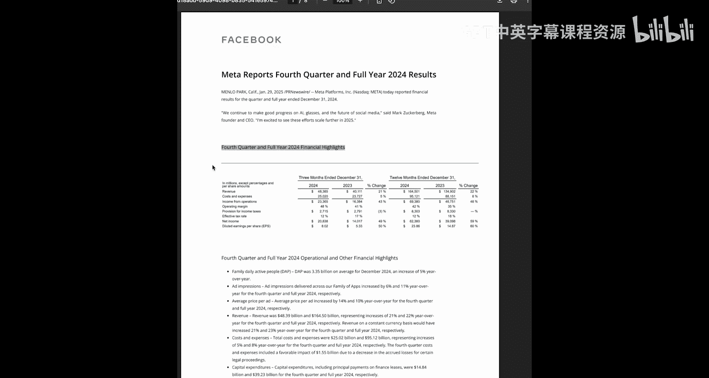


我们已将其保存在这个文件中。这就是图像。我们可以将图像转换为 Base64，并将其与提示词一起传递给 Llama 4。得到的回答同样是“42%”，与使用报告文本得到的结果一致。

请注意，尽管这两种情况下答案相同，但推理过程是不同的。在一些复杂的情况下，使用图像可能会得到更好、更准确的结果，因为与纯文本版本相比，Llama 能更好地理解表格的整体结构。

## 应用三：从截图生成用户界面代码 💻


现在，让我们使用 Llama 根据界面图像来编写代码。为此，我们将从 Meta 网站的一个视频中截取这一帧画面，并使用 Llama 4 为其生成代码。

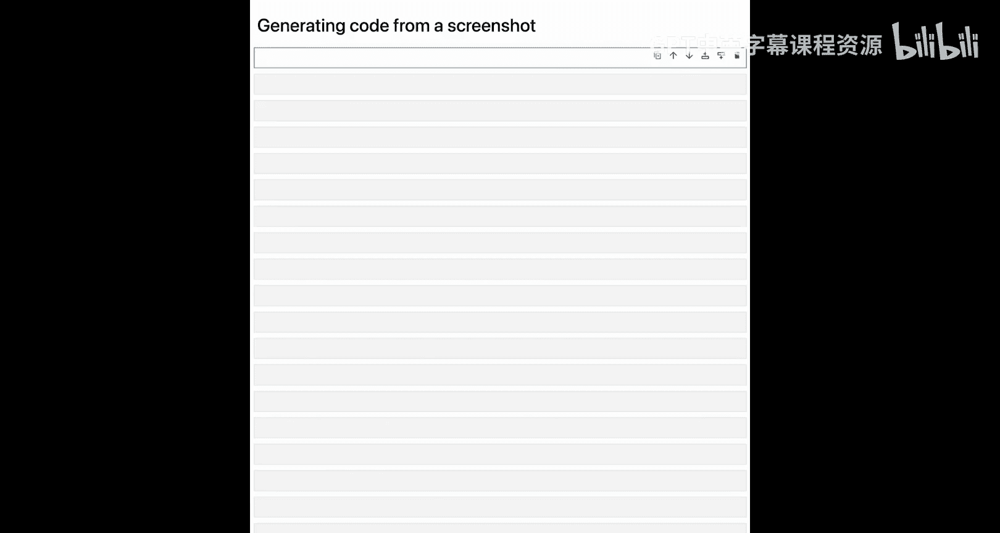
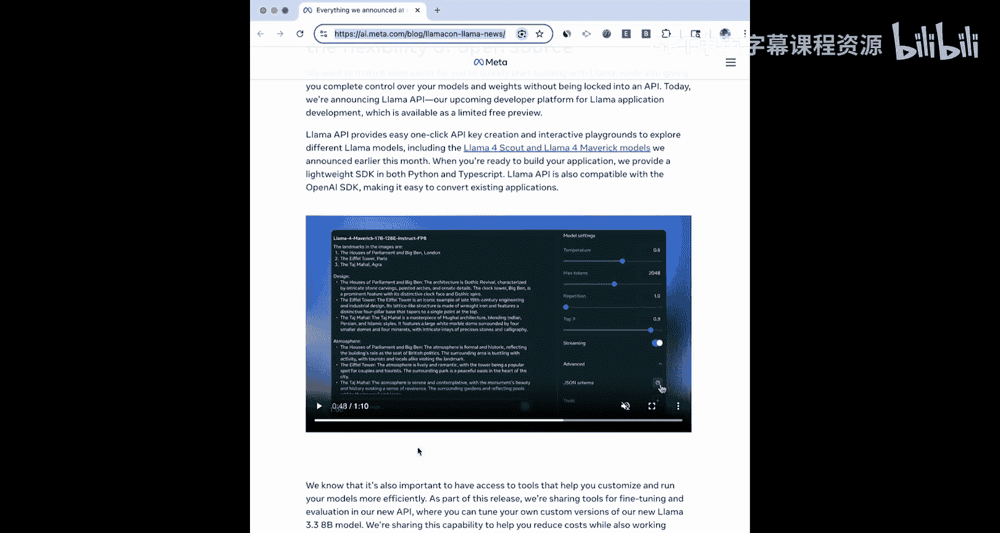

这是该截图的图像。首先，让我们提一个问题，看看 Llama 是否理解这张图像：“如果我想改变图像中的温度，应该点击哪里？”温度是这里的滑块，当前设置为 0.6。这是 Llama 的回答：“要更改图像中的温度，您应该点击温度旁边的滑块。”并且也给出了当前值。很好。

现在，让我们看看 Llama 能否为我们编写这个界面的代码。

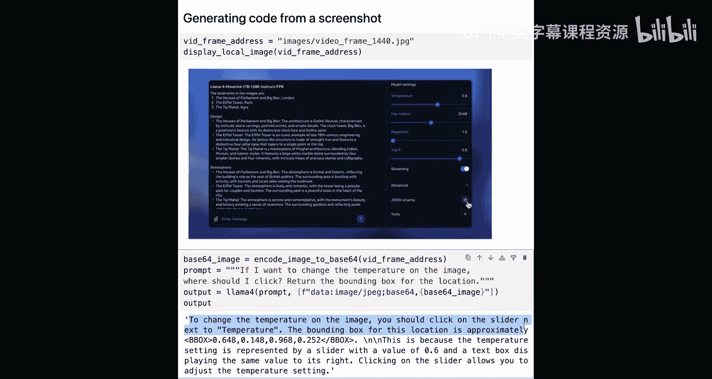

我们提示它：“编写一个使用 Gradio 实现图像中聊天机器人用户界面的 Python 脚本。”


这是模型的回复，包含了需要安装的指令以及最终的 Python 代码。

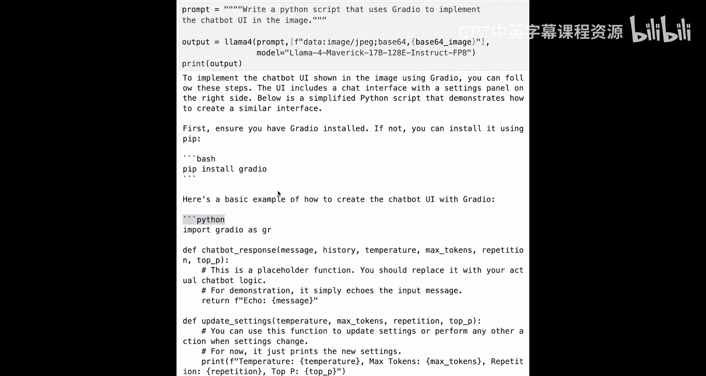

让我们复制并运行这段代码。这是我们从 Llama 得到的代码。


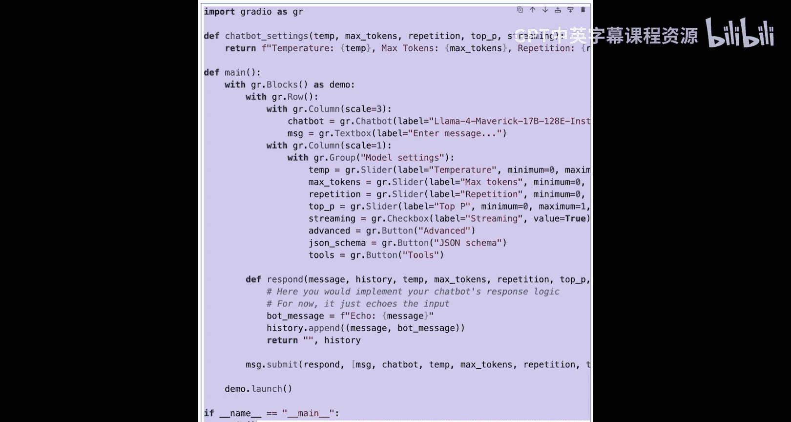

运行后，我们得到了这个界面，所有滑块都已实现，甚至包括可以输入消息并与之交互的聊天框。请注意，这只是我们要求 Llama 实现的界面，并不包含后期需要添加的、使其完全工作的所有功能。


## 应用四：解决数学问题 ➗


现在，让我们使用 Llama 解决一个数学问题。

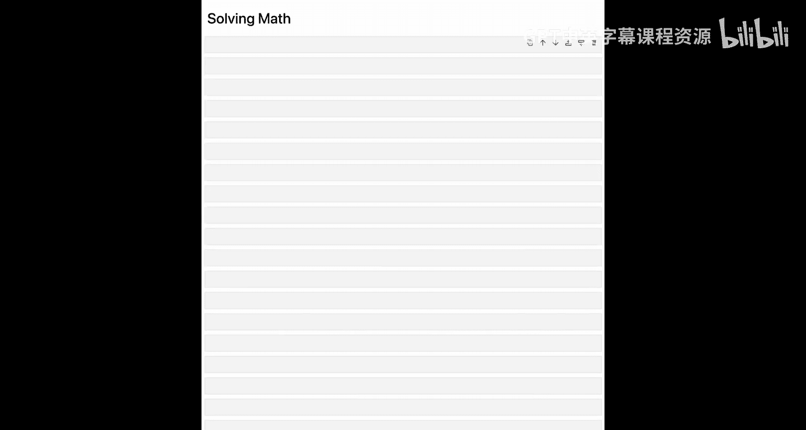

这是我们想要解决的问题。要解决它，Llama 需要理解问题及其解法。这是我们的提示词：“回答图像中的问题。”


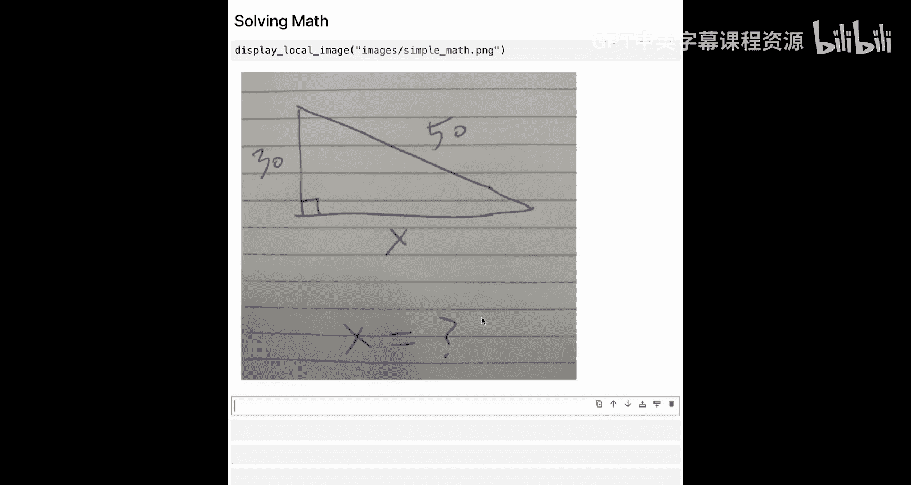


我们将 Base64 编码的数学图像与提示词一起传递给 Llama。这是回复。Llama 给出了解决这个问题的所有步骤，最终计算出的答案是 40，这是正确的。

## 应用五：分析计算机屏幕 🖥️

让我们处理另一个用例：使用 Llama 分析计算机屏幕。这是你将使用的图像。这可能看起来很熟悉，因为这是我们之前在 DeepLearning.AI 平台上关于 Llama 3.2 课程的图像。

让我们要求 Llama 详细描述此截图，包括浏览器、URL 和标签页。模型给出了对此图像的详细分析，甚至列出了屏幕底部的所有图标。

假设你有一个浏览器代理，想要自动进入下一课。让我们问 Llama 这个问题：“如果我想进入下一课，应该怎么做？”

我们再次显示图像，以便将结果和图像放在一起。这是回复：“要继续下一课，请点击标有‘下一课’的红色按钮，它位于屏幕的右下角。”这个用例展示了如何在计算机使用应用程序和构建浏览器 AI 代理中使用 Llama。

## 总结

在本节课中，我们在多个图像推理和定位的用例与应用中使用了 Llama 4。我们一起学习了：
1.  **图像定位**：识别图片中的特定物体并获取其坐标。
2.  **文档分析**：通过文本和图像两种方式解析 PDF 中的表格信息。
3.  **代码生成**：根据用户界面截图自动生成可运行的界面代码。
4.  **问题求解**：理解并解答图像中的数学问题。
5.  **屏幕理解**：分析计算机屏幕内容以指导自动化操作。

这些实践展示了 Llama 4 强大的多模态理解能力，为构建智能视觉应用奠定了基础。在下一节课中，我们将深入探讨 Llama 4 的提示工程与格式化。

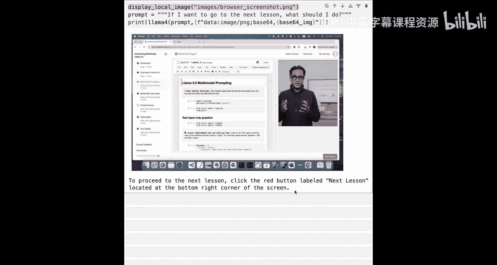


我们下节课见。