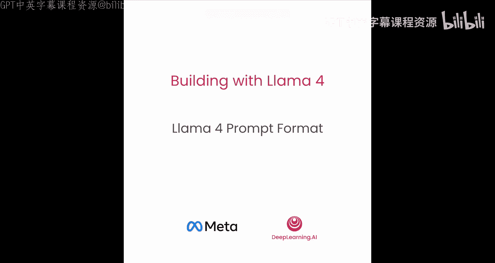
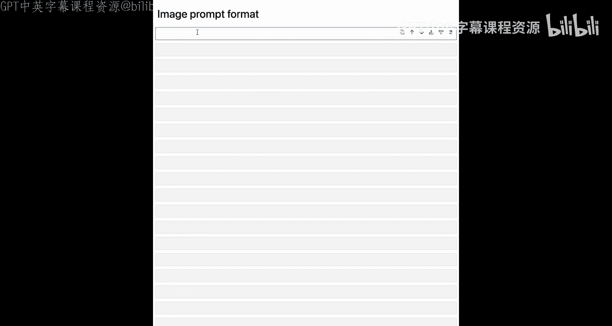
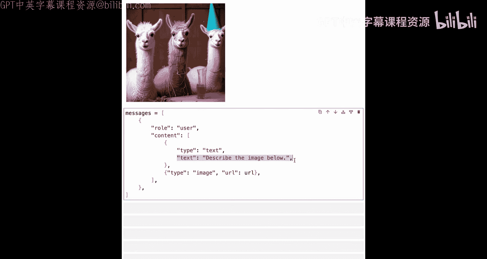
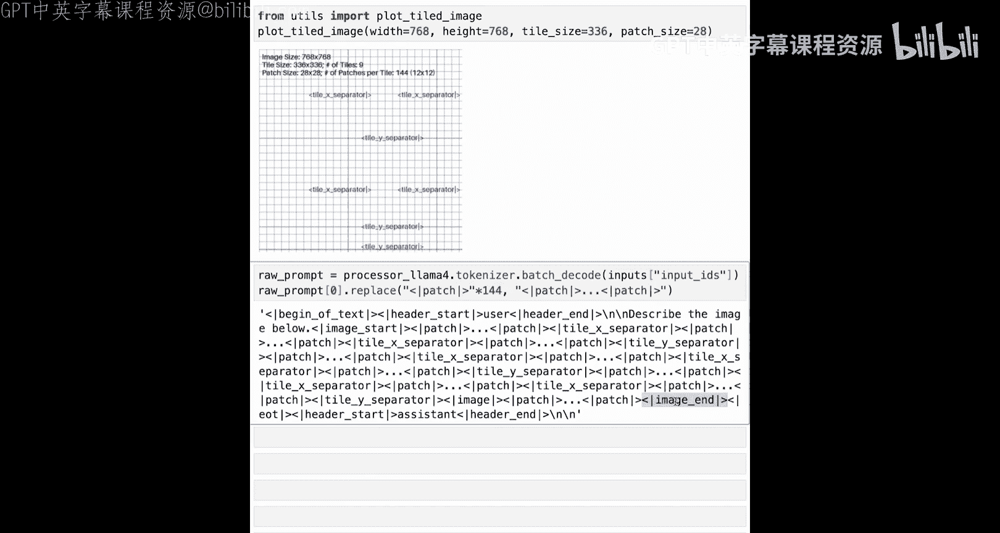

# 005：Llama 4 提示词格式详解 🧩



在本节课中，我们将学习 Llama 4 模型如何解析提示词，包括纯文本和多模态提示中的特殊标记。理解这些格式有助于我们更好地构建基于 Llama 4 的应用。

---

## 模型与特殊标记概述

Llama 4 SC 和 Maverick 是多模态模型，在文本和图像理解方面表现出色。首先，我们将快速了解 Llama 4 的特殊标记和提示词格式，从纯文本输入开始，然后探讨文本加图像输入的工作原理。

**核心概念**：虽然构建应用时无需直接处理这些特殊标记，但了解模型如何处理你的文本和图像提示词总是有益的。

---

## 文本特殊标记

Llama 4 支持以下通用特殊标记：


*   **`<|begin_of_text|>`**：指定提示词开始。
*   **`<|start_header_id|>`**：特定消息角色的开始。
*   **`<|end_header_id|>`**：特定消息角色的结束。
*   **`<|eot_id|>`**：表示模型已完成交互的“回合结束”标记。

---

## 图像特殊标记

对于图像输入，Llama 4 使用以下图像标记：

*   **`<|image_start|>`**：提示词中图像数据的开始。
*   **`<|image_end|>`**：提示词中图像数据的结束。
*   **`<|patch|>`**：代表输入图像子集的“补丁”。
*   **`<|tile_x_separator|>`**：分隔图像的 X 方向图块。
*   **`<|tile_y_separator|>`**：分隔图像的 Y 方向图块。
*   **`<|image|>`**：将常规尺寸的图像标记与适合单个图块的缩小版本分隔开。

---

## 消息角色

Llama 4 支持与 Llama 3 相同的四种角色：

*   **`system`**：设置与 Llama 交互的上下文。系统提示通常包含帮助模型有效响应的规则和指南。
*   **`user`**：代表与 Llama 交互的人类。用户提示包含具体的用户输入、命令或问题。
*   **`assistant`**：代表 Llama 对用户的响应。
*   **`ipython`**：代表工具调用的输出，该输出被发送回 Llama。

---

## 代码实践：对比提示词格式

上一节我们介绍了 Llama 4 的特殊标记和角色，本节中我们来看看如何在代码中观察和对比 Llama 4 与 Llama 3 的原始提示词格式。

首先，我们需要加载 API 密钥。本节课需要 Llama API 密钥和 Hugging Face 访问令牌，它们已预先设置好。

我们将使用 Hugging Face Transformers 库的 `AutoProcessor` 来查看输入消息的原始提示词格式，并比较 Llama 4 和 Llama 3 模型的差异。

```python
# 定义两个模型的处理器
processor_llama4 = AutoProcessor.from_pretrained("meta-llama/Llama-4-SC")
processor_llama33 = AutoProcessor.from_pretrained("meta-llama/Llama-3-3B")
```

现在，让我们使用以下示例消息来比较两个模型的原始提示词：

```python
sample_message = [{"role": "user", "content": "Hello, how are you?"}]
```

使用 `processor_llama4` 并将其 `apply_chat_template` 方法的 `tokenize` 参数设为 `False`，`add_generation_prompt` 设为 `True`，我们可以看到 Llama 4 的原始提示词格式。将 `add_generation_prompt` 设为 `True` 会在原始提示词末尾添加 `<|start_header_id|>assistant<|end_header_id|>`，提示模型开始生成。

```python
raw_prompt_llama4 = processor_llama4.apply_chat_template(sample_message, tokenize=False, add_generation_prompt=True)
print(raw_prompt_llama4)
```

现在，让我们对 Llama 3.3 处理器进行同样的操作：

```python
raw_prompt_llama33 = processor_llama33.apply_chat_template(sample_message, tokenize=False, add_generation_prompt=True)
print(raw_prompt_llama33)
```

这两个原始提示词有两个主要区别：

1.  **特殊标记的变化**：Llama 4 中，部分特殊标记的名称发生了变化。例如，Llama 3 中的 `<|start_header_id|>` 和 `<|end_header_id|>` 在 Llama 4 中保持不变，但 `<|eot_id|>` 在 Llama 3 中可能是其他形式。
2.  **默认系统提示词**：在 Llama 3 模型中，默认情况下会有一个系统消息被添加到原始提示词中。而 Llama 4 的原始提示词默认不包含系统提示词。



为了验证第二点，让我们在提示词中添加一个系统规则：“用法语回答”，然后再次查看原始提示词。

```python
message_with_system = [
    {"role": "system", "content": "Respond in French."},
    {"role": "user", "content": "Hello, how are you?"}
]
raw_prompt_llama4_sys = processor_llama4.apply_chat_template(message_with_system, tokenize=False, add_generation_prompt=True)
raw_prompt_llama33_sys = processor_llama33.apply_chat_template(message_with_system, tokenize=False, add_generation_prompt=True)
```

现在，包含系统提示词后，它会添加到 Llama 4 的原始提示词中，同时也会添加到 Llama 3 的默认系统提示词之上。

---

## 图像输入提示词格式

了解了文本格式后，我们接下来看看图像输入的提示词是如何构造的。



让我们加载并显示一张在前几节课中见过的图片。

```python
image_url = "https://example.com/path/to/your/image.jpg" # 替换为实际图片URL
image = Image.open(requests.get(image_url, stream=True).raw)
display(image)
```

构建一个包含用户角色和内容的消息，内容为文本提示“描述下面的图片”并传递图片URL。

```python
messages = [
    {
        "role": "user",
        "content": [
            {"type": "text", "text": "Describe the image below."},
            {"type": "image_url", "image_url": {"url": image_url}},
        ],
    }
]
```

现在，使用 `processor_llama4` 处理我们的消息，将 `add_generation_prompt` 和 `tokenize` 设为 `True`，获取结果字典，并将 `return_tensors` 设置为 `"pt"`（PyTorch 张量）。

```python
inputs = processor_llama4(messages, add_generation_prompt=True, tokenize=True, return_tensors="pt")
print(inputs.keys()) # 查看输入字典的键
```

`input_ids` 键包含了消息编码后的原始提示词。让我们查看 `pixel_values` 的大小。

```python
print(inputs["pixel_values"].shape)
```

Llama 4 使用尺寸为 336x336 像素、包含红绿蓝三个通道的“图块”来处理图像。我们的图片会被分割成多个这样的图块。

为了理解这些图块是如何形成的，我们有一个函数 `plot_tile_image`。如果你调用这个函数，传入图片的宽度和高度（例如 768）、Llama 4 的图块大小（336x336），并指定补丁大小为 28x28 像素（意味着每个图块将有 12x12 = 144 个补丁），你将看到可视化结果。

**图像处理逻辑**：
*   每个小方块是一个 28x28 像素的补丁。
*   由 12x12 个补丁（即 336x336 像素）组成的更大方块形成一个图块。
*   对于一张图片，Llama 会创建多个这样的图块（例如9个）。
*   此外，Llama 还会通过将整个图像缩放到 336x336 像素来创建一个“全局图块”，以提供输入图像的全局视图。
*   总共，我们将有 N 个图像图块加上一个全局图块。

为了分隔这些图块，Llama 4 使用了特殊的 `tile_x_separator` 和 `tile_y_separator` 标记。例如，在第一行图块之后，会添加一个 `tile_y_separator` 来开始下一行。在同一行的图块之间，则使用 `tile_x_separator` 进行分隔。

Llama 4 将使用特殊的 `<|patch|>` 标记来表示图块中的每个补丁。

现在，让我们看看这张图片的原始提示词格式。`batch_decode` 方法可以解码 `input_ids` 得到原始提示词字符串。

```python
raw_prompt_with_image = processor_llama4.batch_decode(inputs["input_ids"])[0]
# 由于每个图块有144个补丁标记，字符串会非常长。我们可以进行简化显示：
import re
simplified_prompt = re.sub(r'(<\|patch\|>){144}', r'<|patch|>...<|patch|>', raw_prompt_with_image)
print(simplified_prompt)
```

结果将类似于：
`<|begin_of_text|><|start_header_id|>user<|end_header_id|>Describe the image below.<|image_start|><|patch|>...<|patch|><|tile_x_separator|><|patch|>...<|patch|><|tile_y_separator|>...<|image_end|><|eot_id|><|start_header_id|>assistant<|end_header_id|>`

它显示了文本开始、用户角色、文本消息“描述下面的图片”，然后是图像开始标记、代表第一个图块的144个补丁（已简化）、图块X分隔符、第二个图块的补丁，接着是图块Y分隔符，如此继续，直到图像结束标记。

---

## 总结

在本节课中，我们一起学习了 Llama 4 的提示词格式，包括文本和图像输入的处理方式。我们了解了其特殊的标记系统、消息角色，并通过代码对比了与 Llama 3 的差异，还深入探讨了图像如何被分割成图块和补丁并编码到提示词中。理解这些底层机制将帮助我们更有效地构建和调试基于 Llama 4 的多模态应用。



在下一节课中，你将学习如何在长文本文件和代码仓库上使用 Llama 4。