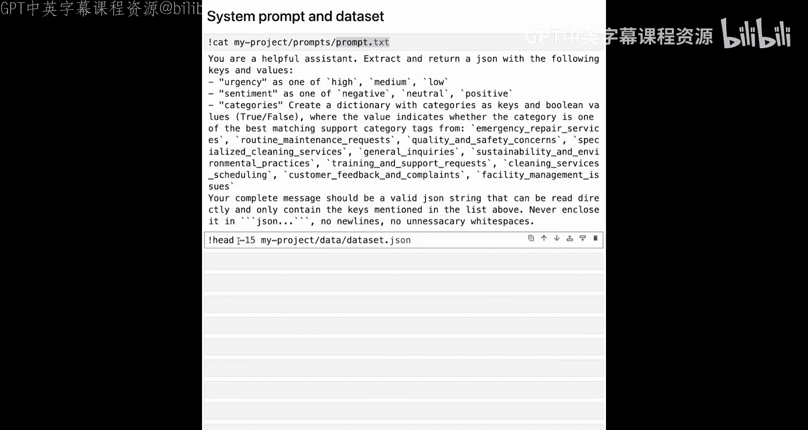
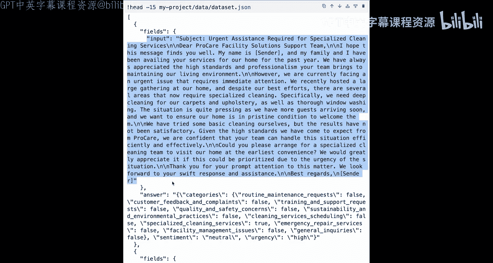
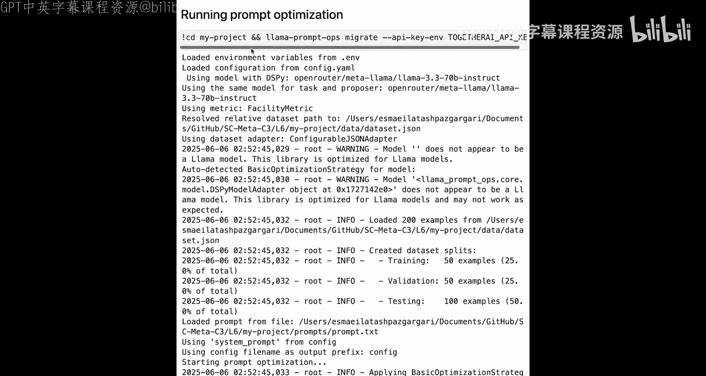
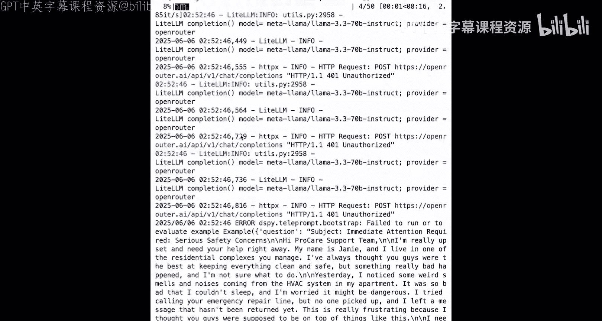
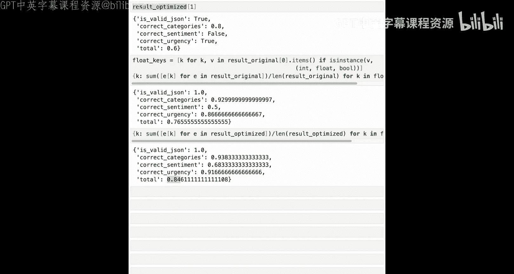

# 006：Prompt 优化工具 🛠️


在本节课中，我们将学习如何使用 Llama 的 Prompt 优化工具来自动改进你的提示词。我们将通过一个具体的例子，演示如何优化一个用于客户消息分类的提示词，并比较优化前后的性能差异。

## 概述

提示词对模型的行为有巨大影响。即使是微小的措辞变化也可能完全改变模型的输出。然而，手动设计提示词既耗时又常常不一致。Meta 的开源 Prompt 优化工具可以帮助我们自动化提示词改进的过程，使你的 Llama 应用更加可靠和高效。

该工具是一个 Python 包，名为 `llama-prompts-rs`。你只需向工具提供当前的提示词和一些示例任务，在 YAML 配置文件中选择一个评估指标并设置其他参数。它会使用 Llama 模型本身来建议改进版本、运行比较，并最终给出一个优化后的版本。这在从其他模型迁移提示词或针对边缘情况进行调整时尤其有用。

## 项目设置与配置

上一节我们介绍了工具的基本原理，本节中我们来看看如何设置一个具体的优化项目。



首先，我们需要加载 API 密钥。你还需要通过 `pip install llama-prompts-ops` 安装工具包。由于在演示平台上已经安装，所以代码中已注释。



你可以创建一个示例项目。该工具创建的示例项目是一个设施管理分类任务，旨在根据紧急程度、客户情绪和相关服务类别对客户服务消息进行分类。

项目创建后，会添加以下文件：
*   `config.yaml` 配置文件
*   `prompt.txt` 原始提示词文件
*   一个数据集文件
*   一个 `README.md` 文件

让我们查看 `prompt.txt` 文件中的系统提示词：

```text
你是一个乐于助人的助手。提取并返回一个包含以下键和值的 JSON。
```

以下是 JSON 的键：
```json
{
  "urgency": "...",
  "sentiment": "...",
  "category": "..."
}
```

对于收到的每条消息，都应提取并返回紧急程度、情绪和类别。这就是我们想要优化的提示词。

接下来，我们查看配置文件 `config.yaml`。这个文件包含影响优化过程的不同参数。其中定义了初始系统提示词的位置、数据集路径，以及任务模型和提案模型。任务模型默认设置为 `llama-3-3`，它使用 `prompt.txt` 中的系统提示词来处理所有输入消息并返回结果。提案模型也默认设置为 `llama-3-3`，它将提出新的系统提示词，以提升任务模型在给定数据集上的整体性能。



我们将修改这个配置文件，将任务模型设置为 `llama-4-sc`，提案模型设置为 `llama-4-maverick`。同时，优化策略设置为 `llama`。你可以将其改为 `basic` 以获得快速结果，或改为 `advance` 以进行更广泛的提示词修改和更多轮次的评估。`llama` 是我们为 Llama 模型优化提示词的推荐策略。

此外，提示词优化工具支持两种内置评估指标：用于简单字符串匹配的 `exact_match` 指标，以及用于特定字段评估的 `standard_json` 指标。默认示例任务使用的指标是为客户服务消息分类设计的自定义指标，它评估预测在三个关键维度（紧急程度、情绪和服务类别）上的准确性。



## 运行优化过程

现在我们的示例项目已设置好，我们可以使用 `migrate` 命令来运行提示词优化过程。

优化过程涉及几个步骤：
1.  加载系统提示词和数据集。
2.  分析提示词的结构和内容。
3.  应用优化策略。
4.  将优化后的提示词与原始提示词进行评估比较。
5.  将优化后的提示词保存到结果目录。

运行此命令需要一些时间。优化完成后，我们可以比较优化后的提示词和原始提示词。

## 比较优化结果

优化后的提示词存储在结果目录的 JSON 文件中。我们可以通过几行代码获取它。为了更直观地比较，我们也可以读取 `prompt.txt` 文件中的原始提示词，并使用代码块将两者并排显示。

除了优化后的提示词，优化器还会生成一些少样本示例。优化后的提示词与生成的少样本示例结合使用，将带来更好的评估结果。少样本示例是问答对。

现在，让我们使用评估函数来比较优化后和原始的提示词。首先加载数据集中最后 30% 的数据作为测试集。然后，我们分别使用原始提示词以及“优化后提示词 + 少样本示例”在测试数据上进行评估，并收集结果。

以下是评估结果的关键指标对比：

*   **原始提示词平均得分**:
    *   正确分类: `0.92`
    *   正确情绪: `0.50`
    *   正确紧急程度: `0.86`
    *   总分（前三项平均值）: `0.76`

*   **优化后提示词 + 少样本示例平均得分**:
    *   正确分类: `0.94`
    *   正确情绪: `0.60`
    *   正确紧急程度: `0.91`
    *   总分（前三项平均值）: `0.84`

可以看到，优化后，正确情绪识别的分数从 `0.50` 提升到了 `0.60`，正确紧急程度识别的分数从 `0.86` 提升到了 `0.91`。正确分类的分数也有小幅提升。总体平均分从 `0.76` 提高到了 `0.84`。

## 总结

在本节课中，我们使用了 Llama 的 Prompt 优化工具来优化一个用于情绪分析和分类用例的系统提示词。我们比较了优化后的提示词（连同优化器生成的少样本示例）与原始提示词的性能。结果显示，优化后的提示词在多个评估维度上均有显著提升。



在下一节课中，我们将使用合成数据工具包来生成、整理和保存合成数据。