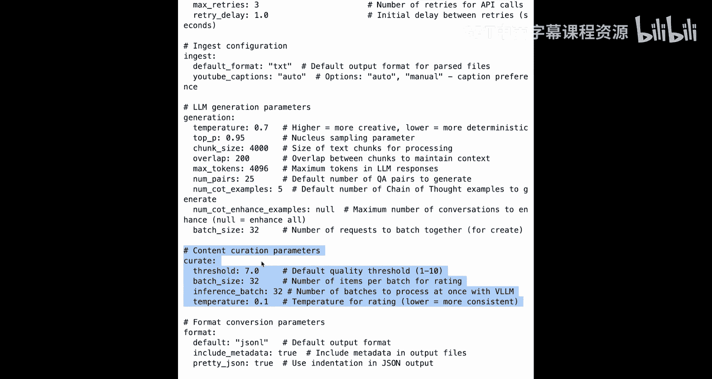

# 007：使用合成数据工具包

在本节课中，我们将学习如何使用 Llama 合成数据工具包来创建高质量的数据集，用于训练和微调模型。我们将了解如何通过几个简单的步骤来**摄取**、**创建**、**筛选**和**保存**数据。

## 概述：为何需要合成数据？ 🤔

在构建大语言模型应用时，我们常常会遇到数据问题。真实世界的数据通常杂乱、非结构化，或者数量不足。合成数据提供了一个灵活的替代方案，它允许我们生成恰好符合需求的示例数据。合成数据对于模型蒸馏、微调，甚至在特定边缘案例上对模型进行压力测试都非常重要。

Llama 合成数据工具包是一个命令行工具，它使得利用 Llama 模型本身生成高质量训练数据变得非常容易。使用这个工具，你可以生成不同类型的数据集，从问答对到思维链和摘要数据。

接下来，我们将通过一个完整流程来学习其工作原理：首先摄取一个 PDF 文件，从中创建数据，然后通过移除低质量数据进行筛选，最后以不同格式保存数据。

## 第一步：环境设置与安装 ⚙️

我们将从导入 API 密钥开始。要使用合成数据工具包，你需要设置一个名为 `API_KEY` 的环境变量，其值应为你的 Llama API 密钥或其他 Llama 云服务提供商的 API 密钥。

此外，你需要安装 `synthetic-data-kit` 包。由于在本教学平台中已经预装，所以安装命令在此被注释掉了。

```bash
# 设置环境变量（示例）
# export API_KEY="your_api_key_here"

# 安装工具包（如果尚未安装）
# pip install synthetic-data-kit
```

## 第二步：从文档中摄取数据 📄

从 PDF、网页和视频等真实世界文档中提取相关数据是复杂且容易出错的。合成数据工具包可以帮助你摄取不同类型的文件，包括 PDF 和网页，并从中提取纯文本数据。

这里，我们有一篇 27 页的论文。只需运行下面这一行代码，合成数据工具包就会提取文本并保存它。

```bash
synthetic-data-kit ingest --input paper.pdf --output extracted_text.txt
```

让我们查看提取文本的前 50 行中的最后 10 行，结果如下所示。

合成数据工具包也可以从网页提取文本。这里我们有一个 Meta 官网上的网页。让我们使用工具包来提取该网页的文本。

```bash
synthetic-data-kit ingest --input https://ai.meta.com/ --output webpage_text.txt
```

提取完成后，结果被保存在这里。我们来看几行提取的文本。

## 第三步：创建问答数据集 ❓➡️💬

现在，让我们基于刚才摄取并提取了文本的论文，创建一个问答数据集。这就像运行下面这一行命令一样简单：使用 `create` 命令，传入提取文本的地址，并选择我们想要创建的数据类型为 `Q&A`。

```bash
synthetic-data-kit create --input extracted_text.txt --type Q&A --output qa_dataset.json
```

你还可以选择其他数据类型，包括思维链和摘要。通过将 `Q&A` 改为 `COT`，你可以创建思维链数据。

运行此命令，过程将持续到所有数据生成完毕。最后，你会看到数据保存的位置。让我们查看这个 JSON 文件，结果如下：文档的摘要被给出，并且生成了问答对。

## 第四步：筛选与清理数据 🧹

在某些用例中，你需要过滤数据，从数据集中移除低质量的数据。你可以使用合成数据工具包的 `curate` 命令来完成此操作。你可以传入创建好的数据，以及一个质量阈值（1到10之间的数字）。阈值越高，保留数据的质量就越高，但保留率会降低。

让我们尝试对我们创建的数据使用阈值 8。

```bash
synthetic-data-kit curate --input qa_dataset.json --threshold 8 --output clean_qa_dataset.json
```

现在，清理过程正在进行。如你所见，创建的 48 对数据被评估和评分，其中 45 对评分达到或超过阈值 8 的数据被保留。清理后的数据被保存在这里。

让我们查看一下：现在为每个问答对计算了一个评分，只有评分大于或等于 8 的对被保留。你还拥有每个问题对的对话记录，包含系统、用户和助手消息。最后，你还会看到一个统计矩阵，包括问题总数、通过给定评分阈值的问题数量、保留率以及保留问题的平均分数。

## 第五步：保存为不同格式 💾

`saves` 命令将筛选后的数据集转换为不同的文件格式。它支持四种流行的输出格式：`Json`、`Alpaca`、`FT` 和 `ChatML`，以及两种存储格式：`Json` 和 `Hugging Face` 的 `HF4`。

让我们将上一步得到的干净问答对，使用 Json 存储格式保存为 JSon 格式。

```bash
synthetic-data-kit saves --input clean_qa_dataset.json --format Json --storage Json --output final_dataset.json
```

运行后，以 JSon 格式和 JSon 存储格式的文件被保存在这里。让我们看看这个文件中的前 10 个问题。

通过将格式更改为其他选项，例如 `FT`，你可以将数据保存为不同格式。运行后，数据的 FT 格式被保存在这个 JSon 文件中。让我们从这个文件中看几行，这就是我们问答数据集的 FT 格式。

我鼓励你将格式改为 `Alpaca` 和 `ChatML` 并比较结果。

## 第六步：了解配置文件 ⚙️📁

合成数据工具包有一个默认的配置文件。让我们快速浏览一下这个文件。

这个合成数据的配置文件包含了合成数据生成所需的所有配置。例如，当使用 `create` 命令生成数据时，它会自动存储在 `data/generated` 路径下。你可以控制从传入到最终保存所有阶段的路径。

这里还有更多设置。我鼓励你查看这个配置文件，并更改任何设置以优化你的合成数据创建过程。例如，这些是控制创建步骤的参数，而这些是控制筛选过程的参数。

## 总结 🎯

在本节课中，我们一起学习了如何使用合成数据工具包生成合成数据。我们走完了从设置环境、摄取文档、创建问答数据集、筛选清理数据到最终保存为多种格式的完整流程。




我鼓励你尝试其他数据类型，如思维链，并尝试保存为不同的格式，以更好地掌握这个强大工具的使用。