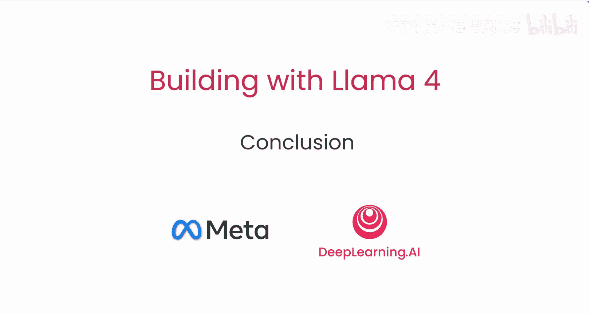

# 008：9. 总结 🎯

在本课程中，我们学习了如何利用最新的 Llama 4 模型进行应用开发。现在，让我们对所学内容进行回顾与总结。



## 课程概述 📖

在本节课中，我们将要学习并总结整个课程的核心内容。我们回顾了如何利用 MeAs API 构建应用、进行图像推理、处理长文本与代码库，以及使用新工具优化提示词和生成合成数据。

## 核心内容回顾

上一节我们介绍了课程的各项实践内容，本节中我们来看看整体的知识框架。

### 1. 使用 MeAs API 构建应用
你已学会如何使用 MeAs API 与最新的 Llama 4 模型进行交互和构建应用。其核心调用方式通常遵循以下模式：
```python
response = mea_api.call(model="llama-4", prompt=user_input)
```

### 2. 图像推理
课程涵盖了如何让 Llama 4 模型理解和推理图像内容。这通常涉及将图像编码为模型可理解的格式。

### 3. 长上下文与代码库提示
你探索了如何针对长文本文件和代码仓库进行有效的提示（Prompting）。处理长上下文的关键在于**有效的信息分块与检索**。

### 4. 新工具的应用
你还接触了来自 Error 的新工具，用于：
以下是两个主要应用方向：
*   **提示词优化**：系统化地改进提示以获得更佳模型输出。
*   **合成数据生成**：自动创建训练或测试数据，以扩展数据集。

## 总结与展望

本节课中我们一起学习了利用 Llama 4 模型进行应用开发的全流程。从基础的 API 调用，到复杂的图像推理和长上下文处理，再到利用先进工具优化工作流，你已掌握了构建智能应用的关键技能。

我们希望本课程能帮助你迈出使用 Llama 4 进行开发的重要一步。

期待看到你构建出的精彩作品。