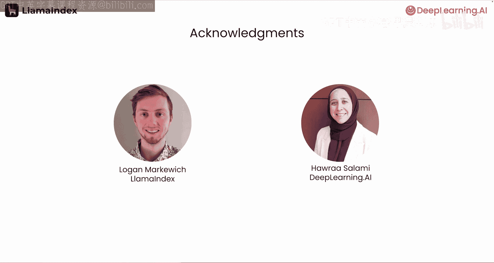

# 001：事件驱动的智能代理文档工作流简介 🚀

在本节课中，我们将学习如何构建基于事件驱动的智能代理文档工作流。这是一种建立在检索增强生成（RAG）系统之上的高级应用，能够自动化处理复杂的端到端文档任务。

## 概述

欢迎来到由LlamaIndex合作推出的“事件驱动的智能代理文档工作流”课程。本课程的讲师是LlamaIndex的开发者关系副总裁Lari Vos。

智能代理文档工作流是一种基于代理的应用程序。与仅能回答数据简单问题的RAG系统不同，智能代理工作流可以构建在RAG之上，以更复杂的方式处理输入文档。

## 智能代理工作流原理

在我们将要学习的架构中，代理会首先识别完成任务所需的信息，然后利用RAG检索相关材料，最后将收集到的信息组合成结构化的输出。

以下是两个具体示例：

*   **合同合规审查**：代理可以解析合同，提取关键条款，并从法规要求知识库中匹配相关条款，最终生成一份合规性摘要。
*   **发票信息标准化**：代理可以从发票中提取商品描述，利用RAG在产品目录中匹配最接近的产品代码，然后将标准化信息附加到该发票上。

在本课程中，您将把这类工作流应用于一个实际场景：构建一个能使用简历自动填写求职申请表的代理。

## 课程核心：LlamaIndex工作流抽象

Lari将指导您从头开始构建，使用的工具是LlamaIndex的**工作流抽象**。这是构建事件驱动系统的有效方法，也是构建高效代理集的关键设计模式。

LlamaIndex的工作流是一种事件驱动架构。您将把代理的逻辑封装在一系列步骤中，其中每一步都会发出事件以触发后续步骤。

您将学习如何在工作中实现：
*   代码分支和循环。
*   创建并发事件。
*   在给定步骤收集多个事件。

## 实践项目：分步构建表单填写代理

您将应用上述概念，逐步构建您的表单填写代理：

1.  **设置RAG能力**：首先，设置代理的RAG功能，以解析给定的简历、加载到向量数据库并创建查询引擎。
2.  **解析申请表**：让代理解析求职申请表，将空白处转换为一连串问题，并发送给RAG流程处理。
3.  **迭代与反馈**：为代理提供的答案提供反馈，并共同迭代改进。您将通过文本，乃至语音的方式与代理沟通反馈。

## 总结

本节课我们一起学习了事件驱动智能代理文档工作流的基本概念、优势及其应用场景。我们了解到，这是一种超越基础RAG的、能够自动化复杂文档处理任务的高级模式。通过LlamaIndex的工作流抽象，我们可以以事件驱动的方式设计和构建这样的代理。

许多人为本课程的创作做出了贡献，特别感谢来自LlamaIndex的Logan Markrovitch和DeepLearning.AI的Hout Salami。

事件驱动工作流是一个非常重要的设计模式，越来越多的企业正在使用它来设计由大语言模型驱动的应用程序。希望您能享受学习这些概念的过程。接下来，让我们进入下一个视频，开始动手实践吧！😊