# 002：什么是智能代理文档工作流 🧠

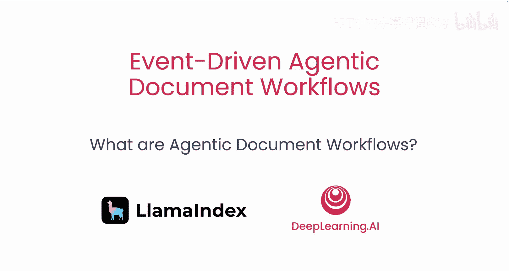

在本节课中，我们将学习智能代理文档工作流的基本概念。这包括RAG（检索增强生成）、代理和工作流。你将了解RAG如何帮助回答关于数据的问题，工作流如何为代理规定数据流，以及事件驱动的文档处理如何增强RAG。让我们开始吧。

## 概述 📋

今天要介绍的是智能代理文档工作流。你将构建一个简单的示例。这是一种基于RAG（如ChatGPT）构建LLM应用的新范式，旨在解决RAG的局限性，并通过应用代理策略超越这些限制。

但这里有很多陌生的术语。什么是RAG？什么是代理策略？在开始之前，我们先来定义这些概念。

## 什么是RAG？ 🔍

RAG代表**检索增强生成**。RAG是对LLM一个基本局限性的回应。LLM在大量数据上训练，但并未在你的特定数据上训练。通常，当你解决问题时，不仅需要通用知识，还需要处理你的私有数据。

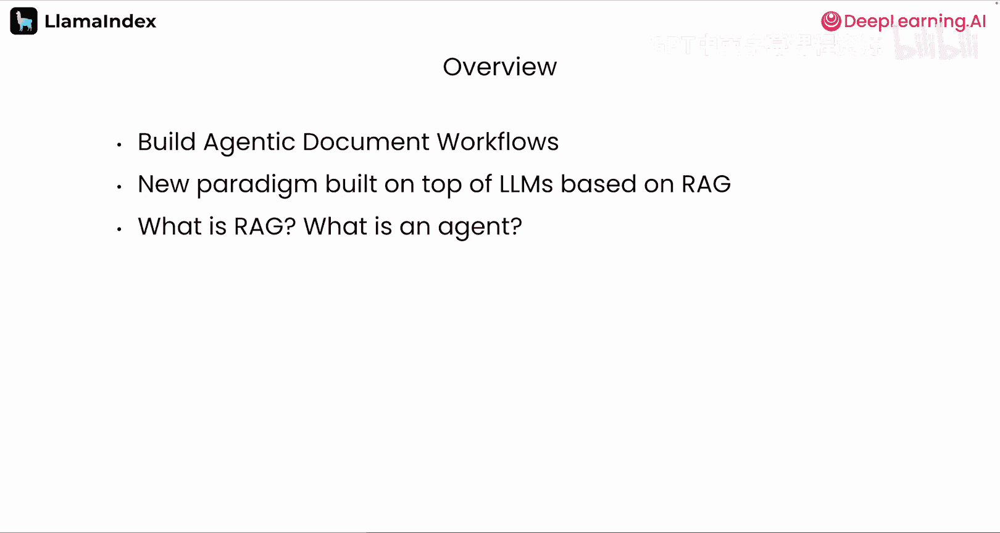

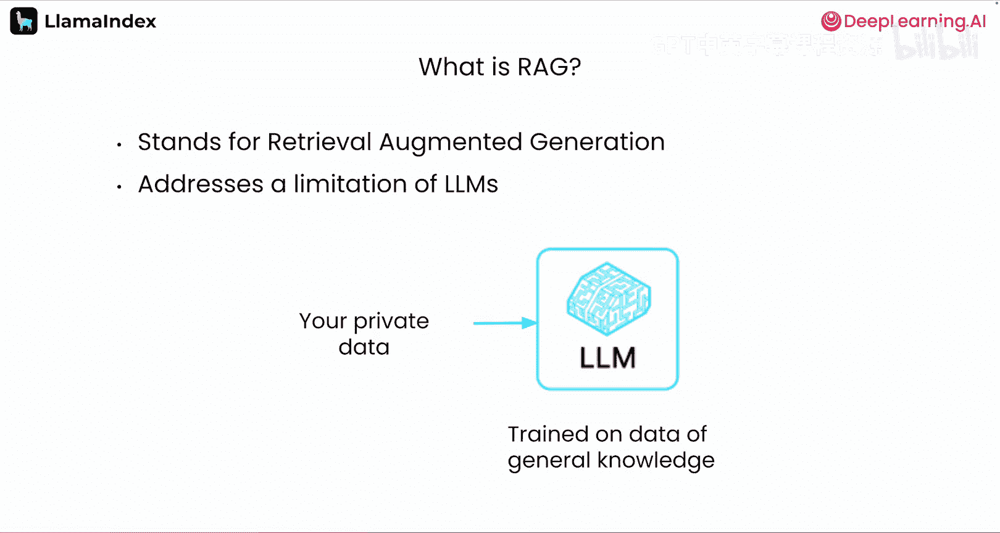

为了让LLM回答关于你数据的问题，你必须将数据提供给LLM。但这遇到了LLM的另一个基本限制：**上下文窗口**。你一次只能给LLM提供有限的数据。即使最强大的LLM一次也只能处理大约一百万个标记的信息，而你的组织数据量可能远超于此，达到数千万甚至数亿。

因此，你必须选择性地向LLM提供数据。这就带来了一个挑战：如何选择数据？你希望给LLM提供最相关的数据。

事实证明，产生LLM的相同技术也产生了称为**嵌入模型**的东西，这是解决该问题的部分方案。嵌入模型将数据字符串编码成称为**向量**的数字数组。所有可能向量的集合被称为**向量空间**。这些向量编码了你所编码数据的含义。

然后，你可以将这些向量存储在数据库中。现在，如果你有一个关于数据的问题，你可以将你的问题通过相同的嵌入模型运行，你的问题也会被编码成一个向量。嵌入模型的魔力在于，因为它们编码含义，所以你的问题和回答你问题的数据是关于相似事物的，它们具有相似的含义。因此，它们在向量空间中数学上是彼此接近的。

你可以使用数据库来搜索附近的向量。这就是当你有一个查询时，如何找到相关数据提供给LLM的方法。

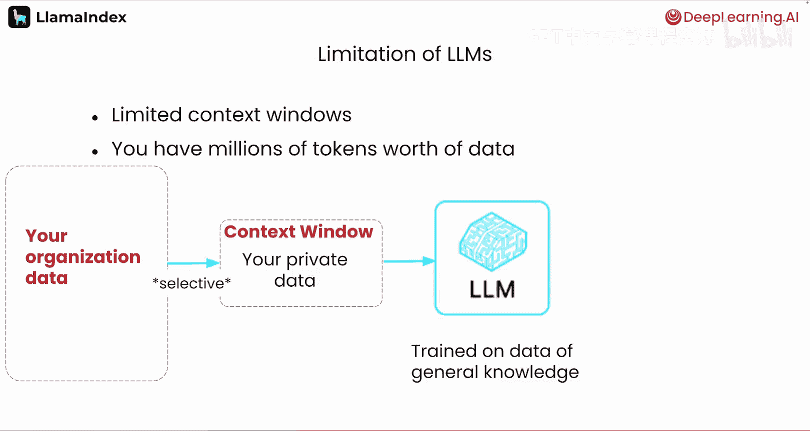

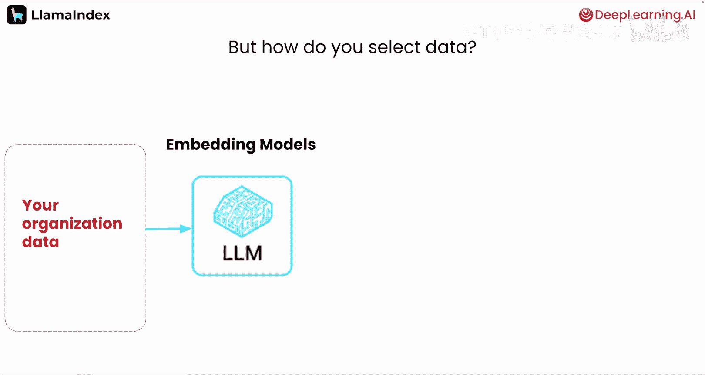

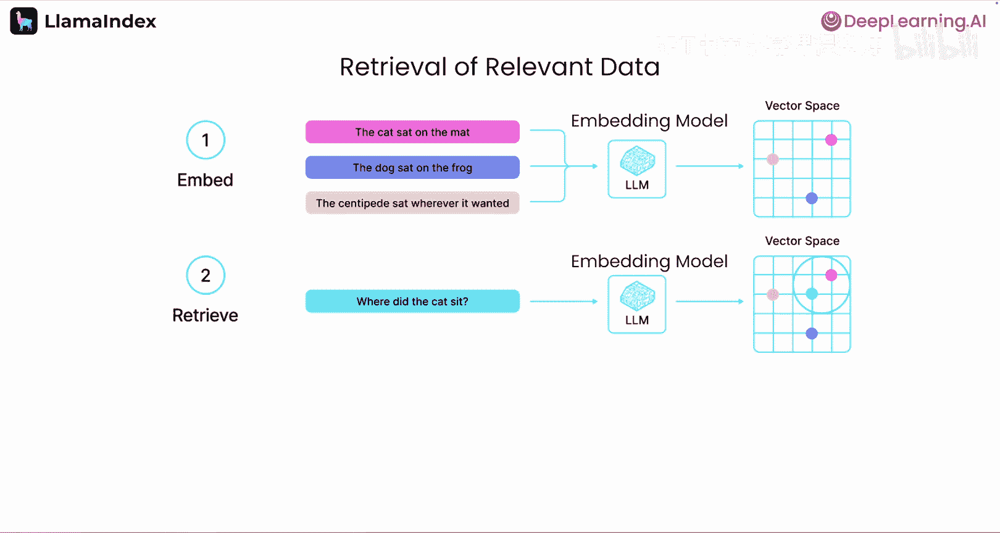

然后，你可以将你的查询和相关数据（称为**上下文**）一起提供给LLM，并要求它使用上下文来回答问题。我们将这一步称为**生成**，因为它正在生成答案。而我们搜索相关数据的步骤称为**检索**。因此，合起来就是**检索增强生成**或**RAG**。

RAG是一种极其强大的技术，但它确实有一些局限性。其中之一是处理复杂或多部分问题。

## RAG的局限性与解决方案 ⚙️

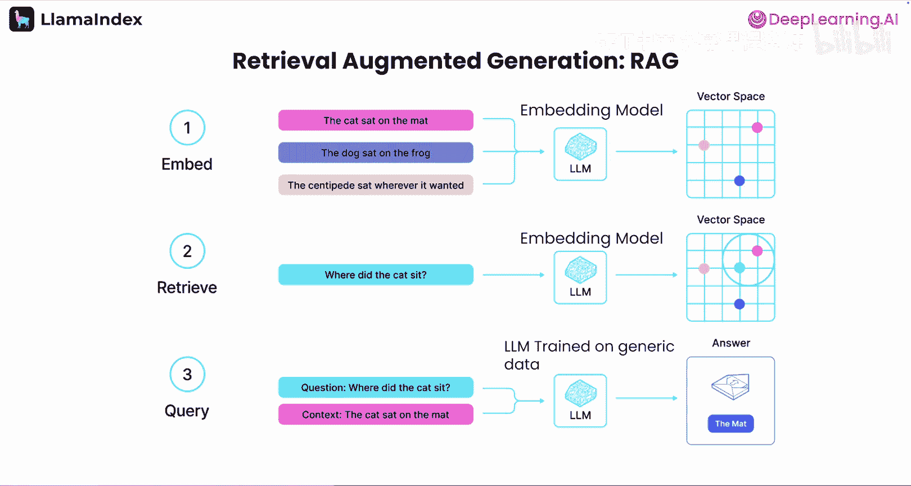

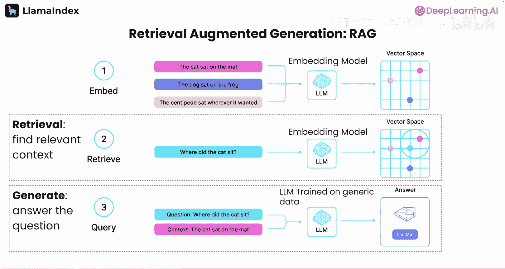

这个局限性是合理的，因为RAG基于搜索。如果你有一个包含多个部分的问题，RAG会同时搜索你的嵌入以寻找许多东西。因此，它得到的结果会不那么集中。你会得到大量结果，但它们可能不包含你需要的所有信息。

这个问题的解决方案是将你的复杂问题分解成许多更简单的问题。每个更简单的问题将获得一组更集中、更全面的搜索结果。这对LLM来说是一个很好的任务，因为它们擅长查看一个复杂问题并将其分解为更小的问题。在另一端，它们可以获取一堆简单问题的答案，并将它们综合成一个连贯的答案。

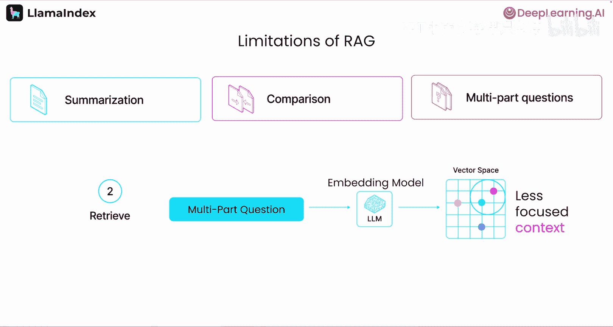

这就是你今天要做的事情。而你将通过构建一个**代理**来实现。

## 什么是代理？ 🤖

我之前提到过代理和代理策略。那么，什么是代理？这是一个相当模糊的术语。在LlamaIndex，当我们说代理时，我们指的是一段**半自主软件**。它可以被赋予工具和一个目标，并且会找出如何解决问题，而无需被给予实现该目标的具体、逐步的指令。

这与传统编程非常不同，在传统编程中，每一步都是精确定义的。在LlamaIndex中，构建代理的方式是使用**工作流**。

## 什么是工作流？ 🔄

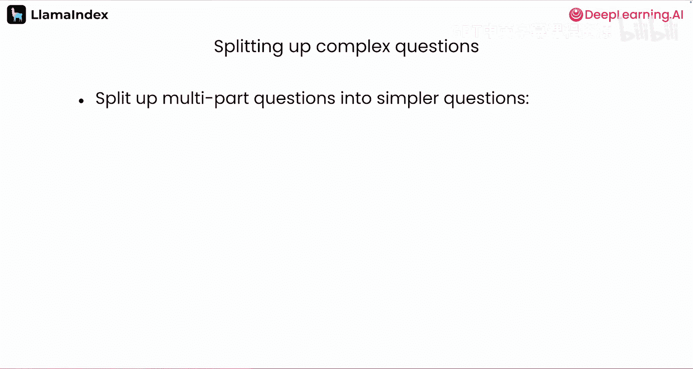

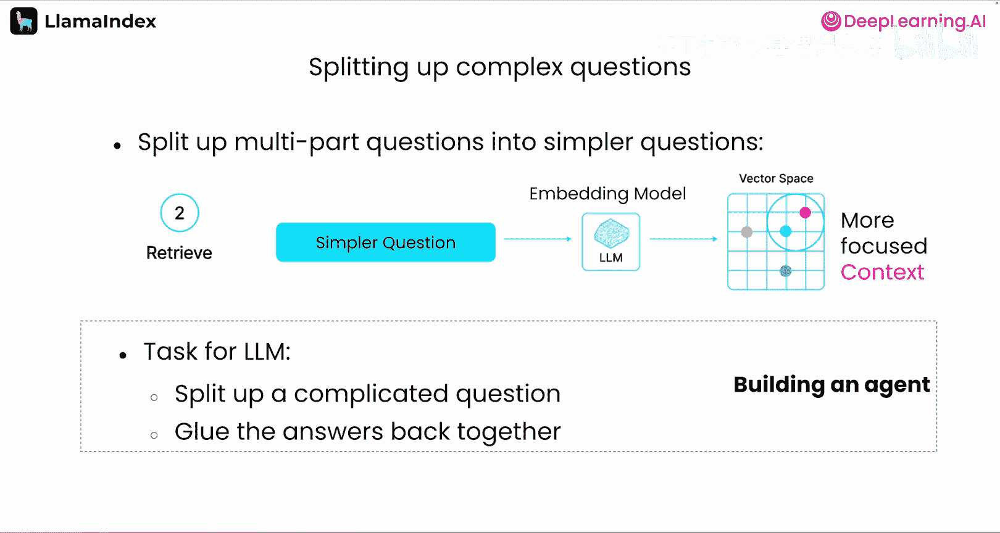

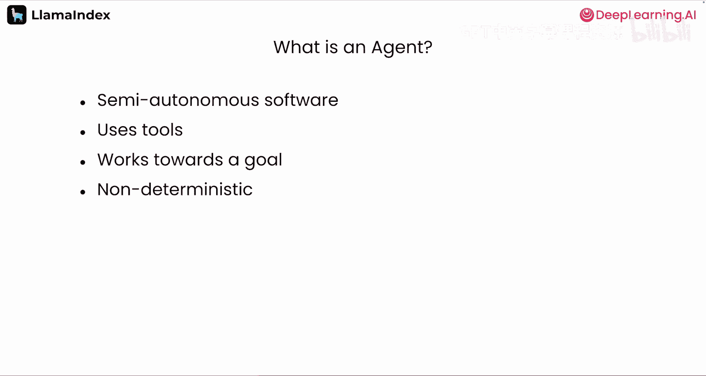

工作流是LlamaIndex中代理系统的构建模块。它们是一个基于事件的系统，允许你定义一系列由事件连接的步骤，并在步骤之间传递信息。正如你将看到的，你可以创建相当复杂的工作流，包含分支、循环和并行执行，以实现你需要的任何任务。

工作流为你的代理提供结构，其精细程度或宽松程度可根据需要而定。一些代理框架根本没有结构，这可能导致混乱的结果。另一些则采用基于图的方法，这使得循环和其他结构更加困难。我认为工作流提供了两全其美的方案。

## 智能代理文档工作流 📄

这让我们来到了**智能代理文档工作流**或**ADW**。我们已经讨论了基础知识：RAG、工作流和代理。智能代理文档工作流是一种通过将代理工作流应用于实际问题，并将其构建到更大的软件中，来解决实际业务问题的软件构建方式。

ADW建立在RAG的强大功能之上。但与主要处理简单问题的RAG不同，智能代理文档工作流处理复杂问题，并产生结构化、具体的输出，而不仅仅是简单的英文答案。

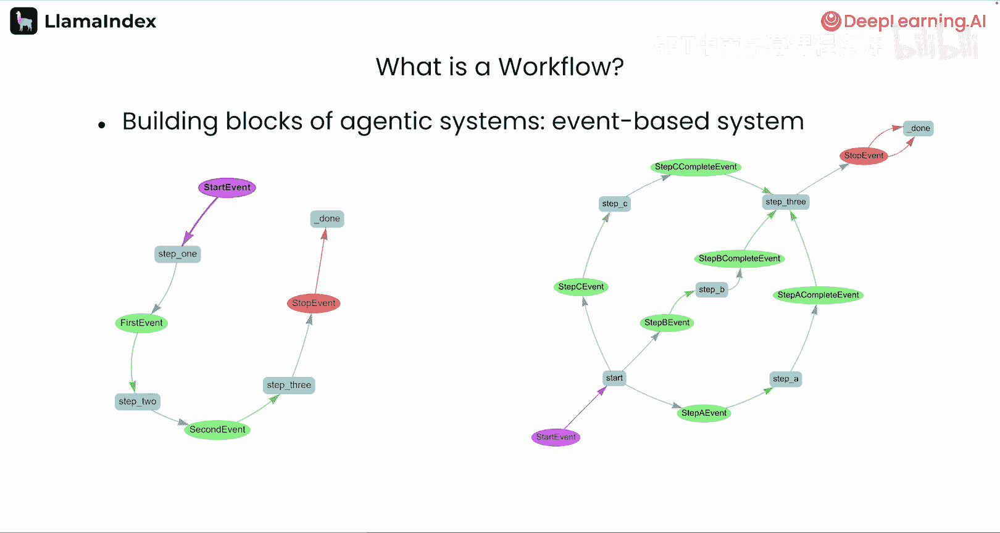

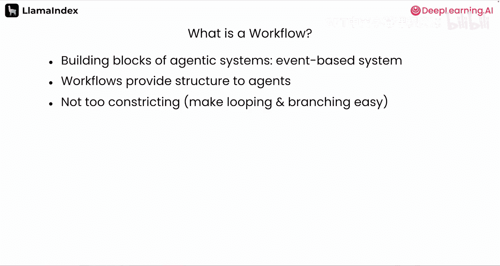

## 总结 🎯

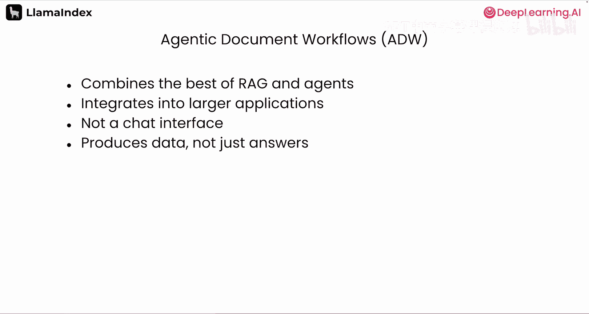

在本节课中，我们一起学习了智能代理文档工作流的核心概念。我们了解了RAG如何通过检索和生成来回答关于私有数据的问题，以及它在处理复杂问题时的局限性。我们探讨了代理作为半自主软件的概念，以及工作流如何为代理提供结构化的执行路径。最后，我们定义了智能代理文档工作流，它是一种结合了RAG、代理和工作流优势，用于解决复杂业务问题并产生结构化输出的高级应用范式。在下一课中，我们将开始动手构建。