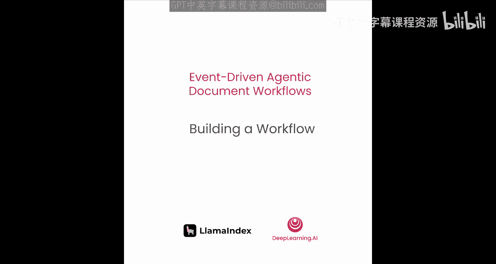
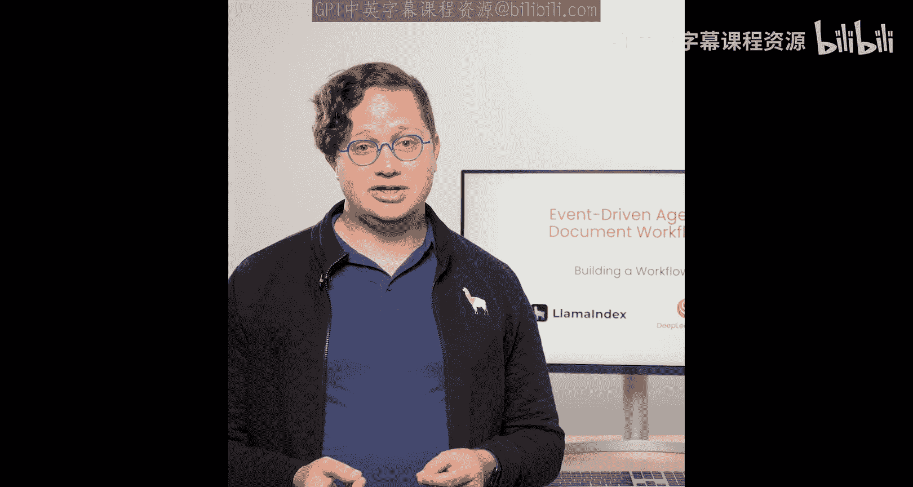
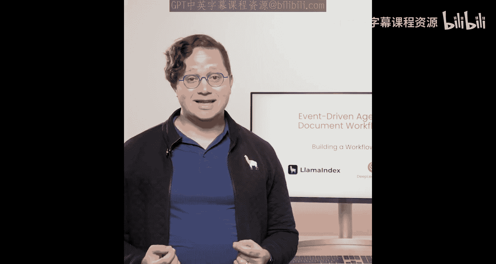
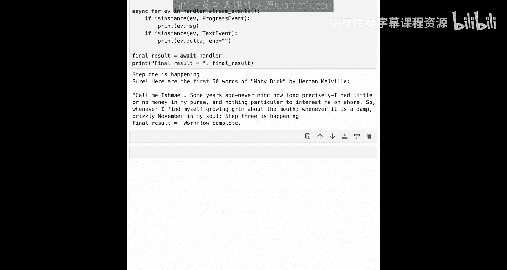

# 003：构建工作流 🛠️



在本节课中，我们将学习构建一系列由简到繁的工作流，以掌握其基本概念。我们将从一个简单的、由一系列触发事件的步骤组成的工作流开始，然后逐步为其添加分支和循环逻辑，实现并发执行，并最终学习如何在特定步骤收集不同类型的事件。





## 概述

工作流本质上是常规的Python类，由一系列步骤定义。每个步骤接收特定类型的事件，并发出特定类型的事件。接下来，让我们开始构建第一个工作流。

## 导入与基础设置

首先，我们需要导入必要的库。我们将使用OpenAI，因此需要设置API密钥。同时，我们还需要导入一些特殊事件类以及工作流的核心模块。

```python
import os
from llama_index.core.workflow import (
    StartEvent,
    StopEvent,
    step,
    Context,
    Event,
)
from llama_index.core.workflow.visualization import draw_all_possible_flows
from IPython.display import display, HTML
import asyncio
import random
import time

# 设置OpenAI API密钥
os.environ["OPENAI_API_KEY"] = "your-api-key-here"
```

## 构建单步工作流

我们从一个最简单的单步工作流开始。它接收一个`StartEvent`（启动事件），并发出一个`StopEvent`（停止事件）。

```python
class MyWorkflow:
    @step
    async def my_step(self, ev: StartEvent) -> StopEvent:
        # 这是一个异步函数，可以暂停和恢复，允许其他任务同时运行。
        # 这在后续实现并行执行时会很有用。
        return StopEvent(result="Workflow completed.")

# 实例化并运行工作流
async def run_workflow():
    workflow = MyWorkflow(timeout=10, verbose=False)
    result = await workflow.run()
    print(result)

# 在Jupyter Notebook中可以直接运行
# await run_workflow()

# 在普通Python脚本中，需要这样运行：
# asyncio.run(run_workflow())
```

## 可视化工作流

工作流的一个强大功能是内置的可视化工具。我们可以生成一个交互式的HTML图表来查看工作流的结构。

```python
# 生成可视化图表
draw_all_possible_flows(MyWorkflow, "simple_workflow.html")

# 在Notebook中显示图表
with open("simple_workflow.html", "r") as f:
    html_content = f.read()
display(HTML(html_content))
```

如上所示，可视化图表展示了从`StartEvent`到`my_step`，再到`StopEvent`的简单流程。

## 构建多步工作流

单步工作流功能有限。要创建多步工作流，我们需要定义可以触发其他步骤的自定义事件。

以下是创建一个三步工作流的步骤：

1.  **定义自定义事件类**：它们必须继承自`Event`基类。
2.  **定义工作流类**：使用`@step`装饰器定义每个步骤，并指定其接收和发出的事件类型。

```python
# 1. 定义自定义事件
class FirstEvent(Event):
    pass

class SecondEvent(Event):
    pass

# 2. 定义三步工作流
class MyMultiStepWorkflow:
    @step
    async def step1(self, ev: StartEvent) -> FirstEvent:
        print("Step 1 executed.")
        return FirstEvent()

    @step
    async def step2(self, ev: FirstEvent) -> SecondEvent:
        print("Step 2 executed.")
        return SecondEvent()

    @step
    async def step3(self, ev: SecondEvent) -> StopEvent:
        print("Step 3 executed.")
        return StopEvent(result="Multi-step workflow completed.")

# 运行工作流
async def run_multi_step():
    workflow = MyMultiStepWorkflow()
    result = await workflow.run()
    print(result)

# await run_multi_step()
```

可视化这个工作流，你会看到一条清晰的路径：`StartEvent` -> `step1` -> `FirstEvent` -> `step2` -> `SecondEvent` -> `step3` -> `StopEvent`。

## 实现循环逻辑

仅仅顺序执行还不够灵活。工作流允许我们实现循环和分支逻辑。为了实现循环，我们可以创建一个循环事件，并让某个步骤在满足条件时发出该事件，从而触发自身或其他步骤再次执行。

以下是实现随机循环的示例：

```python
# 定义循环事件
class LoopEvent(Event):
    pass

class LoopingWorkflow:
    @step
    async def step1(self, ev: StartEvent | LoopEvent) -> FirstEvent | LoopEvent:
        # 随机决定是继续执行还是循环
        if random.randint(0, 1) == 0:
            print("A bad thing happened. Looping back.")
            return LoopEvent()  # 发出循环事件，触发step1再次执行
        else:
            print("A good thing happened. Moving to next step.")
            return FirstEvent()

    @step
    async def step2(self, ev: FirstEvent) -> StopEvent:
        print("Step 2 executed.")
        return StopEvent(result="Looping workflow completed.")

# 运行多次以观察随机循环
# await LoopingWorkflow().run()
```

在可视化图中，你可以看到从`step1`出发的一个箭头指向`FirstEvent`（继续执行），另一个箭头指回`step1`自身（形成循环）。

## 实现分支逻辑

与循环类似，我们也可以实现分支逻辑，让工作流根据条件执行不同的路径。

以下是创建一个二分支工作流的示例：

```python
# 定义分支相关事件
class BranchA1Event(Event):
    pass
class BranchA2Event(Event):
    pass
class BranchB1Event(Event):
    pass
class BranchB2Event(Event):
    pass

class BranchingWorkflow:
    @step
    async def step1(self, ev: StartEvent) -> BranchA1Event | BranchB1Event:
        if random.randint(0, 1) == 0:
            print("Taking Branch A.")
            return BranchA1Event()
        else:
            print("Taking Branch B.")
            return BranchB1Event()

    @step
    async def step_a1(self, ev: BranchA1Event) -> BranchA2Event:
        print("Executing Step A1.")
        return BranchA2Event()

    @step
    async def step_a2(self, ev: BranchA2Event) -> StopEvent:
        print("Executing Step A2.")
        return StopEvent(result="Branch A completed.")

    @step
    async def step_b1(self, ev: BranchB1Event) -> BranchB2Event:
        print("Executing Step B1.")
        return BranchB2Event()

    @step
    async def step_b2(self, ev: BranchB2Event) -> StopEvent:
        print("Executing Step B2.")
        return StopEvent(result="Branch B completed.")

# 可视化分支工作流（无需实例化）
draw_all_possible_flows(BranchingWorkflow, "branching_workflow.html")
```

可视化图表将清晰地展示从`step1`分出的两条独立路径。

## 实现并发执行

对于耗时的任务，并发执行可以显著提高效率。工作流通过`Context`对象和`send_event`方法支持并行执行。

`Context`对象是工作流中所有步骤可访问的共享内存。通过它，一个步骤可以并行发出多个事件。

以下是一个并行执行三个查询任务的示例：

```python
class Step2Event(Event):
    def __init__(self, query: str):
        self.query = query

class ParallelFlow:
    @step
    async def step1(self, ev: StartEvent, ctx: Context) -> None:
        # 使用 ctx.send_event 并行发出三个事件
        await ctx.send_event(Step2Event("Query 1"))
        await ctx.send_event(Step2Event("Query 2"))
        await ctx.send_event(Step2Event("Query 3"))
        # 注意：这里没有return事件，流程由step2触发的事件驱动

    @step
    async def step2(self, ev: Step2Event) -> StopEvent:
        # 模拟一个耗时任务
        wait_time = random.randint(1, 5)
        print(f"Processing {ev.query}, waiting {wait_time} seconds...")
        await asyncio.sleep(wait_time)
        print(f"Finished {ev.query}")
        # 第一个完成的step2会触发StopEvent，导致整个工作流停止
        return StopEvent(result=ev.query)

# 运行并发工作流
# result = await ParallelFlow().run()
# print(f"The first query to finish was: {result}")
```

需要注意的是，在这个例子中，第一个完成的`step2`发出的`StopEvent`会立即终止整个工作流。

## 收集并行事件的结果

如果我们希望收集所有并行任务的结果，而不是只取第一个，可以使用`Context`对象的`collect_events`方法。

`collect_events`会等待指定数量、指定类型的事件全部到达后，才返回一个包含这些事件的列表。

以下是收集三个相同类型事件结果的示例：

```python
class Step3Event(Event):
    def __init__(self, query: str):
        self.query = query

class ConcurrentCollectWorkflow:
    @step
    async def step1(self, ev: StartEvent, ctx: Context) -> None:
        await ctx.send_event(Step2Event("Query 1"))
        await ctx.send_event(Step2Event("Query 2"))
        await ctx.send_event(Step2Event("Query 3"))

    @step
    async def step2(self, ev: Step2Event) -> Step3Event:
        wait_time = random.randint(1, 3)
        await asyncio.sleep(wait_time)
        return Step3Event(query=ev.query)

    @step
    async def step3(self, ev: Step3Event, ctx: Context) -> StopEvent | None:
        # 收集3个Step3Event类型的事件
        events = await ctx.collect_events(Step3Event, count=3)
        if events is None:
            # 如果还没收集齐，返回None，步骤会再次被触发
            print("Not all events received yet.")
            return None
        else:
            # 收集齐了，处理结果
            results = [e.query for e in events]
            print(f"All queries received: {results}")
            return StopEvent(result=results)

# 运行收集工作流
# result = await ConcurrentCollectWorkflow().run()
# print(f"Final result: {result}")
```

## 收集不同类型的事件

`collect_events`方法同样可以用于收集多种不同类型的事件。你需要指定要收集的每种事件类型及其数量。

以下是收集三种不同类型事件结果的示例：

```python
# 定义多种事件类型
class StepAEvent(Event):
    pass
class StepACompleteEvent(Event):
    def __init__(self, data: str):
        self.data = data
class StepBEvent(Event):
    pass
class StepBCompleteEvent(Event):
    def __init__(self, data: str):
        self.data = data
class StepCEvent(Event):
    pass
class StepCCompleteEvent(Event):
    def __init__(self, data: str):
        self.data = data

class MultiTypeCollectWorkflow:
    @step
    async def step1(self, ev: StartEvent, ctx: Context) -> None:
        # 并行发出三种不同类型的事件
        await ctx.send_event(StepAEvent())
        await ctx.send_event(StepBEvent())
        await ctx.send_event(StepCEvent())

    @step
    async def step_a(self, ev: StepAEvent) -> StepACompleteEvent:
        await asyncio.sleep(random.randint(1, 2))
        return StepACompleteEvent(data="Something A-ish")

    @step
    async def step_b(self, ev: StepBEvent) -> StepBCompleteEvent:
        await asyncio.sleep(random.randint(1, 2))
        return StepBCompleteEvent(data="Something B-ish")

    @step
    async def step_c(self, ev: StepCEvent) -> StepCCompleteEvent:
        await asyncio.sleep(random.randint(1, 2))
        return StepCCompleteEvent(data="Something C-ish")

    @step
    async def step_final(self,
                         ev: StepACompleteEvent | StepBCompleteEvent | StepCCompleteEvent,
                         ctx: Context) -> StopEvent | None:
        # 收集三种不同类型的事件各一个
        # 注意：顺序决定了返回列表中的事件顺序
        events = await ctx.collect_events(StepCCompleteEvent, StepACompleteEvent, StepBCompleteEvent, count=1)
        if events is None:
            return None
        else:
            results = [e.data for e in events]
            print(f"Collected results in specified order: {results}")
            return StopEvent(result=results)

# 运行并可视化这个更复杂的工作流
# draw_all_possible_flows(MultiTypeCollectWorkflow, "multi_type_workflow.html")
# result = await MultiTypeCollectWorkflow().run()
```

## 实现事件流式输出

对于运行时间较长的智能体，向用户实时反馈进度非常重要。工作流支持通过`Context`对象的`write_event`方法将事件流式传输回用户。

以下是一个集成LLM并流式返回其生成内容的示例：

```python
from llama_index.llms.openai import OpenAI

# 定义流式相关事件
class FirstEvent(Event):
    pass
class SecondEvent(Event):
    pass
class TextEvent(Event):
    def __init__(self, delta: str):
        self.delta = delta
class ProgressEvent(Event):
    def __init__(self, message: str):
        self.message = message

class StreamingWorkflow:
    @step
    async def step1(self, ev: StartEvent, ctx: Context) -> FirstEvent:
        # 流式发送一个进度事件
        await ctx.write_event(ProgressEvent(message="Step 1 is happening..."))
        return FirstEvent()

    @step
    async def step2(self, ev: FirstEvent, ctx: Context) -> SecondEvent:
        llm = OpenAI(model="gpt-4o-mini")
        # 异步流式调用LLM
        response = await llm.astream_complete("Write a very short haiku about programming.")
        async for chunk in response:
            # 将LLM返回的每个数据块包装成TextEvent并流式发出
            if chunk.delta:
                await ctx.write_event(TextEvent(delta=chunk.delta))
        return SecondEvent()

    @step
    async def step3(self, ev: SecondEvent, ctx: Context) -> StopEvent:
        await ctx.write_event(ProgressEvent(message="Step 3 is happening..."))
        return StopEvent(result="Streaming complete.")

async def run_and_stream():
    workflow = StreamingWorkflow()
    # 获取工作流运行句柄，而不是直接等待结果
    handle = workflow.run()
    # 从句柄获取事件流
    async for ev in handle.stream_events():
        # 过滤并处理我们关心的事件类型
        if isinstance(ev, ProgressEvent):
            print(f"[Progress] {ev.message}")
        elif isinstance(ev, TextEvent):
            # end='' 确保输出在同一行
            print(ev.delta, end='', flush=True)
    # 所有事件流式传输完毕后，获取最终结果
    final_result = await handle
    print(f"\n[Final Result] {final_result}")

# 运行流式工作流
# await run_and_stream()
```

运行上述代码，你将看到“Step 1 is happening...”立即打印，然后LLM生成的诗歌会以词块的形式逐渐出现，最后显示“Step 3 is happening...”和最终结果。

## 总结



在本节课中，我们一起学习了LlamaIndex工作流的核心构建方法。我们从最简单的单步工作流开始，逐步掌握了如何定义事件和步骤、构建多步顺序流程、实现循环与分支逻辑以提高灵活性、利用并发执行来提升效率、收集并行或不同类型任务的结果，以及最终通过流式输出来改善长时间运行任务的用户体验。这些基础概念为我们下一节课将RAG（检索增强生成）集成到工作流中打下了坚实的基础。