# 004：为代理添加RAG能力

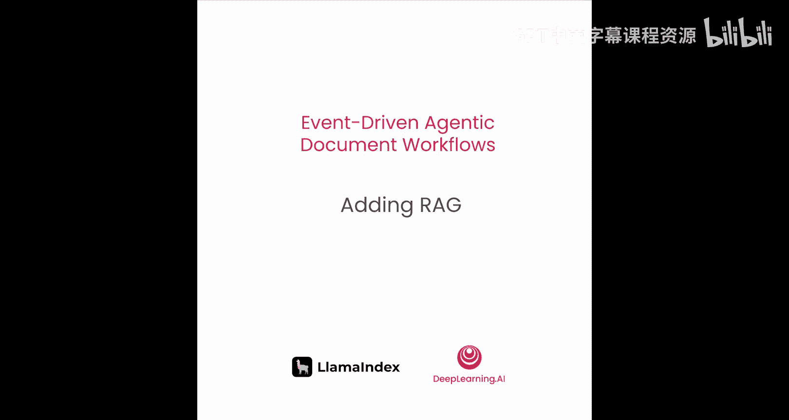

## 概述
在本节课中，我们将学习如何为智能代理添加检索增强生成（RAG）能力。我们将使用LlamaParse解析一份简历文档，将其信息加载到向量存储中，并构建一个能够查询这些信息的RAG工具。最后，我们会将这个工具封装成一个可复用的工作流。

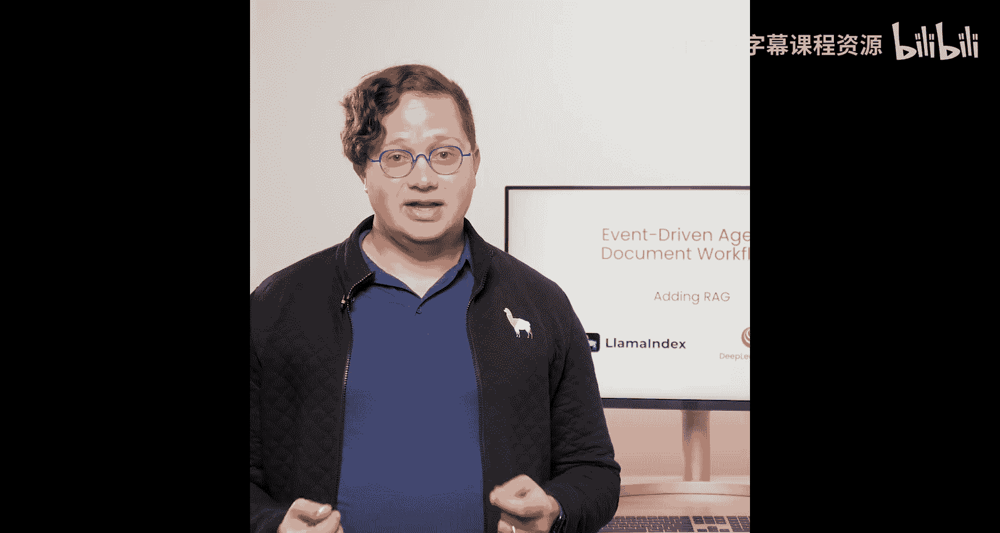

## 启用嵌套异步与导入依赖
为了确保本教程中的代码正常运行，我们需要启用嵌套异步功能。


首先，导入必要的库和模块。

```python
# 导入所需库
import asyncio
from llama_index.core import VectorStoreIndex, StorageContext
from llama_index.embeddings.openai import OpenAIEmbedding
from llama_index.llms.openai import OpenAI
from llama_parse import LlamaParse
```

接着，启用嵌套异步。

```python
# 启用嵌套异步
import nest_asyncio
nest_asyncio.apply()
```

我们还需要设置API密钥，包括OpenAI的API密钥和Llama Cloud的API密钥（用于LlamaParse服务）。你可以在 `llamaindex.ai` 免费获取Llama Cloud的API密钥。

## 使用LlamaParse解析简历
LlamaParse是一个高级文档解析器，能够读取PDF、Word、PowerPoint和Excel等文件，并将复杂文档中的信息提取成易于大语言模型理解的形式。

它的一个强大功能是，你可以告知它正在解析的文档类型，以便它能更智能地提取内容。在本例中，我们将告诉它正在解析一份简历。

以下是解析文档的步骤。

首先，导入LlamaParse并初始化解析器。

```python
# 初始化LlamaParse解析器
parser = LlamaParse(
    api_key="你的LlamaCloud_API_KEY",
    result_type="markdown", # 输出格式可以是markdown、text等
    parsing_instruction="这是一份简历。请将相关事实整理在一起，并使用标题和项目符号格式化。"
)
```

然后，使用解析器加载我们的假简历文件。

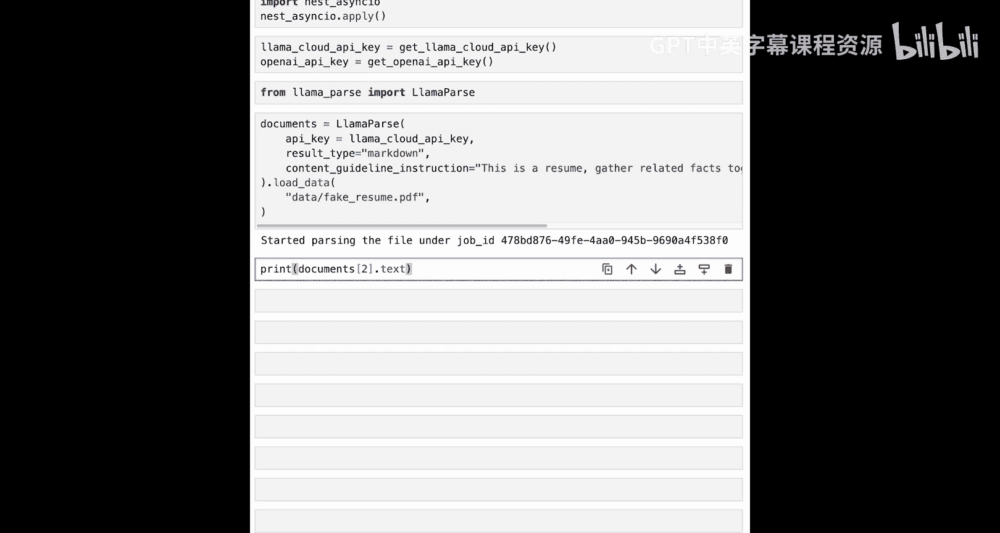

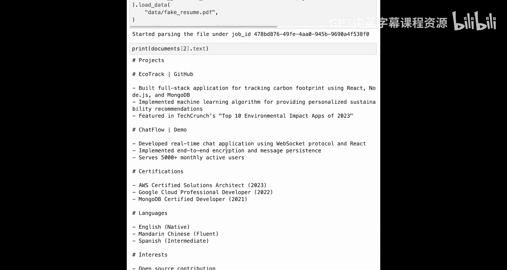

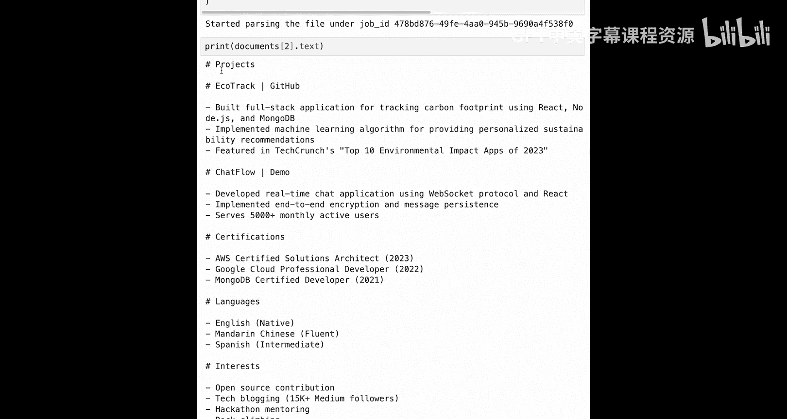

```python
# 解析简历文档
documents = parser.load_data("./fake_resume.pdf")
```

解析完成后，`documents` 是一个文档数组。我们可以查看解析出的内容。

```python
# 查看解析结果（例如，查看数组中的第三个文档）
print(documents[2].text)
```

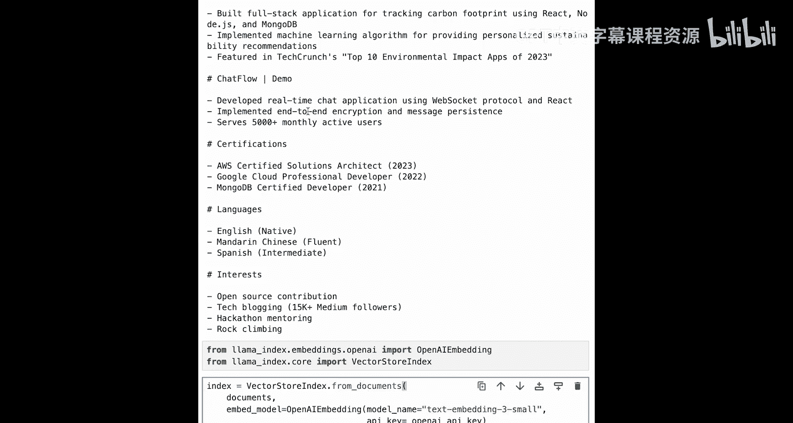

解析器会以Markdown格式输出简历内容，包含项目标题、公司名称以及用项目符号列出的工作职责描述。

## 构建向量存储索引
上一节我们成功解析了简历文档，本节我们将把这些文档转换成可搜索的向量形式。

我们需要使用一个嵌入模型将文本转换为向量。这里我们使用OpenAI提供的 `text-embedding-3-small` 模型。

首先，导入嵌入模型和向量存储索引类。

```python
# 设置嵌入模型
embed_model = OpenAIEmbedding(model="text-embedding-3-small")
```

接着，使用解析出的文档创建向量存储索引。

```python
# 从文档创建向量存储索引
index = VectorStoreIndex.from_documents(
    documents,
    embed_model=embed_model
)
```

现在，我们有了一个包含简历信息的索引。为了进行查询，我们需要基于这个索引创建一个查询引擎。

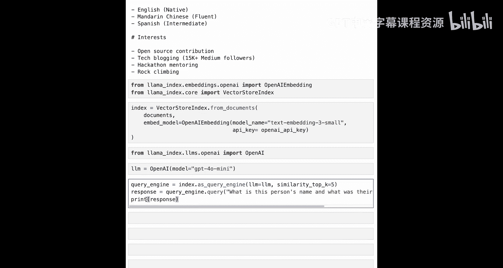

## 创建查询引擎并进行测试
索引构建完成后，我们可以创建一个查询引擎来回答关于简历的问题。

首先，初始化我们将要使用的大语言模型（LLM）。这里我们使用 `gpt-4o-mini`，因为它速度快且成本低。

```python
# 初始化LLM
llm = OpenAI(model="gpt-4o-mini")
```

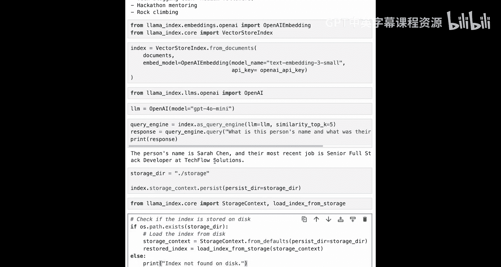

然后，从索引创建查询引擎。我们可以设置 `similarity_top_k` 参数，它决定了引擎在回答问题时返回的最相关上下文片段的数量。

```python
# 创建查询引擎
query_engine = index.as_query_engine(
    llm=llm,
    similarity_top_k=5
)
```

现在，我们可以用查询引擎来提问了。

```python
# 向查询引擎提问
response = query_engine.query("申请人的姓名是什么？他最近的一份工作是什么？")
print(response)
```

查询引擎会返回答案，例如：“申请人的名字是Sarah Chen，她最近的工作是TechFlow Solutions公司的高级全栈开发工程师。”

## 持久化与加载向量存储
为了在后续会话中复用向量存储，我们需要将其保存到磁盘。

保存索引非常简单，只需调用 `persist` 方法并指定存储目录。

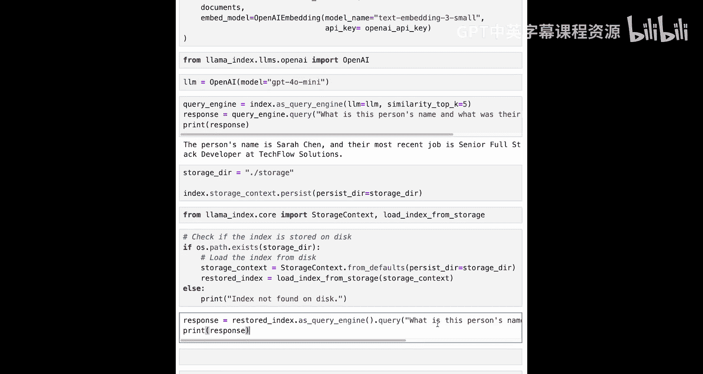

```python
# 将索引持久化到磁盘
index.storage_context.persist(persist_dir="./storage")
```

当需要再次使用时，我们可以从存储目录加载索引。

```python
# 从磁盘加载索引
storage_context = StorageContext.from_defaults(persist_dir="./storage")
loaded_index = load_index_from_storage(storage_context)
```

加载后，可以像之前一样创建查询引擎并进行查询。

```python
# 使用加载的索引创建查询引擎
loaded_query_engine = loaded_index.as_query_engine(llm=llm)
response = loaded_query_engine.query("申请人的姓名是什么？")
print(response)
```

## 将RAG功能封装为代理工具
我们已经有了一个可工作的RAG管道，现在将其封装成一个工具，以便智能代理可以调用它。

这需要两个新类：`FunctionTool` 和 `FunctionCallingAgent`。

首先，定义一个执行RAG查询的普通Python函数。为函数提供描述性的名称、输入输出类型以及详细的文档字符串非常重要，因为这些元数据会被提供给LLM，帮助它决定是否以及如何使用这个工具。

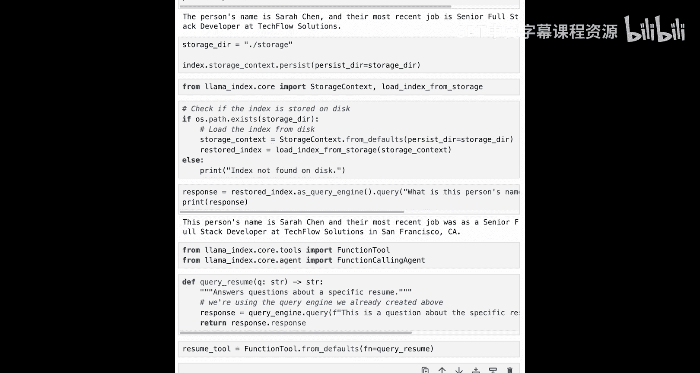

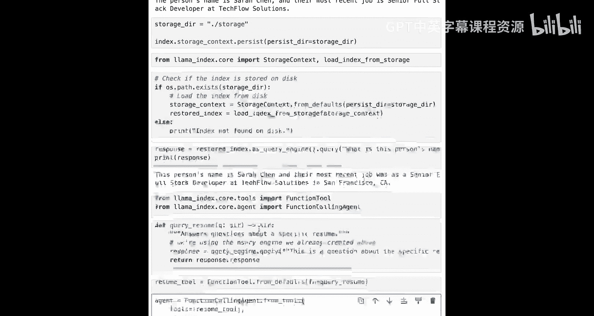

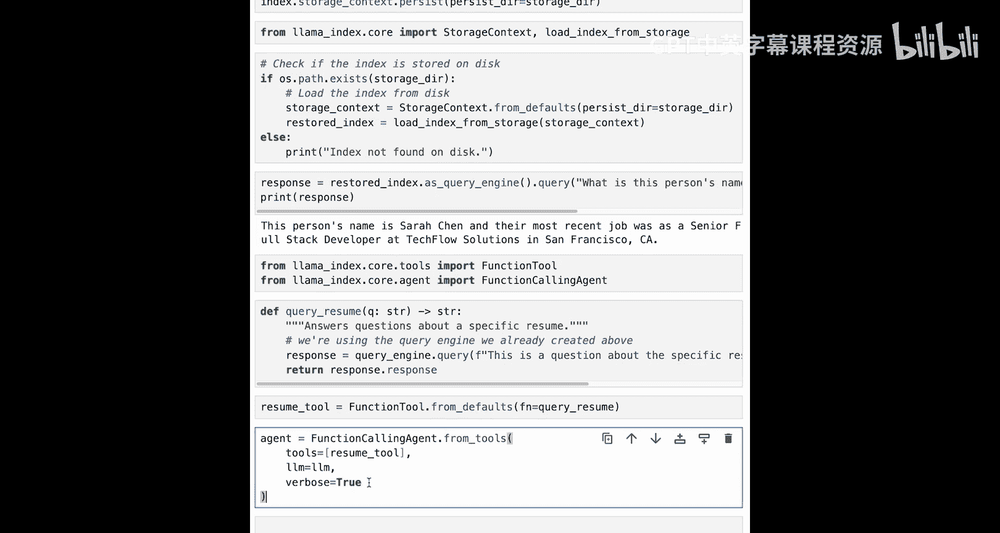

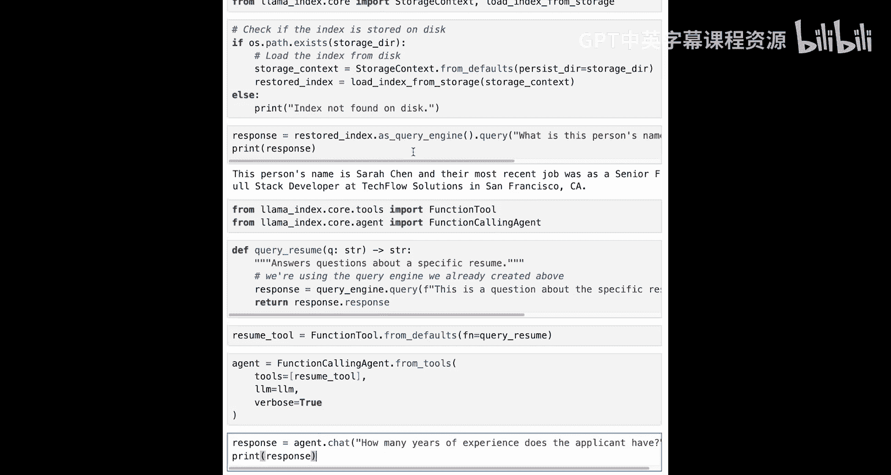

```python
def query_resume(query: str) -> str:
    """
    根据简历内容回答问题。
    参数:
        query (str): 关于申请人简历的问题。
    返回:
        str: 基于简历信息生成的答案。
    """
    response = query_engine.query(query)
    return str(response)
```

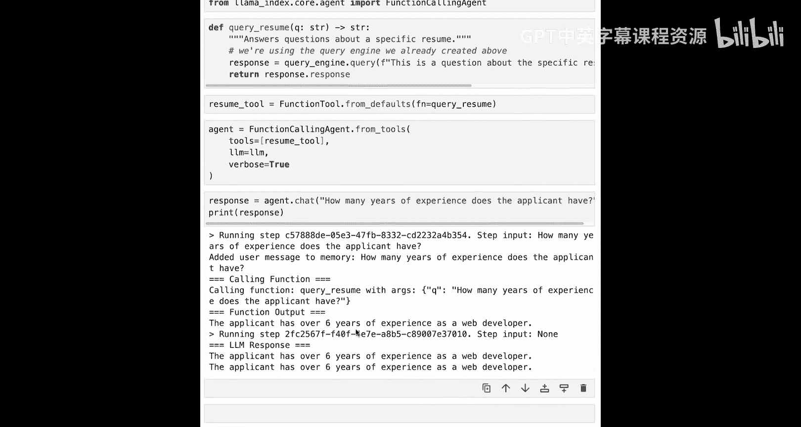

然后，使用 `FunctionTool.from_defaults` 方法将这个函数转换为代理可用的工具。

```python
from llama_index.core.tools import FunctionTool

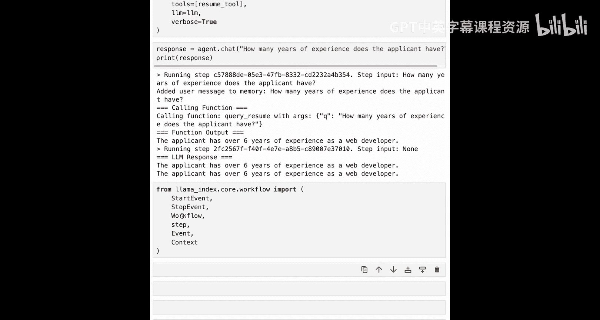

# 将函数转换为工具
rag_tool = FunctionTool.from_defaults(fn=query_resume)
```

现在，我们可以创建一个使用此工具的函数调用代理。

```python
from llama_index.core.agent import FunctionCallingAgent

# 创建代理
agent = FunctionCallingAgent.from_tools(
    tools=[rag_tool],
    llm=llm,
    verbose=True # 设置为True以查看代理的思考过程
)
```

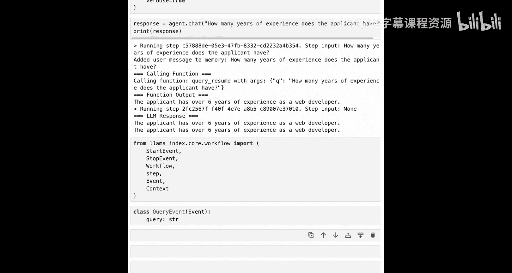

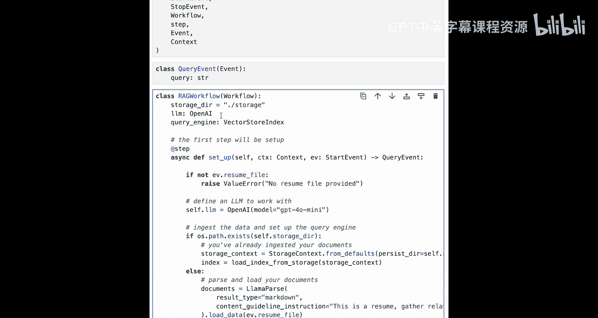

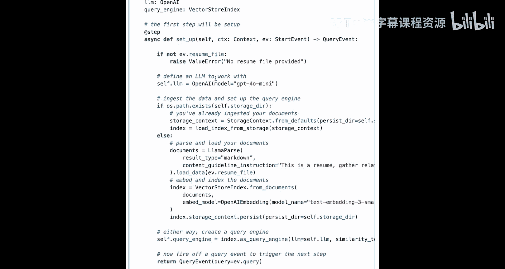

创建代理后，我们可以与它对话。

```python
# 向代理提问
response = agent.chat("申请人有多少年工作经验？")
print(response)
```

当 `verbose=True` 时，控制台会输出详细的步骤信息，包括代理何时调用 `query_resume` 工具、传递了什么参数以及最终的回答。

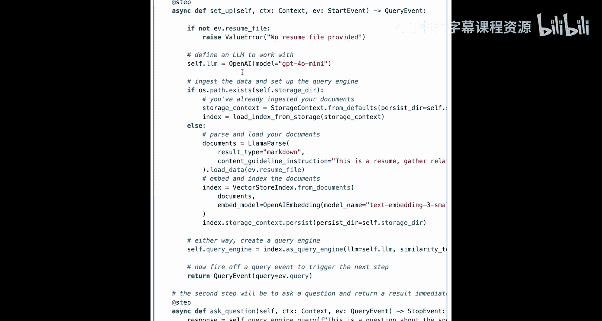

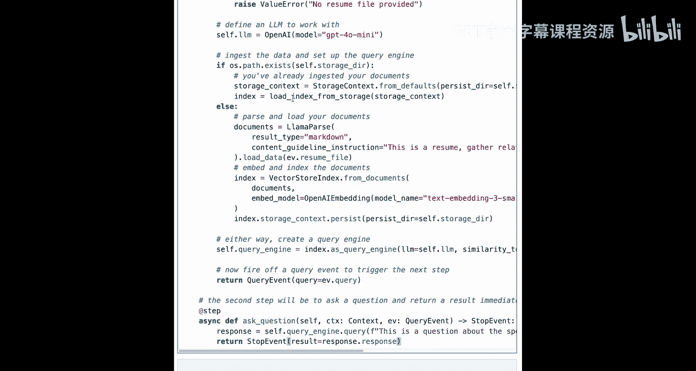

## 构建可复用的RAG工作流
最后，我们将之前的所有步骤整合封装成一个整洁、可复用的工作流类。这个工作流类会处理文档解析、索引创建/加载以及查询响应。

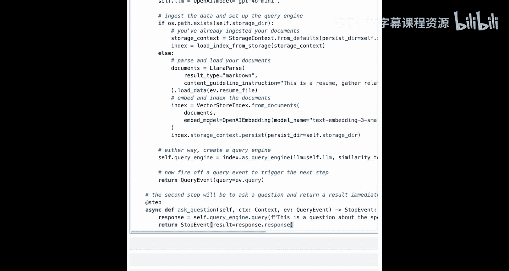

以下是工作流类的定义。

```python
from llama_index.core.workflow import (
    StartEvent, StopEvent, step, Context
)
from pathlib import Path

# 定义工作流事件
class QueryEvent:
    def __init__(self, question: str):
        self.question = question

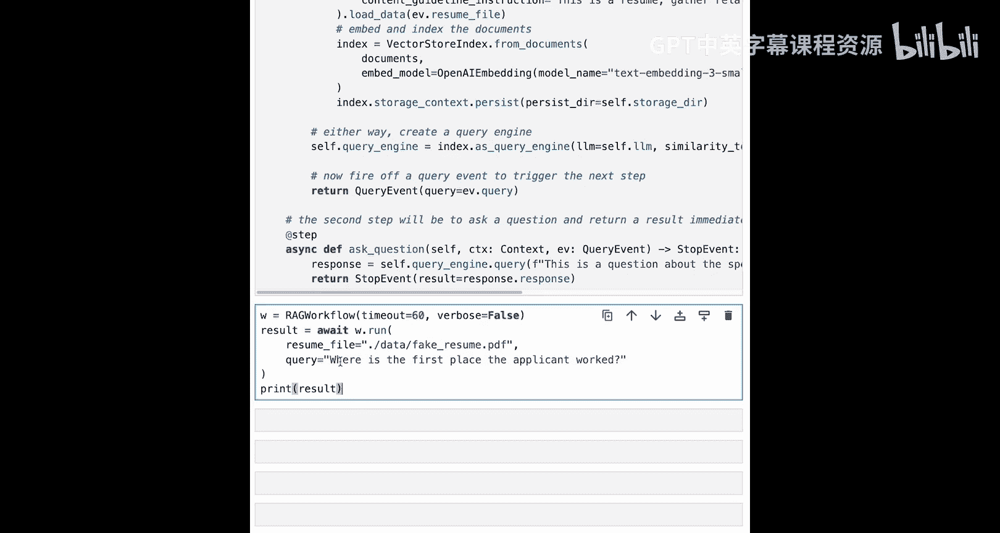

# 定义RAG工作流类
class RAGWorkflow:
    def __init__(self, storage_dir: str = "./storage"):
        self.storage_dir = storage_dir
        self.llm = None
        self.query_engine = None

    @step
    async def setup(self, ctx: Context, event: StartEvent):
        """工作流设置步骤：初始化LLM，加载或创建索引。"""
        # 从事件中获取简历文件路径
        resume_file = event.resume_file
        self.llm = OpenAI(model="gpt-4o-mini")

        storage_path = Path(self.storage_dir)
        # 检查存储目录是否存在
        if storage_path.exists():
            # 从磁盘加载索引
            storage_context = StorageContext.from_defaults(persist_dir=self.storage_dir)
            index = load_index_from_storage(storage_context)
        else:
            # 解析文档并创建新索引
            parser = LlamaParse(api_key="你的API_KEY", result_type="markdown")
            documents = parser.load_data(resume_file)
            embed_model = OpenAIEmbedding(model="text-embedding-3-small")
            index = VectorStoreIndex.from_documents(documents, embed_model=embed_model)
            # 持久化新索引
            index.storage_context.persist(persist_dir=self.storage_dir)

        # 创建查询引擎
        self.query_engine = index.as_query_engine(llm=self.llm, similarity_top_k=5)
        # 触发查询事件
        await ctx.emit(QueryEvent(question=event.query))

    @step
    async def ask_question(self, ctx: Context, event: QueryEvent):
        """执行查询并返回答案。"""
        response = self.query_engine.query(event.question)
        await ctx.set_result(response)
        await ctx.emit(StopEvent())

# 实例化并运行工作流
workflow = RAGWorkflow()
# 假设我们有一个启动事件，包含简历文件路径和查询问题
start_event = StartEvent(resume_file="./fake_resume.pdf", query="申请人掌握哪些编程语言？")
result = asyncio.run(workflow.run(start_event))
print(result)
```

运行这个工作流，它会快速返回答案，因为如果索引已存在，它会直接从磁盘加载，而无需重新解析文档。

**注意**：当前工作流存在一个小缺陷。如果你第二次运行时传入一份不同的简历文件，代码会发现磁盘上已存在旧的索引，因此不会解析新的简历。目前你不需要修复它，但可以思考一下如何改进。

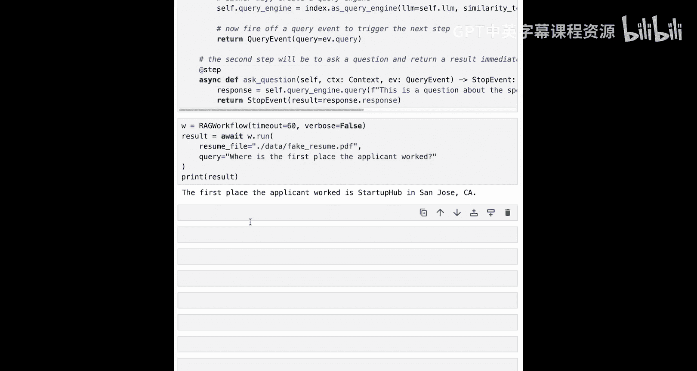

## 总结
本节课中，我们一起学习了如何为智能代理构建RAG能力。我们使用LlamaParse解析了简历文档，将信息嵌入到向量存储中，并创建了查询引擎。接着，我们将RAG查询功能封装成一个代理可以调用的工具。最后，我们将所有组件整合到一个可复用、事件驱动的工作流中。这为创建能够处理更复杂任务的智能代理系统奠定了坚实的基础。在下一课中，我们将为代理赋予更复杂的任务。