# 005：表单解析与智能代理工作流 🧩

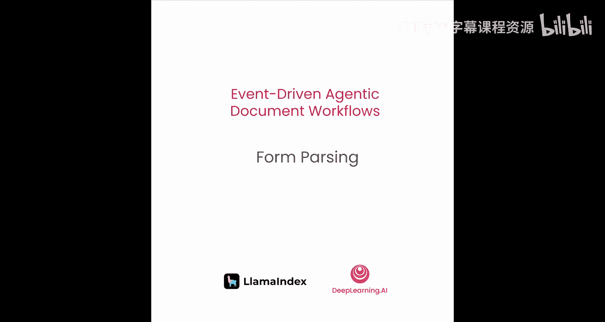

在本节课中，我们将学习如何让智能代理处理更复杂的任务。具体来说，我们将指导代理解析一份职位申请表，将解析出的表单内容转化为一系列简单问题，并利用这些问题来查询RAG（检索增强生成）管道。我们将再次使用LlamaParse来提取需要填写的字段，然后生成对RAG系统的查询。

---

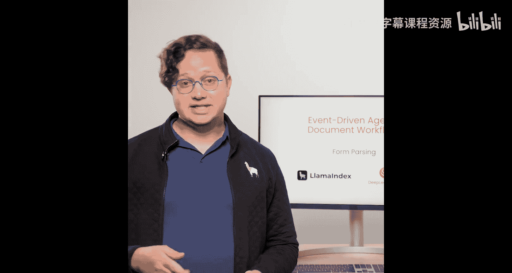

## 导入必要库与设置

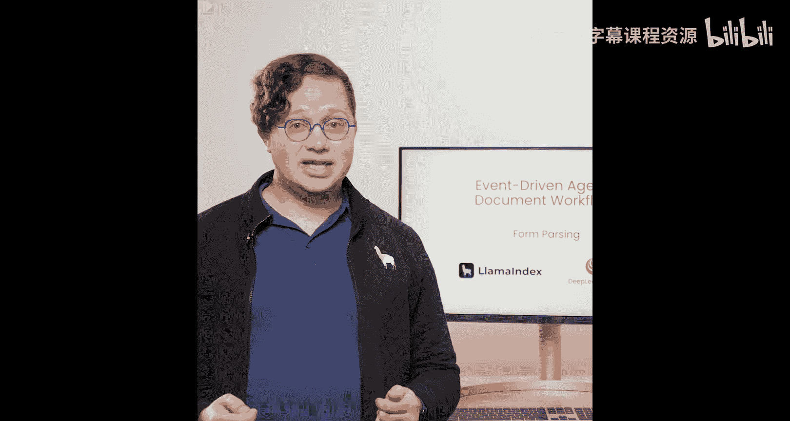

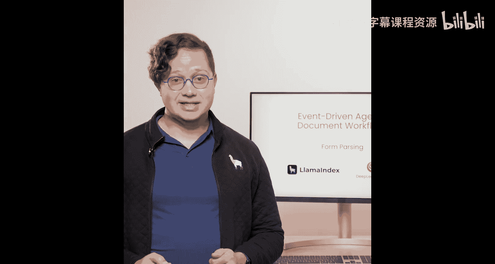

首先，我们需要导入必要的库并进行基础设置。这与上一节课的步骤类似。

```python
import os
from llama_parse import LlamaParse
from openai import OpenAI
# 假设有辅助函数来获取API密钥
from helpers import get_openai_key, get_llamaparse_key
```

我们还需要设置Ancchio（假设这是一个工作流管理工具）并获取API密钥。

```python
import ancchio
openai_key = get_openai_key()
llamaparse_key = get_llamaparse_key()
```

执行以上代码以完成初始化。

---

## 解析申请表

在上一节课中，我们使用LlamaParse来解析简历并包含了解析指令。这次我们将做类似的事情，但指令会更高级：让模型读取一份申请表，并将其转换为一个需要填写的字段列表，并以JSON对象的形式返回。

首先，设置我们的解析器。我们要求结果类型为Markdown，但这次我们提供两套指令：内容指导指令和格式指令。

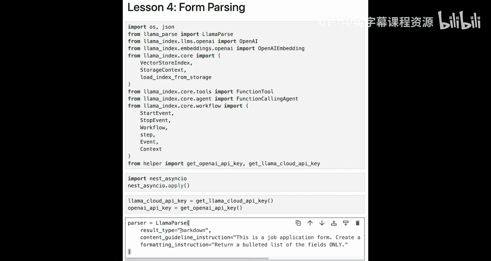

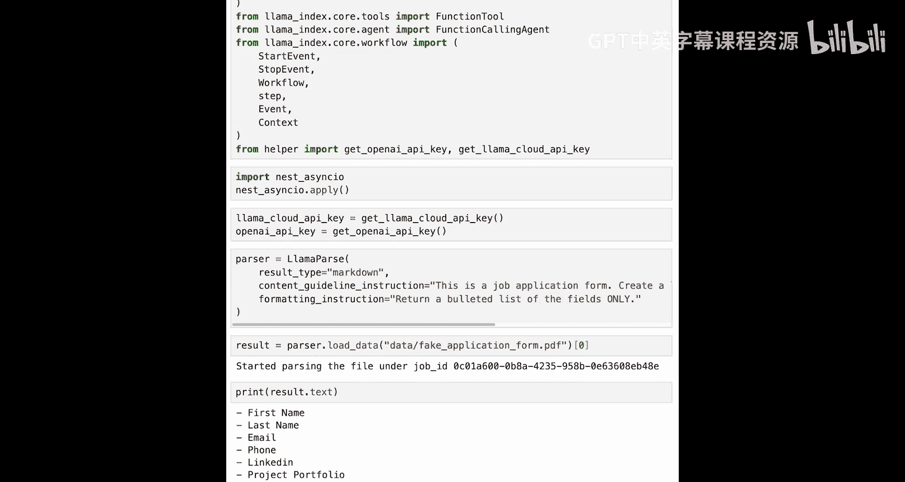

```python
parser = LlamaParse(
    api_key=llamaparse_key,
    result_type="markdown",
    parsing_instructions="这是一份职位申请表。请创建所有需要填写的字段列表。",
    formatting_instructions="仅返回字段的项目符号列表。"
)
```

现在，我们可以调用`load_data`方法来加载我们的模拟申请表文件。

```python
documents = parser.load_data("./fake_application_form.pdf")
parsed_result = documents[0].text
print(parsed_result)
```

如你所见，模型严格遵循了指令，输出了一个仅包含表单字段的项目符号列表。

---

## 将列表转换为JSON

大语言模型（LLM）的一个有用功能是能将人类可读的格式（如此列表）转换为机器可读的格式。我们将在这里实现这一点，要求模型将列表转换为一个包含字段数组的JSON对象。

为此，我们需要一个LLM。

```python
client = OpenAI(api_key=openai_key)
```

我们将给LLM一个提示词和我们的字段列表。

```python
prompt = f"""
这是一个已解析的表单，数据如下：
{parsed_result}
请仅返回JSON格式。
"""
response = client.chat.completions.create(
    model="gpt-4",
    messages=[{"role": "user", "content": prompt}]
)
json_output = response.choices[0].message.content
print(json_output)
```

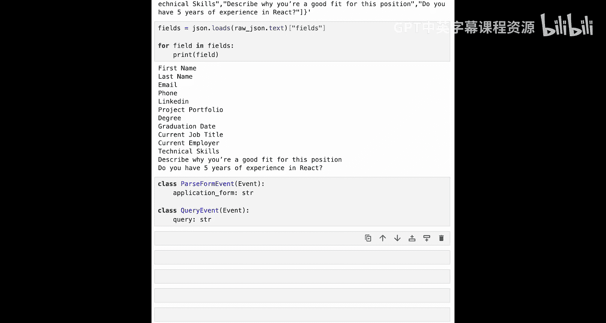

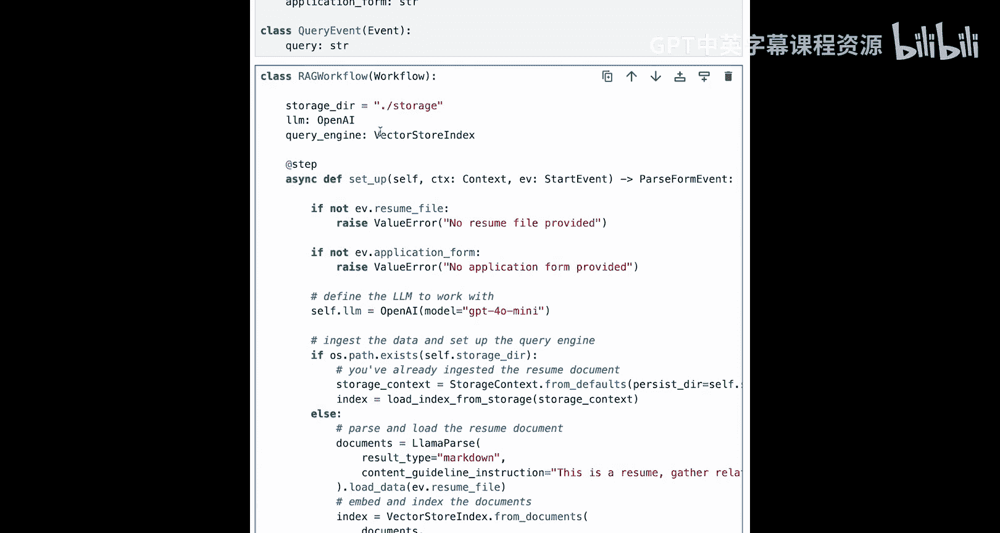

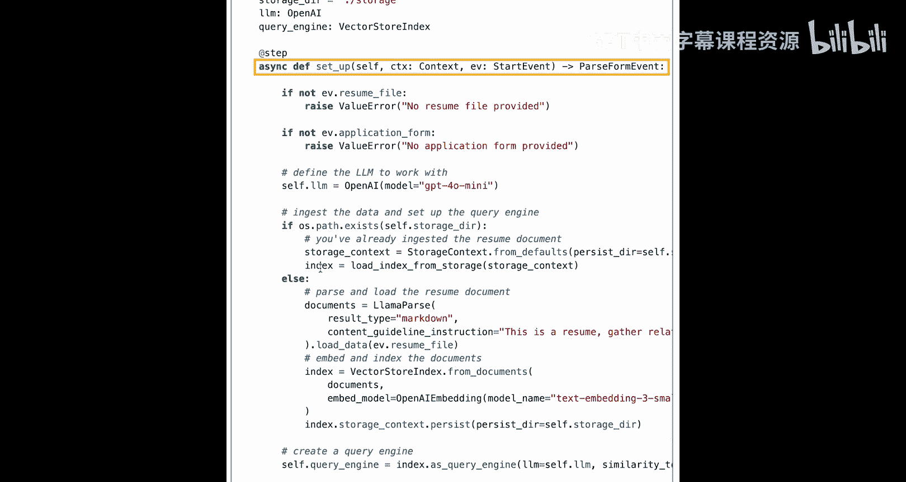

你可以看到它返回了JSON。现在我们可以解析这个JSON并以编程方式打印字段列表。

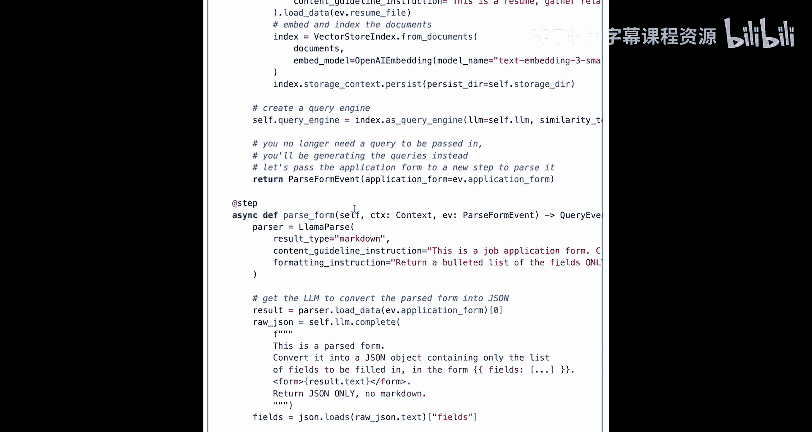

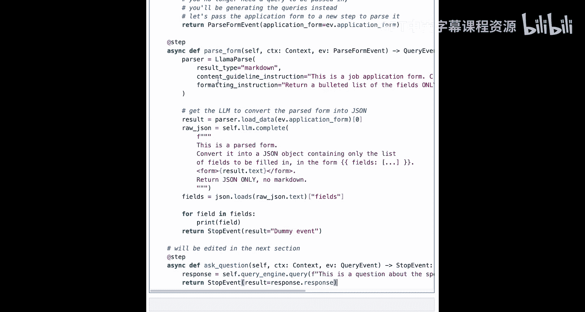

```python
import json
fields_data = json.loads(json_output)
fields_list = fields_data.get('fields', [])
print(fields_list)
```

完美。我们现在获得了一个清晰的字段数组，可以在后续的编程工作中使用。

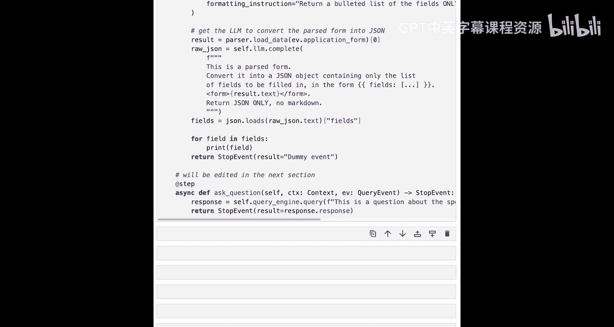

---

## 将解析器集成到工作流中

现在，让我们将上一节课构建的工作流与这个新的解析器结合起来。我们需要两个新事件：`parse_form`事件和`query`事件。

以下是新的工作流代码，它更长一些，我们将逐行讲解。

```python
class RAGWorkflow:
    def __init__(self, storage_dir, llm, query_engine):
        self.storage_dir = storage_dir
        self.llm = llm
        self.query_engine = query_engine
        self.context = {}  # 用于在步骤间共享数据

    def setup(self):
        # 触发解析表单事件
        self.emit_event("parse_form")

    def parse_form(self, event_data):
        # 这是我们上面编写的解析代码
        parser = LlamaParse(
            api_key=llamaparse_key,
            result_type="markdown",
            parsing_instructions="这是一份职位申请表。请创建所有需要填写的字段列表。",
            formatting_instructions="仅返回字段的项目符号列表。"
        )
        documents = parser.load_data("./fake_application_form.pdf")
        parsed_result = documents[0].text

        # 转换为JSON
        prompt = f"这是一个已解析的表单，数据如下：\n{parsed_result}\n请仅返回JSON格式。"
        response = self.llm.chat.completions.create(
            model="gpt-4",
            messages=[{"role": "user", "content": prompt}]
        )
        json_output = response.choices[0].message.content
        fields_data = json.loads(json_output)
        self.context['fields'] = fields_data.get('fields', [])
        print(f"解析出的字段: {self.context['fields']}")

        # 为每个字段触发查询事件
        for field in self.context['fields']:
            self.emit_event("query", {"field": field, "query": f"候选人关于'{field}'的信息是什么？"})
        self.context['total_fields'] = len(self.context['fields'])
```

工作流的其余部分暂时保持不变，我们稍后再处理。让我们执行这个工作流看看效果。

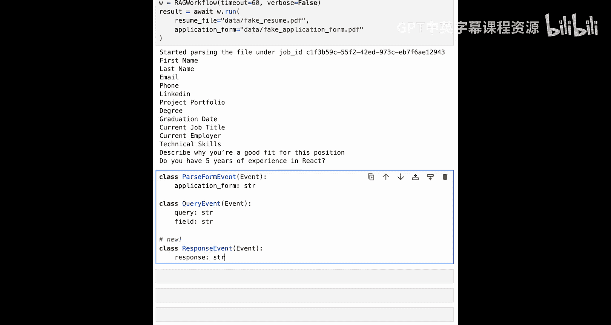

```python
workflow = RAGWorkflow(storage_dir="./storage", llm=client, query_engine=None)
workflow.setup()
# 假设有一个事件循环来驱动工作流
```

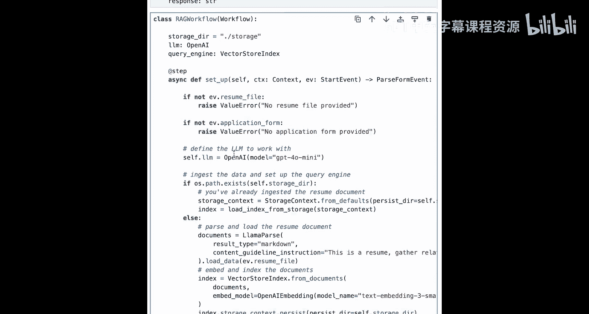

它执行了与工作流外部代码完全相同的操作，这正是我们需要的。现在，工作流知道了它需要为哪些字段寻找答案。

---

## 实现并发查询与答案聚合

在下一轮迭代中，我们可以为每个字段触发一个`query`事件，它们将被并发执行。还记得在第2课中我们讨论过并发步骤吗？

我们要做的修改是：
1.  为从表单中提取的每个问题生成一个`query`事件。
2.  创建一个`fill_in_application`步骤，它将接收所有问题的回答，并将它们聚合成一个连贯的响应。
3.  添加一个`response`事件，将查询结果传递给`fill_in_application`。

让我们看看具体实现。首先，定义我们的事件，这里有一个新事件`response`。

以下是更新后的工作流核心部分：

```python
    def ask_question(self, event_data):
        # 模拟查询RAG管道并获取答案
        field = event_data['field']
        query = event_data['query']
        # 这里应调用实际的query_engine
        # simulated_answer = self.query_engine.query(query)
        simulated_answer = f"这是关于{field}的模拟答案。"
        # 触发响应事件
        self.emit_event("response", {"field": field, "answer": simulated_answer})

    def fill_in_application(self, event_data):
        # 收集所有响应事件
        responses = self.collect_events("response", self.context['total_fields'])
        if not responses:
            return  # 尚未收集到所有响应

        # 将所有回答整理成列表，传递给LLM
        answers_list = [f"{r['field']}: {r['answer']}" for r in responses]
        prompt = f"请根据以下信息回答申请表上的问题：\n" + "\n".join(answers_list)
        final_response = self.llm.chat.completions.create(
            model="gpt-4",
            messages=[{"role": "user", "content": prompt}]
        ).choices[0].message.content

        print("最终填表结果：")
        print(final_response)
        # 触发停止事件
        self.emit_event("stop")
```

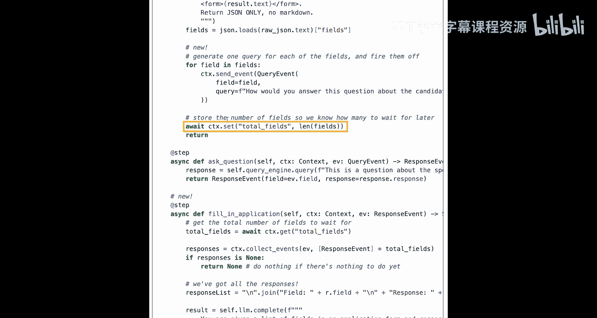

`collect_events`方法（假设在工作流引擎中实现）会等待特定数量的事件被触发。我们将之前存储的字段总数`total_fields`保存在上下文中，以便跨步骤使用。

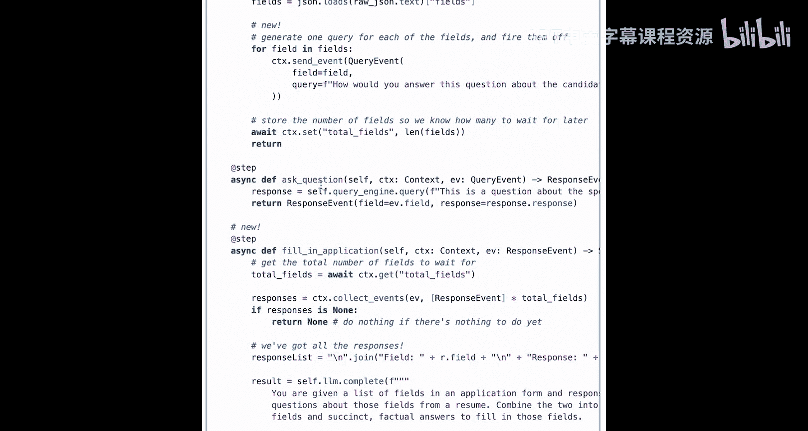

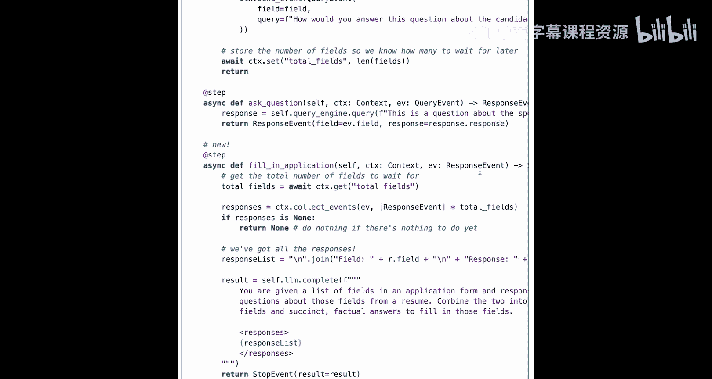

现在，让我们执行这个完整的工作流。

```python
# 传入模拟简历和申请表路径
workflow.run(resume_path="./fake_resume.pdf", form_path="./fake_application_form.pdf")
```

这次可能会花费一点时间，因为它需要询问一系列问题。

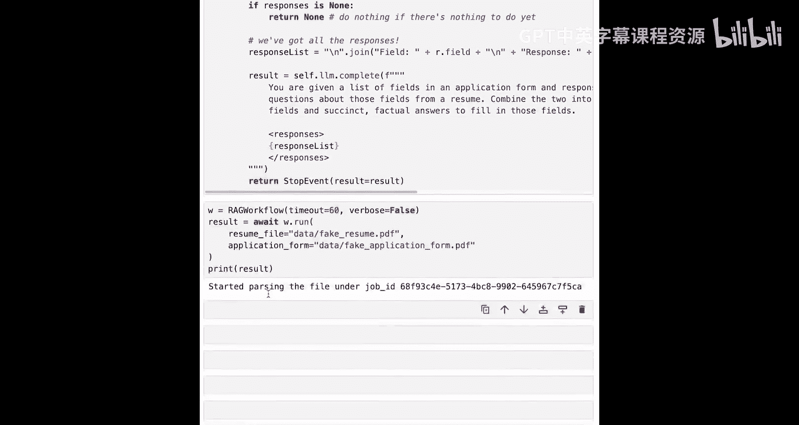

完成之后，你可以看到LLM已经解释了它的操作，并给出了所有字段及其答案的编号列表。你的工作流提取了表单中的所有字段，并为它们生成了合理的答案。

不过，有些字段的答案可能还有改进空间，例如“作品集”字段。在原始文档中，作品集是一个链接，而这里它试图列出作品集内容。我们将在下一节课中利用反馈机制来尝试修正这个问题。

---

## 总结

在本节课中，我们一起学习了如何扩展智能代理的能力：
1.  **解析复杂表单**：使用LlamaParse和高级指令从申请表中提取结构化字段列表。
2.  **格式转换**：利用LLM将人类可读的列表转换为机器可读的JSON格式。
3.  **集成与并发**：将解析步骤集成到事件驱动的工作流中，并为每个字段触发并发查询。
4.  **答案聚合**：通过收集所有并发查询的响应，并使用LLM合成最终的回答来填写申请表。

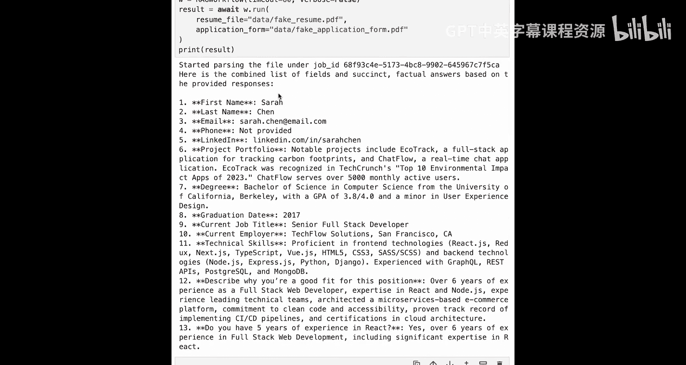

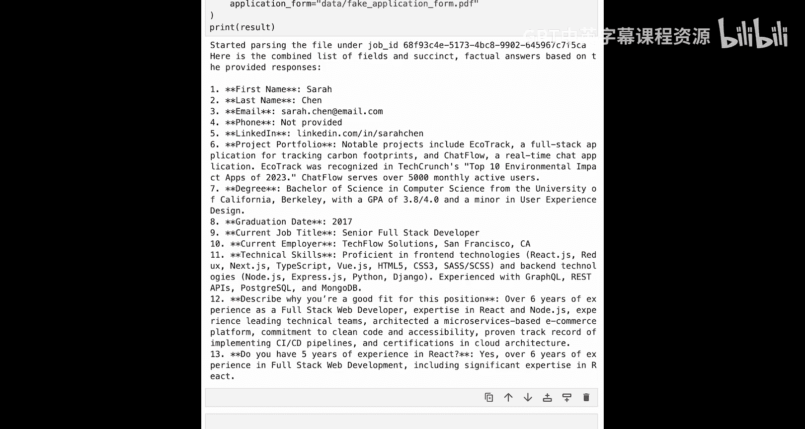

通过以上步骤，我们构建了一个能够自动解析表单、生成问题、查询知识库并汇总答案的智能代理工作流。在下一节课中，我们将为这个代理添加反馈机制，使其能够根据我们的意见进行修正并重新尝试。🚀