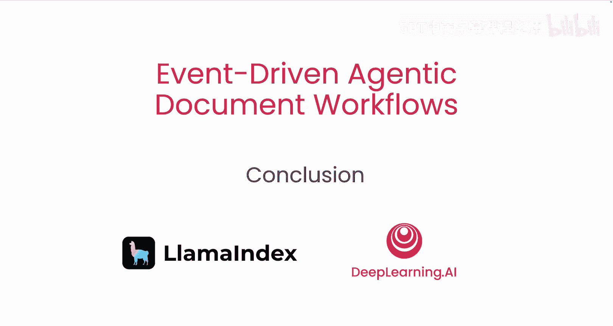

# 008：总结与展望 🎉

在本节课中，我们将对之前学习的事件驱动智能代理文档工作流进行总结，并展望未来的应用方向。

---

上一节我们详细探讨了代理如何响应人类反馈以完善文档。现在，我们来对整个课程的核心内容进行回顾。

恭喜你，现在你已经掌握了如何设计一个代理工作流，该工作流能够填写文档并响应人类反馈，从而生成更准确的已填写表单。

我期待看到你将独立构建出怎样的应用。😊

---

本节课中我们一起学习了构建事件驱动智能代理文档工作流的完整流程。从理解基础概念，到设计代理逻辑，再到实现反馈循环以提升输出准确性，你已经掌握了创建能够动态处理文档的智能系统的关键知识。希望你能将这些知识应用到实际项目中，创造出有价值的解决方案。