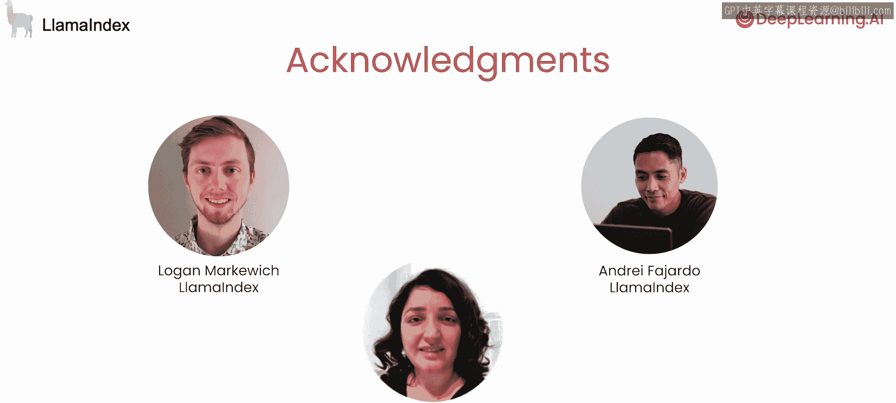

# 001：课程介绍 🎯

在本课程中，我们将学习如何使用LlamaIndex构建一个具备高级推理和决策能力的主动式RAG（检索增强生成）研究智能体。与处理简单查询的标准RAG不同，主动式RAG能够处理复杂的多步骤任务，例如从一系列研究论文中提取相关信息并进行综合总结。

## 课程概述

欢迎来到《使用LlamaIndex构建主动式RAG》课程。我是吴恩达，与我一同授课的是LlamaIndex的联合创始人兼CEO，Jerry Liu。

Jerry Liu表示，他非常高兴能参与此课程。本课程将聚焦于“智能体RAG”框架，该框架能帮助你构建具备高级推理和数据决策能力的研究智能体。

例如，假设你拥有某个主题的一系列研究论文，并希望提取与特定问题相关的信息，然后综合各论文的观点。这是一个需要多步骤处理的复杂请求。并且，早期处理步骤（如从一篇论文中识别主题）可能会改变后续所需的步骤（例如从其他论文中检索关于该主题的额外信息）。

相比之下，目前非常流行的标准RAG流程，更适用于对少量文档提出简单问题。其工作原理是检索一些上下文，将其塞入大语言模型的提示词中，然后仅调用一次大语言模型来获取响应。

本课程将把“与数据对话”的理念提升到新的高度，向你展示如何构建一个自主的研究智能体。

## 核心学习路径

你将学习构建完整智能体所需的渐进式推理组件。

首先，是**路由**。你将为请求添加决策能力，将其路由到多个不同的工具。

接下来，是**工具使用**。你将创建一个接口，让智能体能够选择工具，并为该工具生成正确的参数。

最后，是**多步骤推理与工具使用**。我们将使用大语言模型，借助一系列工具执行多步骤推理，并在此过程中保持记忆。

## 高级控制与监督

你将学习如何有效地与智能体交互，并利用其能力进行细致的控制和监督。

这不仅允许你在RAG流程之上创建一个更高级的研究助手，还能为你提供更有效的方法来指导其行动。

具体而言，你将学习如何确保大语言模型的可调试性。我们将探讨如何逐步查看智能体的执行过程，并利用这些信息来改进你的智能体。

另一个非常强大的工具是，允许用户在中间步骤选择性地注入指导。

例如，如果你看到智能体正在搜索错误的文档，来自人类输入的一点提示（建议它搜索不同的文档）可以带来更好的性能。这就像一位经验丰富的经理给初级员工一个提示，让其考虑新的信息。

## 致谢与课程启动

许多人共同努力创建了本课程。Jerry Liu特别感谢来自LlamaIndex的Logan Markowch和Anja Farjado，以及来自DeepL AI并为课程做出贡献的Dila Eadin。

在第一课中，你将构建一个基于单个文档的路由器，它可以同时处理问答和摘要任务。

这听起来很棒，让我们进入下一个视频，开始学习吧。😊

## 总结

本节课我们一起了解了主动式RAG的概念及其相较于标准RAG的优势，明确了本课程的学习路径——从路由、工具使用到多步骤推理。我们还预览了如何对智能体进行控制和调试，并确认了第一课的实际构建目标。接下来，我们将动手开始构建。