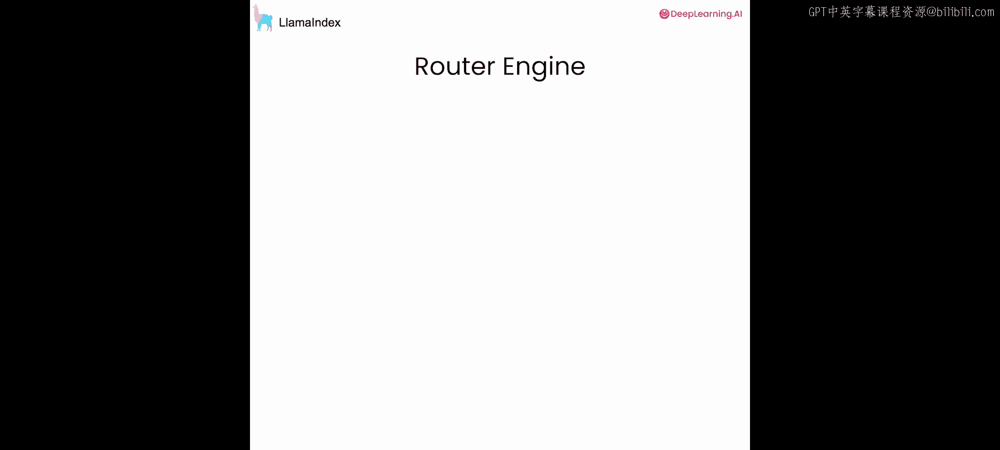
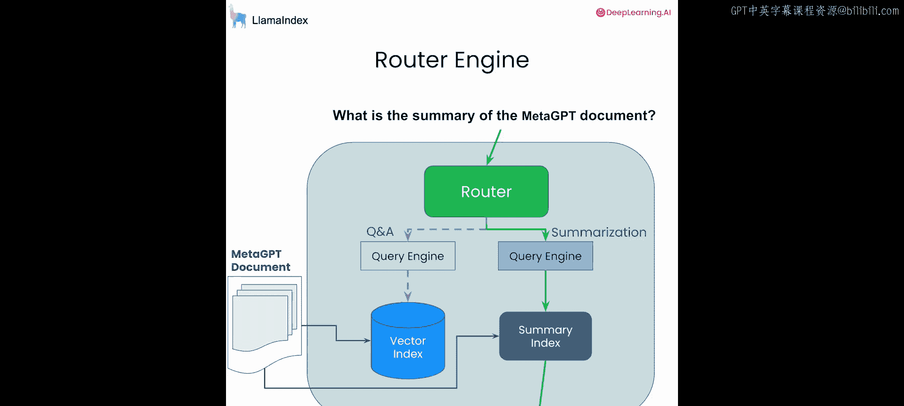
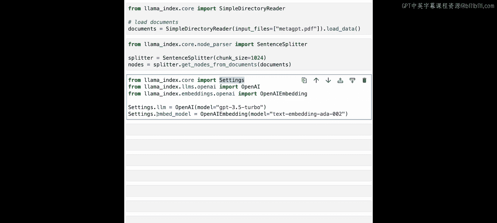
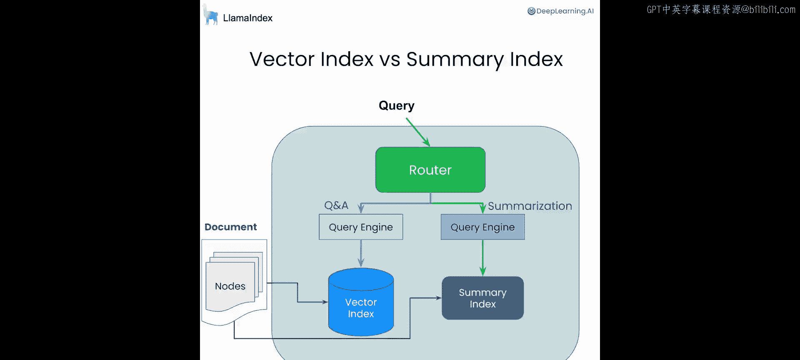
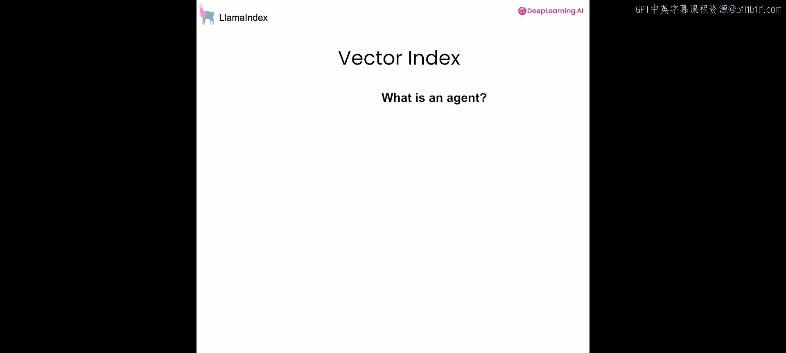
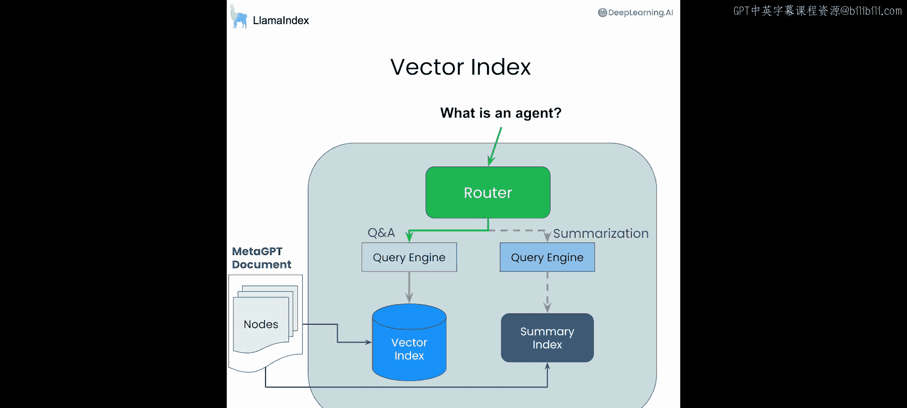
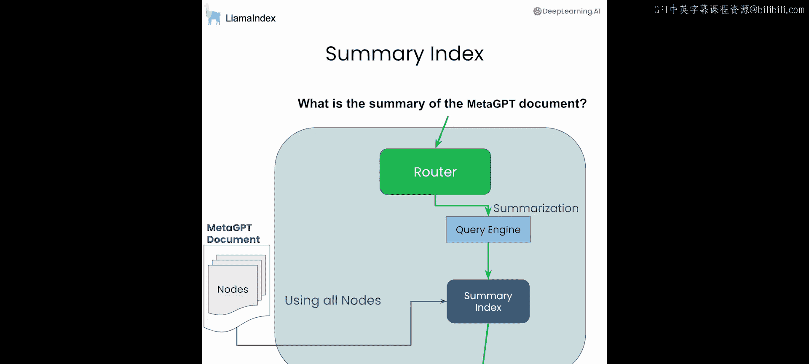
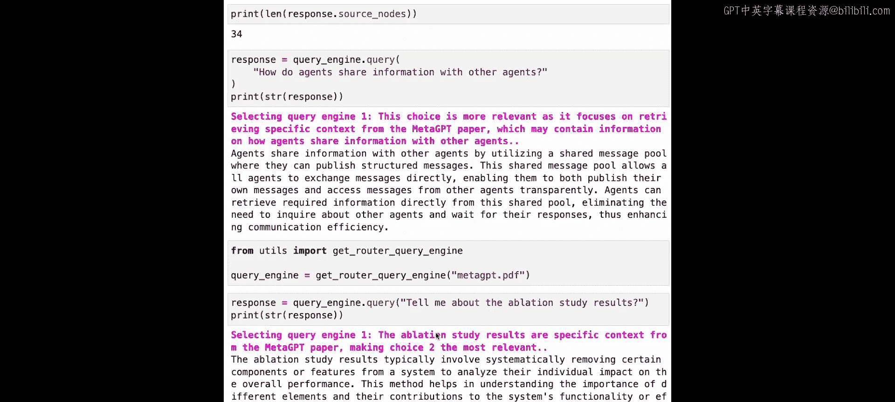

# 002：路由引擎 🧭


在本节课中，我们将学习主动式RAG的最简单形式：路由引擎。给定一个查询，路由引擎将从多个查询引擎中选择一个来执行查询。我们将基于单个文档构建一个简单的路由引擎，使其能够同时处理问答和摘要任务。



## 概述与设置

上一节我们介绍了主动式RAG的概念，本节中我们来看看如何构建一个基础的路由引擎。首先，我们需要完成一些准备工作。



以下是设置环境所需的步骤：

1.  **导入OpenAI密钥**：我们首先定义一个辅助函数来导入OpenAI API密钥。
2.  **导入Nest Async IIio模块**：由于Jupyter在后台运行事件循环，而我们的许多模块使用异步操作，导入此模块可以确保异步功能在Jupyter笔记本中正常运行。
3.  **加载示例文档**：我们将加载一篇名为“MetaGPT”的论文PDF作为示例文档。这是一篇关于新型多智能体框架的论文，于2024年被ICLR会议接收。你也可以上传自己的文档进行尝试。
4.  **分割文档**：我们使用LlamaIndex的句子分割器将文档分割成大小均匀的块。这里设置块大小为1024个字符。
5.  **配置模型**：这一步是可选的，它允许我们设置默认的LLM和嵌入模型。在本课程中，默认使用`gpt-3.5-turbo`和`text-embedding-ada-002`，但你也可以注入自己的模型。

```python
# 示例：设置全局配置
from llama_index.core import Settings
Settings.llm = OpenAI(model="gpt-3.5-turbo")
Settings.embedding_model = OpenAIEmbedding(model="text-embedding-ada-002")
```

## 构建索引

现在，我们准备开始构建索引。索引可以被视为数据之上的一组元数据，查询索引会触发不同的检索行为。

我们将为文档节点构建两种索引：



*   **向量索引**：通过文本嵌入对节点进行索引。查询向量索引将根据嵌入相似度返回最相似的节点。这是构建任何RAG系统的核心抽象。
*   **摘要索引**：这是一种非常简单的索引。查询摘要索引将返回索引中当前存在的所有节点，其返回结果不依赖于用户的具体查询。

```python
# 示例：构建索引
from llama_index.core import VectorStoreIndex, SummaryIndex





vector_index = VectorStoreIndex(nodes)
summary_index = SummaryIndex(nodes)
```

## 创建查询引擎与工具






接下来，我们将这些索引转化为查询引擎，进而转化为查询工具。

*   **查询引擎**：代表存储在索引中数据的整体查询接口，它结合了检索和LLM综合生成的能力。每个查询引擎都擅长处理特定类型的问题。
*   **查询工具**：是带有元数据（特别是描述该工具能回答何种问题）的查询引擎。这为路由引擎在不同查询引擎之间动态路由提供了基础。

以下是创建查询工具的过程：

1.  从摘要索引和向量索引创建对应的查询引擎。
2.  为每个查询引擎定义描述其功能的元数据，从而创建查询工具。

```python
# 示例：创建查询引擎和工具
summary_query_engine = summary_index.as_query_engine()
vector_query_engine = vector_index.as_query_engine()

from llama_index.core.tools import QueryEngineTool

summary_tool = QueryEngineTool.from_defaults(
    query_engine=summary_query_engine,
    description="用于回答与MetaGPT相关的摘要性问题。"
)
vector_tool = QueryEngineTool.from_defaults(
    query_engine=vector_query_engine,
    description="用于从MetaGPT论文中检索特定上下文。"
)
```

## 定义路由引擎

有了查询引擎和工具，我们现在可以定义路由引擎。LlamaIndex提供了几种不同类型的**选择器**来构建路由引擎。

*   **LLM选择器**：提示LLM输出一个JSON，然后进行解析，最后查询相应的索引。
*   **Pydantic选择器**：利用OpenAI等模型支持的函数调用API，生成Pydantic选择对象，而不是解析原始JSON。

这些选择器可以动态地让你选择单个或多个索引进行路由。在本例中，我们尝试使用一个名为`LLMSingleSelector`的LLM驱动的单选择器。

```python
# 示例：构建路由查询引擎
from llama_index.core.query_engine import RouterQueryEngine
from llama_index.core.selectors import LLMSingleSelector

router_query_engine = RouterQueryEngine(
    selector=LLMSingleSelector.from_defaults(),
    query_engine_tools=[summary_tool, vector_tool]
)
```

## 测试路由引擎

让我们通过一些查询来测试路由引擎的工作情况。启用详细输出可以让我们查看中间步骤。

**测试1：摘要查询**
*   **查询**：“What is a summary of the document?”（文档的摘要是什么？）
*   **过程**：路由引擎选择了`query_engine 0`（即摘要工具）。这是因为问题要求整体摘要。
*   **结果**：返回了对整篇论文的总结，其源节点数量等于文档的总块数（34个），证实了摘要引擎被调用并综合了所有上下文。

**测试2：具体信息查询**
*   **查询**：“How do agents share information with other agents?”（智能体如何与其他智能体共享信息？）
*   **过程**：路由引擎选择了`query_engine 1`（即向量搜索工具）。LLM给出的推理是，这个问题需要从论文的特定段落中检索具体上下文。
*   **结果**：成功找到了相关上下文（例如，智能体使用共享消息工具发布结构化消息），并生成了准确回答。

## 代码整合与总结

本节课中我们一起学习了如何构建一个基础的路由引擎。为了方便使用，可以将上述所有代码整合到一个辅助函数中。这个函数接收文件路径，并构建一个兼具向量搜索和摘要功能的路由查询引擎。

```python
# 辅助函数示例
def get_router_query_engine(file_path):
    # ... 包含上述所有步骤：加载文档、分割、构建索引、创建工具、定义路由引擎 ...
    return router_query_engine

# 使用示例
query_engine = get_router_query_engine("metaGPT.pdf")
response = query_engine.query("Tell me about the ablation study results.")
```

通过这个整合的函数，你可以轻松加载自己的PDF文档并体验路由查询的效果。例如，询问“关于消融实验的结果”，路由引擎会识别这是需要具体上下文的问题，从而调用向量搜索工具来获取答案。



总结来说，本节课程展示了如何利用LlamaIndex构建一个能理解查询意图、并在不同查询引擎（如摘要和向量搜索）之间智能路由的简单系统。这是实现更复杂主动式RAG功能的第一步。下一节课中，我们将探索更高级的代理能力。