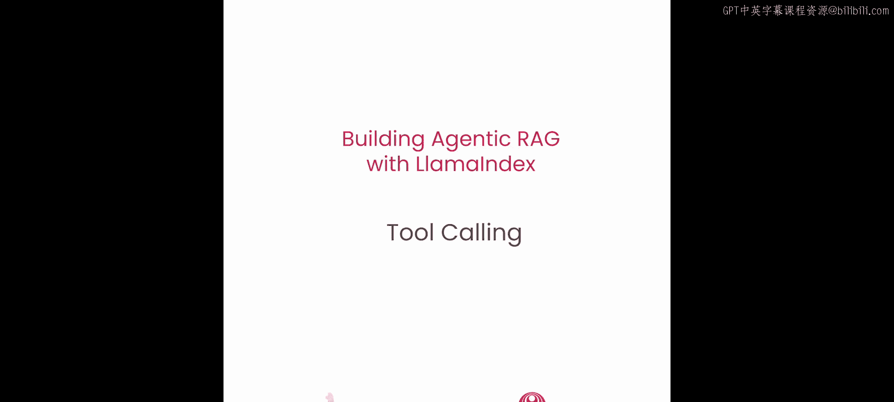
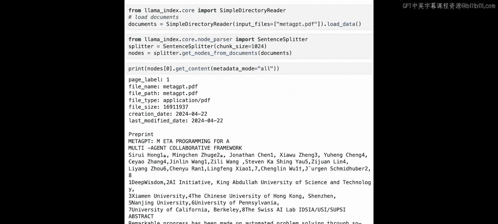
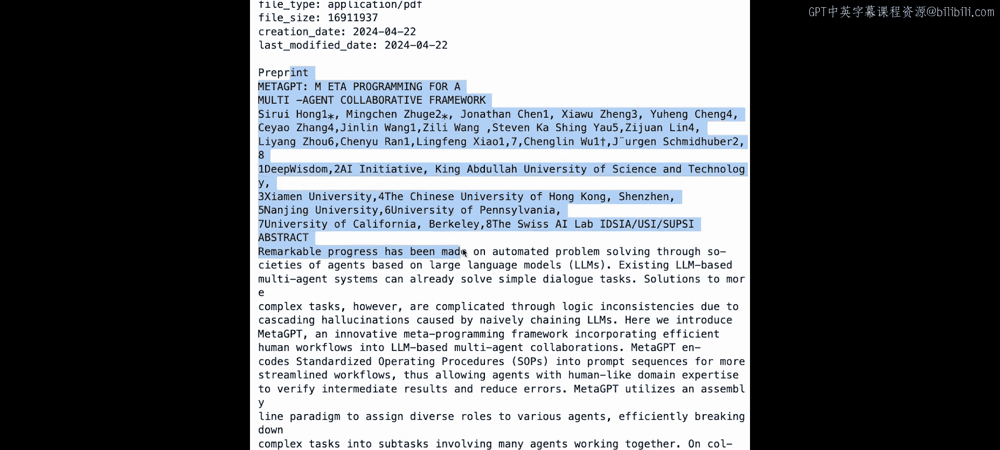
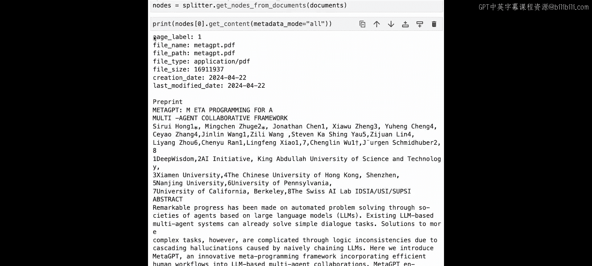
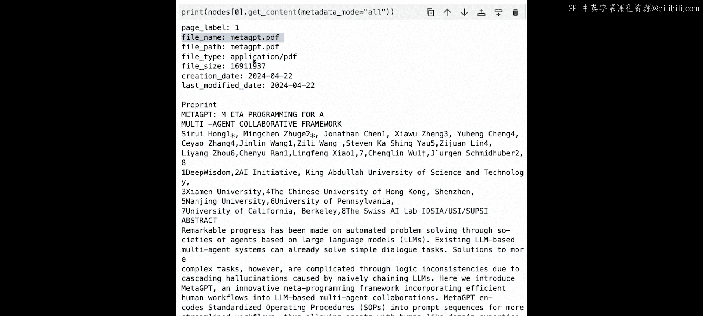
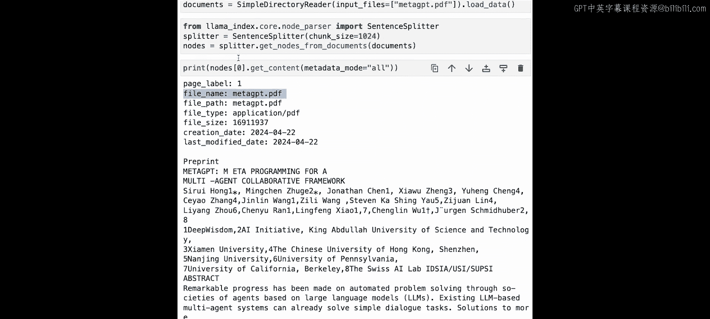
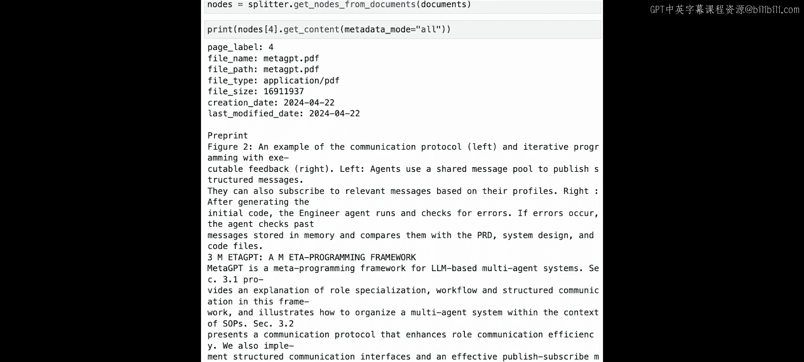
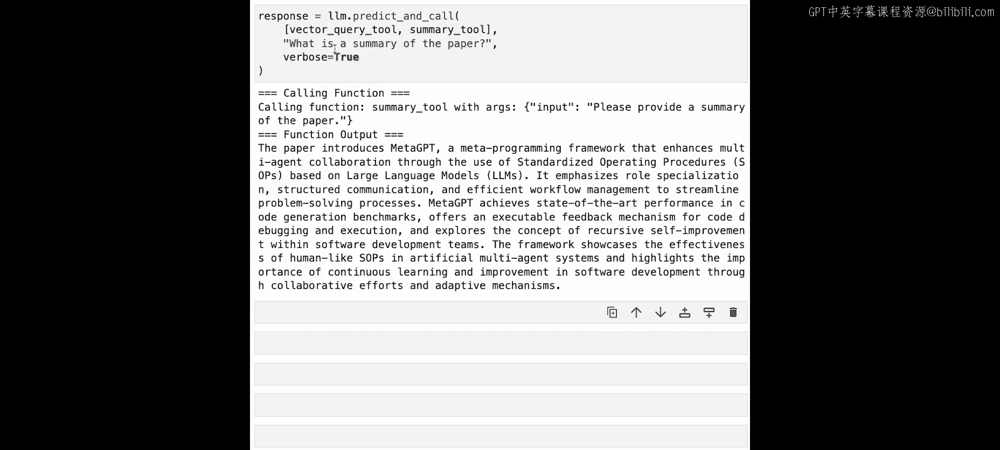

# 003：工具调用 🛠️



在本节课中，我们将学习如何让大型语言模型（LLM）不仅选择要执行的功能，还能推断出传递给该功能的参数。这超越了基础RAG中LLM仅用于内容合成的角色，是实现LLM与外部环境交互的关键一步。

## 概述


在基础的RAG流程中，LLM仅用于内容合成。上一节课展示了如何使用LLM通过选择不同的查询流程来做出决策，这是一种简化的工具调用形式。本节中，我们将展示如何使用LLM不仅选择要执行的函数，还能推断出传递给该函数的参数。这使得LLM能够理解如何使用向量数据库，而不仅仅是消费其输出。最终结果是，通过工具调用，用户能够提出更多问题，并获得比标准RAG技术更精确的结果。


## 开始编码

让我们开始编写代码。首先，我们需要设置OpenAI环境。

```python
# 设置OpenAI环境
import os
os.environ["OPENAI_API_KEY"] = "your-api-key-here"
```

接下来，我们将导入必要的LlamaIndex模块。

```python
# 导入LlamaIndex模块
from llama_index.core import VectorStoreIndex, SimpleDirectoryReader, Settings
from llama_index.core.node_parser import SentenceSplitter
from llama_index.llms.openai import OpenAI
```

## 工具调用简介

工具调用是LLM与外部环境交互的必要接口。我们将展示如何从Python函数定义工具接口，LLM将使用LlamaIndex的抽象功能，自动从Python函数的签名中推断参数。

为了说明这一点，我们首先定义两个简单的计算器函数，展示工具调用的工作原理。

```python
# 定义两个示例函数
def add(x: int, y: int) -> int:
    """将两个数字相加。"""
    return x + y

def mystery(x: int, y: int) -> int:
    """计算 (x + y) * (x + y)。"""
    return (x + y) * (x + y)
```

LlamaIndex中的核心抽象是`FunctionTool`。这个`FunctionTool`包装了你提供的任何Python函数。

```python
# 将函数包装为工具
from llama_index.core.tools import FunctionTool

add_tool = FunctionTool.from_defaults(fn=add)
mystery_tool = FunctionTool.from_defaults(fn=mystery)
```

我们的函数工具与许多LLM模型（包括OpenAI）的函数调用功能原生集成。要将工具传递给LLM，你需要导入LLM模块，然后调用`predict_and_call`。

```python
# 使用LLM调用工具
from llama_index.llms.openai import OpenAI

llm = OpenAI(model="gpt-3.5-turbo")
response = llm.predict_and_call(
    tools=[add_tool, mystery_tool],
    input_str="使用mystery函数计算，其中x=2，y=9"
)
print(response)
```

`predict_and_call`接收一组工具以及一个输入提示字符串或一系列聊天消息。然后，它能够决定调用哪个工具，调用该工具本身，并返回最终响应。在这个例子中，我们看到LLM正确选择了`mystery`工具，并推断出参数`x=2, y=9`，最终返回了正确的结果121。

请注意，这个简单的例子实际上是路由器的扩展版本。LLM不仅选择工具，还决定给工具什么参数。

## 在向量搜索之上构建智能体层

让我们利用这个核心概念，在向量搜索之上定义一个更复杂的智能体层。LLM不仅可以选择向量搜索，我们还可以让它推断元数据过滤器。元数据过滤器是一个结构化的标签列表，有助于返回更精确的搜索结果。

我们将使用之前相同的论文“MetaGBT”。这次，让我们关注节点本身（即文本块），因为我们将查看附加在这些块上的实际元数据。

与上一课类似，我们将使用LlamaIndex的`SimpleDirectoryReader`来加载这个PDF文件的解析表示。

```python
# 加载文档
documents = SimpleDirectoryReader(input_dir="./data").load_data()
```

接下来，与上一课类似，我们将使用句子分割器将这些文档分割成一组均匀的块，块大小为1024。

```python
# 分割文档为节点
node_parser = SentenceSplitter(chunk_size=1024)
nodes = node_parser.get_nodes_from_documents(documents)
```

这里的每个节点代表一个块。让我们查看一个示例块的内容。

```python
# 查看第一个节点的内容和元数据
example_node = nodes[0]
print(example_node.get_content(metadata_mode="all"))
```

当我们打印出来时，不仅得到了论文首页的解析表示，还可以看到附加在顶部的元数据。这包括`page_label=1`、`file_name=metagbt.pdf`、文件类型、文件大小以及创建和结束日期。我们将特别关注页面标签，因为如果我们尝试查看不同的节点，会得到不同的页码。实际上，我们为每个块添加了页码注释。



## 定义带元数据过滤的向量存储索引





接下来，我们将在这些节点上定义一个向量存储索引。与上一课类似，这基本上会在这些节点上构建一个RAG索引管道，为每个节点添加嵌入，并返回一个查询引擎。

与上次不同的是，我们可以尝试通过元数据过滤器查询这个RAG管道，以展示元数据过滤的工作原理。

```python
# 构建向量索引
index = VectorStoreIndex(nodes)
query_engine = index.as_query_engine()



# 使用元数据过滤器进行查询
from llama_index.core.vector_stores import MetadataFilter, MetadataFilters





filters = MetadataFilters(filters=[MetadataFilter(key="page_label", value="2")])
response = query_engine.query("MetaGBT的一些高级成果是什么？", filters=filters)
print(response)
```

我们定义了一个查询引擎，并调用“MetaGBT的一些高级成果是什么？”。如果我们查看源节点，运行后会发现，当我们遍历源节点时，可以打印出附加在这些源节点上的元数据。我们看到这里的`page_label`等于2，因此它能够正确地过滤页码，将搜索限制在`page_label`等于2的页面集合中。

## 将检索工具封装为函数

本节课的最后一部分将允许我们将这个整体检索工具包装成一个函数。这个函数接收查询字符串和页码作为过滤器。然后，LLM实际上可以推断出用于用户查询的页码过滤器，而不需要用户手动指定元数据过滤器。

需要注意的是，元数据不仅限于页码。正如你所见，你可以通过LlamaIndex抽象定义任何你想要的元数据，如章节ID、标题、页脚等。使用多个元数据过滤器的能力在像GPT-4这样的更好模型中尤为突出，因此我们强烈建议你尝试一下。

在这里，我们将定义一个封装此功能的Python函数。

```python
# 定义向量查询函数
def vector_query(query: str, page_numbers: list[int]) -> str:
    """
    在索引上执行向量搜索，并指定页码作为元数据过滤器。
    """
    filters = MetadataFilters(
        filters=[MetadataFilter(key="page_label", value=str(p)) for p in page_numbers]
    )
    query_engine = index.as_query_engine()
    response = query_engine.query(query, filters=filters)
    return str(response)

# 将函数包装为工具
vector_query_tool = FunctionTool.from_defaults(fn=vector_query)
```

我们定义了一个名为`vector_query`的函数，它接收查询和页码。这允许你在索引上执行向量搜索，并指定页码作为元数据过滤器。最后，我们看到我们定义了`vector_query_tool = FunctionTool.from_defaults(fn=vector_query)`，这使我们能够将其与语言模型一起使用。

## 使用LLM调用工具

让我们尝试用LLM（特别是GPT-3.5 Turbo）调用这个工具。我们会发现LLM能够推断出字符串以及元数据过滤器。

```python
# 使用LLM调用向量查询工具
response = llm.predict_and_call(
    tools=[vector_query_tool],
    input_str="第2页描述的MetaGBT的高级成果是什么？"
)
print(response)
```

我们看到LLM能够制定正确的查询“MetaGBT的高级成果是什么？”，并指定页码为2。我们得到了正确的答案。与之前类似，我们可以快速验证源节点，看到返回的源节点的`page_label`为2。

## 结合多个工具

最后，我们可以从第一课的路由器示例中引入摘要工具，并将其与向量工具结合，创建这个整体的工具选择系统。

这段代码在相同的节点集上设置了一个摘要索引，并将其包装在一个类似于第一课的摘要工具中。

```python
# 创建摘要索引和工具
from llama_index.core import SummaryIndex

summary_index = SummaryIndex(nodes)
summary_query_engine = summary_index.as_query_engine()

def summary_query(query: str) -> str:
    """生成文档的摘要。"""
    response = summary_query_engine.query(query)
    return str(response)

summary_tool = FunctionTool.from_defaults(fn=summary_query)
```

现在让我们再次尝试工具调用。LLM有一个稍微困难的任务，即除了推断函数参数外，还要选择正确的工具。

```python
# 使用多个工具进行查询
response = llm.predict_and_call(
    tools=[vector_query_tool, summary_tool],
    input_str="第8页上MetaGBT与ChatDev的比较是什么？"
)
print(response)
```

我们看到它仍然调用了向量工具，页码等于8，并且能够返回正确的答案。我们可以通过打印源节点来验证这一点。

最后，我们可以问一个问题“这篇论文的摘要是什么？”，以展示LLM在必要时仍然可以选择摘要工具。

```python
# 测试摘要工具
response = llm.predict_and_call(
    tools=[vector_query_tool, summary_tool],
    input_str="这篇论文的摘要是什么？"
)
print(response)
```

我们看到它返回了正确的响应。

## 总结



本节课中，我们一起学习了工具调用的核心概念。我们了解到，通过让LLM选择工具并推断参数，可以构建更智能、更灵活的RAG系统。我们演示了如何将Python函数封装为工具，如何使用元数据过滤器精确控制检索范围，以及如何让LLM在多个工具中做出选择。这为构建能够与文档进行复杂交互的智能体奠定了重要基础。在下一课中，我们将展示如何在文档之上构建一个完整的智能体。