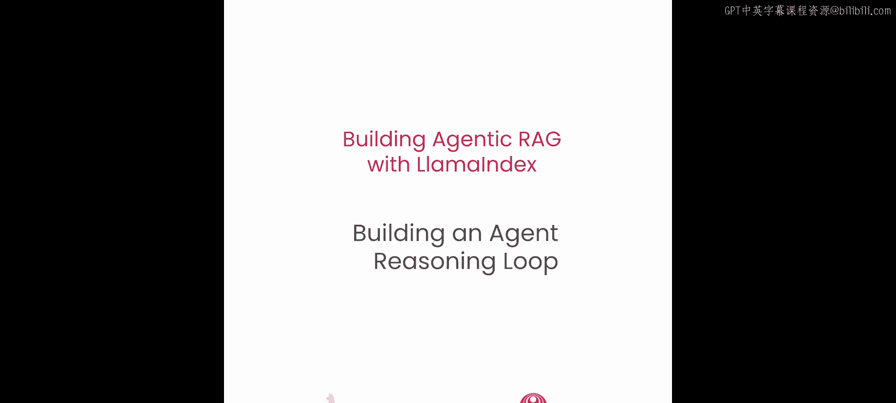
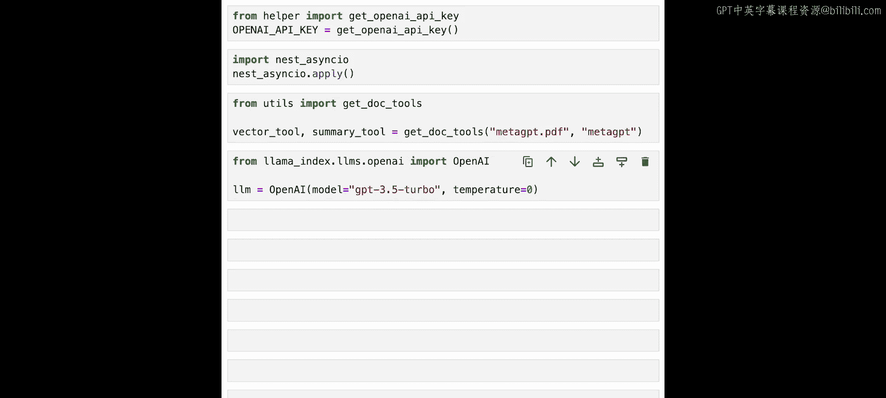
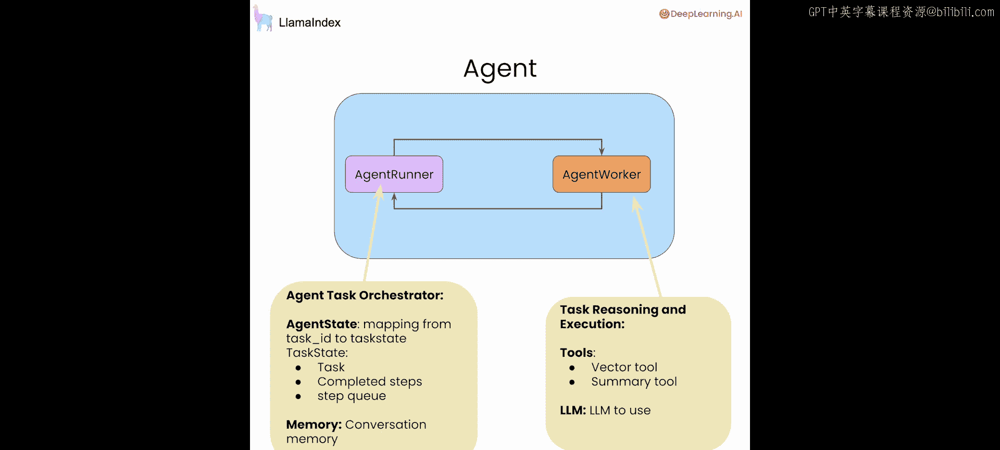
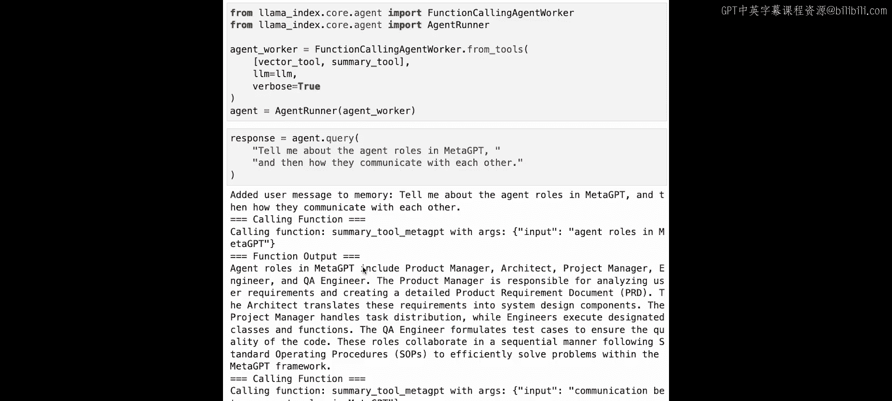
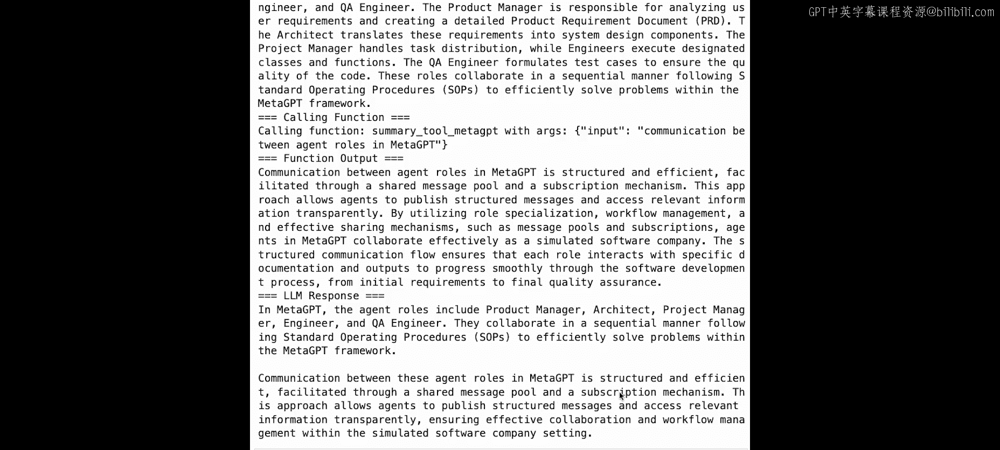
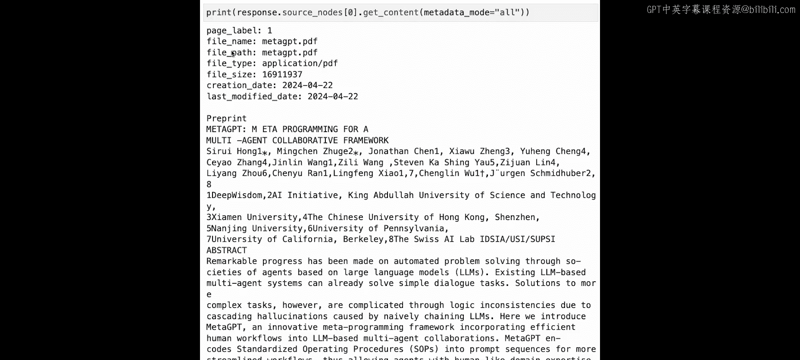
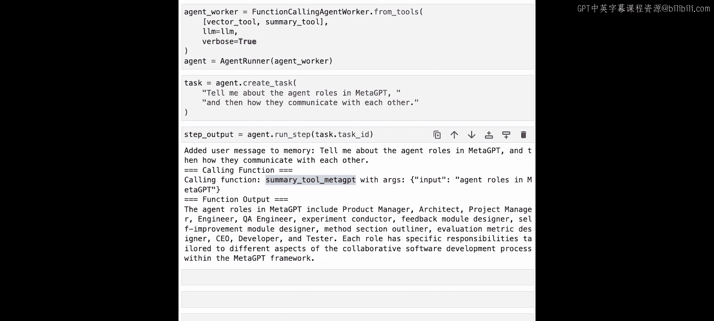
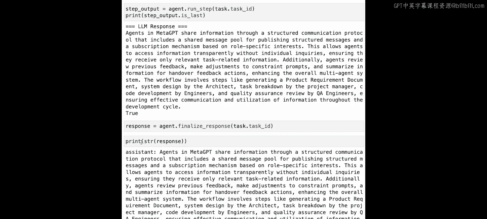

# 004：构建智能体推理循环 🤖



在本节课中，我们将学习如何构建一个完整的智能体推理循环，而不仅仅是单次工具调用。我们将使用LlamaIndex的函数调用智能体实现，它能够进行多步推理，处理复杂的用户查询。

到目前为止，我们的查询都是在单次前向传递中完成的：给定查询，用正确的参数调用正确的工具，然后返回响应。但这仍然相当受限。如果用户提出一个包含多个步骤的复杂问题，或者一个需要澄清的模糊问题呢？本节将介绍如何定义完整的智能体推理循环，使智能体能够跨工具和多步骤进行推理。


## 设置环境与工具 🛠️

首先，我们需要设置环境并导入必要的模块。我们将使用与之前课程相同的MetaGPT论文作为数据源。

```python
# 设置OpenAI API密钥
import os
os.environ['OPENAI_API_KEY'] = 'your-api-key-here'



# 导入LlamaIndex和工具
from llama_index import VectorStoreIndex, SimpleDirectoryReader
from llama_index.tools import QueryEngineTool, ToolMetadata
from llama_index.agent import FunctionCallingAgentWorker, AgentRunner
from llama_index.llms import OpenAI

# 加载文档并创建索引
documents = SimpleDirectoryReader('data').load_data()
index = VectorStoreIndex.from_documents(documents)
```



为了简洁起见，我们将上一课中使用的自动检索向量搜索工具和摘要工具打包成一行代码导入。

```python
# 从工具模块导入预定义的工具
from utils import vector_tool, summary_tool
```

现在，我们设置函数调用智能体。与之前的笔记本一样，我们使用GPT-3.5 Turbo作为我们的LLM。

```python
# 初始化LLM
llm = OpenAI(model="gpt-3.5-turbo", temperature=0)
```

## 定义智能体组件 🧩

在LlamaIndex中，一个智能体主要由两个组件构成：智能体工作器（Agent Worker）和智能体运行器（Agent Runner）。智能体工作器负责执行给定智能体的下一步操作，而智能体运行器是总体的任务调度器，负责创建任务、在给定任务上协调智能体工作器的运行，并能够将最终响应返回给用户。

以下是导入和设置这些组件的代码：

```python
# 导入智能体组件
from llama_index.agent import FunctionCallingAgentWorker, AgentRunner

# 创建函数调用智能体工作器
agent_worker = FunctionCallingAgentWorker(
    tools=[vector_tool, summary_tool],
    llm=llm,
    verbose=True  # 设置为True以查看中间输出
)



# 创建智能体运行器
agent = AgentRunner(agent_worker)
```

智能体工作器的主要职责是：根据现有的对话历史、内存、任何过去的状态以及当前的用户输入，使用函数调用来决定下一个要调用的工具，调用该工具，并决定是否返回最终响应。整体的智能体接口由智能体运行器封装，我们将使用它来查询智能体。



## 执行多步查询 🔄

现在，让我们尝试一个多步查询。我们将问：“告诉我关于MetaGPT中的智能体角色，以及它们如何相互通信。”



```python
# 使用智能体进行查询
response = agent.query("Tell me about the agent roles in MetaGPT and then how they communicate with each other.")
print(response)
```

让我们跟踪智能体的输出。我们看到智能体能够将这个整体问题分解为步骤。第一部分是询问MetaGPT中的智能体角色，它调用摘要工具来回答这个问题。

需要注意的是，摘要工具不一定是最精确的。你可能会认为向量工具实际上会返回一组更简洁的上下文，更好地代表你正在寻找的相关文本片段。然而，摘要工具对于这项工作来说仍然是合理的。当然，更强大的模型（如GPT-4 Turbo、Claude 3 Sonnet或Opus）可能能够选择更精确的向量工具来帮助回答这个问题。

无论如何，我们看到我们能够获得输出：MetaGPT的智能体角色包括产品经理、架构师、项目经理、QA工程师等。然后，它使用这个输出进行思维链推理，触发下一个问题：MetaGPT中智能体角色之间的通信。

我们能够获得关于这个问题的答案：MetaGPT中智能体角色之间的通信是结构化和高效的。我们能够结合整个对话历史来生成最终响应。

当运行这样的多步查询时，你需要确保能够跟踪来源。幸运的是，与之前的课程类似，你可以查看`response.source_nodes`来查看这些节点的内容。这允许你检查检索到的第一个源节点的内容，这只是论文的第一页。

## 维护对话历史 💬

调用`agent.query`允许你以一次性方式查询智能体，但不保留状态。现在，让我们尝试在一段时间内维护对话历史。

智能体能够在对话内存缓冲区中维护聊天记录。内存模块可以定制，但默认情况下，它是一个扁平的项目列表，根据LLM上下文窗口的大小作为滚动缓冲区。因此，当智能体决定使用工具时，它不仅使用当前的聊天记录，还使用先前的对话历史来执行下一步或下一个操作。

因此，我们将使用`agent.chat`而不是`agent.query`。我们首先问：“告诉我使用的评估数据集。”然后，我们会问一个后续问题：“告诉我上述其中一个数据集的结果。”显然，要知道“上述数据集”是什么，你必须在对话历史中的某个地方存储这些信息。

```python
# 使用chat方法维护对话历史
response1 = agent.chat("Tell me about the evaluation datasets used.")
print(response1)

# 提出后续问题
response2 = agent.chat("Tell me the results over one of the above datasets.")
print(response2)
```

智能体能够将这个查询加上对话历史转化为对向量工具的查询，询问“在Human Eval数据集上的结果”，这是使用的评估数据集之一，并能够返回最终答案。

## 使用低级API进行调试与控制 🐛

我们刚刚提供了一个与智能体交互的高级接口。在本节中，我们将展示允许你以更细粒度的方式逐步执行和控制智能体的功能。这不仅允许你在RAG管道上创建更高级的研究助手，还可以调试和控制它。这里的一些好处包括：对每个步骤执行的更强调试能力，以及通过允许你注入用户反馈来提高稳定性。

拥有这个低级智能体接口主要有两个原因。首先是调试能力：如果你是一个构建智能体的开发者，你可能希望更透明、更清晰地了解底层实际发生的情况，特别是如果你的智能体第一次没有正常工作。你可以实际进入，跟踪智能体的执行，查看它在何处失败，并尝试不同的输入，看看是否实际上将智能体执行修改为正确的响应。

另一个有用的原因是，实际上可以实现更丰富的用户体验，围绕这个核心智能体能力构建产品体验。例如，假设你希望在智能体执行过程中监听人类反馈，而不仅仅是在智能体执行完成后。那么，你可以想象创建某种异步队列，在整个智能体执行过程中监听来自人类的输入，如果实际有人类输入进来，你可以在智能体执行较大任务的过程中中断并修改其执行，而不必等到智能体任务完成。

我们将首先再次通过函数调用智能体工作器和智能体运行器设置来定义我们的智能体，然后开始使用低级API。我们首先从用户查询创建一个任务对象，然后开始逐步执行，甚至可以在中间注入我们自己的输入。

```python
# 重新定义智能体（为了示例清晰）
agent_worker = FunctionCallingAgentWorker(
    tools=[vector_tool, summary_tool],
    llm=llm,
    verbose=True
)
agent = AgentRunner(agent_worker)

# 使用低级API：创建任务
task = agent.create_task("Tell me about the agent roles in MetaGPT and then how they communicate with each other.")
print(f"Task created with ID: {task.task_id}")



# 执行任务的第一步
step_output = agent.run_step(task.task_id)
print(step_output)
```

当我们检查日志和智能体的输出时，我们看到第一部分实际上已经执行了。我们调用`agent.get_completed_steps`来查看任务已完成步骤的数量。我们看到一个步骤已经完成，这是到目前为止的当前输出。我们还可以查看智能体的任何即将到来的步骤，通过`agent.get_upcoming_steps`来实现。同样，我们将任务ID传递给智能体，我们能够打印出任务的即将到来步骤的数量。

这个调试接口的好处是，如果你想现在暂停执行，你可以。你可以在不完成智能体流程的情况下获取中间结果。

但让我们继续，运行接下来的两个步骤，并实际尝试注入用户输入。让我们实际问：“智能体如何共享信息？”作为用户输入。这不是原始任务查询的一部分，但通过注入这个，实际上可以修改智能体执行，以返回你想要的结果。

```python
# 注入用户输入以修改执行
user_input = "What about how agents share information?"
agent.run_step(task.task_id, input=user_input)

# 继续执行直到完成
while not step_output.is_last:
    step_output = agent.run_step(task.task_id)
    print(step_output)

# 获取最终响应
final_response = agent.finalize_response(task.task_id)
print(final_response)
```

我们看到我们能够获得关于MetaGPT智能体如何共享信息的答案，这确实是最后一步。要将此转换为类似于你在之前一些笔记本单元格中看到的智能体响应，那么你只需要调用`agent.finalize_response`。

## 总结 📝

在本节课中，我们一起学习了如何构建一个完整的智能体推理循环。我们首先介绍了智能体的高级接口，它允许我们执行多步查询并维护对话历史。然后，我们深入探讨了低级调试接口，它提供了对智能体执行过程的更细粒度控制，允许我们逐步执行、检查状态，甚至在执行过程中注入用户输入。



通过结合高级的易用性和低级的灵活性，LlamaIndex的智能体框架为构建能够处理复杂、多步骤任务的强大RAG应用提供了坚实的基础。在下一课中，我们将展示如何构建一个跨多个文档的智能体。