# 005：构建多文档智能体 🧠

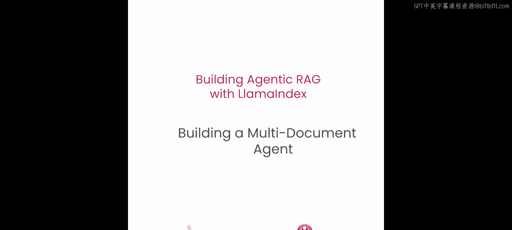

在本节课中，我们将学习如何扩展上一节构建的单文档智能体，使其能够处理多个文档，并应对更复杂的查询场景。我们将从处理三个文档的用例开始，然后扩展到处理十一个文档，并介绍如何使用工具检索器来高效管理大量工具。


---

## 概述

上一节我们介绍了如何构建一个能够对单个文档进行推理并回答复杂问题，同时保持记忆的智能体。

本节中，我们将看看如何将该智能体扩展到处理多个文档，并应对日益增加的复杂度。我们将通过两个具体用例来演示：首先处理三篇研究论文，然后扩展到处理十一篇论文，并引入**对象索引**和**工具检索器**的概念，以解决工具数量过多时可能出现的提示词过长、成本增加和模型混淆问题。

---

## 构建三文档智能体

我们首先从一个包含三篇文档的用例开始，然后扩展到包含十一篇文档的用例。

我们需要设置OpenAI API密钥并导入必要的库。

```python
import os
from llama_index import VectorStoreIndex, SummaryIndex
from llama_index.tools import FunctionTool
# ... 其他导入
```

第一个任务是为三篇论文设置一个函数调用智能体。我们通过将每篇文档的向量搜索工具和摘要工具组合成一个列表，并将其传递给智能体来实现。这样，智能体总共拥有六个工具。

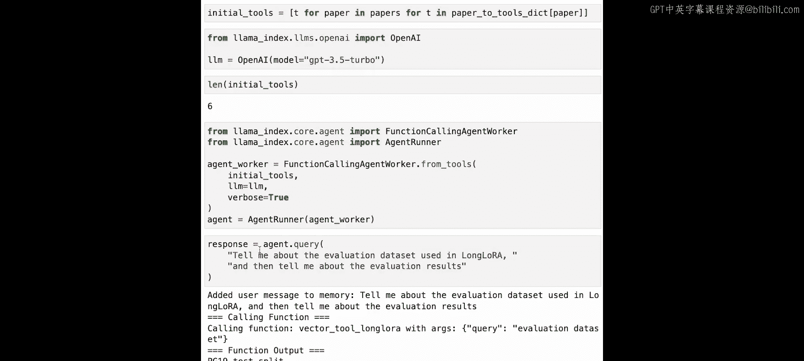

我们将从ICLR 2024下载三篇论文，包括上一节用到的MeGPT，以及LongLORA和Self-RAG。

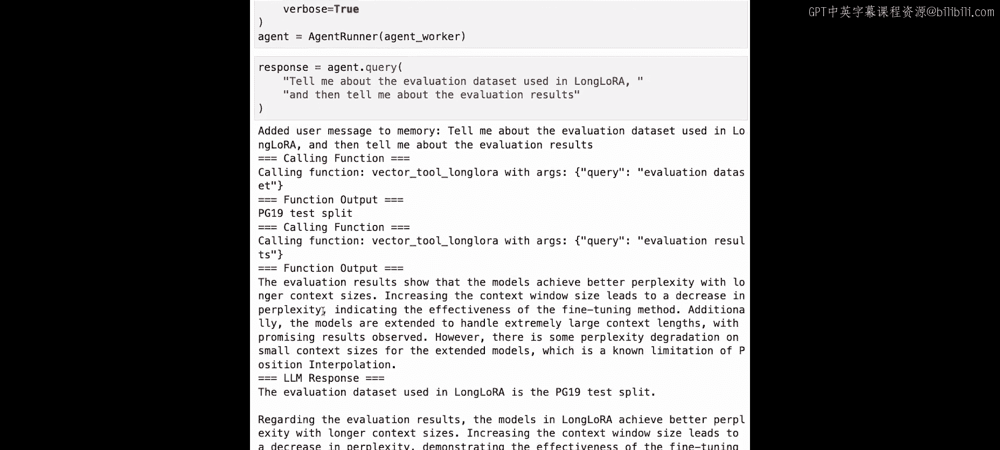

接下来，我们将每篇论文转换成一个工具。如果你还记得第3课，我们有一个名为`get_doc_tools`的辅助函数，它可以自动为给定的论文构建一个向量索引工具和一个摘要索引工具。向量工具执行向量搜索，摘要工具对整个文档进行总结。

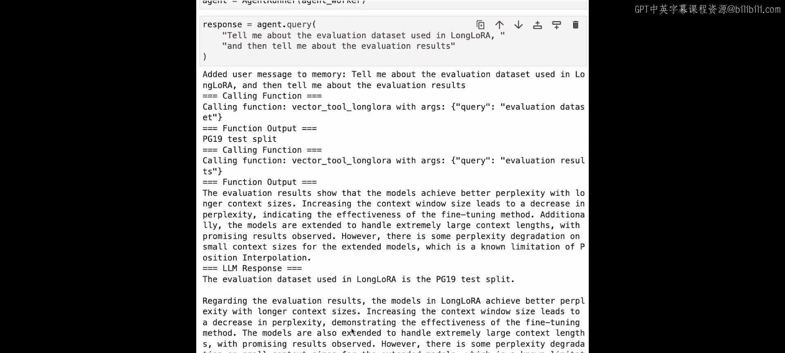

对于每篇论文，我们都会得到向量工具和摘要工具，并将它们放入一个总体的字典中，映射每篇论文的名称到其对应的工具。

然后，我们简单地将这些工具放入一个扁平列表中。我们定义GPT-3.5 Turbo作为我们选择的LLM。如果我们快速查看一下将要传递给智能体的工具数量，会发现是六个，这是因为我们有三篇论文，每篇论文有两个工具：一个向量工具和一个摘要工具。

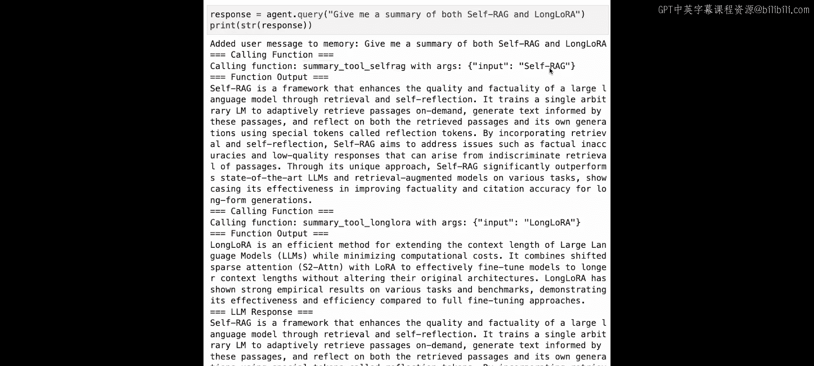

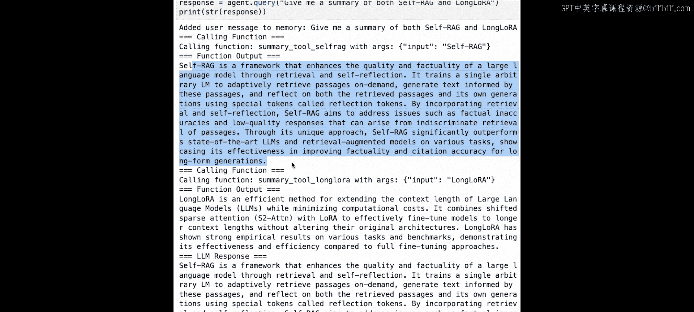

下一步是构建我们的整体智能体工作器。这个智能体工作器包含我们传递的六个工具和LLM。

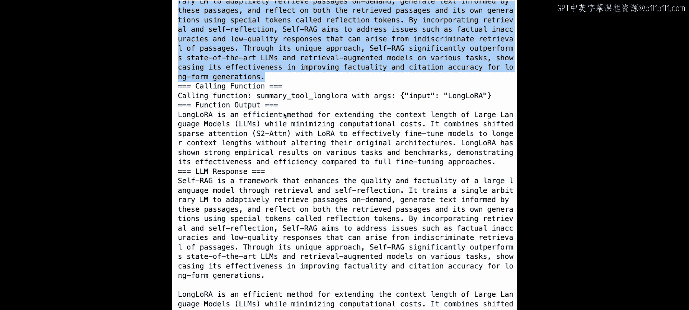

现在，我们能够针对这三篇文档或其中一篇文档提问了。让我们快速问一个关于LongLORA的问题：“告诉我LongLORA中使用的Eval数据集，然后告诉我Eval结果。”

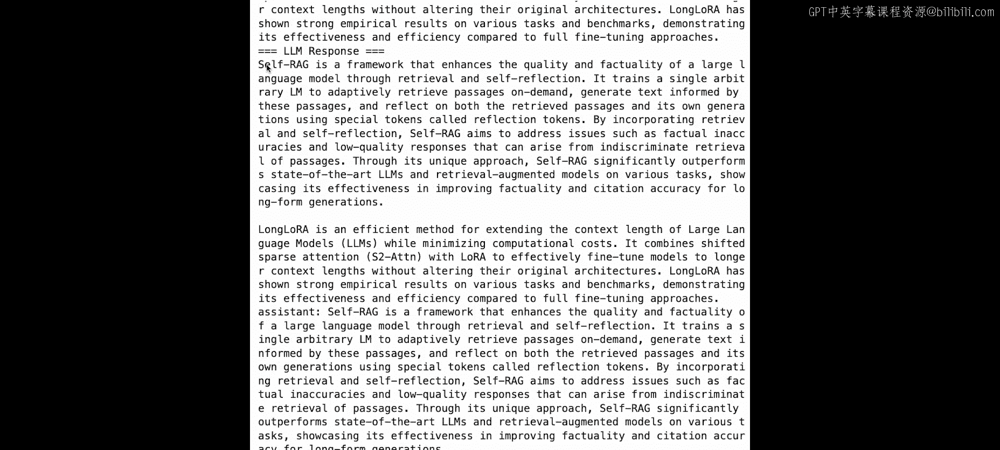

我们得到的回答是，其中一个使用的Eval数据集是AP19测试集。然后我们能够查看LongLORA模型的Eval结果。

我们可以问的下一个问题是：“给我Self-RAG和LongLORA的摘要。”这将允许我们对两篇论文进行总结。

首先，智能体调用Self-RAG的摘要工具，输入其名称，我们能够获得描述该论文内容的输出。

我们看到智能体随后调用LongLORA的摘要工具，输入“LongLORA”，然后我们得到LongLORA的整体摘要。

最终的回答是，我们能够同时获得Self-RAG和LongLORA的摘要。

如果你想自己尝试一些查询，可以尝试这两篇或甚至三篇论文的任何组合，并要求获取摘要或论文中的具体信息，以查看智能体是否能够对每篇文档的摘要和向量工具进行推理。

---

## 扩展到十一文档智能体

现在，让我们扩展到一个更高级的用例。这里我们将实际处理十一篇ICLR论文。

我们将从ICLR 2024下载十一篇研究论文。这包括MeGPT、LongLORA、LoftQ、S-Bench、Self-RAG以及其他几篇论文。

与上一节类似，我们现在将构建一个字典，将每篇论文映射到其向量工具和摘要工具。这个部分可能需要一点时间，因为我们需要处理、索引和嵌入十一篇文档。

现在，让我们将这些工具折叠成一个扁平列表。这是我们需要一个稍微更高级的智能体和工具架构的时刻。

问题是，假设我们尝试索引所有十一篇论文，现在包含22个工具。或者假设我们尝试索引100篇或1000篇甚至更多的论文。尽管LLM的上下文窗口正在变长，但将过多的工具选择塞入LLM提示词会导致以下问题：

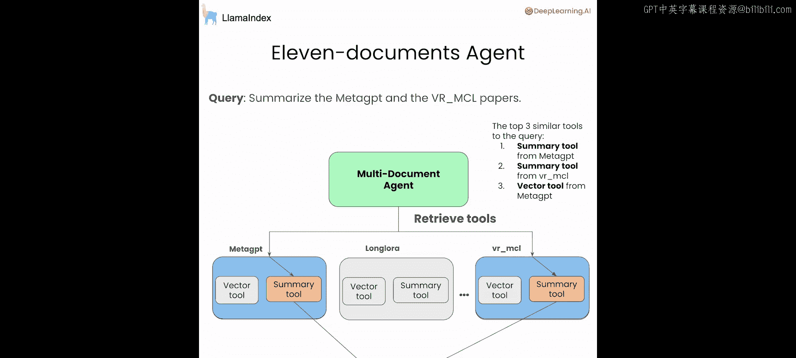

1.  工具可能无法全部放入提示词中，特别是当文档数量很大，并且你将每个文档建模为单独的工具或一组工具时。
2.  成本和延迟会激增，因为你增加了提示词中的令牌数量。
3.  LLM实际上可能会感到困惑，当选择数量太大时，LLM可能无法选择正确的工具。

这里的解决方案是，当用户提出查询时，我们实际上执行检索增强，但不是在文本层面，而是在工具层面。我们首先检索一小部分相关工具，然后将这些相关工具提供给智能体推理提示词，而不是所有工具。

这个检索过程类似于RAG中使用的检索过程。简单来说，它可以只是top-K向量搜索，但当然，你可以添加所有你想要的先进检索技术来过滤出相关的结果集。

我们的智能体允许你插入一个**工具检索器**，让你能够精确地完成这个任务。让我们展示如何实际实现这一点。

首先，我们需要索引这些工具。LlamaIndex已经对通用文本文档具有广泛的索引能力。但由于这些工具实际上是Python对象，我们需要一种方法来将这些对象转换并序列化为字符串表示，然后再转换回来。这在LlamaIndex中通过**对象索引**抽象来解决。

我们将为这些工具定义一个对象索引和检索器。我们看到我们导入了`VectorStoreIndex`，这是我们索引文本的标准接口。但我们用`ObjectIndex`包装了它。要构建对象索引，我们看到我们直接将Python工具作为输入插入到索引中。

你可以通过对象检索器从对象索引中检索。这将调用索引的底层检索器，并直接将输出作为对象返回。在这种情况下，输出将是工具。

现在我们已经定义了对象检索器，让我们看一个非常简单的例子。让我们提问：“告诉我MeGPT和S-Bench中使用的Eval数据集。”

现在让我们看看这个列表中的第一个工具。我们看到我们实际上直接检索到了一组工具，并且第一个工具是MeGPT的摘要工具。如果我们看第二个工具，我们看到这是一个与MeGPT和S-Bench无关的论文的摘要工具。当然，检索的质量完全取决于你的嵌入模型。然而，我们看到检索到的最后一个工具确实是S-Bench的摘要工具。

现在我们准备好设置我们的函数调用智能体了。我们注意到设置与上一课中的设置非常相似。然而，作为一个附加功能，我们展示了你实际上可以向智能体添加一个系统提示词，如果你愿意的话。这是可选的，你不需要指定它，但如果你想要额外的指导，如果你希望智能体以某种方式输出内容，或者你希望它在对这些工具进行推理时考虑某些因素，你可以这样做。这就是一个例子。

现在让我们尝试问一些比较查询。我们问：“告诉我MeGPT中使用的Eval数据集，并与S-Bench进行比较。”

我们看到它调用了MeGPT的摘要工具以及S-Bench的摘要工具。它能够获得两者的结果。然后它在这里生成了最终的回答。

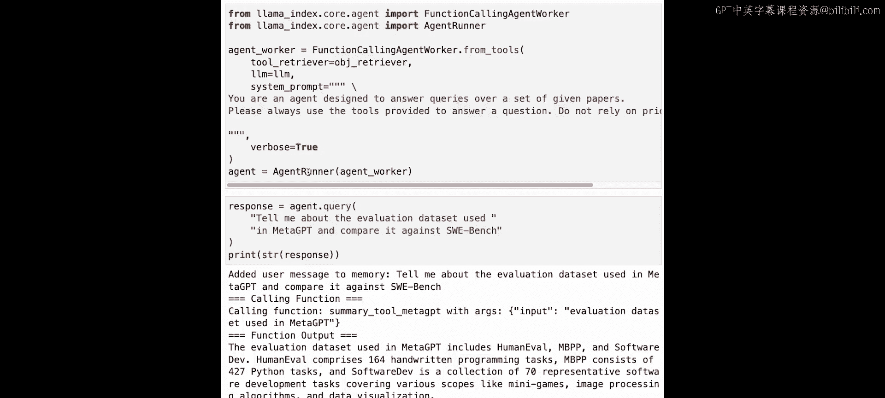

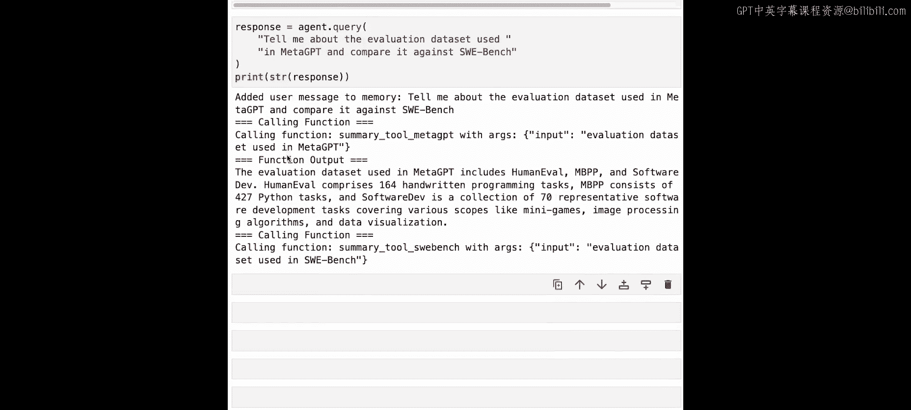

现在，作为最后一个例子，让我们比较和对比两篇LoRA论文：LongLORA和LoftQ，并首先分析每篇论文的方法。

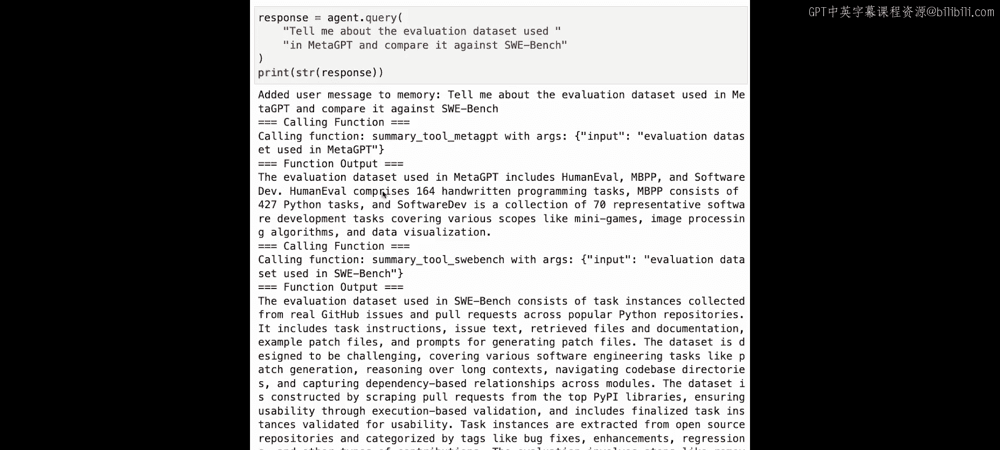

我们看到智能体正在执行这个查询，它采取的第一步是获取这个输入任务，并实际检索一组输入工具来帮助它完成这个任务。因此，通过对象检索器，希望它实际上检索到LongLORA和LoftQ的工具，以帮助它完成响应。

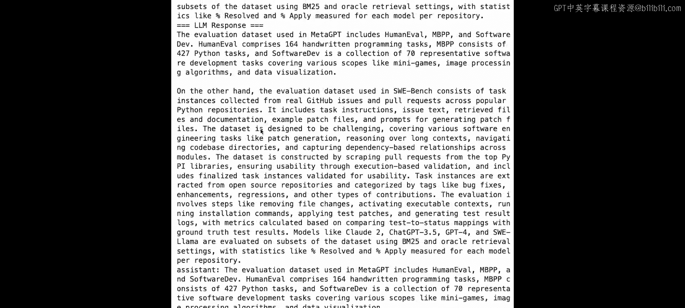

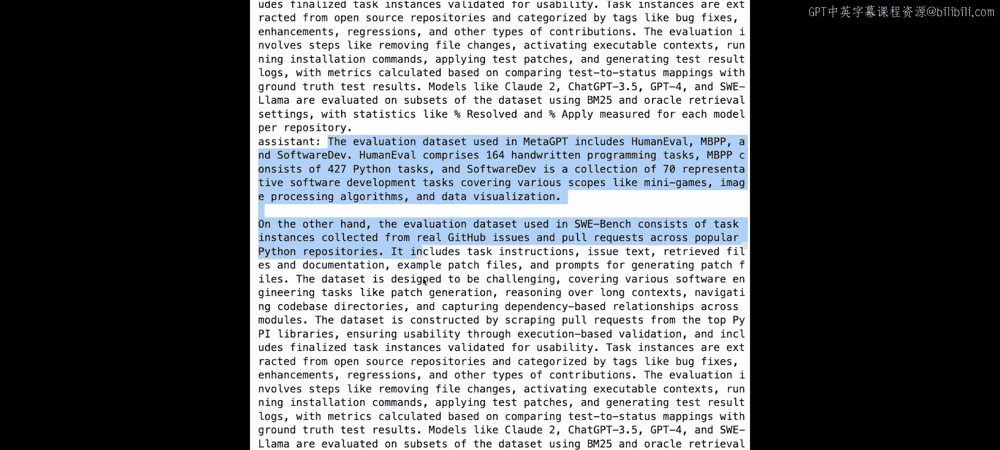

如果我们查看智能体的中间输出，我们看到它能够访问来自LongLORA和LoftQ的相关工具。

我们看到它首先调用LongLORA的摘要工具，参数为“LongLORA”，并且能够获得该方法的摘要。

类似地，通过调用LoftQ的摘要工具，能够获得LoftQ的方法。

最终的LLM响应能够通过比较这两个工具的响应，并将其组合起来，综合成一个满足用户查询的答案。

---

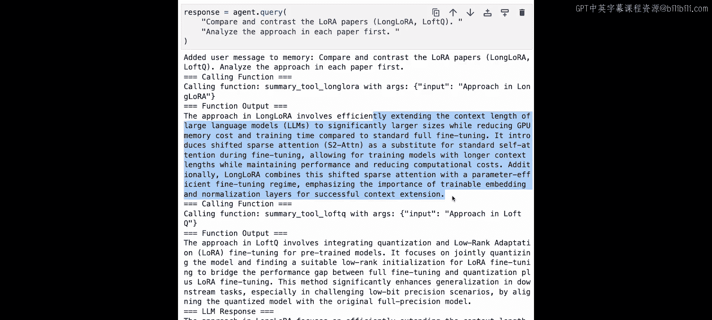

## 总结

本节课中，我们一起学习了如何构建不仅能够处理单个文档，还能处理多个文档的智能体。我们从一个三文档的简单用例开始，介绍了如何为每篇文档创建向量和摘要工具，并将它们组合成一个智能体。

接着，我们扩展到一个更复杂的十一文档用例，并遇到了工具数量过多带来的挑战。为了解决这个问题，我们引入了**对象索引**和**工具检索器**的概念。这允许智能体在回答查询时，先动态检索最相关的工具子集，而不是一次性加载所有工具，从而提高了效率并降低了LLM的困惑度。

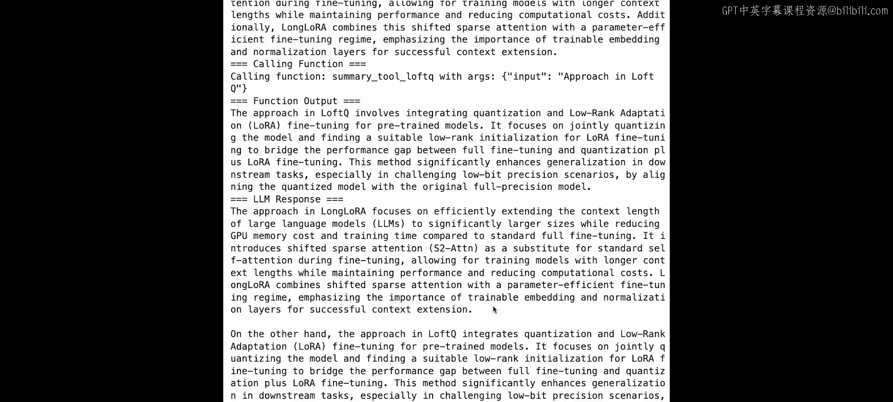

现在，你应该掌握了正确的工具，能够构建不仅限于单文档，还能处理多文档的智能体，使你能够构建更通用、更复杂的上下文增强研究助手，以回答复杂的问题。