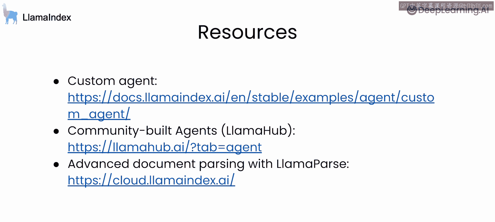

# 006：6.课程总结

在本节课中，我们将对《使用LlamaIndex构建主动式RAG》课程进行总结，回顾所学到的核心知识与技能。

感谢您参与本课程的学习，并祝贺您顺利完成。在本课程中，您学习了关于智能体驱动的RAG系统构建，从构建路由智能体开始，到工具调用，再到构建能够对多个文档进行推理的自定义智能体。

上一节我们探讨了智能体的高级功能，本节我们将对整个课程内容进行回顾与总结。

以下是本课程涵盖的核心知识点：
*   **路由智能体**：学习了如何构建一个能够根据查询意图，将问题路由到不同处理模块或数据源的智能体。
*   **工具调用**：掌握了让智能体能够调用外部工具（如搜索引擎、计算器、API）来获取信息或执行操作的方法。
*   **多文档推理**：理解了如何构建不仅能处理单一文档，还能综合分析多个文档内容并进行复杂推理的智能体。

如果您希望进一步深入：
*   构建自定义智能体。
*   将您的智能体实现作为社区模板提交。
*   利用高级文档解析服务。

请查阅课程中链接的相关资源。我期待看到您运用主动式RAG技术构建出的所有精彩应用。

在本节课中，我们一起回顾了构建主动式RAG系统的完整路径，从基础的路由与工具调用，到实现能够进行多文档推理的复杂智能体。希望这些知识能帮助您在开发智能、自主的问答与信息检索系统时大展身手。