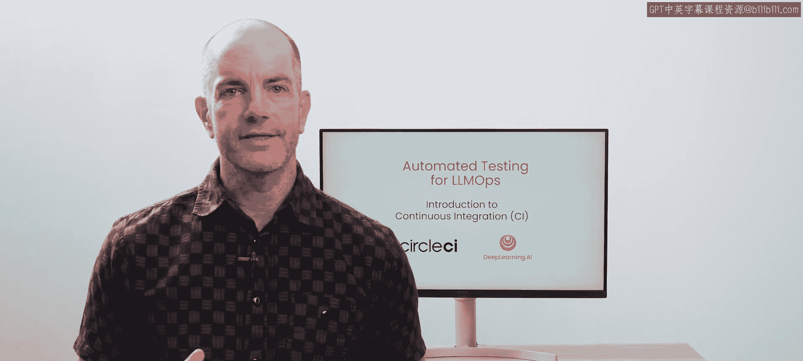
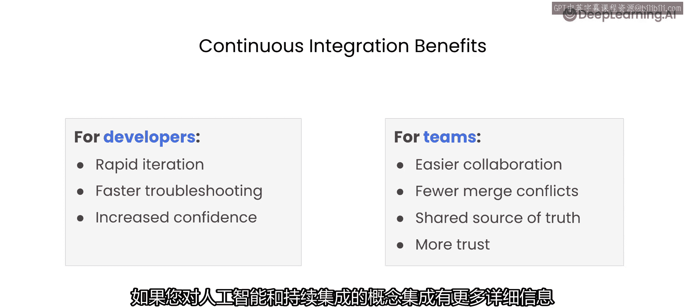
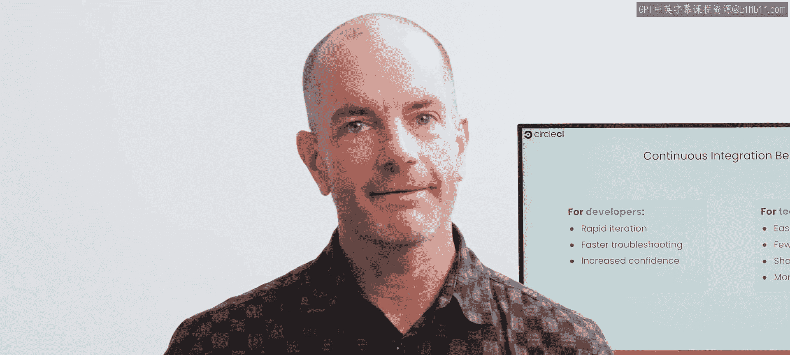

# 002：持续集成简介 🚀

在本节课中，我们将快速概览用于自动化LLM评估的技术——持续集成。我们将讨论什么是持续集成、它为何重要，这将为我们后续课程中构建的自动化工作流打下坚实基础。

让我们开始吧。

## 什么是持续集成？

简而言之，**持续集成**是一种开发实践，其核心在于对软件进行**频繁的小规模更改**，并**与团队其他成员的更改一起进行彻底测试**。

换句话说，你持续地验证你的新功能和更新在与团队其他成员的代码集成后，是否按预期工作。这种方法使你能够在问题演变成你和团队更难解决的大麻烦之前，及早发现并修复它们。

## 持续集成在LLM应用中的运作

让我们看看这在LLM驱动的应用程序中是如何运作的。

想象你正在开发一个尖端的虚拟助手应用。在持续集成的流程中，每当你或团队成员进行代码更改（无论是优化LLM提示词还是更新数据集成），你都会将该更改合并到一个中央代码仓库。

现在，关键的一步来了。一旦代码被合并，CI平台就会启动。它会自动构建你的应用程序，模拟其在真实环境中的行为。接着，**自动测试**会运行，以确保你的LLM产生准确可靠的结果。这些测试涵盖从基本功能到更复杂问题（如幻觉或偏见输出）的方方面面。

## 持续集成的重要性

为什么这很重要？可以把它看作一个**超级反馈循环**。CI平台对你的更改提供近乎即时的反馈。如果检测到问题（例如模型产生了意外的输出），你会立刻收到警报。这种快速的反馈循环使你能够在开发周期的早期发现并解决问题。这样一来，有缺陷的代码就不会影响到团队成员正在构建的其他功能，更糟糕的是，也不会被部署给你的用户。

## 对开发者的益处

现在，让我们谈谈持续集成对作为开发者的你的好处。

持续集成显著减少了你在调试和故障排除上花费的时间和精力。这并不是说你的测试永远不会失败。但当测试确实失败时，你将获得可操作的信息，可以用来快速回到正轨，并继续创新。

CI使你能够**快速迭代**、**尝试新功能**并**充满信心地进行改进**。

## 对团队的益处

但优势不仅限于个人开发者。对于团队而言，CI通过鼓励**更小、更频繁的贡献**来促进协作。代码冲突被最小化，使得管理和解决问题变得更加容易。共享的代码仓库成为一个可靠的单一事实来源，自动化测试确保每个人都在一个稳定的基础上进行构建。这营造了一种信任、协作和快速交付高质量软件的文化。

此外，持续集成为你在**部署、监控和重新训练语言模型**方面实现更多自动化奠定了基础，使你的团队能够迈向更敏捷、响应更迅速的开发实践。对于创新快速且持续的AI开发者来说，CI提供了取得成功所需的结构。

如果你对AI与持续集成的概念整合有更多兴趣，我们在播客中有一个迷你系列《The Confident Commit》，其中通过许多出色的嘉宾详细探讨了这一点。

## 本课程中的实践

在本课程的其余部分，你将使用**CircleCI**作为你的持续集成平台。在你探索测试和评估LLM应用的不同技术时，你将能够触发你的自动化评估，并在CircleCI用户界面中查看结果。

所有的设置工作都已为你完成，以便你可以专注于学习和应用课程中使用的策略。

在团队环境中，通常会有一位**CI/CD专家**负责设置和维护你的流水线。但如果你有兴趣了解更多幕后发生的事情，可以随时探索项目仓库中提供的配置文件。我们还在本课程末尾包含了一个可选实验，让你有机会逐步体验在CircleCI中设置工作流的过程。

## 总结

虽然这只是持续集成功能的冰山一角，但在整个课程中使用它将为你提供所需的知识和工具，开始将自动化测试作为你开发实践的核心部分。这些技能将使你的整个职业生涯受益，并为你遵循现代软件工程实践奠定基础，无论你的兴趣将你带向何方。

好了，让我们马上开始你的第一次评估，并设置它们在CircleCI中运行。

下节课见。

