# 003：自动化评估概述 🧪


在本节课中，我们将学习如何为基于LLM的应用程序设置自动化评估。我们将从基于规则的评估开始，这种评估运行速度快、成本低，非常适合在开发的早期迭代阶段频繁运行。最终，我们将看到这些评估如何在持续集成管道中自动运行。

## 传统软件与基于LLM应用的差异

上一节我们介绍了自动化评估的目标，本节中我们来看看为何基于LLM的应用需要不同的测试方法。

与传统软件相比，基于LLM的应用有几个根本区别：
*   **行为模式**：传统软件的行为通常是预定义的。我们知道输入是什么，也知道特定输入对应的输出是什么，测试相对直接。
*   **输出性质**：在基于LLM的应用中，我们知道输入，但会得到一组可能的输出，其本质更具概率性。
*   **主观性与多样性**：许多LLM应用基于自然语言，具有高度主观性。例如，对于一个总结任务，可能存在多个足够好、可被视为正确的结果，同时也存在许多错误的结果。
*   **评估挑战**：LLM可能产生有害、有毒或冒犯性的回应，这为应用测试带来了新的挑战。

为了应对这些新的测试挑战，AI研究人员提出了**评估**的概念，用于评估LLM在特定任务上的表现。虽然存在MMLU、Hellaswag、HumanEval等针对不同任务的通用基准数据集，但当我们构建自己的应用时，更需要针对特定用例进行测试。

## 自动化评估的关注点与时机

既然我们已经理解了为何需要专门的评估，接下来我们探讨一下评估的具体内容和执行时机。

进行自动化评估时，我们主要关注以下四个领域：
1.  **上下文遵循性**：LLM的回应是否与提供的上下文或指南一致。
2.  **上下文相关性**：检索到的上下文是否与原始查询或提示相关。
3.  **正确性或准确性**：LLM的输出是否与提供的标准答案和预期结果一致。
4.  **偏见与毒性**：LLM应用中可能存在的负面倾向，包括对特定群体的偏见或使用有害、冒犯性的措辞。

关于评估时机：
*   在传统软件模型中，我们通常在每次变更（如修复bug、更新功能、数据或模型变更）后进行测试。
*   对于LLM应用，如果每次变更后都进行全面测试速度太慢，也可以将更全面的测试安排在特定节点，例如**部署前**（在推送到生产环境时）或**部署后**（软件在生产环境中运行时）。

## 实践项目：AI驱动的测验生成器

理论部分已经介绍完毕，现在让我们通过一个实践项目来应用这个框架。我们将构建一个AI驱动的测验生成器。

该应用的数据集包含艺术、科学和地理类别的事实。用户要求我们的机器人就给定主题编写测验，并得到一组问题。我们将编写评估来检查机器人是否正确使用了我们数据中的事实。

### 环境与数据准备

在开始构建之前，我们需要进行一些设置。本应用需要使用CircleCI、GitHub和OpenAI等第三方服务。相关密钥已预先配置好。我们还将使用一个为每位学员生成的独立GitHub分支，以避免冲突。

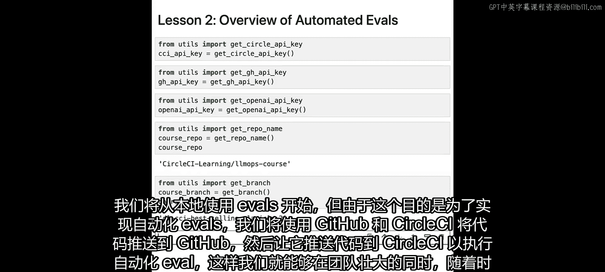

首先，我们创建测验的数据集。为了清晰展示，我们将数据存储在字符串中。在实际应用中，你更可能将数据放入文件或数据库。

```python
# 示例：测验数据（部分）
quiz_data = {
    "art": ["达芬奇创作了《蒙娜丽莎》。", "梵高是《星夜》的作者。"],
    "science": ["水的化学式是H2O。", "地球围绕太阳公转。"],
    "geography": ["巴黎是法国的首都。", "亚马逊河是世界上流量最大的河流。"]
}
```

接下来，我们构建一个提示模板，用于请求生成特定测验，并确保生成的测验基于我们提供的数据。

```python
# 提示模板示例
prompt_template = """
你是一个测验生成助手。请根据以下步骤生成一个测验：
1. 类别：用户询问的类别是：{category}（可选：地理、科学、艺术）。
2. 主题：从以下题库中选择最多两个相关主题：{quiz_bank}。
3. 生成测验：基于上述类别和主题，生成一个包含问题和答案的测验。
请使用以下格式：
问题1: [问题]
答案1: [答案]
...
"""
```

我们将使用LangChain工具包来构建这个提示模板，并连接到LLM（本例中使用OpenAI的GPT-3.5-turbo）。最后，我们将所有组件组合成一个可复用的链。

### 创建基于规则的评估

现在应用的核心功能已经就绪，本节中我们开始为其创建评估。首先，我们创建基于规则的评估，检查输出中是否包含预期的词语。

例如，当我们请求生成一个关于“科学”的测验时，我们预期在回应中看到“H2O”、“地球”等词语。我们编写一个函数来执行此检查。

```python
def eval_expected_words(response, expected_words):
    """
    评估响应中是否包含预期词语。
    response: LLM的回应文本
    expected_words: 预期出现的词语列表
    """
    for word in expected_words:
        if word not in response:
            raise AssertionError(f"未在响应中找到预期词语：'{word}'")
    print("评估通过：所有预期词语均已找到。")
    return True
```

然后，我们执行一次评估：
1.  请求助手生成一个关于“科学”的测验。
2.  定义预期词语列表，例如 `["H2O", "地球"]`。
3.  运行 `eval_expected_words` 函数检查响应。

如果所有预期词语都找到，评估通过；如果缺少任何一个，函数将抛出断言错误，表明评估失败。

### 测试失败场景与优化提示

为了确保应用的健壮性，我们还需要测试它如何处理未知请求。例如，当用户请求一个关于“罗马”（不在我们数据集中）的测验时，我们希望助手礼貌地拒绝，而不是编造信息。

最初，我们的提示模板可能没有包含相关限制，因此测试会失败。助手可能会生成一个关于罗马的虚构测验。我们的评估函数会检查响应中是否包含“抱歉”等词语，由于没有找到，评估失败。

为了解决这个问题，我们优化提示模板，添加明确的指令：
1.  仅使用提供的事实列表中的信息。
2.  如果用户询问的主题没有相关信息，则回复：“抱歉，我没有关于该主题的信息。”

优化提示后，再次运行关于“罗马”的测验请求，助手现在应该会礼貌拒绝，评估得以通过。

### 集成到持续集成（CI）管道

手动运行评估对于单个更改尚可，但在团队协作和频繁迭代中无法扩展。因此，我们需要将评估自动化，集成到CI/CD管道中。

我们将创建两个主要文件：
1.  `app.py`：包含应用的主要逻辑和优化后的提示。
2.  `test_assistant.py`：包含我们定义的评估函数（如 `eval_expected_words`）和具体的测试用例。

测试用例示例：
```python
# test_assistant.py 中的测试用例
def test_science_quiz():
    response = assistant_chain.run(category="science", ...)
    expected = ["引力", "细胞"]
    assert eval_expected_words(response, expected) == True

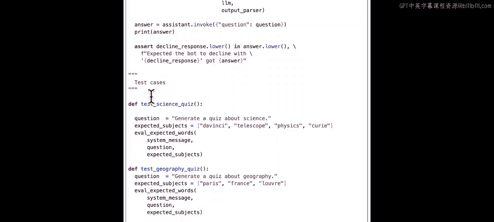

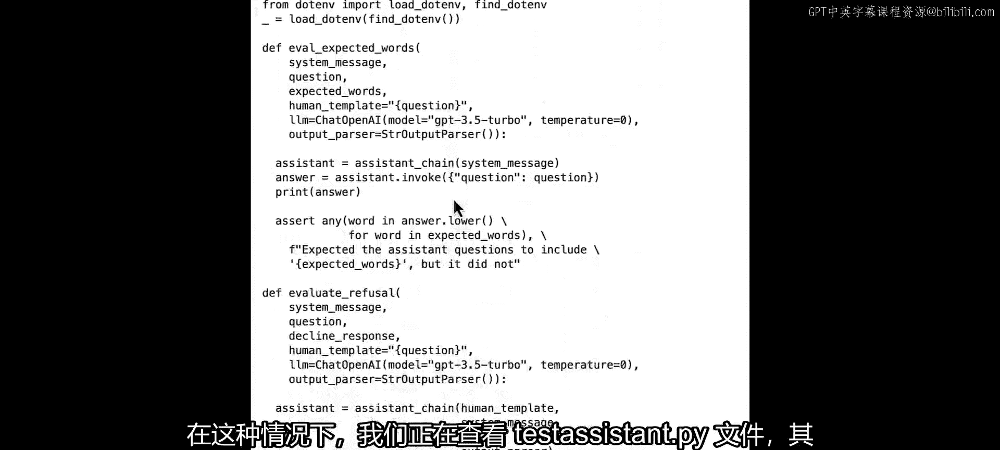

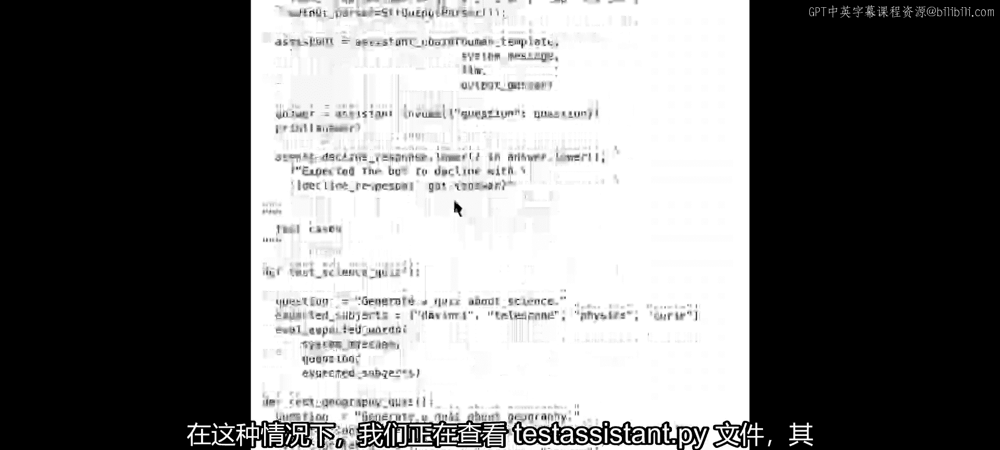

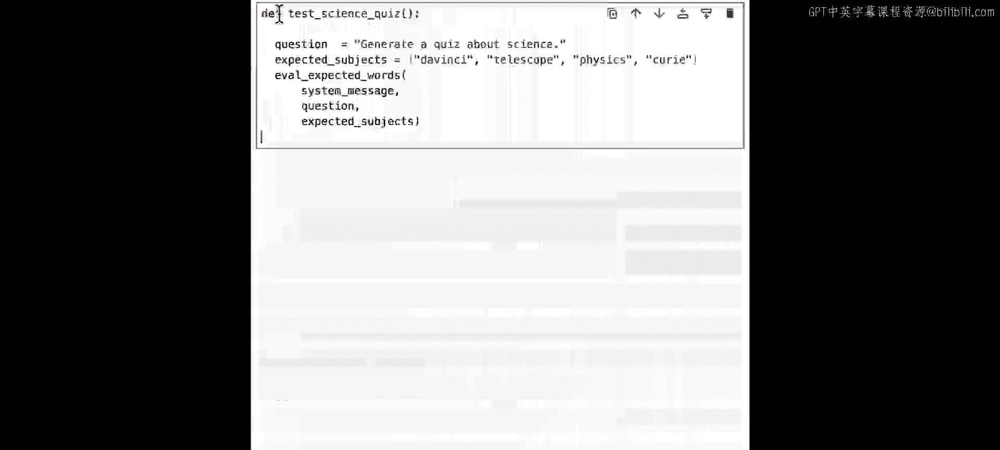

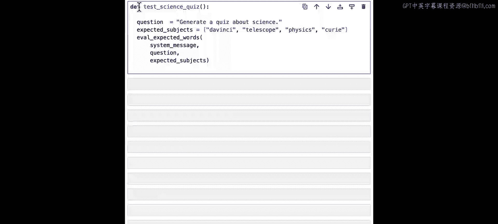

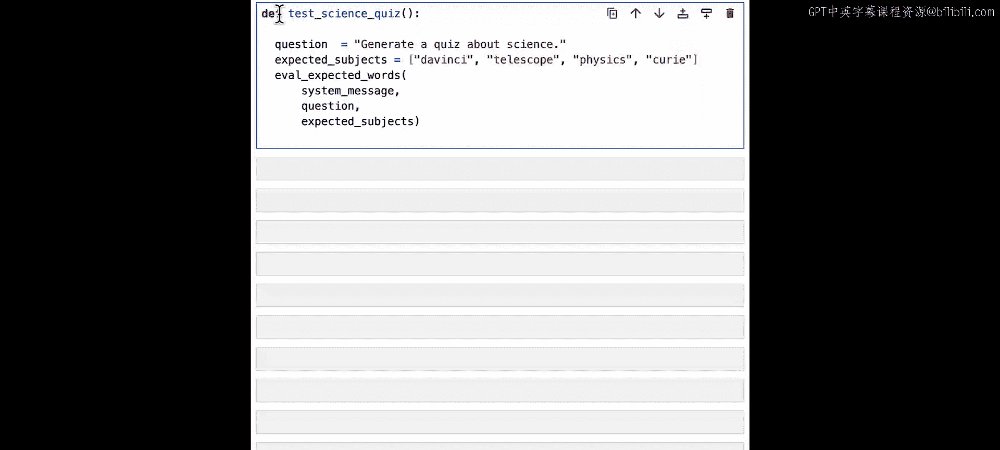

def test_refusal_for_unknown_topic():
    response = assistant_chain.run(category="history", ...) # 'history' 不在数据中
    expected = ["抱歉"]
    assert eval_expected_words(response, expected) == True
```

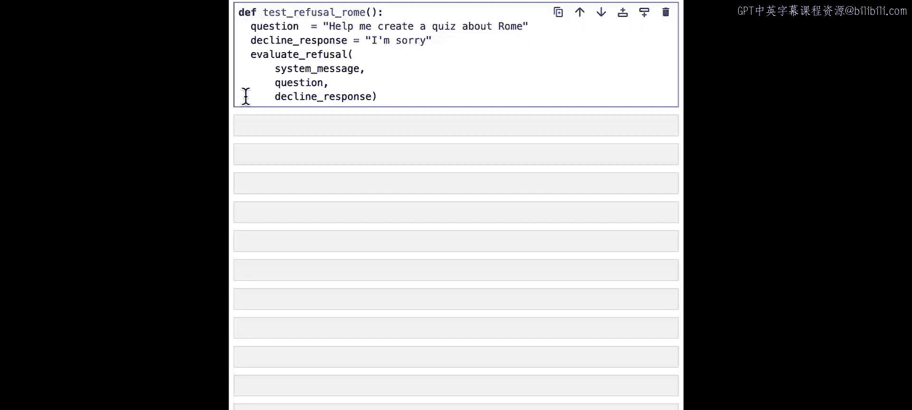

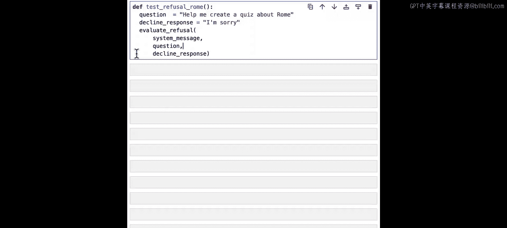

我们使用Git将这两个文件推送到GitHub仓库。我们在项目中已经配置了CircleCI的配置文件（如 `.circleci/config.yml`），该文件定义了CI管道的步骤：设置环境、安装依赖、运行测试（使用 `pytest test_assistant.py`）。

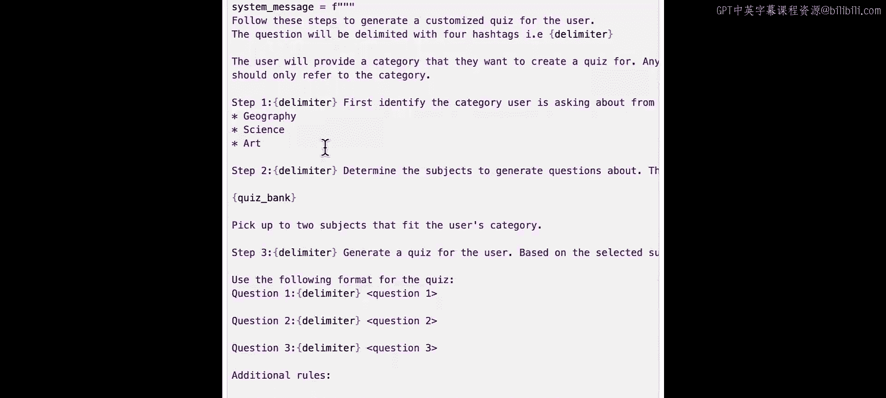

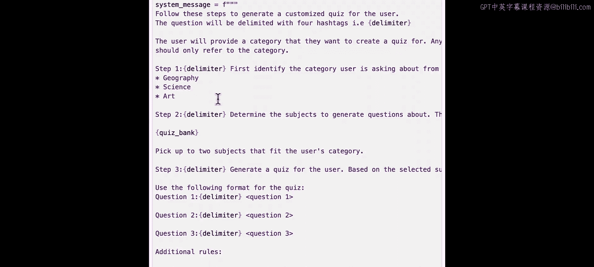

当我们推送代码到GitHub时，会自动触发CircleCI管道。管道会拉取代码，在一个干净的环境中运行我们的所有评估测试。如果所有测试通过，管道显示成功；如果有任何测试失败，管道会停止并报告错误，通知开发者修复问题。

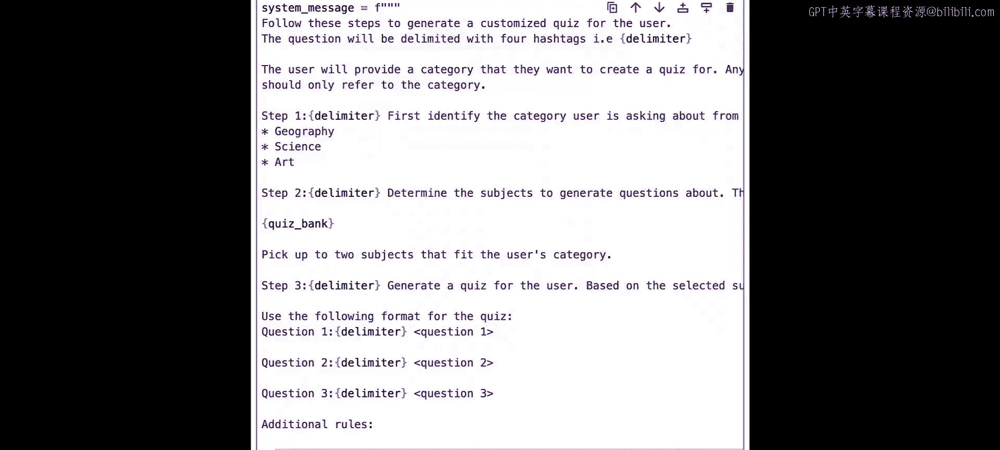

## 总结 🎯

本节课中我们一起学习了为基于LLM的应用实施自动化评估的基础。
1.  我们首先理解了为何基于LLM的应用需要不同于传统软件的评估方法。
2.  接着，我们通过构建一个AI测验生成器，实践了创建基于规则的评估，例如检查输出中是否包含预期关键词。
3.  我们测试了应用在遇到未知请求时的行为，并通过优化提示工程使其能够正确处理。
4.  最后，我们将这些评估集成到了持续集成管道中，实现了每次代码变更时的自动测试，从而确保软件质量，并支持团队高效协作。

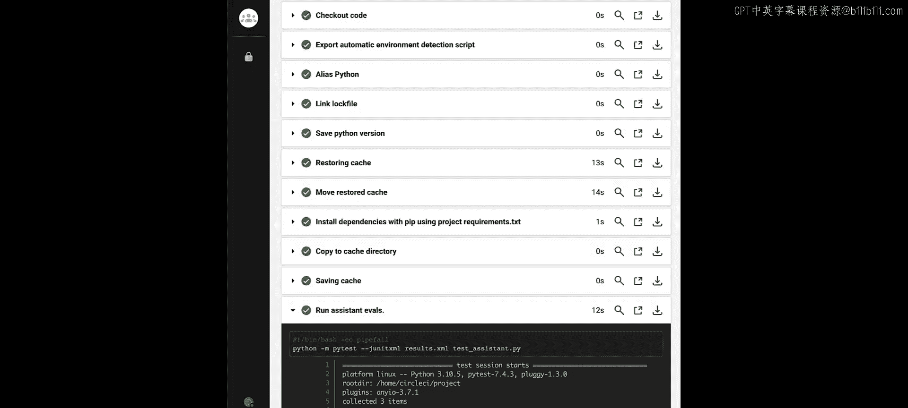

在下一节课中，我们将学习如何使用LLM本身来进行**模型评分评估**，并将这些更高级的评估也引入我们的自动化管道。