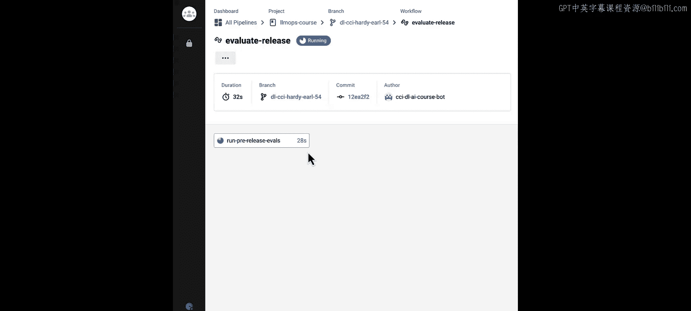
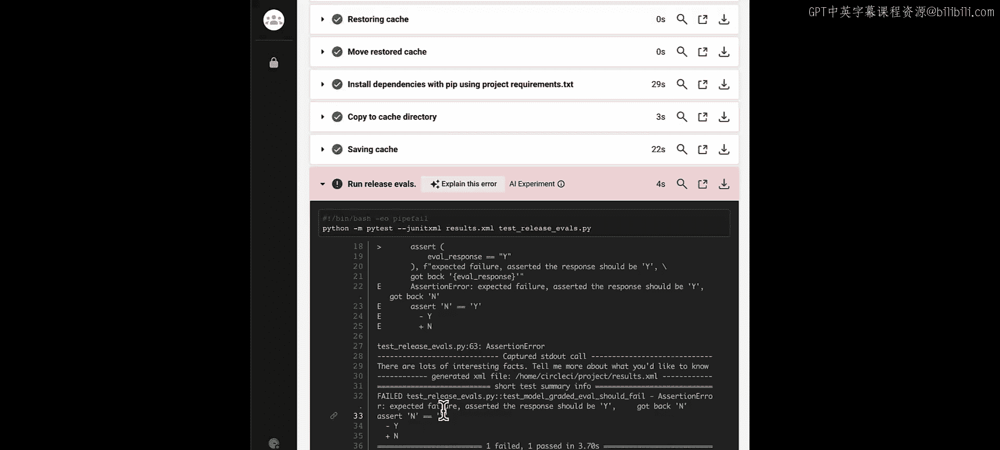
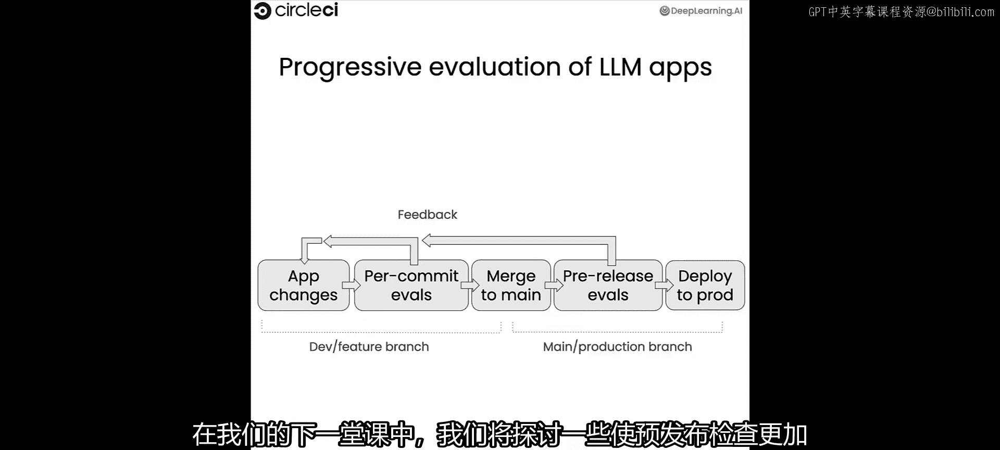

# 004：模型评分评估的自动化

## 概述
在本节课中，我们将要学习一种更强大、更全面的评估方法——模型评分评估。我们将了解如何使用另一个大语言模型来评估我们的LLM应用，并学习如何将这种评估方法自动化，集成到持续集成/持续部署的测试流程中。

到目前为止，我们一直使用基于规则的快速评估方法，这种方法适合在开发阶段，每次代码提交时频繁运行。然而，在将应用部署给用户之前，更稳健和全面的评估方法能帮助我们更好地确保整体质量。模型评分评估就是这样一种方法，即使用一个LLM来评估另一个LLM应用。让我们来看看这种评估方式，以及如何将其自动化，作为测试流程的一部分。


## 从规则评估到模型评估

上一节我们介绍了基于规则的快速评估，用于确保模型遵循提示中的指导方针并忠实于提供的数据。本节中，我们来看看如何通过模型评分评估来确保模型生成高质量、符合语境的回答。

评估LLM的输出可能很棘手，因为对于一个查询的“好”回答是主观的。我们可以尝试像初始评估那样编写自定义规则，以确保输出中包含预期的数据。但随着应用的增长，这会变得越来越复杂和脆弱。检查LLM输出的一种方法是使用另一个LLM作为评分器，这被称为模型评分评估。

我们将展示一个简单的例子，以确保我们的模型确实以测验的形式输出内容。目前我们只关心格式，不关心内容质量。我们将在下一课中更仔细地研究输出的质量。因此，在本课中，我们将专注于判断响应是否符合期望的格式，下一课再研究幻觉和忠实度等问题。

## 构建模型评分评估链

让我们直接开始，编写一个通过测试用例和一个失败测试用例，看看这是如何工作的。首先，我们需要像上一课那样建立密钥。

为了添加模型评分评估，我们将继续使用上一课生成的应用。让我们再看一下，以回忆我们正在处理的内容。同样，如果你想在本地文件系统上查看这些文件的内容，可以使用`cat`命令，它们都包含在你现有的实验环境中。

现在，让我们看看如何构建一个模型评分评估。这将类似于我们构建测验助手的工作，但这次我们构建的是一个提示，告诉LLM去评估测验助手的输出。

以下是构建评估链的核心步骤：

1.  **定义评估提示**：创建一个提示，明确指示LLM扮演评估者的角色，并给出具体的评估标准和输出格式。
2.  **选择评估模型**：选择一个LLM作为评分器。
3.  **设置输出解析器**：指定如何解析评分模型的输出。

```python
# 示例：构建评估链的核心代码结构
from langchain.prompts import ChatPromptTemplate
from langchain.chat_models import ChatOpenAI
from langchain.schema.output_parser import StrOutputParser

# 1. 定义评估提示模板
eval_prompt = ChatPromptTemplate.from_messages([...])

# 2. 选择评估模型
llm = ChatOpenAI(model="gpt-3.5-turbo", temperature=0)

# 3. 设置输出解析器
output_parser = StrOutputParser()

# 构建评估链
eval_chain = eval_prompt | llm | output_parser
```

你可以看到，我们给LLM提供了具体的指令，告诉它在评估测验助手工作时所扮演的角色。在评估实际的测验助手之前，我们将通过模拟一个LLM响应来进行测试，使用我们的评估链来判断该响应是否能通过我们设定的测试。

完整的评估提示会告诉LLM：根据上下文评估生成的测验，并判断它是否看起来像一个测验或测试。它不用于评估信息是否正确。然后，它被明确告知，如果响应是一个测验，则输出“Y”；如果响应看起来不像一个测验，则输出“N”。

## 测试评估链

现在，我们将使用LangChain构建一个熟悉的链，但这次是专门用于进行评估的链。首先，我们有之前构建的聊天提示模板。接下来，我们选择LLM，同样使用GPT-3.5 Turbo。最后，我们选择一个输出解析器，即StrOutputParser，以获取LLM的响应并生成一个基本字符串。

我们将这些部分链接在一起：获取评估提示，将其传递给LLM，然后将该响应传递给输出解析器，以得到我们想要的字符串。

现在，我们使用一个已知的良好LLM响应构建了一个基本的评估链。我们可以通过针对该已知文本调用评估链来证明我们得到了积极的结果。

```python
# 调用评估链进行测试
known_good_response = "这是一个模拟的良好测验输出..."
result = eval_chain.invoke({"context": "...", "response": known_good_response})
print(result)  # 预期输出: 'Y'
```

如你所见，在这种情况下，我们得到了一个“Y”，这意味着我们输入的已知良好响应被LLM认为符合预期的测验格式。

然而，我们也需要确保当响应看起来不像测验时，评估会失败。为此，我们首先将所有评估链创建代码存储为一个工具函数，以便重复使用。接下来，我们存储一个已知的不良结果，以便将其传递给一个新的评估链。

```python
# 测试失败案例
known_bad_response = "这只是一段普通的文本，不是测验。"
result = eval_chain.invoke({"context": "...", "response": known_bad_response})
print(result)  # 预期输出: 'N'
```

现在我们调用这个新的评估链，看到我们得到了正确的响应，即一个“N”，表明该文本看起来不像一个测验。

## 集成到CI/CD流程

现在，我们将把新创建的模型评分评估能力，整合到我们在持续集成管道中运行的测试中。实验环境中的文件系统上有两个用于测试的文件。第一个是`test_assistant.py`，这是我们之前运行的。第二个是`test_release_evals.py`，它汇总了我们刚刚完成的所有工作，展示了如何创建模型评分评估并针对OpenAI执行它。

现在我们已经有了发布评估（即模型评分评估），它们存储在`test_release_evals.py`文件中，连同我们之前拥有的文件：`test_assistant.py`和存储原始代码的`app.py`。我们将把所有内容推送到GitHub，然后推送到CircleCI，以便评估我们的应用程序，包括模型评分评估。

在这种特定情况下，我们对积极案例使用完整评估，但故意将已知的不良结果传递给消极案例，以展示在持续集成管道中出现失败时的样子。我们还只会在CircleCI上触发发布评估任务，这样我们就不会为此进行过多的测试。

我们通过函数`trigger_release_evals`来实现这一点，该函数使用传递给工作流的参数。你可以看到，唯一运行的任务是`run_pre_release_evals`，因为这是我们通过该参数特别选择的。

## 运行结果与总结

如你所见，我们在此次运行中执行了模型评分评估，并且确实遇到了失败，因为我们故意传递了已知的不良内容。

很好！你可以看到，当你将应用程序更改合并到主分支时，你的预发布评估就会运行。在实际的开发场景中，这将在你在开发分支上进行更改并运行每次提交的评估之后发生。我们正在建立一个系统，随着我们越来越接近向用户发布应用，逐步增加对应用程序的信心。

在本节课中，我们一起学习了：
1.  **模型评分评估的概念**：使用一个LLM作为评分器来评估另一个LLM应用的输出。
2.  **构建评估链**：如何通过定义提示、选择模型和解析输出来创建一个自动化的评估流程。
3.  **测试评估有效性**：使用已知的良好和不良响应来验证评估链是否能正确判断格式。
4.  **集成到CI/CD**：如何将模型评分评估作为预发布检查的一部分，集成到自动化测试管道中。







在下一课中，我们将探讨如何使预发布检查更加稳健，包括在多个数据点上运行评估、编写用于检测应用程序中幻觉的评估，以及在CI中存储评估结果以供人工审查。