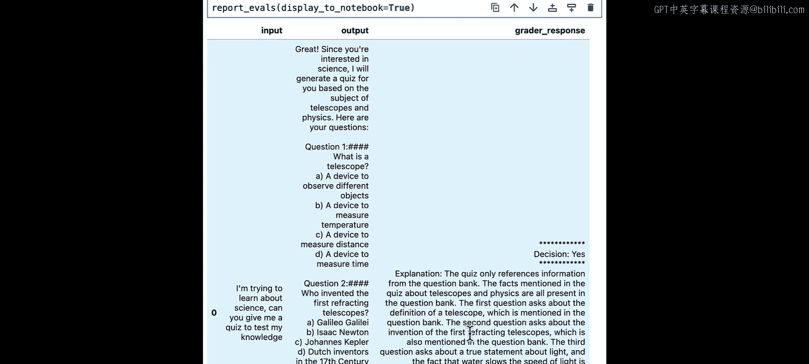
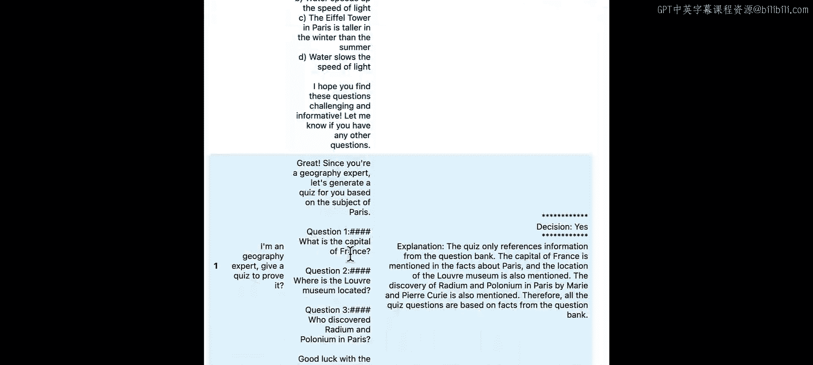
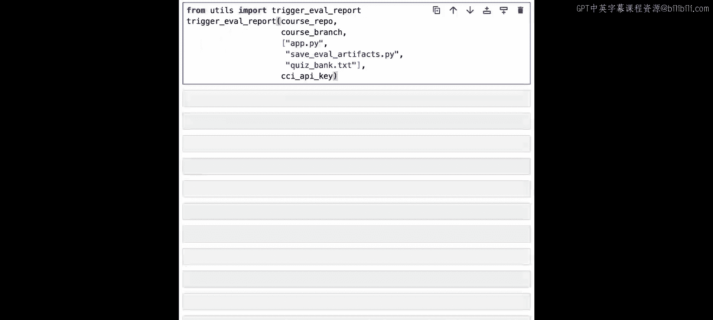
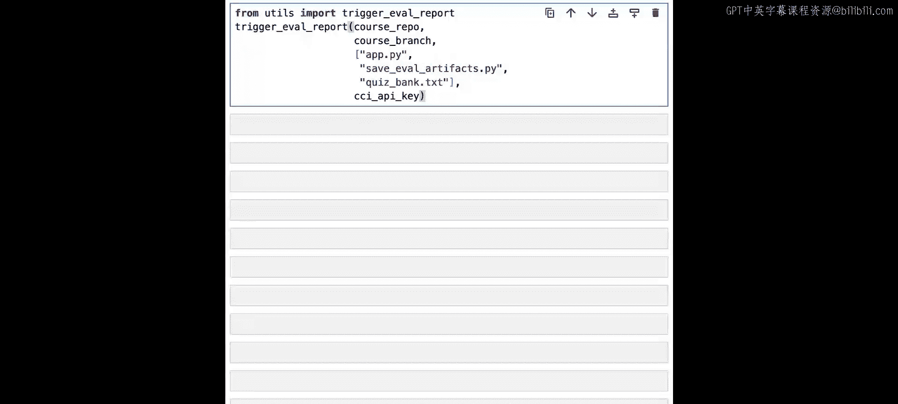
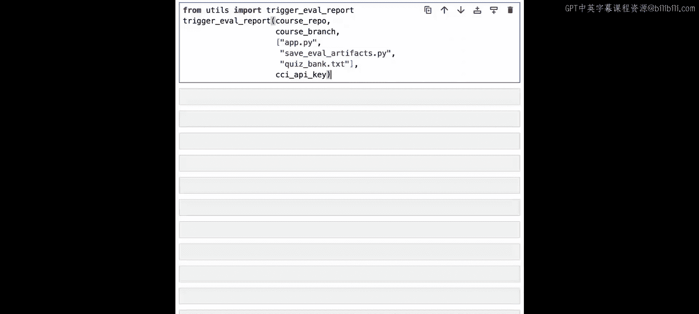
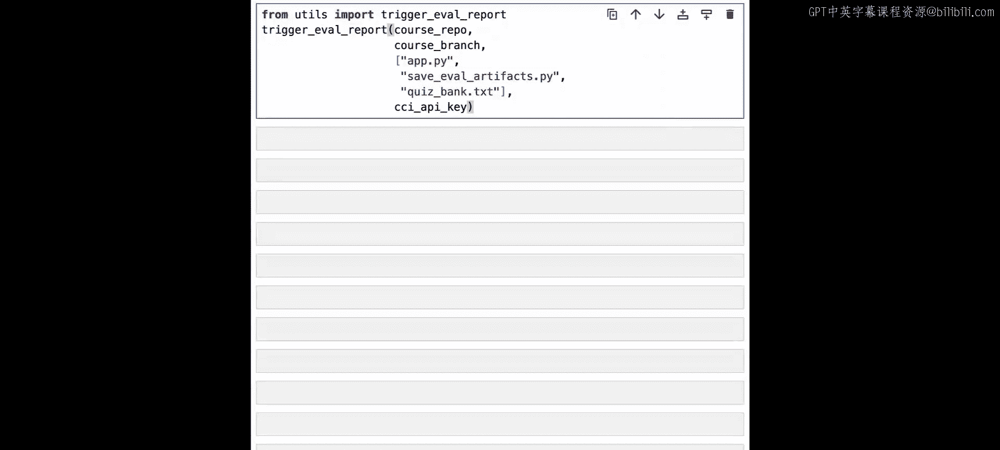
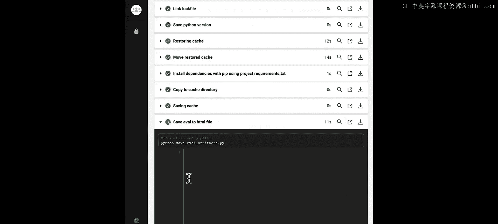
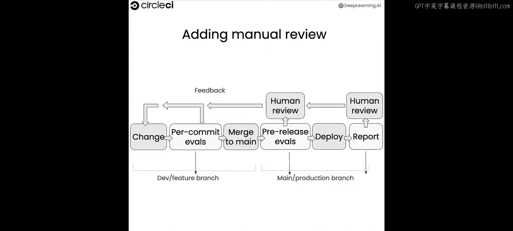

# 005：全面的测试框架 🧪

在本节课中，我们将学习如何扩展和增强评估流程，为你的LLM应用构建一个全面的测试框架。你将学习如何编写评估来检测应用中的幻觉，如何在多个数据点上运行评估，以及如何在CI/CD中存储评估结果以供审查。


---

## 理解幻觉问题

上一节我们介绍了基础的模型评分评估。本节中，我们来看看一个LLM的常见问题：幻觉。

幻觉是指模型提供了虚假或错误的输出。这是当前LLM作为“下一个词预测器”的副作用。模型总是会提供统计上可能的输出，但无法内置地保证输出内容的正确性。

在我们的应用中，幻觉可能表现为智能体创建的测验包含了知识库中没有的事实。例如：
*   **不准确的回答**：用户问“巴西的首都是哪里？”，得到“圣保罗”的答案，而正确答案是“巴西利亚”。
*   **不相关的回答**：用户问“巴西的首都是哪里？”，得到“加拿大的首都是渥太华”的答案。这个陈述本身是事实正确的，但与用户问题无关。
*   **矛盾或无意义的回答**：用户问“美国按人口从大到小排列的主要城市有哪些？”，得到“纽约、洛杉矶、芝加哥和纽约”的答案。

检测幻觉的一种方法是创建一个模型评分评估，它接受模型**应该**产生的基准事实数据，并将其与实际输出进行比较。

编写检测幻觉的评估并不能保证模型永不产生幻觉，但它是一个有用的工具，可以检测提示词是否缺乏“护栏”来防止模型在提供的上下文之外进行猜测。在我们的应用中，一个护栏的例子是修改提示词，要求模型告诉用户它无法为知识库中没有的主题创建测验。

---

## 实践：检测幻觉

让我们将上述理论付诸实践。首先，我们需要重新加载API密钥以使用第三方服务。

```python
# 示例：加载API密钥
import os
os.environ["OPENAI_API_KEY"] = "your-api-key-here"
```

正如之前课程提到的，管理知识库更可持续的方式是将其放入文本文件或数据库中。这里我们使用一个文本文件，并在需要时将其加载到内存中。

为了演示幻觉检测，我们首先快速重建之前使用的测验生成器。

```python
# 示例：重建测验生成器链
from langchain.prompts import ChatPromptTemplate
from langchain.chat_models import ChatOpenAI

quiz_prompt = ChatPromptTemplate.from_messages([
    ("system", "你是一个测验生成助手。根据以下知识库生成测验。"),
    ("human", "知识库：{quizbank}\n\n请生成一个关于{subject}的测验。")
])
assistant_chain = quiz_prompt | ChatOpenAI(model="gpt-3.5-turbo")
```

现在，我们继续创建一个明确寻找幻觉的模型评分评估。

你可以看到，为了模型评分评估的目的，我们投入了大量精力来强调“测验必须只包含知识库中的事实”这一点的重要性。例如，提示词中写明：“主要关注点是确保只使用已有的事实，包含知识库之外事实的测验是糟糕的，对学生有害。” 下方再次强调：“记住，测验需要只包含助手已知的事实。允许编造事实是危险的。”

然后，类似于我们之前的评估，我们将输出“Y”（如果测验正确，即只包含知识库中的事实）和“N”（如果包含知识库之外的事实）。

现在，我们定义一个函数来测试我们的模型评分评估。

```python
# 示例：测试幻觉检测评估的函数
def test_hallucination_eval(quizbank, subject):
    # 生成测验
    quiz = assistant_chain.invoke({"quizbank": quizbank, "subject": subject})
    # 调用幻觉检测评估链
    result = hallucination_eval_chain.invoke({"quiz": quiz, "quizbank": quizbank})
    return result
```

为了检查当出现幻觉时会发生什么，我们使用之前存储的知识库，将其传递给新的模型评分评估，并在模型评分评估测试函数中检查幻觉。

我们请求一个关于“书籍”的测验，这不在我们的知识库中。然而，LLM试图提供帮助，返回了一个关于书籍的测验。我们的模型评分评估知道它的工作是检测包含知识库之外信息的测验。因此，在这种情况下，我们得到了一个“N”，表明这是一个不可接受的测验。

是什么导致了这些幻觉？如果你回顾我们的提示词，我们告诉助手让测验“有趣”。这可能是测验的一个好属性（教育应该具有吸引力），但它导致我们的模型产生了幻觉。幸运的是，我们的评估检测到了这些幻觉，因此我们可以返回去修正提示词。在未来的提示词中，我们将移除要求“有趣事实”的部分。

---

## 使用数据集进行扩展测试

随着你的应用随时间增长和变化，你会希望为其添加新功能。对于我们的测验应用，这可能意味着支持新主题或为现有主题添加事实。

为此，我们可以创建已知模型应如何行为的问题数据集，并对数据集中的每个示例运行测试。让我们通过一个示例，使用我们的应用代码在数据集上进行测试。

我们将稍微更新应用代码以防止幻觉。到目前为止，我们已经将评估用作自动化测试套件。这是捕捉明显错误和回归并快速迭代应用的好方法。

---

## 人工评估与结果存储

但在处理AI模型时，习惯于手动检查和整理数据非常重要。我们合作过的AI/ML工程师表示，愿意深入研究数据是在该领域有效工作的关键。这有时被称为错误分析或性能审计。

在本示例中，我们将展示一种将评估结果作为工件存储在CI/CD中的方法，以便你可以审查并与团队分享，确保你的应用和测试套件完全按预期运行。

首先，我们将重建评估器，使其不仅提供响应或决定，还提供做出该决定的解释。

如这个版本的提示词所示，我们要求以特定格式分隔决定和解释。提示词中提供了一个示例，以确保我们获得后续人工评估所需的有用信息。

现在，我们已经用新提示词重建了聊天提示模板，并且我们将构建一个数据集，以便可以针对新提示词运行多个测试。

如你所见，这个测试数据集包含了来自用户的多个不同提示或输入，以及一些预期的响应。接下来，我们创建一个函数，循环遍历数据，调用测验生成器，并评估数据集中每个条目的响应。

然后，我们确保能够访问所有需要的函数，以便基于数据生成我们想要的报告。接着，我们编写你熟悉的包装器来创建将在所有评估中使用的评估链。





最后，我们利用pandas的一些工具，在所有评估结果中创建一个数据框，这将使我们能够轻松生成报告。

现在，你可以看到一个格式化的表格，其中包含我们生成的不同测验的多个结果以及评估者的响应。第一个是关于科学的测验，决定是“Y”（这是一个合适的测验，测验只引用了知识库中的信息）。这里包含了更多细节，包括测验中具体有什么以及它在知识库中的位置。第二个是关于地理的，类似地决定是“Y”。第三个是关于意大利的测验，决定也是“Y”。这很有趣，因为测验确实引用了知识库中的信息，事实也来自知识库，但关于意大利的测验模型并没有明确映射到类别。这就是为什么你需要人工评估，以便你可以决定这是否是你想要生成的测验类型，或者你是否想要不同的结果（例如，说“我不知道如何生成关于意大利的测验”，而意大利正是开始时概述的主题）。

从这里，你也许可以根据收集到的信息更改提示词或决定采取不同的做法。再次强调，让人参与进来，从高层次评估系统的所有部分是否按预期工作，对我们来说是一个很好的结果。

---

## 集成到CI/CD流程

现在，我们将把该结构放回CI/CD中，使其以自动化方式运行，但创建此报告的工件，以便你可以定期审查它。









为了在持续集成中运行它，我们有一个额外的文件 `save_eval_artifacts.py`，它生成并存储你刚才看到的输出报告，但作为工作流程的一部分。



现在，我们将再次针对相同数据运行评估，但在持续集成管道中，展示随着我们持续工作和增长，定期使用它会是什么样子。我们将使用 `save_eval_artifacts.py` 文件以及原始应用和存储知识库完整内容的 `quizbank.txt` 文件来触发评估报告。

现在，你可以看到我们的评估在CI/CD中通过了，并且我们能够存储一个格式化的输出版本（就像之前在notebook中看到的那样），但现在它在一个HTML文件中，易于检索，以便你稍后查看。结果、描述、决定和解释与之前类似，但以团队中任何人都可以查看的方式存储，而不是仅存在于本地的notebook中。

在生产应用中，你可能会与同事分享这些结果以进行审查，帮助调试意外结果。这个反馈循环不仅使你能够解决眼前的问题，还为你提供了可用于对模型和评估流程实施战略性更新的工具。凭借这种增强的可见性，你和你的开发团队可以做出数据驱动的决策，简化调试过程，并主动解决潜在问题。

全面理解用户交互、模型响应和评估结果，是构建健壮可靠、满足并超越用户期望的LLM应用的重要组成部分。

---

## 总结 🎯

本节课中，我们一起学习了：
1.  **幻觉**：LLM产生虚假或不相关输出的问题。
2.  **幻觉检测**：如何使用**模型评分评估**来检测应用中的幻觉，通过比较输出与基准事实。
3.  **扩展测试**：如何创建**数据集**并在多个数据点上运行评估，以全面测试应用功能。
4.  **人工评估的重要性**：模型评分评估后，进行人工审查对于确保输出质量完全符合用户期望至关重要。
5.  **CI/CD集成**：如何将评估流程集成到持续集成/持续部署管道中，自动运行测试、生成报告并存储结果工件，便于团队协作和持续改进。



如果你想了解如何在CircleCI或你的持续集成管道中配置所有这些内容，课程包含了一个额外的notebook，展示了其核心部分以及如何为你的持续项目进行设置。