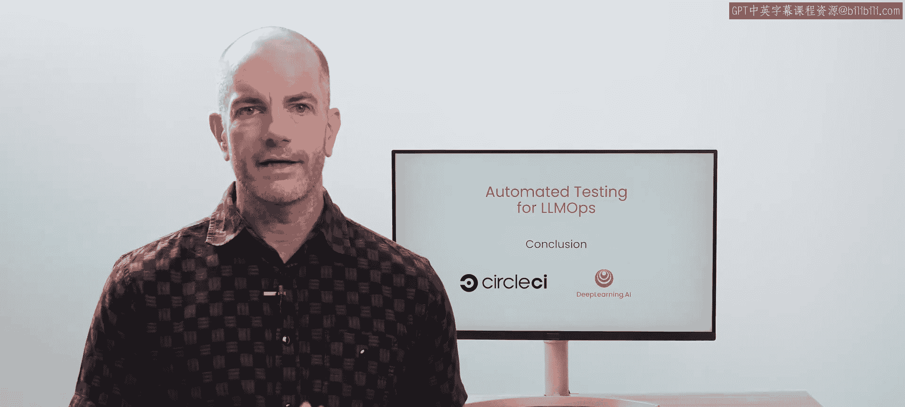
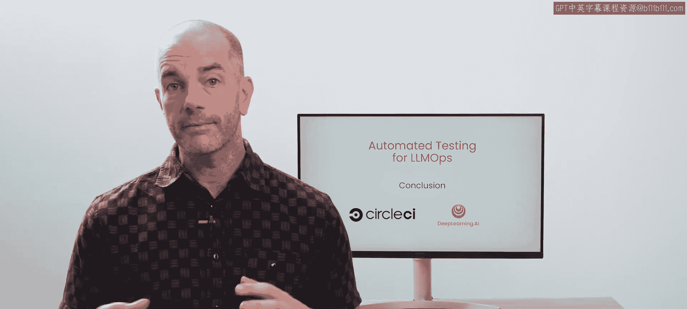
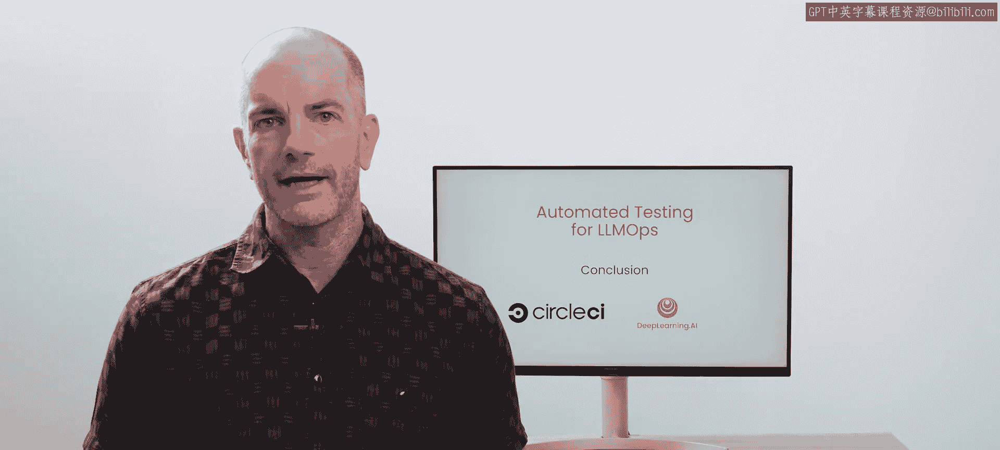
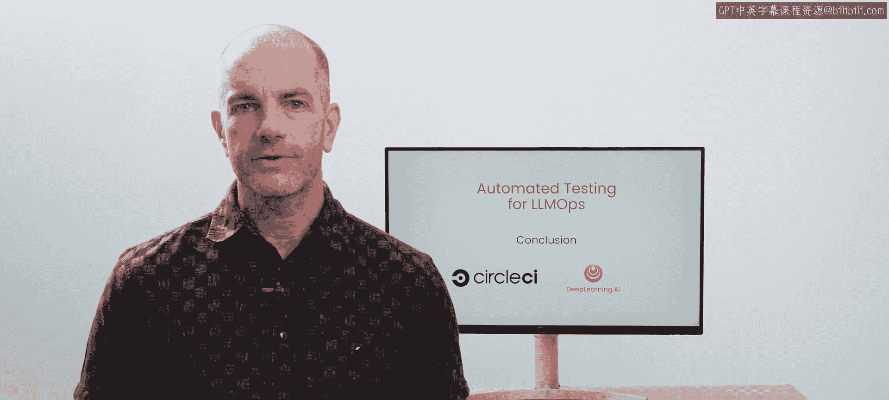

# 006：总结

在本节课中，我们将回顾并总结整个课程的核心内容。我们一起学习了如何将评估（Evals）与持续集成（CI）流程相结合，以构建强大、可靠的LLM应用开发流程。

## 课程回顾

上一节我们探讨了自动化评估流程的构建，本节中，我们来进行全面的总结。

恭喜你完成了本课程的学习。你掌握了一些非常棒的知识。

以下是你在本课程中学到的核心内容：
*   你学习了**评估（Evals）**。
*   你学习了如何**有效地使用评估**。
*   你学习了如何在**一个全面的流程中实现评估的自动化**，从而使你能够与大型团队协作，快速且自信地构建出色的技术。

## 领域展望与鼓励

这是一个新兴的领域。将评估与持续集成流程相结合，汇集了许多核心知识，并且正在快速发展。

我很高兴你能站在这个领域的前沿，并掌握了本课程教授的所有内容。

我也非常期待看到你接下来会构建出什么。

---

**本节课总结**

在本节课中，我们一起回顾了整个《LLMOps的自动化测试》课程。我们总结了三个核心学习要点：理解评估（Evals）的概念、掌握其有效使用方法，以及学习如何将其集成到自动化CI/CD流程中。这门课程为你提供了在快速变化的LLM应用开发领域中，进行高效、可靠和协作式开发的关键工具与思路。