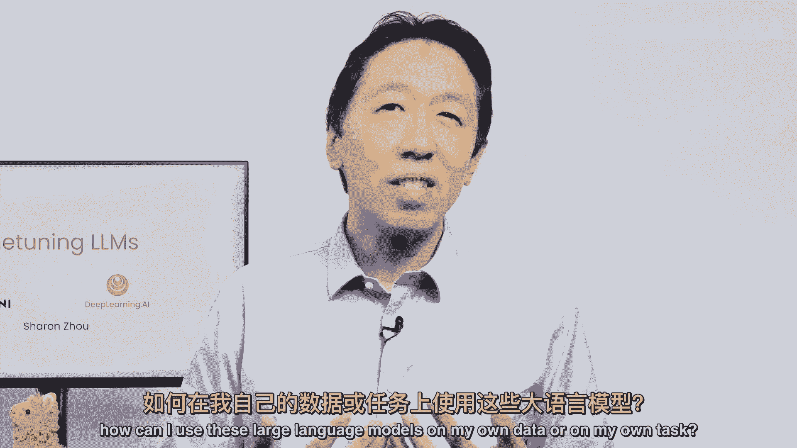
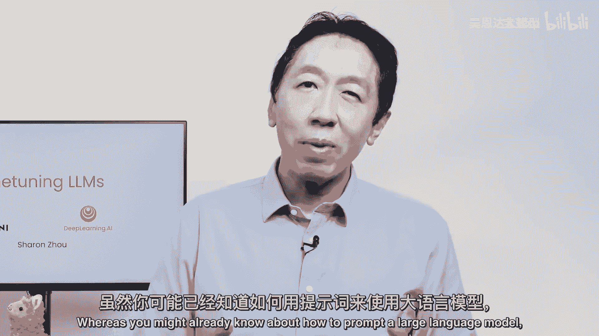
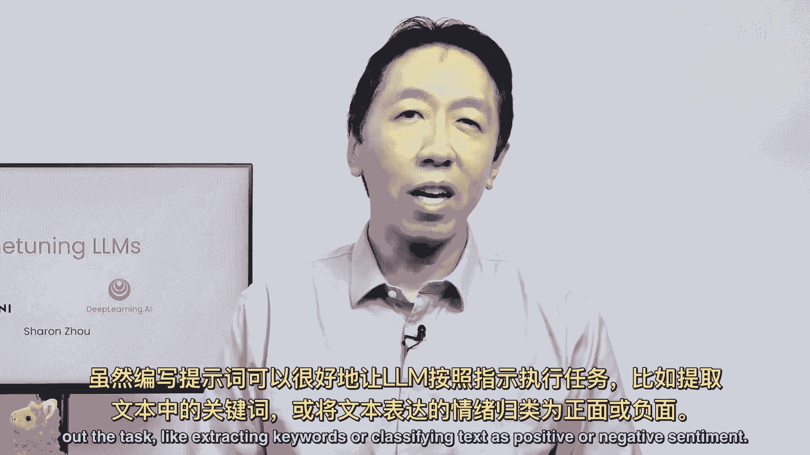
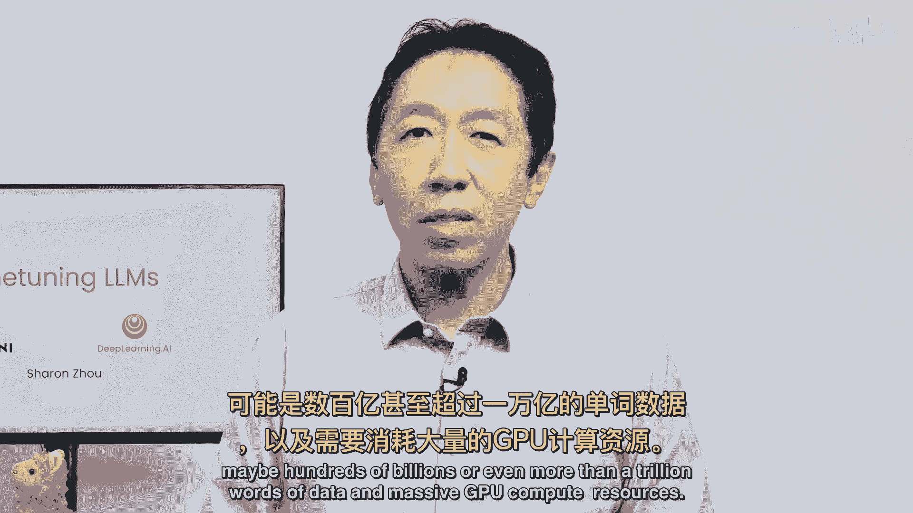
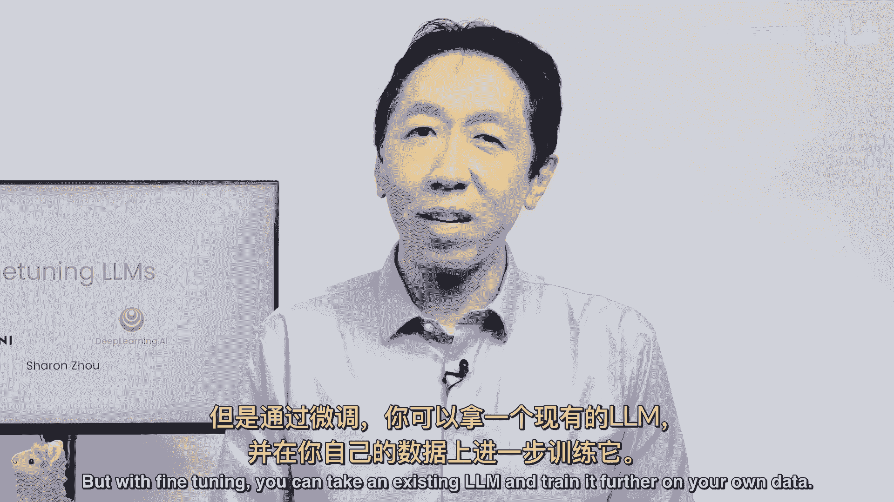
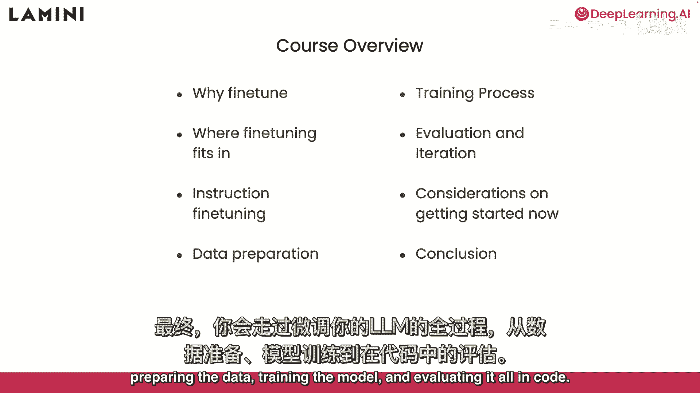
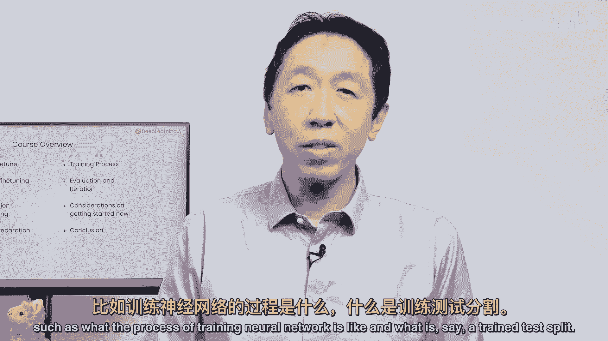
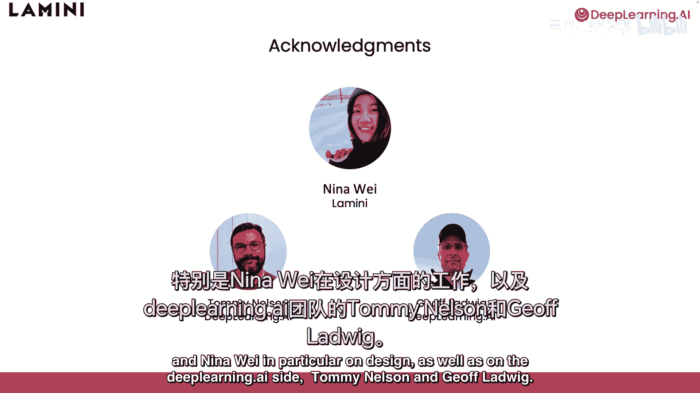

# 001：大语言模型微调之道 🚀

## 概述

在本节课中，我们将要学习大语言模型微调的基本概念。我们将了解什么是微调，它为何重要，以及它如何帮助你利用自己的数据来定制大型语言模型。

你可能已经知道如何通过编写提示词来引导大型语言模型完成任务。这门课程将介绍另一个强大的工具：微调。微调是指在一个已经预训练好的开源模型基础上，使用你自己的数据进行进一步的训练。

## 什么是微调？

上一节我们介绍了微调的基本概念，本节中我们来看看微调的具体作用。

在编写提示词时，你可以让语言模型相当好地遵循指令，来完成诸如提取关键词或将文本分类为积极或消极情感等任务。

如果你对模型进行微调，你可以让它更加一致地执行你期望的任务。我发现，仅通过提示词让模型以特定风格（如更有帮助、更礼貌或更简洁）说话，在某种程度上是具有挑战性的。微调最终是调整模型“语调”的有效方法。

## 微调的应用场景

现在，人们已经认识到像ChatGPT这样的流行大语言模型在回答广泛主题问题上的惊人能力。然而，个人和公司通常希望模型能够处理他们自己的私有和专有数据。

以下是实现这一目标的两种主要方法：

*   **训练一个全新的大语言模型**：这需要海量的数据（可能数百亿甚至上万亿单词）以及巨大的GPU计算资源。
*   **微调现有模型**：你可以选择一个现有的大语言模型，并使用你自己的数据对其进行进一步的训练。这种方法通常更高效、更可行。

## 本课程学习内容

所以在这门课程中，你将学习：

*   微调是什么，以及它可能如何帮助你的应用程序。
*   微调在模型训练流程中的位置，以及它与提示工程或检索增强生成等技术有何不同。
*   如何将这些技术与微调结合使用。
*   深入研究一种特定的微调变体，它使得GPT变得“聊天友好”，被称为**指令微调**。这种微调专门教导大语言模型遵循指令。
*   最后，你将逐步学习如何微调你自己的大语言模型，包括准备数据、训练模型以及在代码中评估模型性能。

## 课程预备知识

这门课程是为熟悉Python的学习者设计的。但要完全理解所有代码，具备一些深度学习的基础知识会更有帮助，例如对训练过程（如神经网络、训练集/测试集划分）的了解。

## 总结

本节课中我们一起学习了微调的核心价值。通过这门短期课程，你将能更深入地理解如何构建属于你自己的语言模型，或者如何让现有的语言模型更好地服务于你的私有数据。

我们想要感谢整个Lamini团队和Nina Wei在课程设计上的努力，以及Tommy和Jeff大约一小时的贡献。