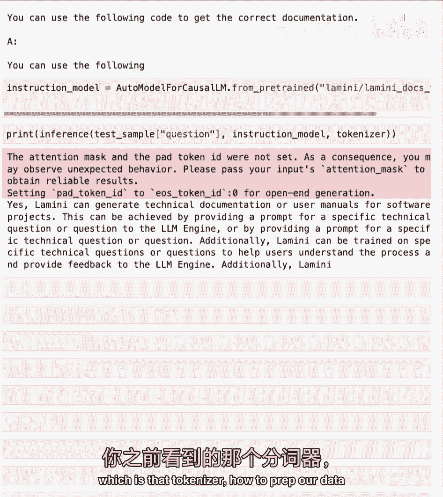
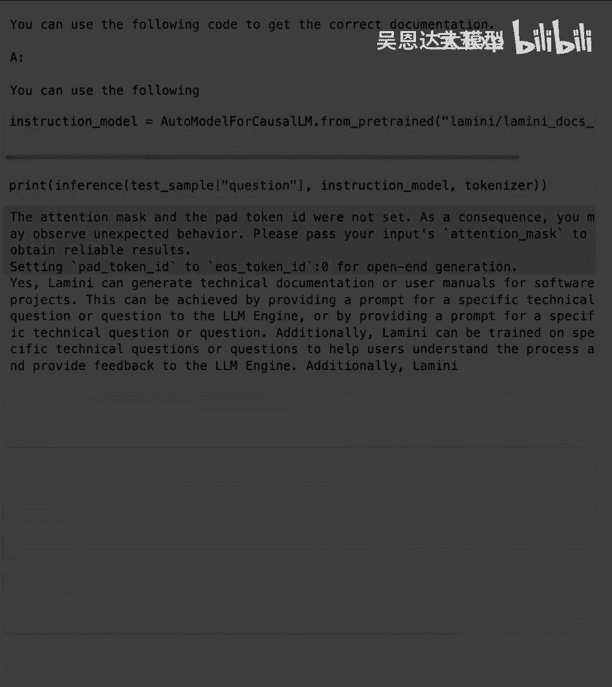

# 004：4-指令微调 - 吴恩达大模型 🧠

## 概述

在本节课中，我们将要学习**指令微调**。这是一种关键的微调技术，它能够将像GPT-3这样的基础语言模型转变为能够进行对话、遵循指令的聊天模型，例如ChatGPT。我们将了解其原理、数据准备方式，并通过实践对比微调前后的模型表现差异。

---

## 什么是指令微调？🎯

上一节我们介绍了微调的基本概念，本节中我们来看看一种特殊的微调类型——指令微调。

指令微调是一种微调类型，其核心目标是**教会大型语言模型遵循人类指令**。通过这种微调，模型能够更好地理解并执行诸如聊天、推理、路由任务、编写代码（Copilot）或扮演不同代理角色等任务。你可能也听过“指令调优”或“指令跟随”等说法，它们指代的是同一概念。

这种技术是与模型交互的更好界面。正如我们在ChatGPT中所见，指令微调是将GPT-3转变为ChatGPT的关键方法。它极大地提升了AI的易用性和普及度，使得AI从少数研究人员的工具，变成了数百万人可以使用的产品。

---

## 指令微调的数据集 📊

了解了指令微调的目标后，我们来看看实现它需要什么样的数据。

对于指令跟随任务，你可以使用多种现成的数据集。这些数据可能来源于网络，也可能是你公司内部的资料，例如：
*   常见问题解答（FAQ）
*   客户支持对话记录
*   Slack等通讯工具中的消息

本质上，这些数据都是**对话数据集**或**指令-响应配对数据集**。

如果你的原始数据不符合这种格式，也无需担心。你可以通过**提示模板**将数据转换成更接近问答或指令跟随的格式。例如，一份“ReadMe”文档可以被转换成一系列问答对。

你甚至可以借助另一个LLM（大型语言模型）来自动完成这种转换。斯坦福大学提出的**Alpaca**技术就使用了ChatGPT来生成指令微调数据。当然，你也可以使用不同开源模型的流程来实现这一点。

---

## 指令微调的优势：行为泛化 🚀

我认为关于指令微调最酷的一点是，它能教会模型一种新的、可泛化的行为模式。

虽然你的微调数据中可能只包含像“法国首都是什么？巴黎。”这样简单的问答对，但模型能够将这种“问答”的概念**泛化**到它从未在微调数据中见过的新问题上。这是因为模型在**预训练**阶段已经学习了大量的世界知识（可能包括代码、事实等）。

一个来自ChatGPT论文的实际发现是：经过指令微调的模型能够回答关于代码的问题，尽管用于微调的数据集中并没有包含关于代码的问答对。这是因为让程序员手动标注大量“提问并编写代码”的数据集成本非常高，而指令微调巧妙地利用了模型已有的知识。

---

## 微调步骤概述 🔄

微调过程通常遵循一个清晰的流程，主要包括以下步骤：

1.  **数据准备**：这是不同微调任务（如指令微调）产生差异的关键环节。你需要根据特定任务定制和转换你的数据。
2.  **训练与评估**：使用准备好的数据对模型进行训练，然后评估其性能。
3.  **迭代改进**：评估模型后，你通常需要再次准备数据、调整训练，以持续改进模型。这是一个迭代过程，对于指令微调尤其如此。

其中，**数据准备**是真正体现不同微调类型特色的地方。而**训练与评估**的流程在不同微调任务中则非常相似。

---

## 实践：探索指令微调数据集 🧪

现在让我们深入实践，通过代码一窥指令微调数据集（以Alpaca为例）的样貌，并比较经过与未经过指令微调的模型表现。

首先，我们需要导入必要的库。

```python
# 导入库
from datasets import load_dataset
```

我们将加载Alpaca指令微调数据集。由于数据集较大，我们使用流式传输方式加载。

```python
# 加载Alpaca数据集
dataset = load_dataset("tatsu-lab/alpaca", streaming=True)
```

与PILE等纯文本数据集不同，指令微调数据集的结构更清晰。Alpaca数据集的作者设计了两类提示模板，以让模型能处理两种任务：
*   **带有输入的指令遵循**：指令和额外的输入信息（例如：“加两个数字”，输入：“第一个数字是3，第二个数字是4”）。
*   **不带有输入的指令遵循**：仅有指令。

以下代码展示了如何查看数据集中的一个样本，以及如何将提示模板“水化”（填充）成完整的输入。

```python
# 查看数据集示例
for example in dataset["train"].take(1):
    print(example)

# 提示模板示例（概念性代码）
# 模板1（有输入）: “Below is an instruction...\n### Instruction:\n{instruction}\n### Input:\n{input}\n### Response:\n”
# 模板2（无输入）: “Below is an instruction...\n### Instruction:\n{instruction}\n### Response:\n”
```

你可以将处理好的数据写入文件，并上传至Hugging Face Hub。我们已经准备好了一个名为`lamini/alpaca`的稳定版本供大家使用。

---

## 实践：模型表现对比 ⚖️

现在，我们已经了解了指令数据集的样子。接下来，我们通过一个具体的提示词，来对比不同模型的表现。

我们使用的提示词是：**“告诉我如何训练我的狗坐下”**。

**1. 未经指令微调的模型（以LLaMA 2为例）**
未经微调的模型可能无法理解这是一个指令，其回答可能不连贯或偏离主题，例如以句号开头或生成无关文本。

**2. 经过指令微调的模型**
经过指令微调的模型能够理解这是寻求指导的请求，并可能生成一系列清晰的步骤，例如：“1. 准备零食... 2. 发出‘坐下’口令...”。

**3. 与ChatGPT对比**
你还可以将其与ChatGPT（一个参数量大得多的、经过精调的商业模型）的回答进行对比，观察不同规模指令微调模型的差异。

为了更具体地展示，我们加载一个较小的、未经指令微调的模型（例如7000万参数的Pythia模型），并向它提问我们之前公司数据集中的问题。

```python
# 示例：向未经微调的模型提问
question = “Lamini能否为软件项目生成技术文档或用户手册？”
# 模型可能产生的偏离答案：“我对以下问题有疑问，如何获取正确的工作文档...”
```

模型虽然学习了“文档”这个词，但并不理解问题的上下文和我们期望的问答行为，因此回答是偏离的。

现在，我们加载一个经过指令微调的模型，并向它提出同样的问题。

```python
# 示例：向经过指令微调的模型提问
# 模型可能产生的准确答案：“可以，Lamini可以为软件项目生成技术文档或用户手册...”
```

经过指令微调的模型能够遵循我们期望的行为，给出准确得多的答案。

---

## 总结 📝



本节课中我们一起学习了**指令微调**。我们了解到：
*   指令微调是一种通过训练使模型学会遵循人类指令的关键技术。
*   它需要**指令-响应**配对格式的数据，这些数据可以从多种来源转换而来。
*   其强大之处在于能够**泛化**出一种新的交互行为，而不仅仅记忆训练数据。
*   微调过程包括**数据准备、训练评估和迭代改进**三个主要阶段。
*   通过实践，我们直观地对比了经过与未经过指令微调的模型在理解指令和生成响应上的显著差异。



理解指令微调，是掌握如何定制和提升大型语言模型对话与任务执行能力的重要一步。在接下来的课程中，我们将继续探索其他微调技术和应用。