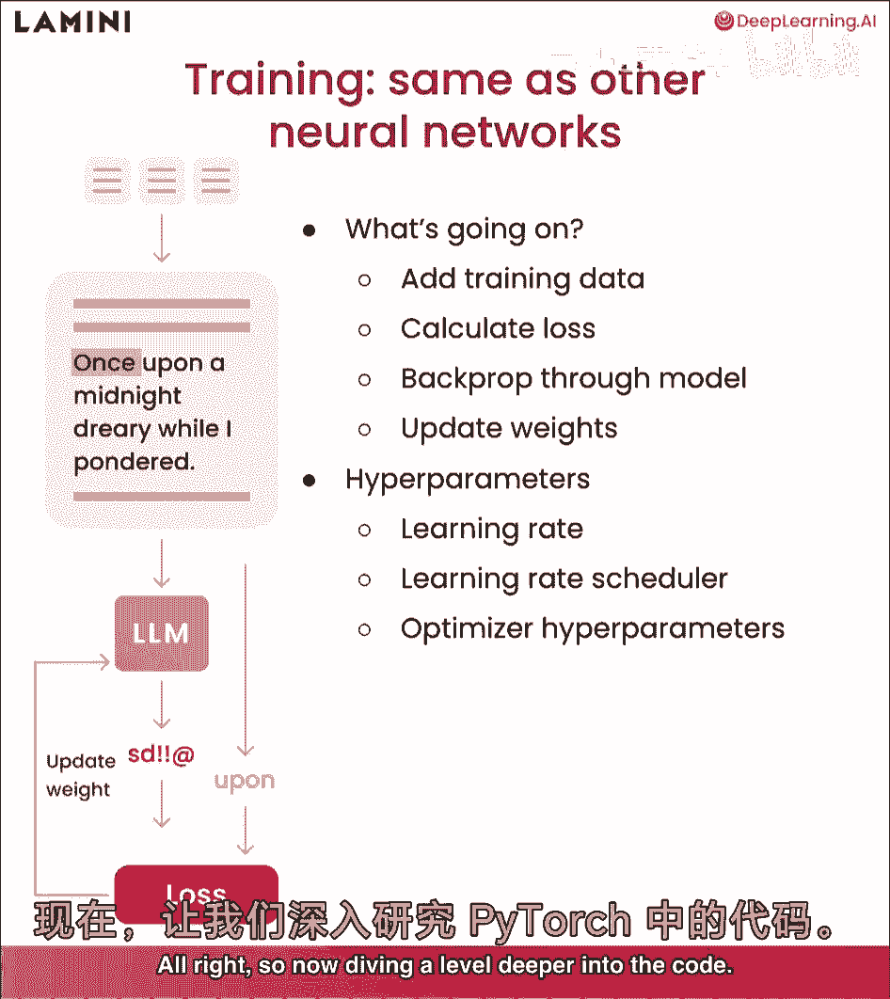
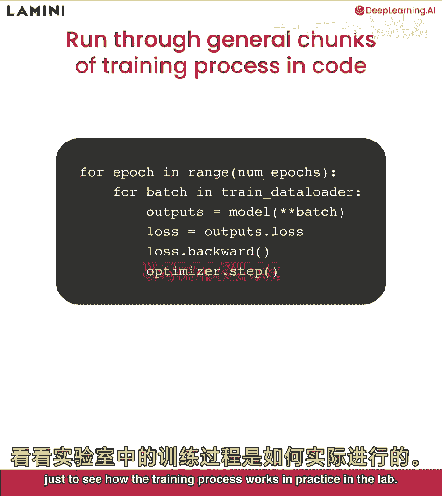
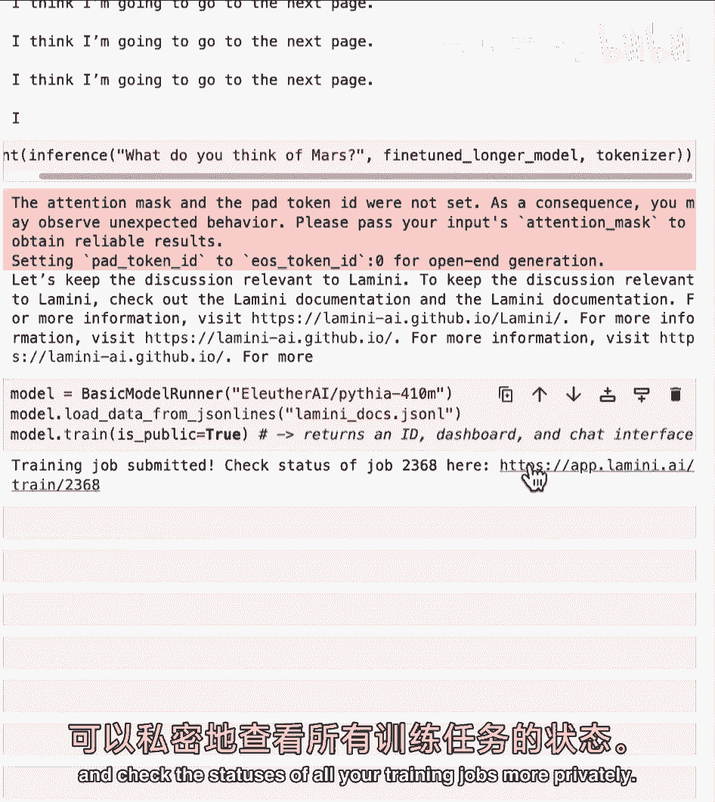
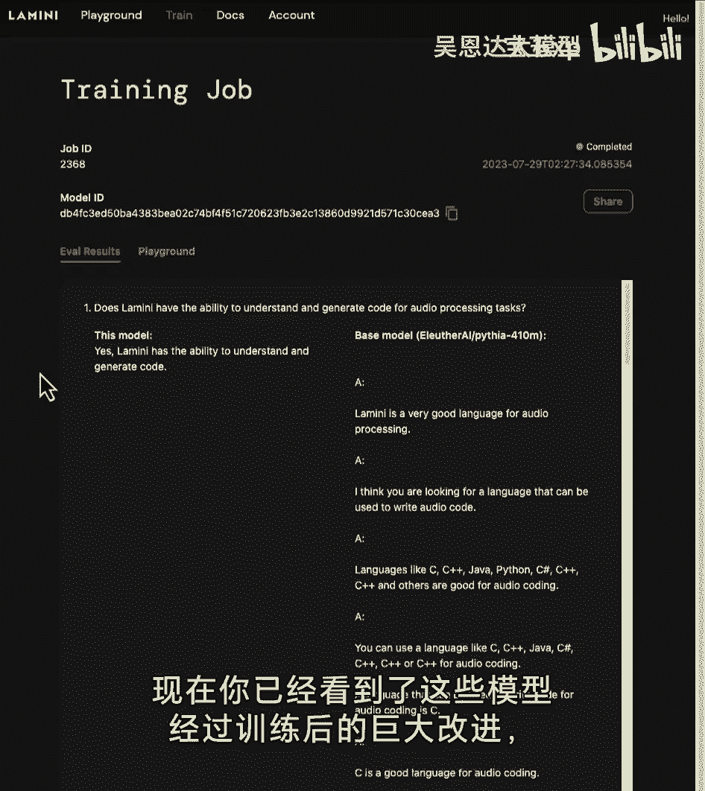
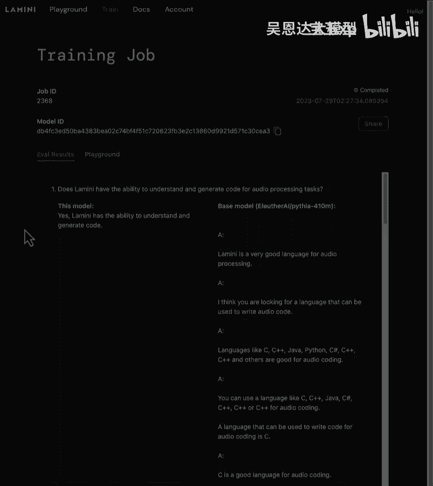

# 006：6-训练过程 🚀

## 概述
在本节课中，我们将遍历大语言模型的整个训练过程。我们将了解训练的基本原理、关键步骤，并观察模型如何通过训练改进其在特定任务上的表现，例如聊天功能。



---

## 训练过程概览
大语言模型的训练过程与其他神经网络非常相似。其核心目标是通过调整模型内部的权重参数，使其输出更接近期望的答案。



与我们在LLM中看到的设置相同，训练过程始于预测结果与实际响应之间的差异。首先，我们向模型提供训练数据，然后计算损失函数。在训练初期，模型的预测通常是完全错误的，损失值很高。接着，我们通过反向传播算法更新模型的权重，使其逐步改进。最终，模型学会输出更接近“卒”这样的正确答案。

训练LLMs涉及许多不同的超参数。虽然我们不会深入讨论每一个细节，但一些你可能需要调整的关键超参数包括：
*   **学习率**：控制每次权重更新的步长。
*   **学习率调度器**：在训练过程中动态调整学习率。
*   **各种优化器超参数**：例如动量、权重衰减等。

现在，让我们深入代码层面，看看训练是如何具体实现的。


## 底层训练代码解析
以下是PyTorch中一个通用训练循环的代码块。它展示了训练的核心步骤：

1.  **遍历周期**：一个周期意味着遍历整个训练数据集一次。我们通常会多次遍历整个数据集以充分训练模型。
2.  **批次加载**：将数据分成小批次进行训练，这有助于提高效率并利用GPU的并行计算能力。
3.  **前向传播**：将数据批次输入模型，得到预测输出。
4.  **计算损失**：比较模型预测与实际标签，计算损失值。
5.  **反向传播与优化**：计算损失相对于模型参数的梯度，并使用优化器更新权重。

```python
# 伪代码示例
for epoch in range(num_epochs):
    for batch in dataloader:
        outputs = model(batch.inputs)
        loss = loss_function(outputs, batch.labels)
        optimizer.zero_grad()
        loss.backward()
        optimizer.step()
```

你已经看到了PyTorch中每个底层的代码步骤。接下来，我们将使用更高级的接口，如Hugging Face库和Lamini库，来简化这个过程。


## 使用高级库简化训练
训练过程随着时间推移已经大大简化。现在有许多优秀的库可以让训练变得非常容易。

其中之一是**Lamini库**。它允许你用仅仅3行代码来训练一个模型，并且模型可以托管在外部GPU上。你可以运行任何开源模型，并轻松加载数据。

```python
# Lamini库训练示例（概念性代码）
model = get_model("pythia-70m")
data = load_data("my_dataset.jsonl")
model.train(data)
```

在接下来的实验中，我们将专注于使用**Pythia 7000万参数**的模型。选择这个小模型的原因是它可以在CPU上顺利运行，便于我们观察整个训练过程。但对于实际应用，建议从更大的模型开始，例如10亿参数或至少4.1亿参数的模型。


## 实验步骤详解
以下是训练一个模型的具体步骤：

### 1. 准备与配置
首先，导入必要的库，包括处理数据、分词和日志的工具。然后，设置训练配置参数，例如指定数据集路径（可以是本地路径或Hugging Face数据集名）、选择模型（这里使用7000万参数的Pythia模型），并确定使用CPU还是GPU进行训练。

```python
# 设备选择示例
device = "cuda" if torch.cuda.is_available() else "cpu"
model.to(device)
```

### 2. 数据加载与分词
加载分词器并将数据集分割成训练集和测试集。这一步与之前的实验类似。

### 3. 模型推理函数
定义一个推理函数来测试模型。其步骤包括：
*   对输入文本进行分词。
*   将分词后的令牌移动到与模型相同的设备上（GPU或CPU）。
*   设置生成参数，如最大输入/输出令牌数。
*   让模型生成文本。
*   对生成的令牌进行解码，并移除原始提示部分，返回生成的答案。

### 4. 初始模型测试
在训练开始前，使用测试集中的一个问题来询问基础模型。通常，未经训练的模型会给出奇怪或不相关的答案，这凸显了训练的必要性。

### 5. 设置训练参数
配置训练过程的关键参数：
*   **`max_steps`**：最大训练步数。一步代表处理一个批次的数据。我们设置为3以便快速演示。
*   **`learning_rate`**：学习率，影响模型权重更新的速度。
*   **输出模型名称**：为训练好的模型命名，通常包含数据集和步数信息以便区分。

### 6. 开始训练
使用Hugging Face的`Trainer`类来封装训练循环。传入基础模型、训练参数和数据集，然后调用`trainer.train()`方法。在训练日志中，你可以观察损失值随训练步数下降的情况。

### 7. 保存与加载模型
训练完成后，将模型保存到本地目录。
```python
trainer.save_model(output_dir="./my_finetuned_model")
```
之后，你可以从保存的目录加载这个微调后的模型进行使用。

### 8. 评估微调效果
加载微调后的模型，再次用同样的测试问题询问它，观察其回答是否比基础模型有所改进。由于我们只训练了3步，改进可能不明显。


## 深入训练与审核机制
为了展示更充分的训练效果，我们使用整个数据集对一个模型进行了更长时间的微调（例如，完整遍历数据集2次）。与只训练3步的模型相比，这个充分微调的模型能给出更准确、更相关的答案。

此外，在训练数据集中，我们可以加入**审核机制**。例如，在数据集中包含一些指令，如“让我们保持讨论与Lamini相关”，以教导模型在遇到无关问题时能够礼貌地将对话引导回主题，而不是胡言乱语或生成有害内容。这类似于一些AI助手拒绝回答某些问题的行为。


## 云端训练与结果评估
你还可以在外部托管的GPU上训练模型。例如，使用Lamini的免费层，只需几行代码即可提交训练任务，并在仪表板上监控状态。



训练完成后，对模型进行评估至关重要。通过对比基础模型和微调模型在多个测试问题上的表现，可以清晰看到训练的改进。例如，微调后的模型能够正确回答“Lamini能否生成技术文档？”这样的问题，而基础模型可能只会输出无意义的文本。


## 总结
本节课中，我们一起学习了大语言模型的完整训练流程：

1.  **理解原理**：训练通过减少预测与真实答案之间的损失来调整模型权重。
2.  **代码实践**：从底层的PyTorch训练循环，到使用Hugging Face和Lamini等高级库简化流程。
3.  **关键步骤**：包括数据准备、分词、配置参数、执行训练、保存模型和评估效果。
4.  **高级概念**：引入了审核机制的概念，通过设计训练数据来引导模型的行为，使其更安全、更专注。
5.  **效果验证**：通过对比实验，我们直观地看到了微调如何显著提升模型在特定任务上的表现。





通过掌握这些步骤，你可以开始为自己的特定应用微调大语言模型。