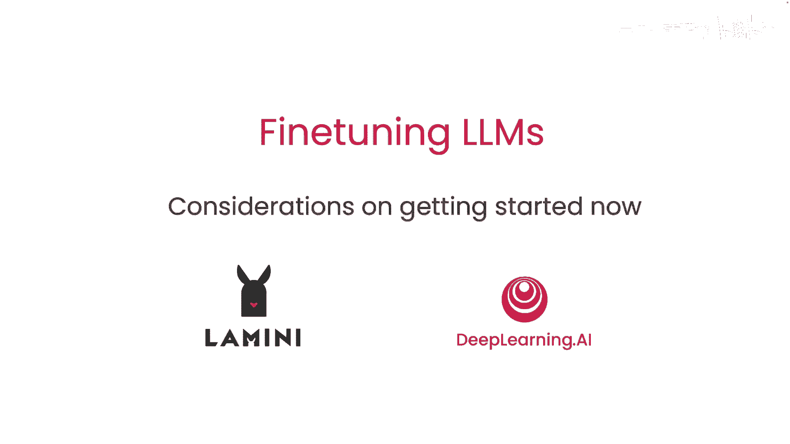
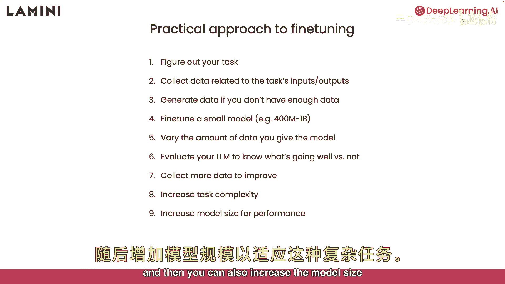
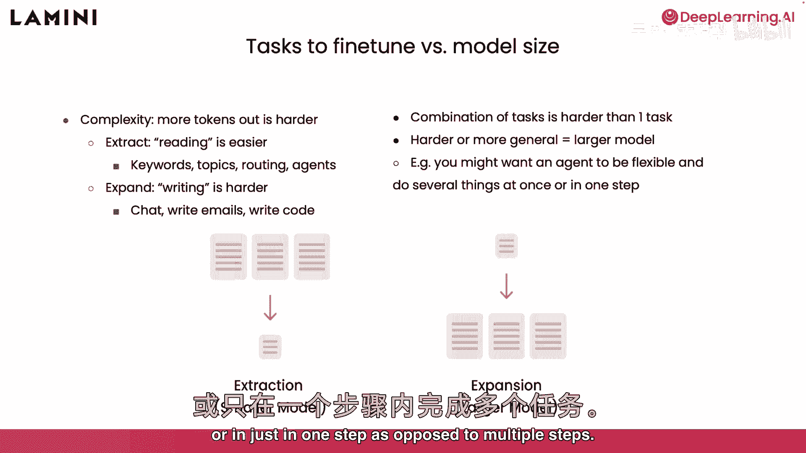
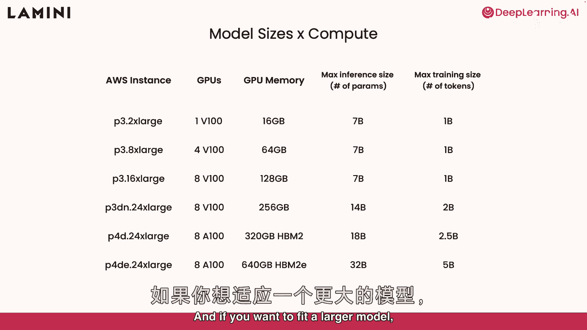
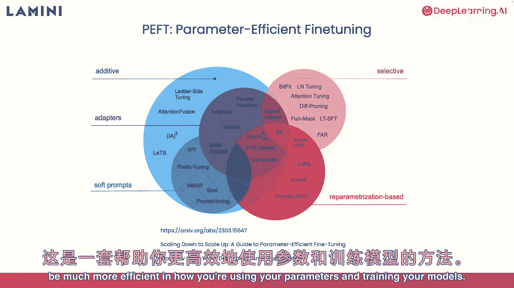
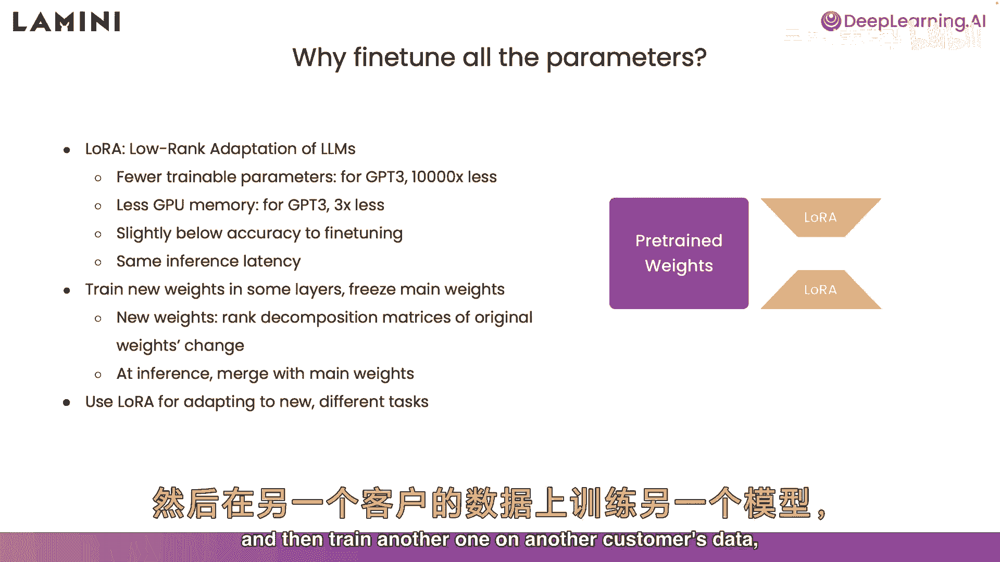

# 008：8-建议和实用技巧 🚀



在本节课中，我们将学习微调大型语言模型的实用步骤、评估任务复杂度与模型规模的关系，并预览一种高效的微调方法。这些知识将帮助你更有效地启动和优化自己的模型微调项目。

## 微调步骤概览 📋

上一节我们介绍了微调的基本概念，本节中我们来看看具体的实施步骤。微调过程可以总结为以下几个关键阶段。

以下是微调的核心步骤列表：
1.  **确定任务**：明确模型需要完成的具体目标。
2.  **收集数据**：获取与任务相关的输入和输出数据，并按此结构进行组织。
3.  **扩充数据**：如果数据不足，可以通过生成或使用提示模板来创建更多数据。
4.  **初步微调**：首先微调一个参数规模较小（例如4亿到10亿参数）的模型，以评估基础性能。
5.  **调整数据量**：改变用于训练的数据量，观察其对模型性能的影响。
6.  **评估模型**：对微调后的模型进行评估，了解其表现。
7.  **迭代优化**：根据评估结果收集更多数据，以持续改进模型。

完成上述基础步骤后，你可以通过增加任务复杂度或使用更大规模的模型来进一步提升性能。



## 任务复杂度与模型规模 ⚖️

在任务微调中，我们了解到不同任务对模型的要求不同。例如，写作类任务（如聊天、写邮件、写代码）通常比阅读类任务更难，因为模型需要生成更多标记。

更难的任务往往需要更大的模型才能有效处理。另一种增加任务复杂度的方法是组合任务，即让模型同时处理多个步骤或完成复合型指令，这比执行单一任务更具挑战性。



## 硬件与计算要求 💻

现在你对任务复杂度与所需模型规模有了基本概念，接下来我们看看相应的计算要求。这主要涉及运行模型所需的硬件。

例如，一张具有16GB内存的V100 GPU（在AWS等云平台可用）可以运行70亿参数的模型。但在训练时，由于需要存储梯度等中间变量，实际可能只能适配约10亿参数的模型进行微调。

## 高效微调方法预览：LoRA 🎯



如果你需要处理更大的模型，但硬件资源有限，可以考虑参数高效微调方法。这类方法能帮助你更高效地利用参数和计算资源进行训练。

其中一种广受欢迎的方法是 **LoRA**。



> LoRA 代表低秩适应。它能显著减少需要训练的参数数量。例如，对于GPT-3，LoRA可将训练参数量减少约1万倍，仅需约3倍于基础模型的内存，且推理延迟不变。虽然精度可能略低于全参数微调，但它是一种非常高效的方法。

LoRA 的工作原理是在模型的部分层中训练新的、低秩的权重矩阵（图中橙色部分），同时冻结主要的预训练权重（蓝色部分）。

```python
# 概念性示意：更新公式
更新后的权重 = 原始预训练权重 + (低秩矩阵A * 低秩矩阵B)
```

你可以单独训练这些新增的低秩权重，而不更新庞大的原始权重。在推理时，可以将这些低秩适配器权重合并回原始模型中，从而得到一个针对特定任务优化的模型。

使用LoRA最令人兴奋的一点是便于适应新任务。你可以用LoRA在客户A的数据上训练一个适配器，在客户B的数据上训练另一个适配器，然后在推理时根据需要动态切换或合并，实现灵活的多任务适配。

---



**本节课总结**：我们一起学习了微调大语言模型的完整步骤流程，理解了任务难度与模型规模、硬件需求之间的关系，并初步了解了LoRA这种参数高效的微调技术。掌握这些建议和技巧，将为你实际开展模型微调项目打下坚实的基础。