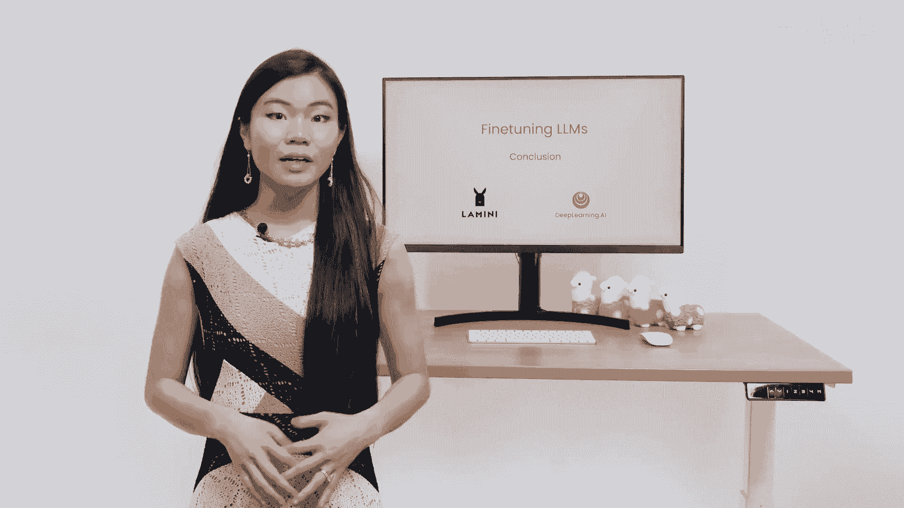

# 009：9-总结 🎯

在本节课中，我们将对微调大语言模型（LLM）的整个流程进行总结，回顾从数据准备到模型评估的关键步骤，并理解微调在生成式AI应用中的重要性。

---

上一节我们介绍了模型评估的具体方法，本节中我们将对整个微调过程进行回顾与总结。

现在，你已经理解了微调是什么，它在哪里适用，以及为什么它重要。微调已经成为你工具箱中的一部分。你已经完成了所有不同的步骤，从数据准备到训练，再到评估模型。

以下是微调流程的核心步骤回顾：

1.  **数据准备**：收集并整理高质量的示例数据对，这是微调成功的基石。
2.  **模型训练**：使用准备好的数据对基础模型进行有监督的微调，使其适应特定任务。
3.  **模型评估**：在独立的测试集上评估微调后模型的性能，确保其达到预期目标。

---

微调的核心优势在于，它能让一个通用的基础模型（如 `base_model`）通过学习特定领域或任务的数据（`training_data`），转变为一个专精的模型（`fine_tuned_model`）。这个过程可以用一个简化的公式表示：

**`fine_tuned_model = base_model + training_data`**

通过这个流程，模型能够更准确、更可靠地执行你希望它完成的具体工作，例如生成特定格式的文本、遵循复杂的指令或在专业领域进行问答。

---

本节课中我们一起学习了微调大型语言模型的完整生命周期。我们回顾了从最初的数据准备，到关键的训练阶段，再到最终的性能评估这一系列步骤。掌握微调技术，意味着你能够将强大的通用AI模型定制成解决你独特问题的专用工具，这是在构建高级生成式AI应用（如基于RAG的智能体）时不可或缺的一项核心技能。