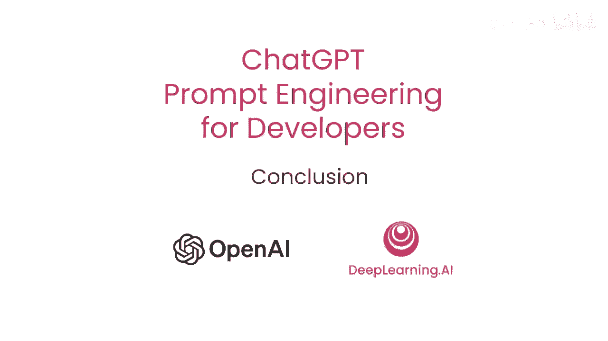
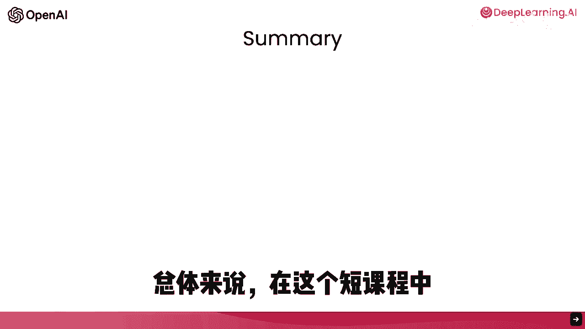
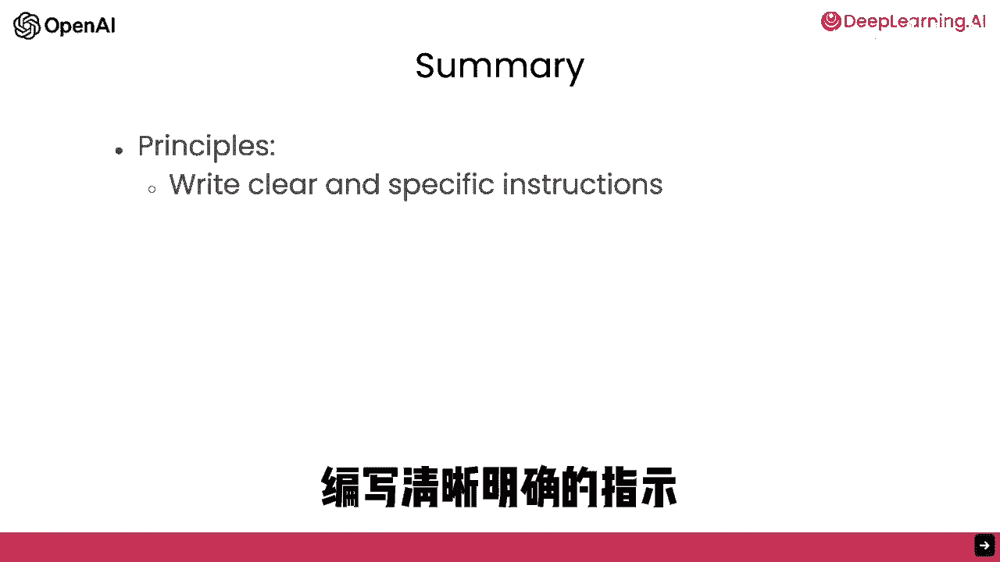
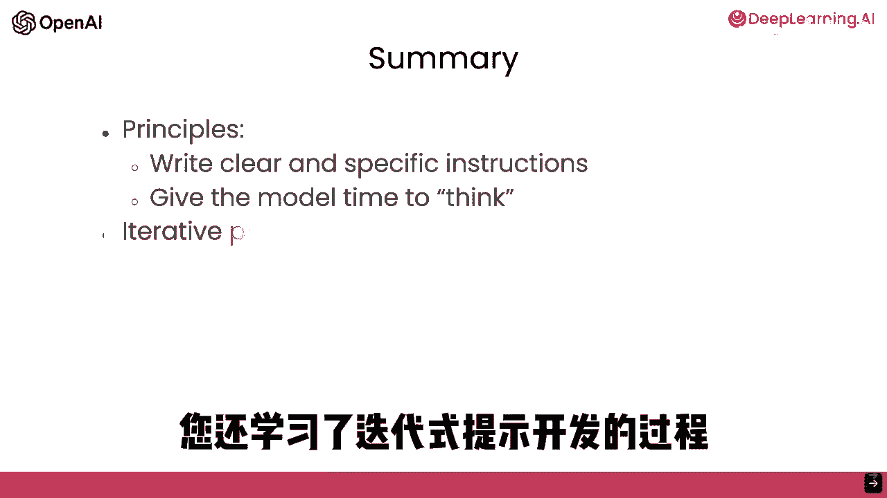
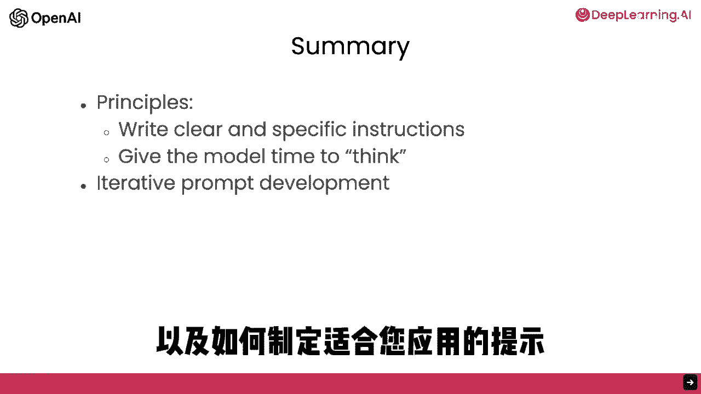
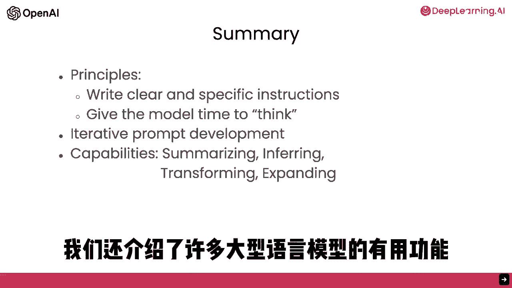
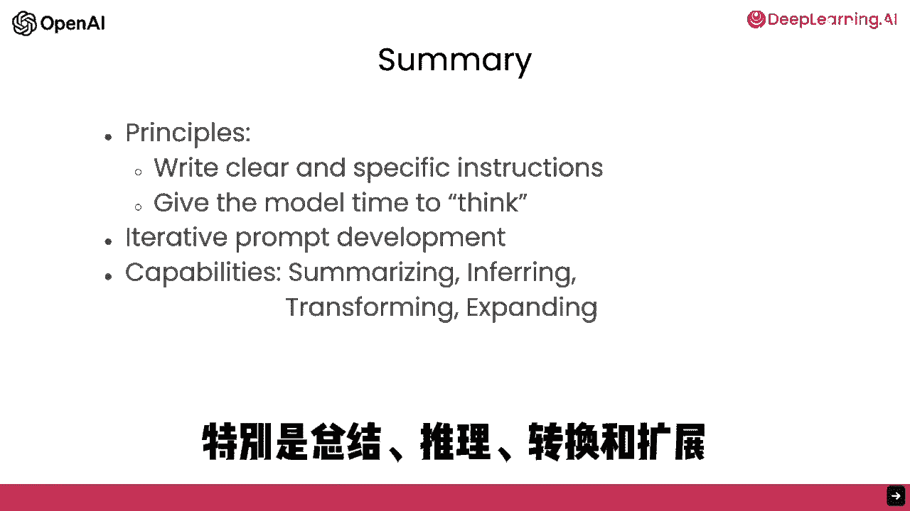

# 018：第9集 总结 🎯

在本节课中，我们将对之前学习的所有核心概念进行回顾与总结，梳理构建大型语言模型应用的关键原则、能力与实践路径。

---

恭喜你完成这个简短课程的所有部分。

总的来说，在这个简短的课程中，你学习了关于如何引导大型语言模型的两个关键原则：**写清楚和具体的指令**，并且在适当的时候，**给模型时间来思考**。

你还学习了**迭代式提示的开发**，以及拥有一个为你的应用获取有效提示的过程的重要性，这对于构建成功的应用至关重要。

上一节我们回顾了提示工程的核心原则，本节中我们来看看大型语言模型所具备的一些通用能力。

然后我们了解了大型语言模型的一些适用于许多应用的有用能力，特别是**总结**、**推断**、**变换**和**扩展**。

你也看到了如何构建一个定制的聊天机器人。在短短的课程中就学到了这么多内容，这非常了不起。

我希望你享受浏览这些材料的过程。我们希望你能从中获得灵感，想出一些可以自己构建的应用程序的想法。

以下是关于如何开始实践的一些建议：
*   请去尝试实践，并让我们知道你的想法。
*   你提出的应用程序再小也不为过。从你知道的做起，从一个稍微小的项目开始。
*   项目可能有一点实用性，或者甚至一点用都没有，但它可以是一件有趣的事情。我发现与这些模型互动实际上真的很有趣，所以去探索吧。

我同意，这是一个从实践中学习的绝佳周末活动。请使用你在第一个项目中学到的经验来构建一个更好的第二个项目，或许还能构建出更好的第三个项目，以此类推。

这就是我如何随着时间的推移，在使用这些模型的过程中自己也有所成长的方式。

或者，如果你已经有一个更大的项目想法，就只管去做。

以下是关于负责任地使用技术的重要提醒：
*   作为一种提醒，这种大型语言模型是一种非常强大的技术，因此我们希望你们负责地使用它们。
*   请只建造会对他人产生积极影响的东西。

我完全同意。我认为在这个时代，构建人工智能系统的人可以对他人产生巨大的影响。因此，我们现在比以往任何时候都更需要我们只负责地使用这些工具。

我认为基于大型语言模型的应用程序开发是一个非常激动人心且正在迅速增长的领域。现在，你已经完成了这门课程，我认为你拥有了大量的知识，这些知识可以让你建造出今天很少有人知道如何建造的应用。

所以我希望你们也能帮助我们传播这个消息，鼓励他人参加这门课程。

最后，我希望你在完成这门课程时过得愉快。我想感谢你完成这门课程。

---

**本节课中我们一起学习了**：构建大型语言模型应用的两大核心原则（清晰的指令与给予思考时间）、迭代式提示开发的重要性、模型的四大关键能力（总结、推断、变换、扩展）以及定制聊天机器人的构建。更重要的是，我们探讨了如何负责任地开启你的AI应用构建之旅，鼓励大家从实践中学习，并积极创造对社会有积极影响的作品。