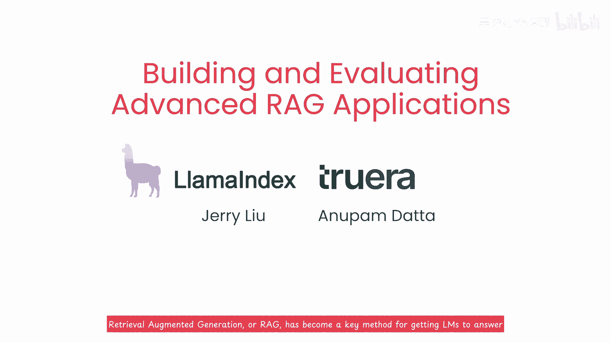

# 019：《构建和评估高级的RAG模型应用》🚀

## 概述

在本节课中，我们将要学习如何构建和评估一个高质量的检索增强生成（RAG）系统。我们将介绍两种高级检索方法，以及一套用于系统化评估和改进RAG应用的指标框架。

---

## 1. 开篇介绍

检索增强生成（RAG）已成为让大型语言模型（LLM）基于用户自有数据回答问题的关键技术。然而，要构建并维护一个生产级别的高质量RAG系统，需要有效的检索技术来为模型提供高度相关的上下文，同时也需要一个有效的评估框架来帮助迭代和改进系统。

本课程将涵盖两种能提供比简单方法更好上下文的高级检索方法：**句子窗口检索**和**自动合并检索**。同时，我们也将学习如何用三个核心评估指标来评估你的LLM问答系统。

很高兴向大家介绍Jerry，他是Jerryu的联合创始人兼CEO，也是True Era的新数据联合创始人兼首席科学家。他长期关注并分享RAG实践的前沿进展。此外，我们还有一位来自CMU的教授，他在可信AI领域的研究已超过十年，专注于如何监控、评估和优化AI系统的效果。

---

## 2. 高级检索方法

上一节我们介绍了构建高质量RAG系统的重要性。本节中，我们来看看两种能够提升检索质量的具体方法。

### 句子窗口检索

这种方法通过检索与问题最相关的句子及其**前后窗口**的文本，来提供更连贯、信息更丰富的上下文，而不仅仅是孤立的单个句子。

### 自动合并检索

这种方法将文档组织成**树状结构**。每个父节点的文本被分配给其子节点。当系统无法识别出足够相关的子节点时，它会将父节点的全部文本作为上下文。这种方法能动态地获取更合适大小的文本块。

虽然听起来步骤较多，但别担心，我们将在代码中详细讲解。主要收获是，这些方法提供了比基础检索更有效的上下文获取策略。

---

## 3. RAG系统评估指标

仅仅拥有好的检索方法还不够，我们还需要系统化的评估来指导改进。以下是用于评估RAG系统的三个核心指标，它们构成了“RAG三元组”。

**RAG三元组**：这是一套专门用于评估RAG应用执行效果的三个指标。

1.  **上下文相关性**
    *   **公式/概念**：`评估(检索到的文本块， 用户问题)`
    *   这衡量的是检索到的文本块与用户问题的**相关性**如何。它帮助你识别和调试系统在检索上下文时可能出现的问题。

2.  **事实性**
    *   这衡量LLM生成的答案是否基于检索到的上下文，即答案是否“**有据可依**”，防止模型产生幻觉。

3.  **答案相关性**
    *   这衡量生成的答案与原始用户问题的**匹配程度**，确保答案直接回应了问题。

通过系统化地分析这三个指标，你可以清楚地了解系统哪些部分有效，哪些部分还需要改进，从而能够有针对性地优化最需要工作的环节。采取这种系统化方法能让你更有效地构建可靠的QA系统。

---

## 4. 课程目标与实践

这门课程的最终目标是帮助你构建**生产就绪**的、基于RAG的LLM应用。使系统达到生产级别的一个重要部分是**系统化迭代**。

在课程的后半部分，你将通过实际操作获得以下经验：
*   尝试使用句子窗口检索或自动合并检索来构建问答系统。
*   比较不同检索方法在“RAG三元组”指标上的性能。
*   学习如何使用系统实验跟踪来建立基线，并快速迭代改进。
*   获得一些来自实践经验的、关于构建RAG应用的建议。

---

## 总结

本节课中，我们一起学习了构建高级RAG系统的关键要素。我们介绍了两种能提供更优质上下文的检索方法：**句子窗口检索**和**自动合并检索**。更重要的是，我们学习了用于系统化评估的 **“RAG三元组”指标**——**上下文相关性、事实性和答案相关性**。掌握这些方法和评估框架，将使你能够更有条理地开发、优化和维护一个健壮的生产级RAG应用。

下一课我们将概述课程其余部分的具体内容。准备好动手实践，真正掌握这些RAG技术吧。