# 020：2. 第一篇 - 先进的RAG管道(Advanced RAG Pipeline) 🚀

## 概述

在本节课中，我们将学习如何设置基本和高级的检索增强生成（RAG）管道。课程将涵盖使用LlamaIndex构建RAG管道、加载评估基准、使用TruLens定义评估指标，并将高级RAG技术与基准或基础管道进行性能对比。

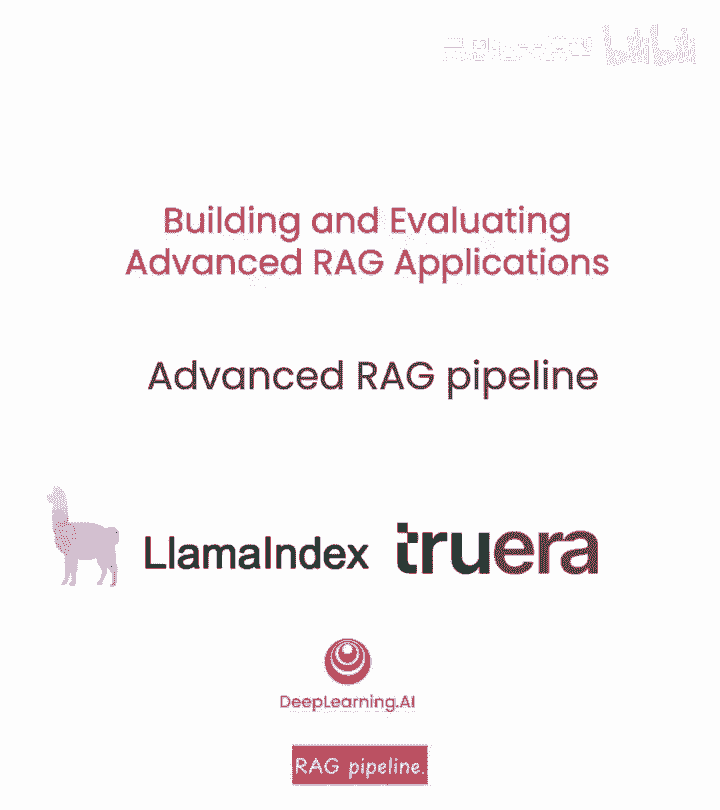

在接下来的几节中，我们将深入探索每个部分。现在，让我们首先了解如何设置一个基础的RAG管道。

## RAG管道的基本工作流程

一个基础的RAG管道由三个主要部分组成：**摄入**、**检索**和**合成**。


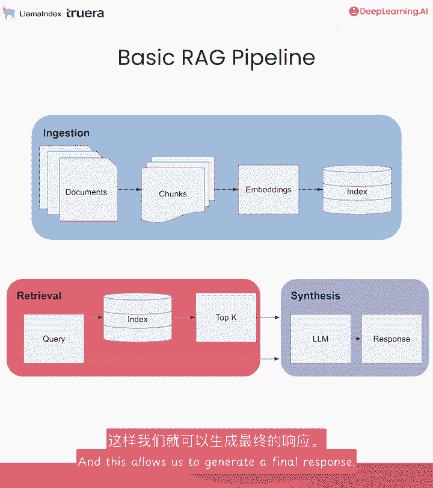

### 1. 摄入阶段
在摄入阶段，我们执行以下步骤：
*   首先，加载一套文档。
*   将每个文档分割成一系列文本块。
*   对于每个文本块，使用嵌入模型生成其向量表示。
*   将每个带有嵌入向量的文本块存储到索引中（例如，向量数据库）。

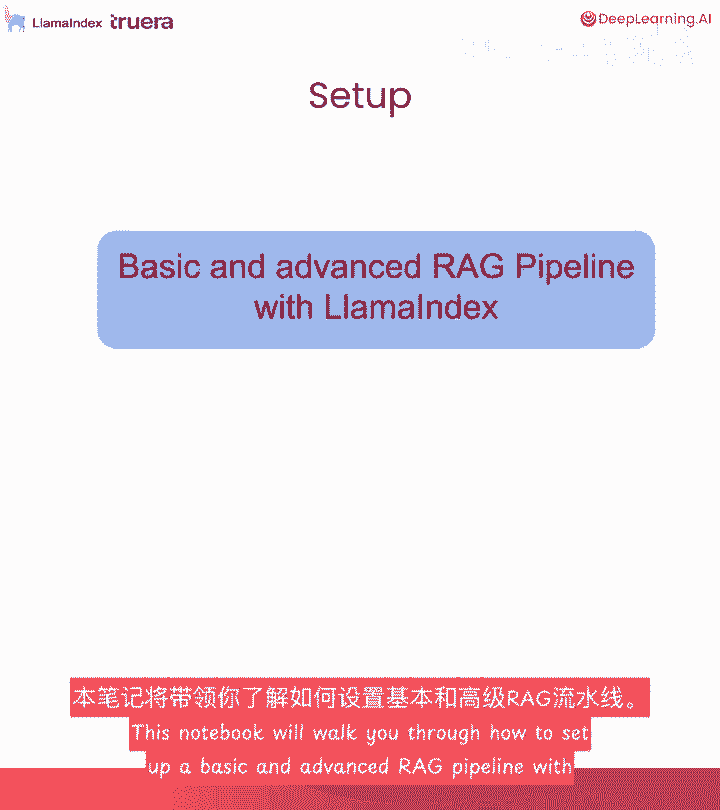

### 2. 检索阶段
数据存入索引后，进入检索阶段：
*   向索引发送用户查询。
*   检索与用户查询最相似的前K个文本块。

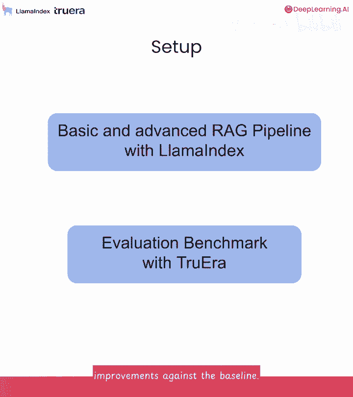

### 3. 合成阶段
最后，在合成阶段：
*   将检索到的相关文本块与用户查询结合。
*   将组合后的内容放入大语言模型（LLM）的提示窗口中，生成最终响应。

## 实践：设置基础RAG管道

本笔记本将引导你如何使用LlamaIndex设置基础和高级的RAG管道。


我们还将使用TruLens来帮助设置评估基准，以便我们可以测量改进效果。

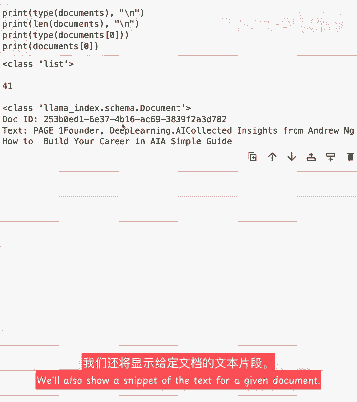


### 准备工作
对于本快速入门，你需要OpenAI API密钥。请注意，本课程将使用一组辅助函数来帮助你快速启动，我们将在后续课程中深入研究这些部分。

接下来，我们将使用LlamaIndex创建一个简单的LLM应用，它内部使用OpenAI的LLM。数据源方面，我们将使用Andrew撰写的关于“如何构建AI职业生涯”的PDF。你也可以上传自己的PDF文件。

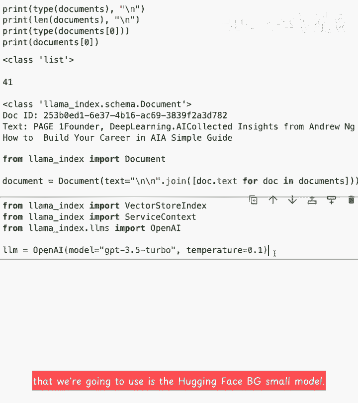

### 加载与检查文档
首先，进行一些基本的合理性检查，以了解文档的内容和长度。

```python
# 示例代码：加载并检查文档
documents = load_documents(“path/to/your/pdf”)
print(f”文档列表长度: {len(documents)}”)
print(f”第一个文档的片段: {documents[0].text[:500]}”)
```

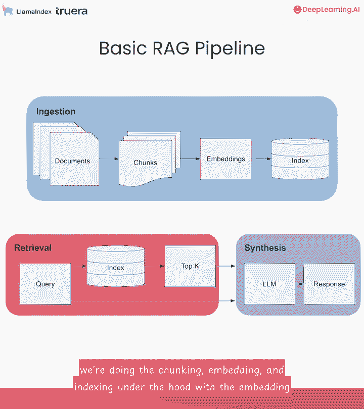

我们看到有一个包含41个元素的文档列表。列表中的每一项都是一个文档对象。

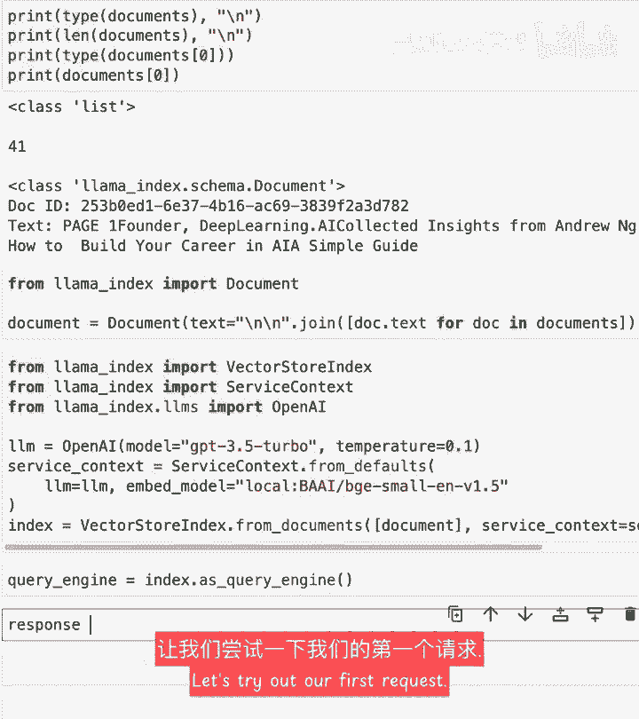

### 合并文档与创建索引
我们将这些文档合并为一个单一文档。在使用更先进的检索方法（如句子窗口检索和自动合并检索）时，这有助于提高整体文本检索的准确性。

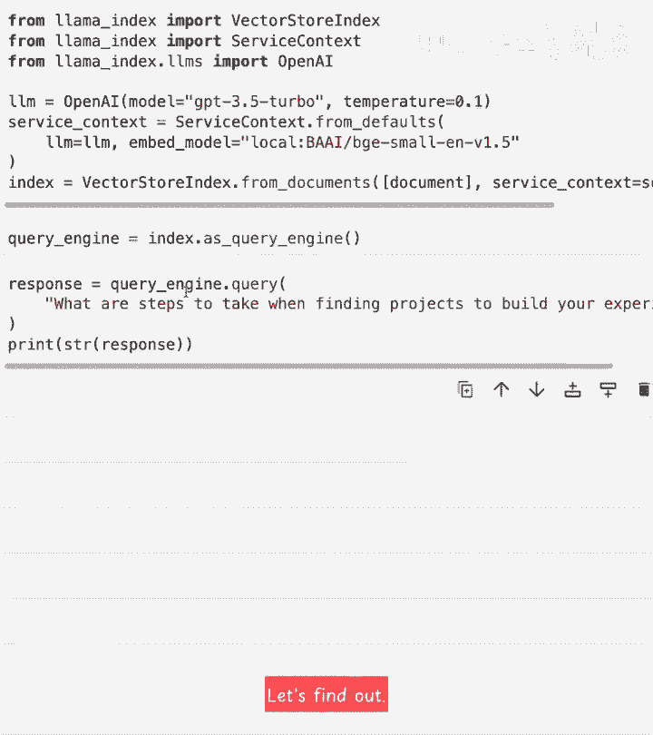

下一步是索引这些文档。我们可以使用LlamaIndex中的`VectorStoreIndex`来完成此操作。

首先，定义一个`ServiceContext`对象，它包含我们将要使用的LLM和嵌入模型。
*   我们将使用的LLM模型是来自OpenAI的`gpt-3.5-turbo`。
*   我们将使用的嵌入模型是来自Hugging Face的`BGE-small`模型。


这些步骤展示了数据摄取过程：加载文档、分块、使用指定嵌入模型生成向量并建立索引，所有这些只需一行代码即可完成。

### 查询与测试
接下来，从这个索引中获取查询引擎。这允许我们发送用户查询，对数据进行检索和合成。

让我们尝试一个查询请求：“找到项目以构建你的经验应该怎么做？”

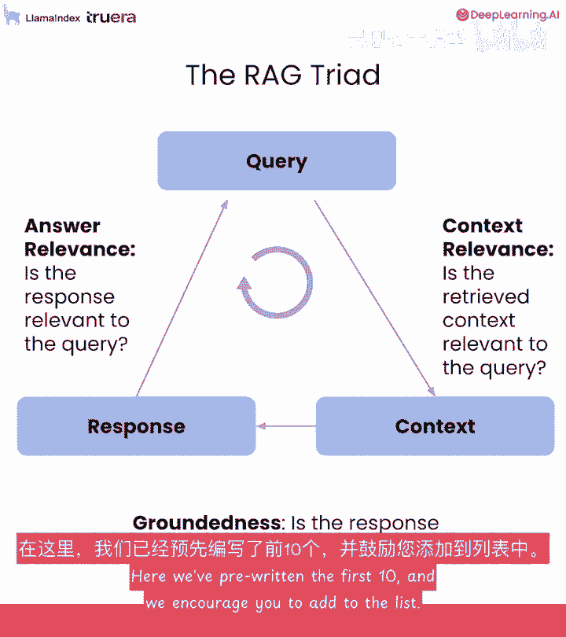

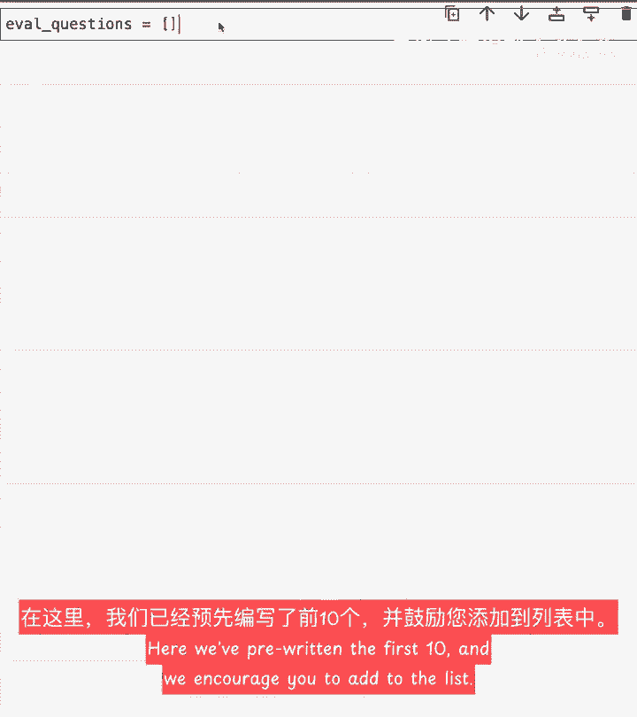


查询引擎返回了响应：“从小事做起，逐渐增加你项目的范围和复杂性。”这表明基础RAG管道正在工作。

## 设置管道评估

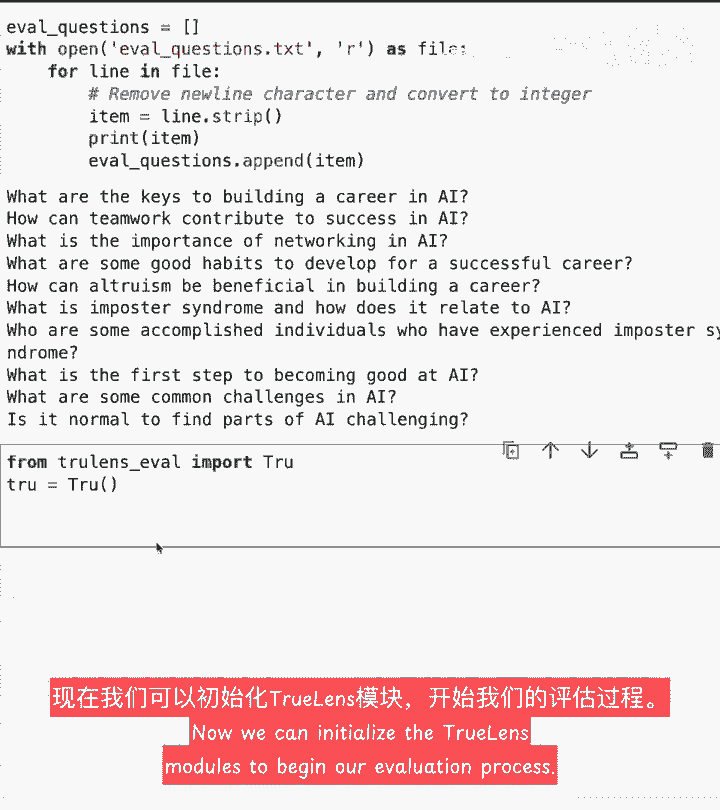

现在你已经设置了基础的RAG管道，下一步是建立对这个管道的评估，以了解其表现如何。这也将为我们定义高级检索方法（句子窗口检索器和自动合并检索器）提供基准。

### 初始化评估函数
在这一部分，我们使用TruLens初始化反馈函数。我们初始化了一个辅助函数`get_feedback`，它返回一个用于评估我们应用的反馈函数列表。

在这里，我们创建了一个**RAG评估三元组**，它由查询、响应和上下文的成对比较组成。这实际上创建了三种不同的评估模型：
1.  **答案相关性**：响应是否与查询相关。
2.  **上下文相关性**：检索到的上下文是否与查询相关。
3.  **事实基础性**：响应是否由上下文支持。

我们将在接下来的课程中教你如何自己设置这个评估框架。

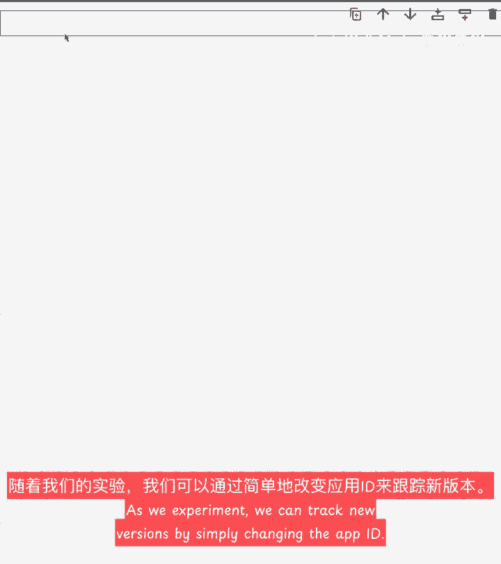

### 创建测试问题集
首先需要创建用于测试应用程序的问题集。这里我们已经预先编写了前十个问题。我们鼓励你添加到这个列表中。

以下是问题集示例：
*   构建人工智能职业生涯的关键是什么？
*   团队合作如何贡献于人工智能的成功？
*   什么样的人工智能工作适合我？（这是我们新添加的问题）

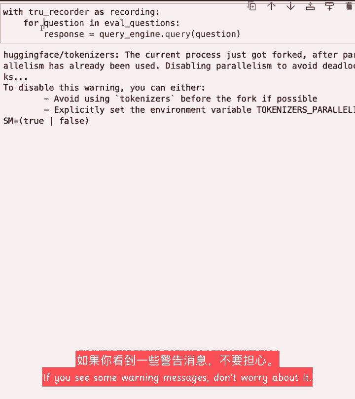


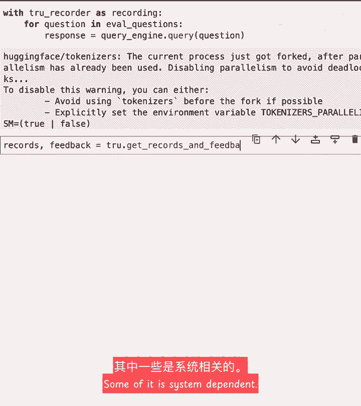

现在，我们可以初始化TruLens模块来开始评估过程。

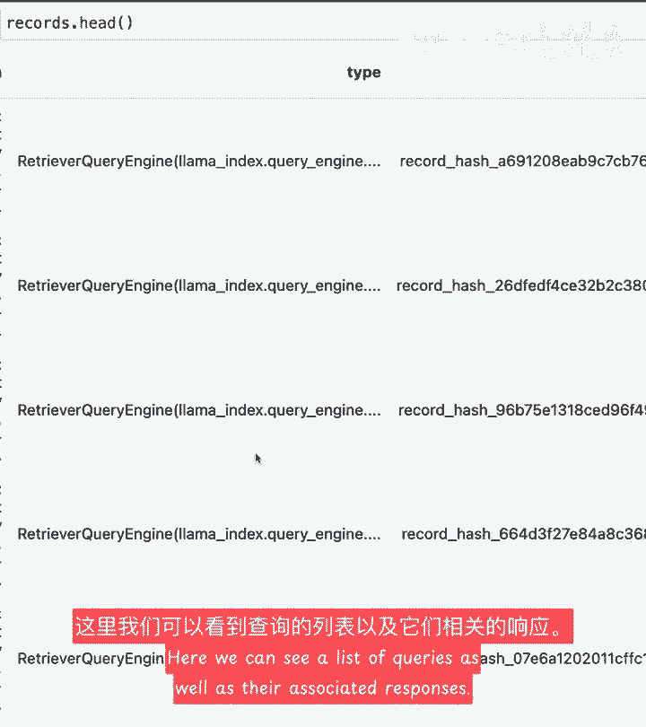

### 运行评估
TruLens作为一种标准机制，用于大规模评估生成式人工智能应用。它不依赖昂贵的人工评估或预设基准，而是允许我们以特定于我们操作领域的方式，动态地评估应用。

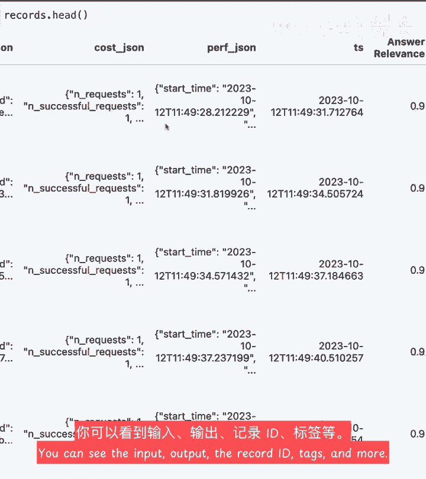

我们已经预先构建了一个TruLens记录器以供使用。在这个例子中，记录器中包含了用于评估RAG的标准三元组：**事实基础性**、**上下文相关性**和**答案相关性**。我们还将指定一个应用ID，以便在实验过程中跟踪不同版本。

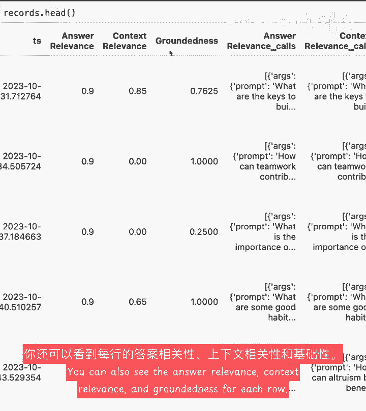


现在，我们可以在TruLens上下文中再次运行查询引擎。在这里，我们将每个查询发送到查询引擎，在后台，TruLens记录器正在根据这三个指标评估每个查询。

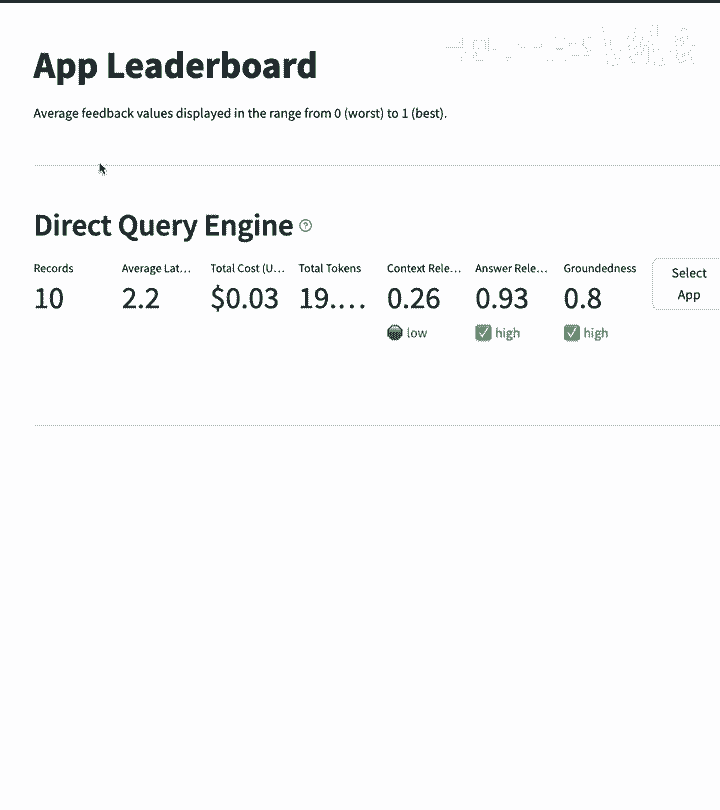

运行后，我们可以看到一组查询及其相关响应、记录ID、标签等。在TruLens仪表板上，你可以看到评估指标，如上下文相关性、答案相关性和事实基础性，以及平均延迟、总成本等。


评估结果显示，答案相关性和事实基础性都相当高，但上下文相关性得分较低。现在，让我们看看是否可以通过更先进的检索技术（如句子窗口检索和自动合并检索）来改善这些指标。

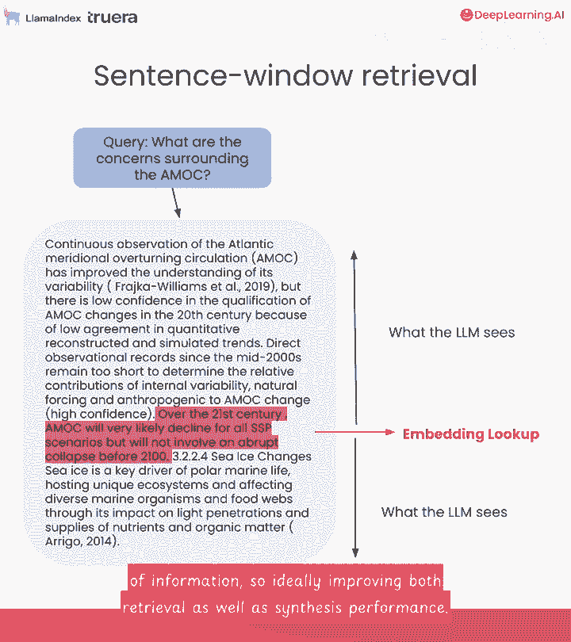

## 高级技术一：句子窗口检索

我们将首先讨论一种高级技术：**句子窗口检索**。这种方法通过嵌入和检索单个句子（即更细粒度的文本块）来实现。但在检索后，检索到的句子会被替换为围绕原始句子的一个更大的句子窗口。

其直觉是，这允许LLM对检索到的信息有更多的上下文，从而更好地回答查询，即使在检索更细粒度的信息时也是如此。

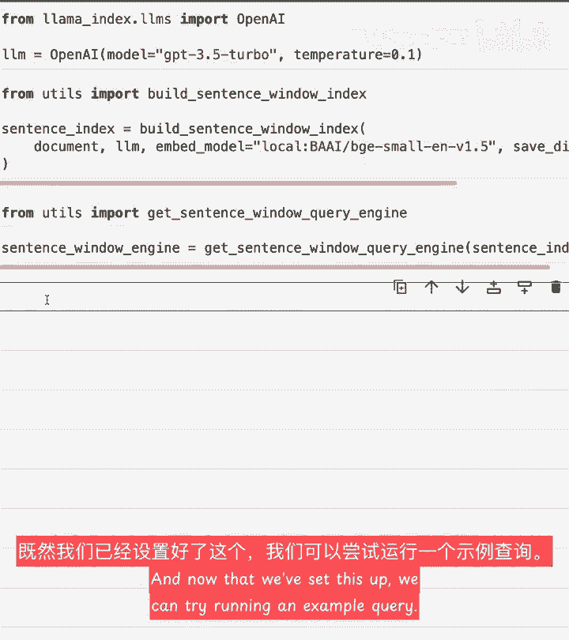


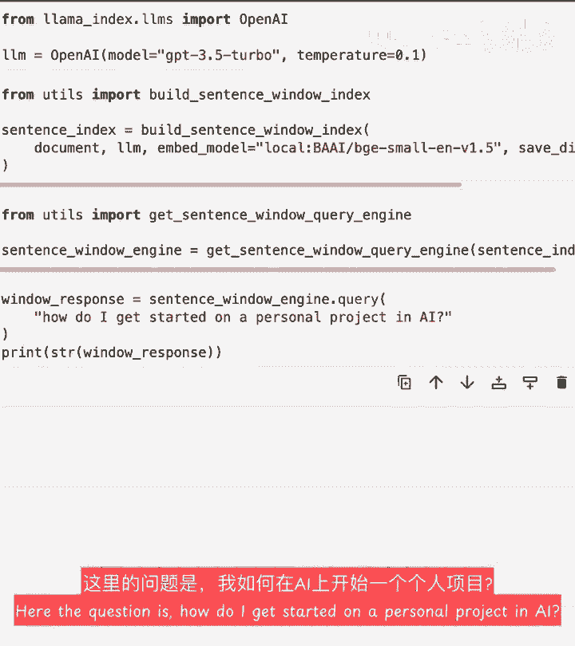

理想情况下，这能同时提高检索和合成性能。

### 设置句子窗口检索器
首先，我们使用`gpt-3.5-turbo`作为LLM。接下来，在索引给定文档时，我们将构建句子窗口索引（我们有一个辅助函数用于此）。我们将在接下来的课程中深入探讨其底层工作原理。

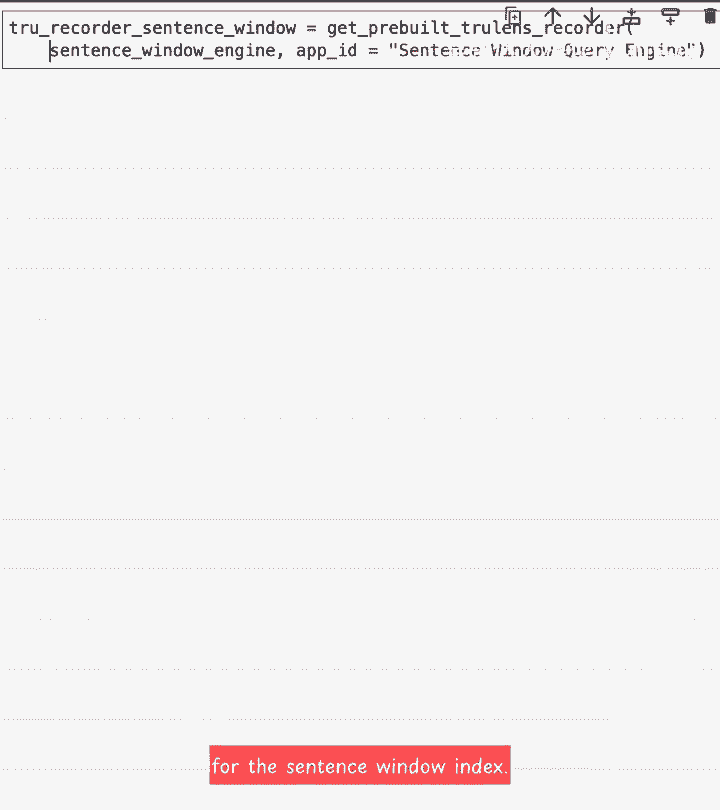

与之前类似，我们从句子窗口索引中获取查询引擎。设置完成后，我们可以运行一个示例查询：“如何开始在人工智能的个人项目中？”

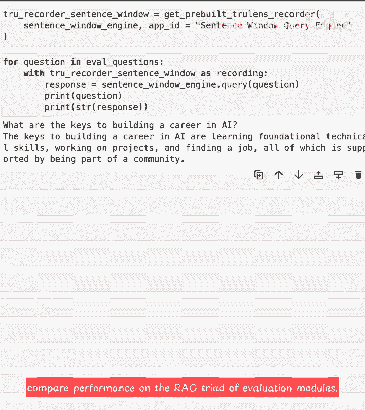


我们得到了响应：“在人工智能中开始个人项目，首先重要的是确定项目的目标……”

### 评估句子窗口检索器
与之前相似，我们获取为句子窗口索引预建的TruLens记录器，并在评估问题集上运行句子窗口检索器，然后在评估模块中比较性能。


评估运行后，我们可以看到一些问题和响应的例子。现在，我们已经对两种技术（基础RAG管道和句子窗口检索管道）进行了评估。

### 查看评估结果
让我们查看结果排名，看看发生了什么。


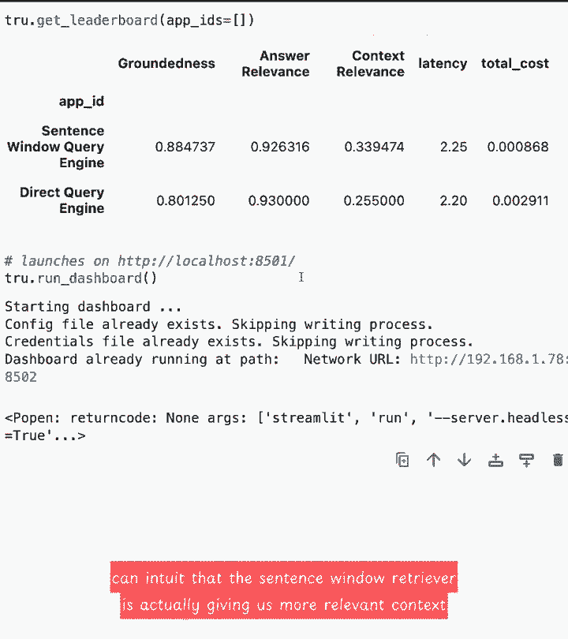

在这里，我们看到句子窗口检索器在**事实基础性**上比基准高出几个百分点。**答案相关性**与基准大致相同。**上下文相关性**对于句子窗口检索器也更好。搜索引擎延迟大致相同，并且总成本更低。

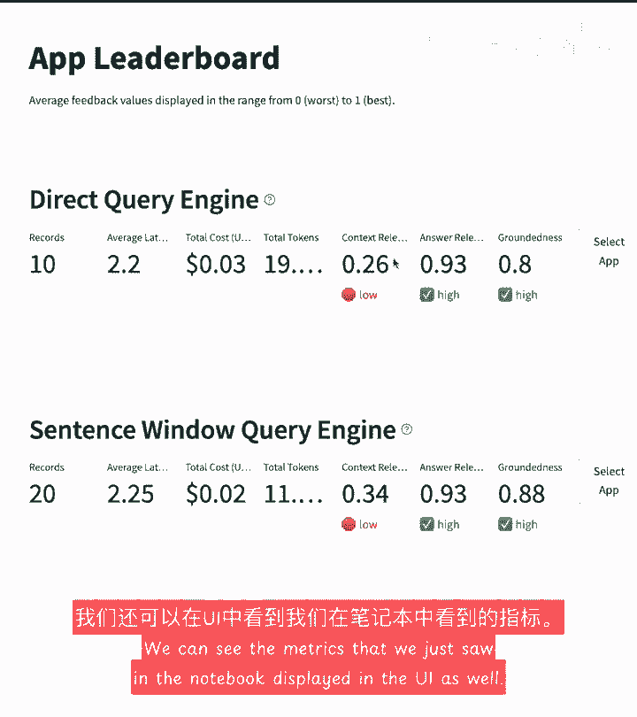

我们可以直观地认为，句子窗口检索器实际上正在为我们提供更多相关上下文，并且更有效。在TruLens UI中，我们可以看到基础查询与句子窗口检索的直接比较，以及我们在笔记本中看到的指标。

## 高级技术二：自动合并检索器

接下来我们要讨论的另一种先进检索技术是**自动合并检索器**。在这里，我们构建了一个层次结构，其中较大的父节点包含较小的子节点，这些子节点引用父节点。

例如，我们可能有一个大小为512个标记的父节点，其下有四个大小为128个标记的子节点，这些子节点都链接到这个父节点。

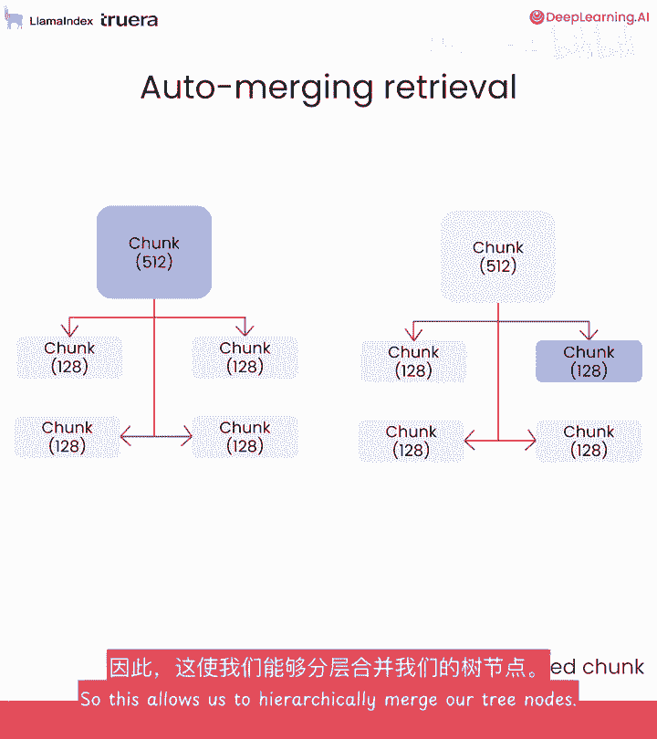

自动合并检索器的工作原理是：在检索过程中，如果某个父节点的大多数子节点都被检索到，那么我们将用父节点替换这些子节点。这使我们能够对检索到的节点进行层次化合并。


所有子节点的组合文本与父节点的文本相同。

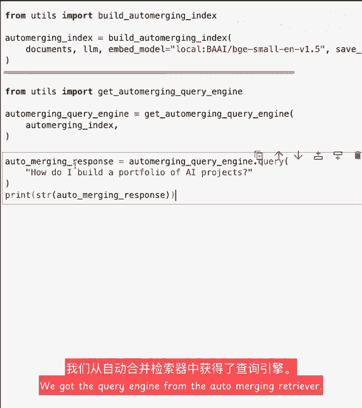

### 设置自动合并检索器
与句子窗口检索器类似，我们将使用辅助函数来设置它。我们再次使用`gpt-3.5-turbo`作为LLM，`BGE`模型作为嵌入模型来构建自动合并索引。然后从自动合并检索器中获取查询引擎。

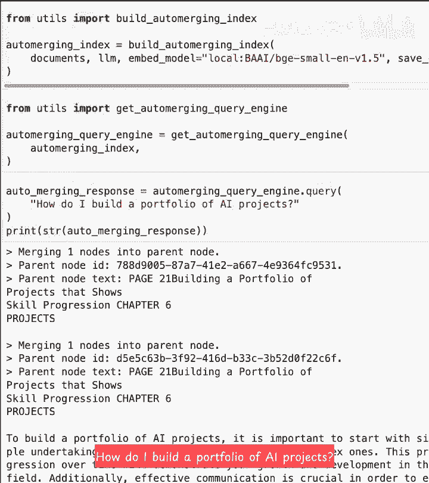

让我们尝试运行一个示例查询：“如何在这里构建一个AI项目组合？”

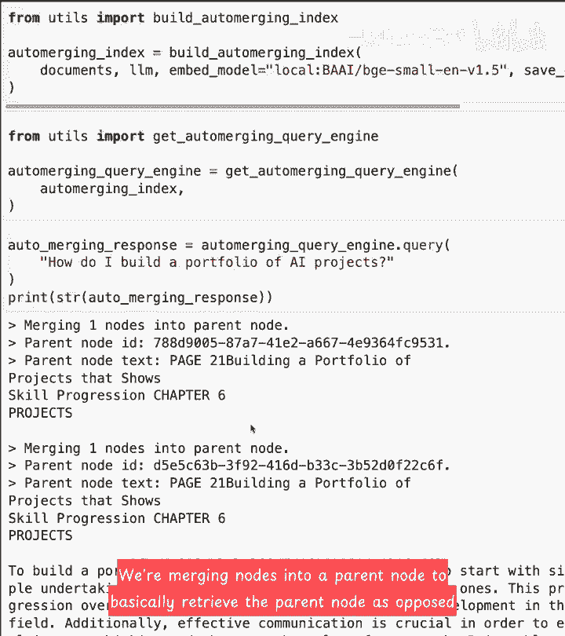


你实际上可以看到合并过程正在进行中，例如“将节点合并为一个父节点”。响应是：“要构建AI项目组合，从简单的任务开始，逐渐进展到更复杂的任务非常重要。”

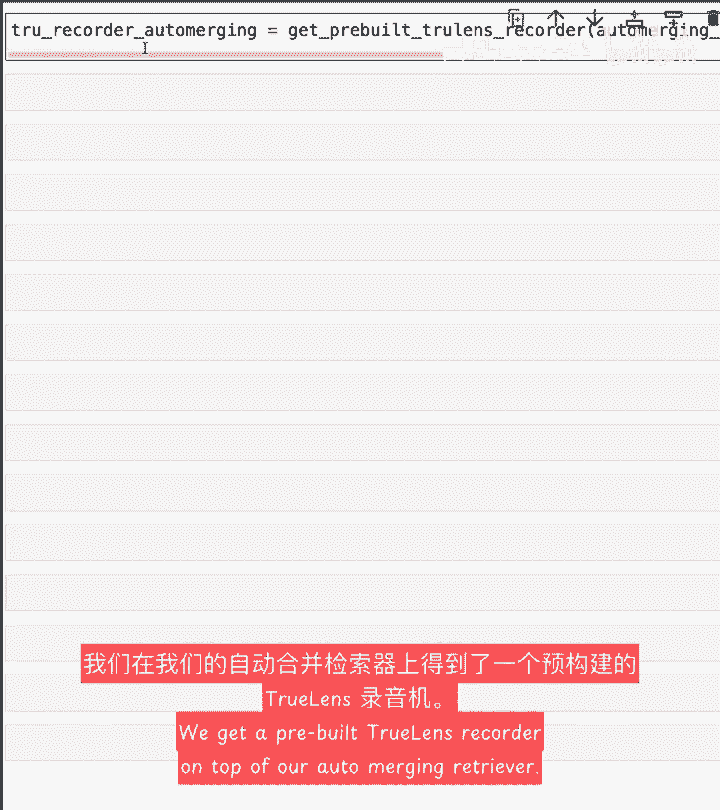

### 评估自动合并检索器
我们在自动合并检索器上构建了一个预制的TruLens记录器，然后在评估问题集上运行它。对于每个问题，你都可以看到合并过程在进行。

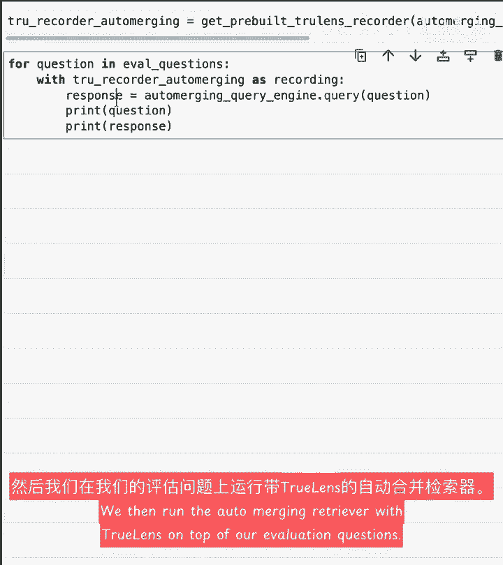

现在，我们已经运行了所有三种检索技术：基础RAG管道和两种高级检索方法。

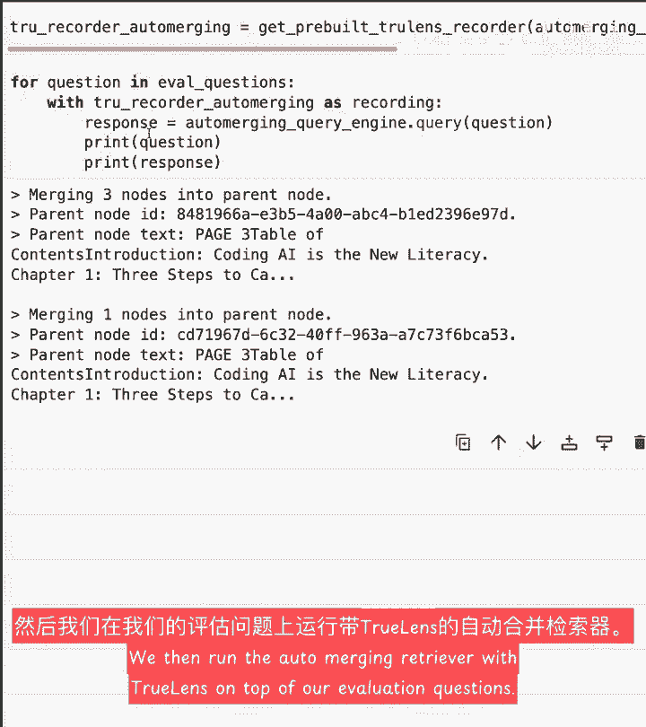

### 综合对比结果
我们可以查看一个全面的排行榜，以了解所有三种技术的表现。

对于自动合并查询引擎，我们得到了非常好的结果。在评估问题上，我们达到了：
*   **事实基础性**: 100%
*   **答案相关性**: 94%
*   **上下文相关性**: 43%

这高于句子窗口和基础RAG管道。我们得到了与句子窗口引擎大致相同的总成本，这意味着这里的检索效率更高，延迟相同。

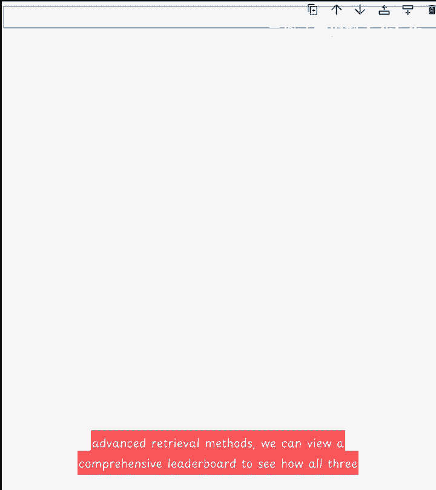

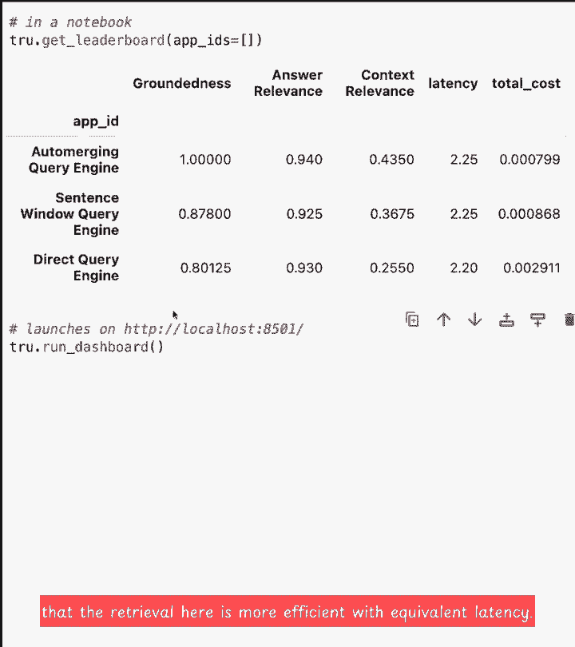

最后，你也可以在TruLens仪表板上查看这些结果。

## 总结


本节课中，我们一起学习了如何设置基础和先进的RAG管道，以及如何设置用于性能测量的评估模块。

在下一节关于提示工程的课程中，我们将深入研究这些评估模块，特别是RAG评估三元组：**答案相关性**、**上下文相关性**和**事实基础性**。

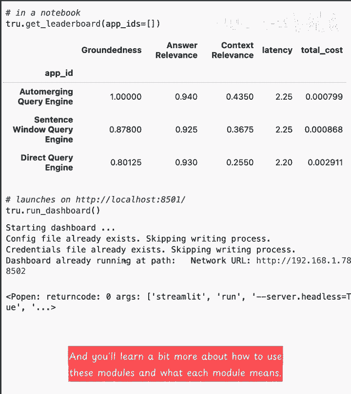

