# 025：LangChain 框架介绍

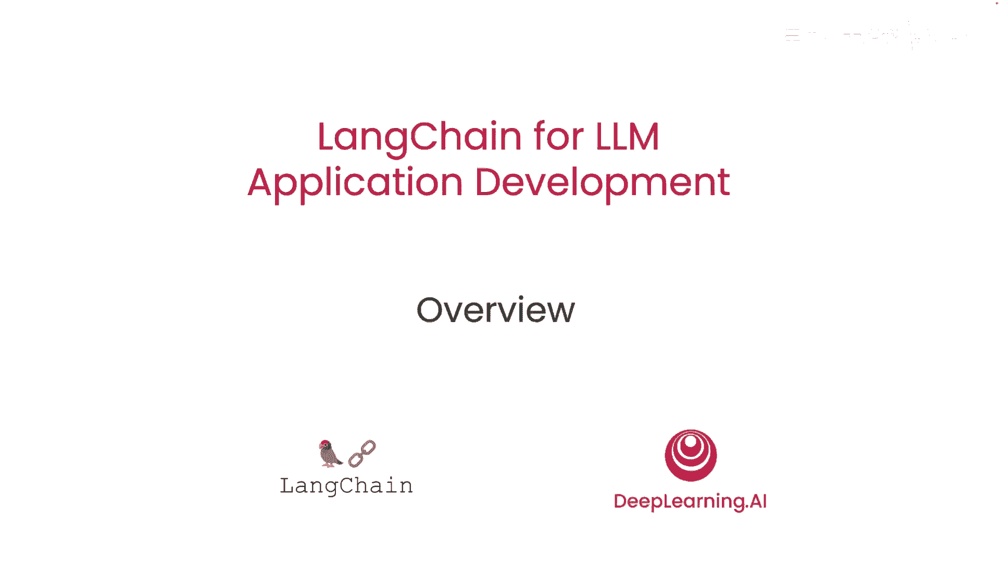

在本课程中，我们将学习 LangChain 框架的基本概念、核心组件及其在大语言模型应用开发中的价值。通过本课程，您将理解 LangChain 如何简化复杂应用的构建过程。

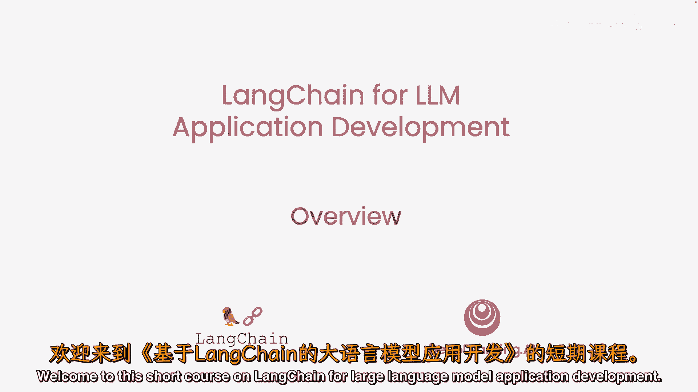

---

通过提示大型语言模型来开发应用，现在比以往任何时候都更快地开发人工智能应用成为可能。但是，一个应用可能需要多次提示语言模型并解析输出，因此需要编写大量的胶水代码。

哈里森·查塞创造的 LangChain 极大地简化了这个开发过程。我很高兴有哈里森在这里，他是与 DeepLearning.AI 一起合作创建了这个短课程的人，教我们如何使用这个强大的工具。

> 谢谢你们邀请我，我非常兴奋能来到这里。

LangChain 最初是一个用于构建所有类型应用的开源框架。它起源于我与该领域的许多人的谈话，他们正在构建更复杂的应用，并看到了他们在开发过程中使用的一些共同抽象。我们对 LangChain 社区的采纳感到非常兴奋，因此期待在这里与大家分享它，并期待看到人们用它建造什么。

实际上，作为 LangChain 发展势头的标志，它不仅有许多用户，而且还有数百名贡献者参与到开源项目中，这对其快速发展起到了关键作用。这个团队以惊人的速度发布代码和特性。

所以，希望短课程结束后，您将能够快速构建一些非常酷的应用程序使用 LangChain。谁知道，也许您甚至决定贡献回开源的 LangChain 项目。

LangChain 是一个用于构建大语言模型应用的开源开发框架。我们有两个不同的包，一个用于 Python，一个用于 JavaScript。它们专注于组合性和模块化。

所以它有许多可以单独使用或与其他组件结合使用的个体组件，这就是一个关键价值主张。

然后，另一个关键价值主张是支持许多不同的使用案例。将这些模块化组件组合成更端到端的应用的各种方式，并在这个课程中使用它们非常容易。

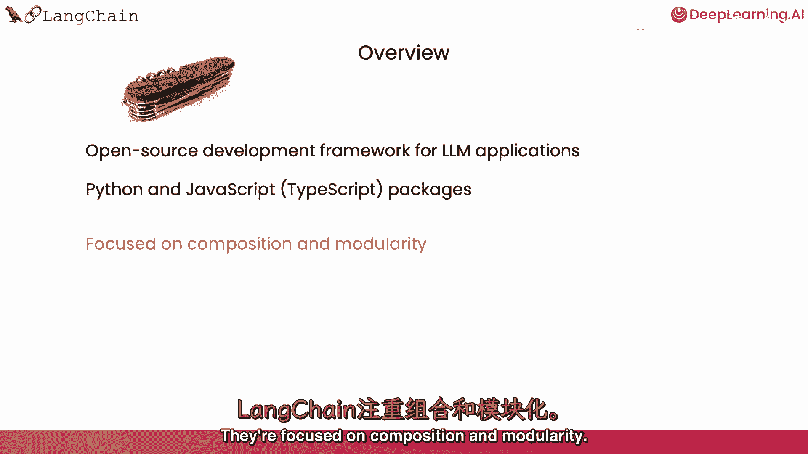

---

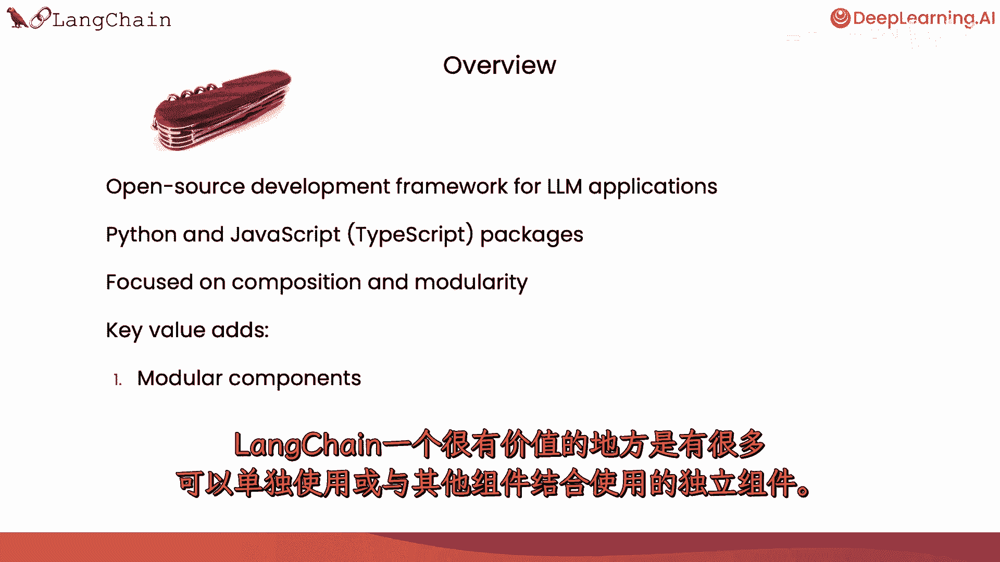

## 📦 核心组件概览

上一节我们介绍了 LangChain 的起源与价值，本节中我们来看看它的核心组成部分。

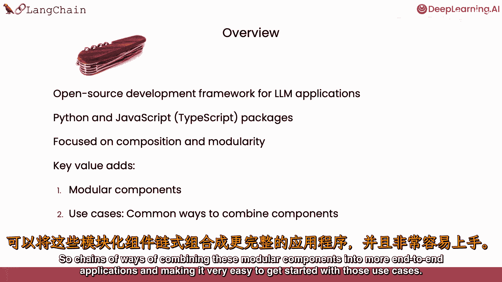

我们将覆盖 LangChain 的常见组件。

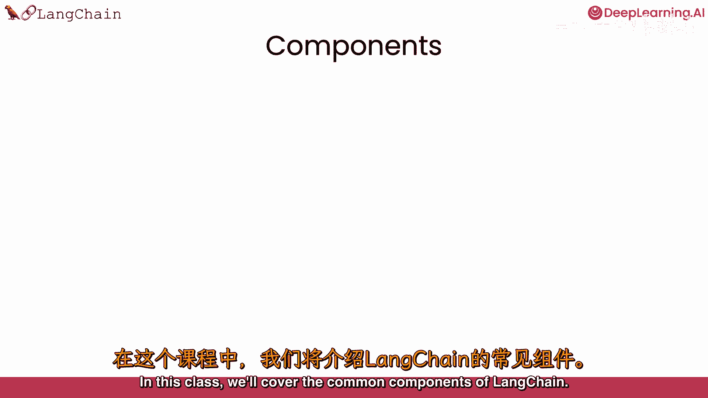

我们会讨论模型，我们会讨论提示，这是您如何让模型做有用和有趣的事情的方式。

我们会讨论索引，这是数据摄入的方式，以便您可以将其与模型结合。

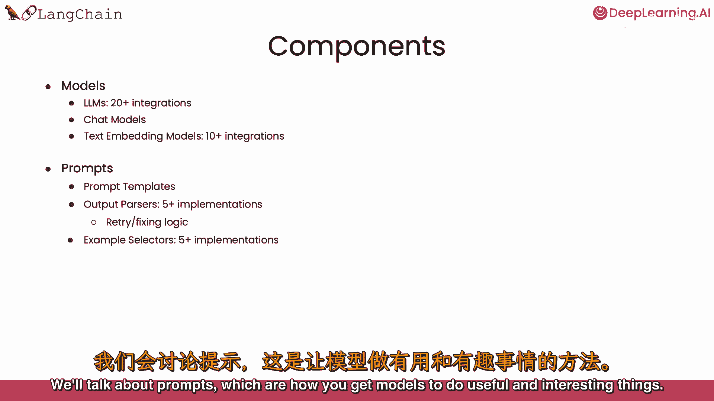

然后我们会讨论链，这是一种更端到端的使用案例，以及代理，这是一种非常令人兴奋的端到端使用案例，它使用模型作为推理引擎。

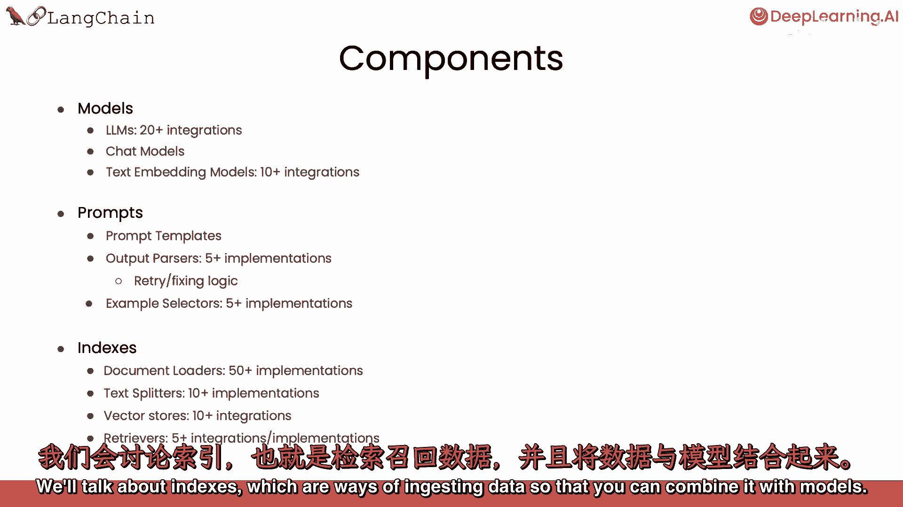

---

## 🙏 致谢

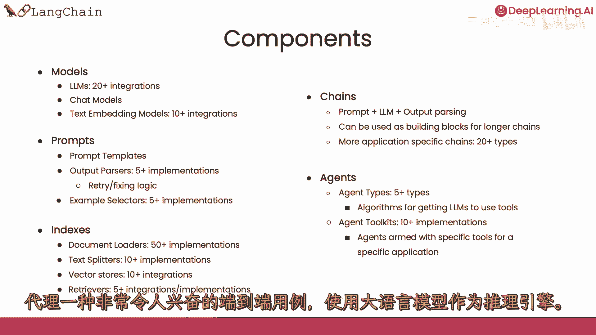

我们也感谢阿尼什·戈拉，他是与哈里森·查塞一起创立 LangChain 的联合创始人，也为这些材料投入了大量思考，帮助创建了这个短课程。

在 DeepLearning.AI 方面，杰夫、路德维希、埃德迪舒和迪亚拉作为院长，也对这些材料做出了贡献。

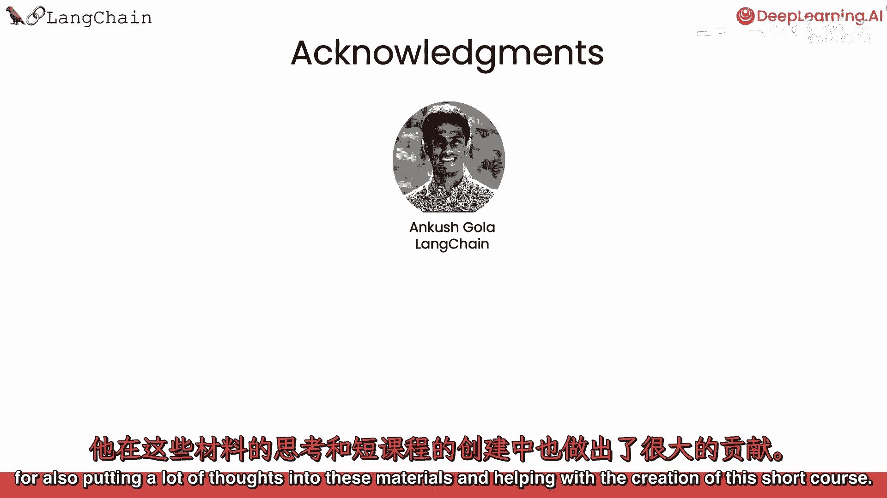

---

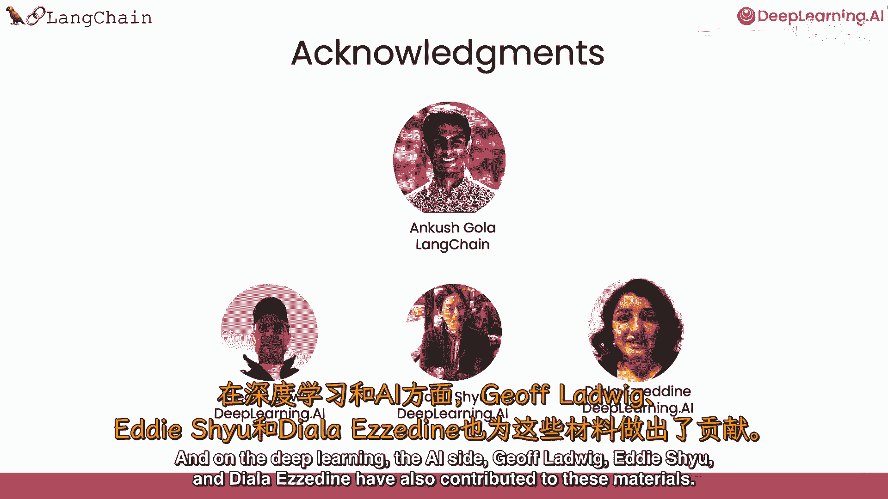

## 🚀 课程总结与展望

在本节课中，我们一起学习了 LangChain 框架的简介、其核心价值主张以及主要组件。我们了解到 LangChain 通过提供模块化组件和简化复杂流程，极大地加速了大语言模型应用的开发。

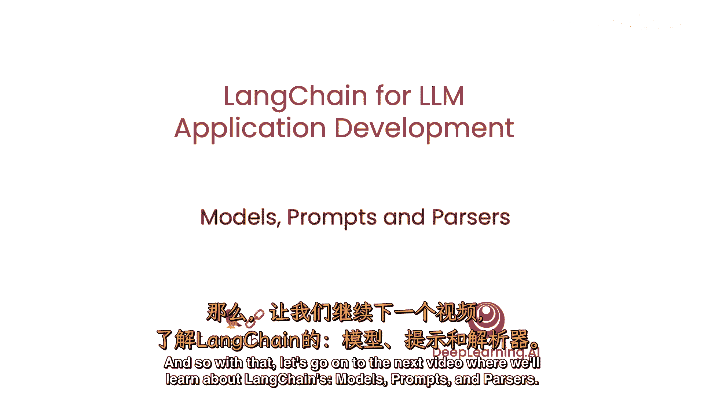

因此，让我们继续看下一个视频，在那里，我们将学习关于大语言模型的内容。