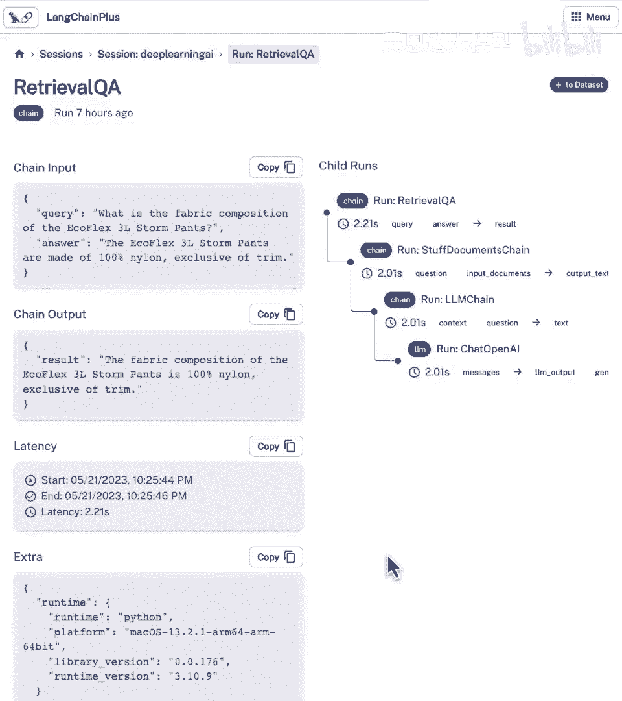

# 030：6. 评估 🧪

在本节课中，我们将学习如何评估基于大语言模型（LLM）构建的复杂应用。评估是确保应用准确性和可靠性的关键步骤，尤其是在调整模型、向量数据库或系统参数时。我们将探讨几种评估方法，从手动检查到利用语言模型进行自动化评估，并介绍 LangChain 提供的调试和评估工具。

---

## 1. 理解评估的重要性

构建复杂应用时，评估应用表现是否满足准确度标准是一个重要但有时棘手的步骤。如果决定更改实现，例如替换不同的语言模型、改变向量数据库的使用策略或调整系统参数，我们需要知道这些更改是否带来了改进。

上一节我们介绍了如何构建应用链，本节中我们来看看如何系统地评估它的表现。

---

## 2. 准备评估数据

要进行评估，首先需要确定评估数据点。我们将覆盖几种创建评估数据集的方法。

### 2.1 手动创建示例

第一种最简单的方法是手动查看数据并创建示例问题及其对应的标准答案（Ground Truth）。

以下是手动创建示例的步骤：
1.  查看文档内容，了解其涵盖的信息。
2.  根据文档内容，构思相关问题。
3.  从文档中找出或总结出问题的正确答案。

例如，查看一个关于“舒适套头衫套装”的文档后，可以创建问题：“舒适套头衫套装是否有侧口袋？”，其标准答案为“是”。

然而，手动为大量文档创建问答对非常耗时，难以扩展。

### 2.2 使用语言模型自动生成示例

我们可以利用语言模型本身来自动化生成问答对。LangChain 提供了 `QAGenerationChain` 来实现这一功能。

以下是使用 `QAGenerationChain` 的代码示例：
```python
from langchain.evaluation.qa import QAGenerationChain
from langchain.chat_models import ChatOpenAI

# 初始化语言模型
llm = ChatOpenAI(temperature=0)
# 创建问答生成链
qa_generation_chain = QAGenerationChain.from_llm(llm)

# 对文档应用链以生成问答对
examples = qa_generation_chain.apply_and_parse([document1, document2, ...])
```
此链会分析每个文档，并自动生成一个相关的问答对，极大地节省了时间。

现在，我们可以将自动生成的示例与我们手动创建的示例合并，形成一个更丰富的评估数据集。

---

## 3. 运行与调试应用链

在评估所有示例之前，理解单个查询在链中的执行过程至关重要。这有助于定位问题发生的环节。

### 3.1 查看链的详细输出

仅查看最终答案是不够的。为了理解链内部发生了什么，包括实际的提示词、检索到的文档以及中间步骤的结果，可以开启 LangChain 的调试模式。

设置调试模式的代码如下：
```python
import langchain
langchain.debug = True

# 运行你的链
result = qa_chain.run(“你的问题”)
```
开启后，运行链会输出详细信息，例如：
*   进入 `RetrievalQA` 链。
*   进入 `StuffDocuments` 链（文档处理方式）。
*   进入 `LLMChain`，显示传入的上下文（由检索到的文档组成）和原始问题。
*   显示最终传入语言模型的完整提示词，包括系统指令和上下文。
*   显示语言模型调用的元数据，如 `token` 使用量。

通过分析这些信息，可以判断是检索步骤未能找到相关文档，还是语言模型在处理给定上下文时出现了问题。

---

## 4. 自动化评估预测结果

手动检查每个例子的预测结果非常乏味。我们可以再次借助语言模型来对预测答案进行自动化评估。

### 4.1 生成预测并评估

首先，我们需要用评估数据集中的所有问题来运行我们的应用链，生成对应的“预测答案”。

然后，使用 LangChain 的 `QAEvalChain` 来评估这些预测。

以下是评估过程的代码框架：
```python
from langchain.evaluation.qa import QAEvalChain

# 1. 为所有示例生成预测
predictions = []
for example in evaluation_examples:
    pred = qa_chain.run(example[“question”])
    predictions.append(pred)

# 2. 创建评估链
eval_chain = QAEvalChain.from_llm(llm)

# 3. 进行评估
graded_outputs = eval_chain.evaluate(evaluation_examples, predictions)

# 4. 查看评估结果
for i, eg in enumerate(evaluation_examples):
    print(f“问题: {eg[‘question’]}”)
    print(f“标准答案: {eg[‘answer’]}”)
    print(f“预测答案: {predictions[i]}”)
    print(f“评估结果: {graded_outputs[i][‘text’]}”)
    print()
```
评估链（另一个语言模型）会比较“预测答案”和“标准答案”，并判断其语义是否一致，输出“正确”或“错误”。

### 4.2 为什么使用语言模型进行评估？

使用语言模型进行评估的核心优势在于它能理解语义，而不仅仅是字符串匹配。

考虑以下情况：
*   **标准答案**：“是的。”
*   **预测答案**：“重置条纹的舒适感有侧口袋。”

虽然两个字符串完全不同，但表达的含义是一致的。传统的字符串匹配或正则表达式会将其判为错误，而语言模型能够理解其语义并给出正确的评判。这对于开放式的文本生成任务评估至关重要。

---

## 5. 使用 LangChain 评估平台

LangChain 还提供了一个评估平台（UI），可以持久化、可视化地跟踪和评估链的运行。

在平台中，你可以：
*   **查看会话历史**：回顾所有运行过的链及其输入输出。
*   **可视化链结构**：像在调试模式中一样，逐步查看链中每个步骤的详细信息。
*   **构建数据集**：可以直接从成功的运行结果中将“问题-答案对”添加到评估数据集中，方便持续积累评估用例。
*   **管理评估飞轮**：通过平台界面，可以方便地运行评估、查看结果并迭代改进你的应用。

这为长期的项目评估和迭代提供了一个更强大、更直观的工具。

---

## 总结



本节课中我们一起学习了评估基于大语言模型的应用的完整流程：
1.  **准备数据**：通过手动或自动化的方式创建包含问题和标准答案的评估数据集。
2.  **调试分析**：利用 LangChain 的调试模式深入理解应用链的内部运作，定位问题。
3.  **自动化评估**：使用 `QAEvalChain` 利用语言模型对预测结果进行语义层面的自动化评估，这比传统的字符串匹配更有效。
4.  **利用平台**：介绍了 LangChain 评估平台，它提供了持久化、可视化的工具来管理评估流程和数据集。


掌握这些评估方法，将使你能够科学地衡量应用性能，并为持续优化提供明确的方向。