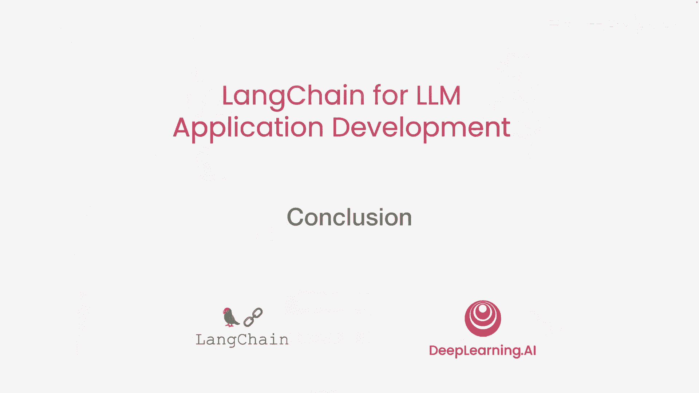

# 032：8——总结 🎯

在本节课中，我们将一起回顾并总结这门短课程的核心内容。我们将看到如何利用LangChain高效构建多种生成式AI应用，并理解其背后的关键概念。

---

在这门短课中，你看到了一系列应用。

这些应用包括处理客户评论、构建回答文档问题的应用程序，以及使用语言模型决定何时调用外部工具（如网络搜索）来回答复杂问题。

如果一两周前有人问你，构建所有这些应用程序需要多少工作量，很多人可能会认为这需要数周甚至更长时间。

但在这门短课中，我们只用了一些合理的代码行，就实现了这些功能。你可以使用LangChain高效地构建所有这些应用程序。

因此，我希望你能接受这些想法。也许你可以使用一些在Jupyter笔记本中看到的代码片段，并将它们应用到你自己的项目中。

这些想法只是一个开始。你可以使用语言模型进行许多其他应用，因为这些模型非常强大，并且适用于广泛的任务。

无论是回答关于CSV文件的问题、查询SQL数据库，还是与API交互，LangChain都提供了大量示例。

这些功能主要通过组合不同的链、提示模板和输出解析器来实现。LangChain中有更多的链可以完成所有这些事情。

而这大部分要归功于LangChain社区。我想向社区中的每个人表示衷心的感谢，无论是谁做出了贡献——无论是改进文档、让其他人更容易入门，还是创造新的链类型，从而开启了一个全新的可能性世界。

课程到此结束。如果你还没有这样做，我希望你打开你的笔记本电脑或台式机，运行 `pip install langchain` 来安装LangChain。

---

本节课中我们一起学习了如何利用LangChain框架快速构建多种生成式AI应用。我们回顾了从处理文本、构建问答系统到创建智能代理的整个流程，并认识到LangChain社区和工具集对于降低开发门槛、开启AI应用新可能性的巨大价值。