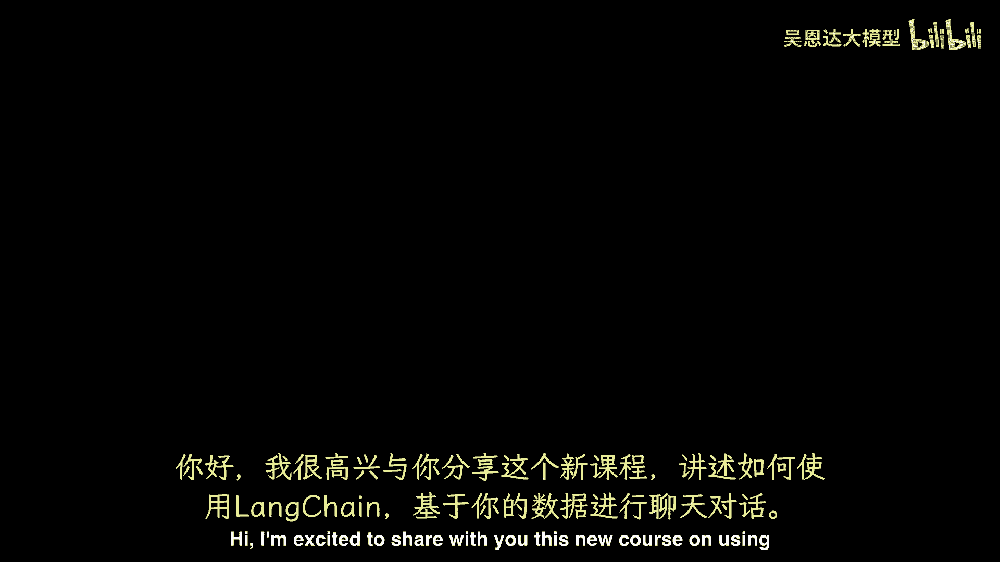
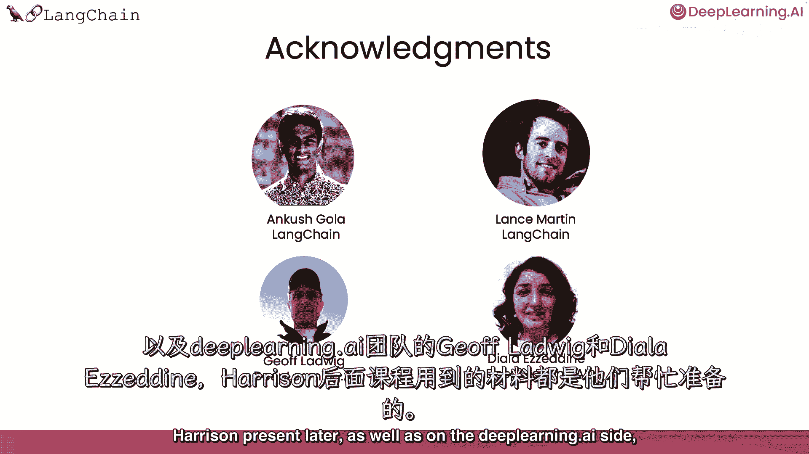

# 033：《构建与数据对话的聊天机器人》1——介绍 🚀

在本节课中，我们将学习如何使用 LangChain 框架，构建一个能够与你的私有数据对话的聊天机器人。我们将从基础概念开始，逐步了解如何加载、处理数据，并利用大型语言模型（LLM）来回答基于这些数据的问题。

---

大型语言模型（如 ChatGPT）能够回答许多主题的问题。但一个孤立的大型语言模型只知道它被训练的内容，不包括你的个人数据。例如，你在公司拥有的专有文档，不在互联网上，以及大型语言模型训练后撰写的数据或文章。若这些数据对你或你的客户有用，能与你的文档对话并解答问题将非常有价值。

利用那些文档的信息和本课程中的 LM，我们将涵盖如何用 LangChain 与数据聊天。LangChain 是一个开源开发者框架，用于构建 LLM 应用。

LangChain 由多个模块化组件和更多端到端模板组成。LangChain 中的模块化组件包括**提示**、**模型**、**索引**、**链条**和**代理**。深入了解这些组件，可查看我与吴恩达合上的第一门课。

在这门课中，我们将深入聚焦 LangChain 的一个流行用例：如何用 LangChain 与数据聊天。

---

## 课程内容概览 📋

以下是本课程将涵盖的核心步骤：

1.  **数据加载**：首先将介绍如何使用 LangChain 文档加载器，从各种来源加载数据。
2.  **文档分割**：然后将触及如何将这些文档分割为有意义的语义块。这个预处理步骤看似简单，但含义丰富。
3.  **语义搜索**：接下来，将概述语义搜索，这是获取相关信息的基本方法。给定用户问题，这是入门最简单的方法，但有几个情况会失败，我们将讨论这些情况以及如何修复。
4.  **检索与回答**：然后展示如何使用检索到的文档，使 LLM 回答基于文档的问题。但你会发现缺少一个关键部分，无法完全重现聊天体验。
5.  **记忆功能**：最后将涵盖缺失部分——记忆，展示如何构建一个完全功能的聊天机器人，通过它，你可以与数据聊天。

这将是一门激动人心的短期课程。我们感谢吴恩达，以及来自 Lang Chain 团队的 Lance Martin，为 Harrison 稍后呈现的所有材料工作，以及 DeepLearning.AI 的 Jeff、Ludwig 和 Dilara。

如果你正在学习这门课程，并决定想复习一下 LangChain 的基础，我鼓励你也要参加那个早期的 LangChain 短课程，关于 LM 应用开发。现在，我们继续下一个视频，在那里 Harrison 将向你展示如何使用。

---

## 总结 ✨

本节课我们一起学习了本系列课程的目标：使用 LangChain 构建能与私有数据对话的聊天机器人。我们概述了从数据加载、处理、检索到最终构建带记忆功能的聊天机器人的完整流程。在接下来的课程中，我们将深入每个步骤的实践细节。