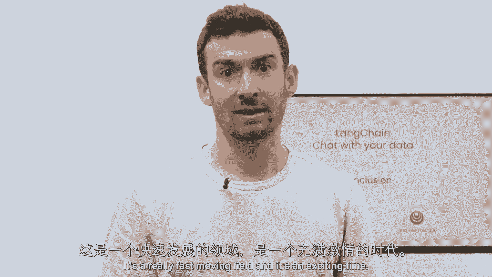

# 040：8——完结 🎓

## 概述

在本节课中，我们将回顾并总结整个“与您的数据聊天”课程模块的核心内容。我们将梳理从数据加载、处理到构建完整聊天机器人的完整流程，并展望未来的学习与应用方向。


---

## 课程内容回顾

上一节我们介绍了如何将检索到的文档与LLM结合生成答案。本节中，我们将对整个课程模块进行总结。

### 数据加载与处理

我们首先学习了如何使用LangChain从多种文档源加载数据。LangChain提供了超过八十种不同的文档加载器，例如 `UnstructuredFileLoader` 或 `WebBaseLoader`。

```python
from langchain.document_loaders import UnstructuredFileLoader
loader = UnstructuredFileLoader("example.pdf")
documents = loader.load()
```

接下来，我们将加载的文档分割成更小的块。这个过程涉及许多细节，例如如何选择合适的分块大小和重叠策略，以确保信息的完整性和检索的准确性。

### 向量化存储与语义搜索

然后，我们为这些文本块创建嵌入向量，并将它们存入向量数据库。这使得语义搜索变得非常便捷。

核心公式可以表示为：`相似度 = 余弦相似度(查询向量, 文档向量)`。

然而，我们也探讨了单纯语义搜索的局限性，例如在某些特定或边缘情况下可能无法准确找到相关信息。

### 高级检索技术

为了克服上述局限，我们深入探讨了多种先进且有趣的检索算法。这是课程中非常精彩的部分，它帮助我们更智能、更精准地从知识库中定位信息。

### 构建问答链

在掌握了检索技术后，我们将其与大型语言模型结合。流程是：检索相关文档，结合用户原始问题，一并提交给LLM，从而生成最终答案。

```python
# 简化的问答链流程示意
retrieved_docs = retriever.get_relevant_documents(user_query)
answer = llm.generate(prompt_template(query=user_query, context=retrieved_docs))
```

### 实现对话式聊天机器人

最后，我们补充了对话能力，构建了一个功能完整的端到端聊天机器人，使其能够基于您的数据进行多轮、连贯的对话。

---

## 致谢与展望

我十分享受教授这门课程的过程，也衷心希望您能从中获益。在此，我想感谢所有为此课程做出贡献的开源社区成员，包括许多提示模板和功能的开发者。

随着您继续使用LangChain进行构建，并探索出新的方法与技巧，我鼓励您将所学分享到社区，例如在Twitter上讨论，甚至为LangChain项目提交Pull Request。

这是一个快速发展的领域，现在正是参与和创造的激动人心的时刻。我热切期待看到您应用本课程所学知识构建出的精彩项目。

---



## 总结

本节课中，我们一起回顾了“与您的数据聊天”模块的完整学习路径：从数据加载、分块、嵌入存储，到语义搜索、高级检索，再到与LLM结合生成答案，最终构建出对话式聊天机器人。希望这套知识体系能助您在生成式AI的应用道路上走得更远。

