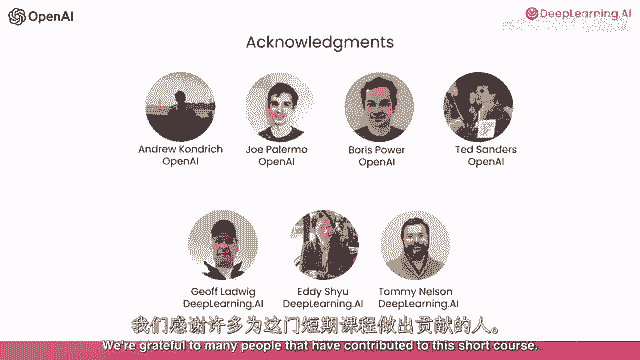
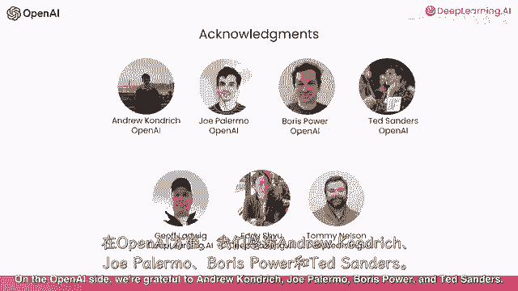
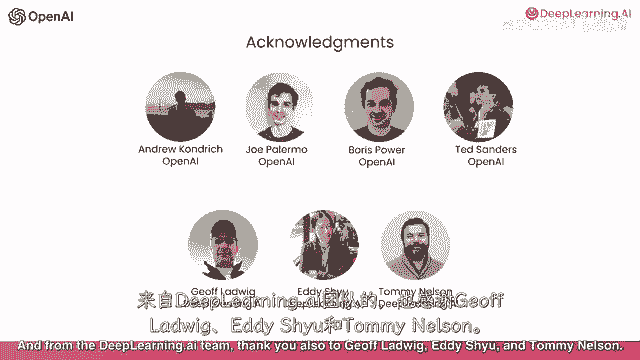

# 041：使用API构建LLM系统 🚀

在本节课中，我们将学习如何使用大型语言模型（LLM）的API来构建复杂的应用程序。我们将通过一个端到端的客户服务辅助系统示例，展示如何将多个处理步骤串联起来，以处理用户查询并生成有用的响应。

---

## 概述

在之前的课程中，我们介绍了如何向GPT等模型编写提示词。然而，构建一个实用的系统通常远不止一次简单的提示或对LLM的单个调用。本课程旨在分享使用LLM构建复杂应用程序的最佳实践。

我们将通过一个运行示例来演示：构建一个端到端的客户服务辅助系统。该系统会链式调用语言模型，根据前一个调用的输出，有时甚至需要从外部来源查找信息，来处理用户请求。

---

## 系统处理流程 🔄

上一节我们概述了课程目标，本节中我们来看看一个典型LLM应用系统的具体处理步骤。

假设用户输入是：“告诉我有关出售的电视”。系统将按以下步骤处理：

1.  **评估输入**：首先，系统会评估用户输入，确保其不包含任何问题内容，例如仇恨言论。
2.  **处理输入**：接着，系统将处理输入内容，识别查询的类型（例如，是投诉还是产品信息请求）。
3.  **检索信息**：一旦确定是产品查询，系统将从外部数据库或知识库中检索有关电视的相关信息。
4.  **生成响应**：然后，系统会使用语言模型，结合检索到的信息，编写一个有用的响应。
5.  **检查输出**：最后，系统会检查生成的输出，确保其没有不准确或不适当的内容，然后再呈现给用户。

---

## 核心概念与挑战 ⚙️

通过上述流程，我们可以看到构建LLM应用时的一些核心主题和挑战。

### 多步骤处理
应用程序通常需要多个对最终用户不可见的内部步骤。开发者需要按顺序处理用户输入的多个步骤，才能获得最终输出。

**伪代码示例**：
```python
def process_user_query(user_input):
    step1_output = evaluate_input(user_input)
    step2_output = classify_query(step1_output)
    step3_output = retrieve_info(step2_output)
    step4_output = generate_response(step3_output)
    final_output = evaluate_output(step4_output)
    return final_output
```



### 持续改进
随着长期使用LLM构建复杂系统，持续改进系统至关重要。因此，本课程也将分享开发基于LLM应用程序的流程，以及一些随时间评估和改进系统的最佳实践。

---


## 致谢 🙏

我们感谢许多人为这门短课程做出的贡献。



在OpenAI方面，我们感谢Andrew、Kendrick、Joe、Palermo、Boris、Powell和Ted Sanders。



来自DeepLearning.AI团队，我们也感谢Jeff、Ludwig、Eddie Hu和Tommy Nelson。

---

## 总结

本节课中，我们一起学习了如何使用API构建多步骤的LLM系统。我们通过一个客户服务系统的例子，了解了从输入评估、分类、信息检索到响应生成和检查的完整流程。希望学完本课程后，您能有信心构建复杂的多步骤应用程序，并准备好对其进行维护和持续改进。