# 042：1——大语言模型、API格式和Token 🧠

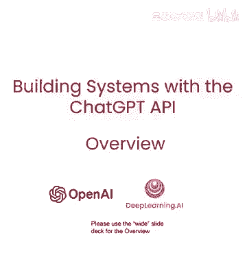

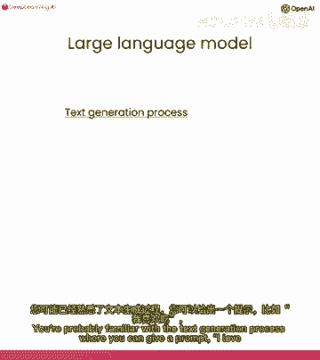

在本节课中，我们将要学习大语言模型（LLM）的基本工作原理、API的聊天格式以及Token（标记）的概念。理解这些核心概念是有效使用和构建生成式AI应用的基础。

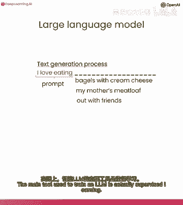

## 大语言模型如何工作

上一节我们介绍了课程概述，本节中我们来看看大语言模型是如何工作的。你可能熟悉文本生成过程：你可以给出一个提示，例如“我爱吃和很棒”，然后让语言模型填充可能的内容。

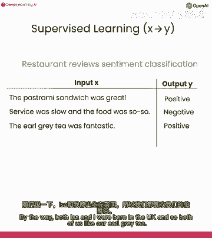

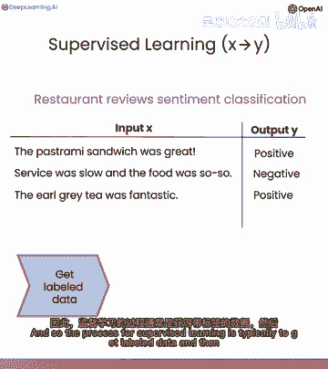

基于此提示，模型可能会输出“奶油芝士维加斯”或“我妈妈的肉馅饼”，或者“也与朋友一起”。但模型是如何学会这样做的呢？

训练大型语言模型的主要工具实际上是**监督学习**。计算机使用标记的训练数据学习输入到输出（X到Y）的映射。例如，若用监督学习分类餐厅评论情绪，你可能收集这样的训练集。

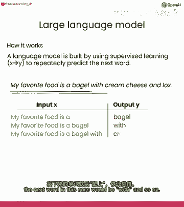

以下是监督学习的典型流程：
1.  获取标记数据。
2.  训练模型。
3.  部署并调用模型。

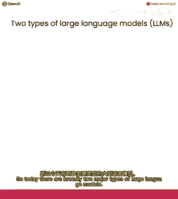

事实证明，监督学习是训练大型语言模型的核心组成部分。具体来说，大型语言模型可以通过使用监督学习反复预测下一个单词来构建。

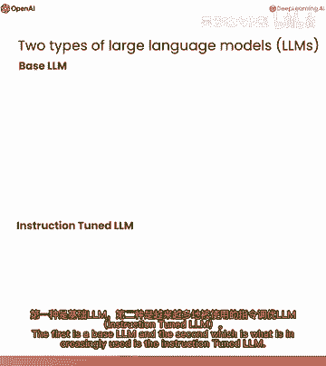

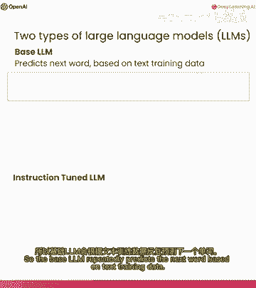

假设在你的训练集中有很多文本数据，例如句子“我最喜欢的食物是一个奶油贝果，芝士和抹酱”。这句话可以被转换成一系列训练示例。

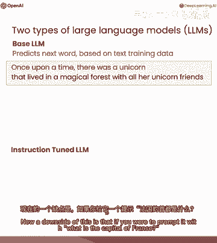

考虑到数百亿甚至更多单词的大型训练集，你可以创建一个庞大的训练集，从句子或文本的一部分开始，并反复要求语言模型学习预测下一个单词。

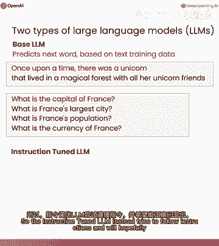

## 基础模型与指令微调模型

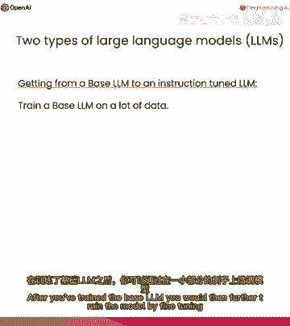

目前有两种主要的大型语言模型。

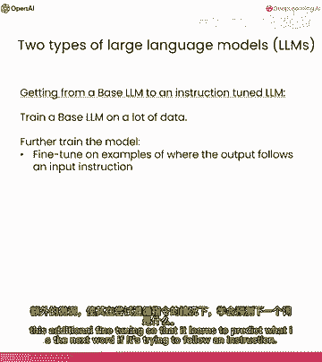

第一种是**基础语言模型**。基础模型反复预测下一个词。例如，如果我给它一个提示“从前有只独角兽”，它可能逐词预测，编出一个完成的故事。

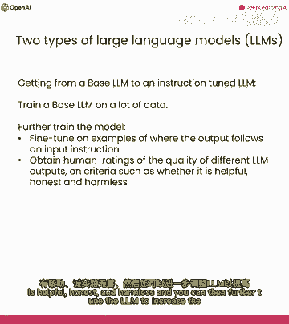

第二种是越来越常用的**指令微调模型**。基础模型的一个缺点是，如果你提示它“法国首都是什么”，它可能用“法国最大城市”或“法国人口”等信息来补全句子，而不是直接回答“巴黎”。指令微调模型则被训练来遵循指令。

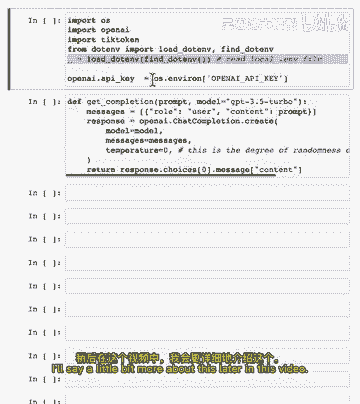

如何从基础模型到指令微调模型呢？以下是训练指令微调模型（如ChatGPT）的过程：
1.  首先在大数据上训练一个基础模型，这过程需数月。
2.  然后通过微调，在小样本上进一步训练模型，使其输出遵循输入指令。
3.  常用人类评分来评估输出是否有用、诚实、无害。
4.  进一步调优模型，增加高评分输出的概率。常用技术为**RLHF**（从人类反馈中强化学习）。

从基础模型到指令微调模型的过程可以在几天内，使用更小的数据集和计算资源完成。

## Token（标记）的概念

在大语言模型的描述中，我把它描述为逐词预测。但实际上还有一个重要的技术细节：它实际上反复预测的是下一个**标记**。

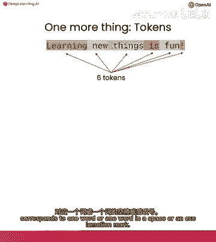

标记是将字符序列分组为常见字符序列的结果。例如，“学习新事物很有趣”这句话，每个单词都是一个相当常见的标记。

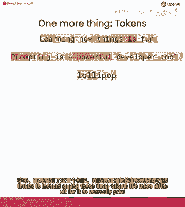

但如果你输入一些不太常用的单词，比如“prompt”，它可能被分解为多个标记。例如，单词“lollipop”可能被分词器拆分为三个标记：“L”、“olli”、“pop”。因为模型看到的是这些标记，而不是单个字母，所以让它完成反转字母等任务会变得困难。

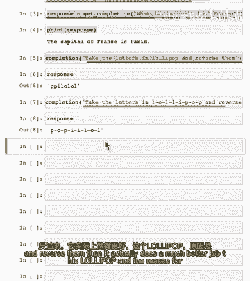

这里有一个技巧可以修复这个问题：在字母之间添加破折号或空格，使每个字符成为一个单独的标记，模型就能更容易地处理。

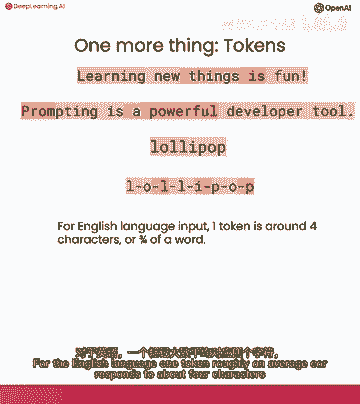

一个标记平均约对应4个字符或3/4个单词。因此，不同大型语言模型常设有不同的输入输出标记数限制。例如，模型`gpt-3.5-turbo`的输入限制约为4000个标记。

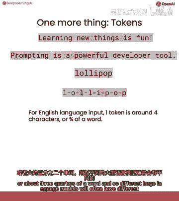

## API聊天格式

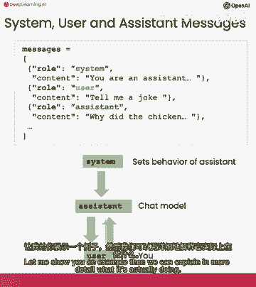

分享另一种强大的用法，涉及指定独立的系统、用户和助手消息。

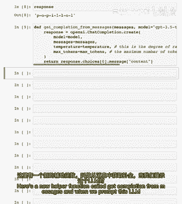

实际操作时，我们可以使用一个辅助函数`get_completion_from_messages`。当我们提示这个语言模型时，我们将给它多条消息。

以下是你可以做的示例：
1.  首先指定一个**系统角色**的消息，设定模型的整体行为基调。
2.  然后指定一个**用户角色**的消息，给出具体的指令。

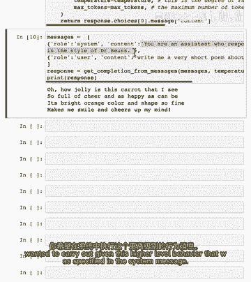

这就是聊天格式的运作方式。系统消息设定助手的整体行为基调，用户消息提出具体请求，模型则输出一个遵循用户请求且与系统设定一致的响应。

虽然这里没有展示，但你也可以在这种消息格式中输入**助手角色**的消息，以实现多轮对话。

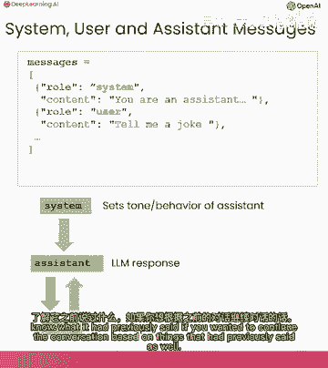

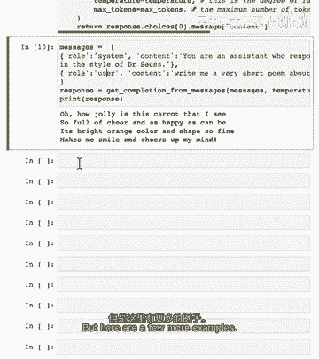

这里还有一些其他例子，例如在系统消息中设定输出长度或结合风格与长度要求。

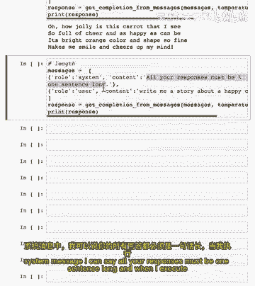

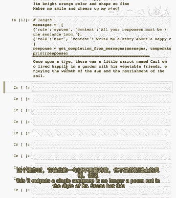

## 令牌计数与API密钥安全

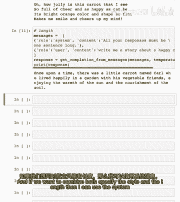

如果你正在使用一个语言模型，并且你想知道你在使用多少个令牌，这里有一个函数可以从OpenAI API端获取响应，并告诉你使用了多少提示令牌、完成令牌和总令牌。

当我实践中使用模型时，坦白说，我并不太担心使用的令牌数。可能有一个值得检查令牌数的情况是，如果你担心用户输入过长，超过了模型的令牌限制。

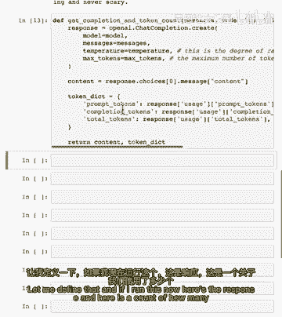

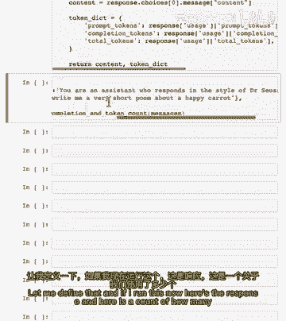

现在我想与你分享如何使用大型语言模型的另一个提示：安全地管理API密钥。

调用OpenAI API需要使用与账户绑定的API密钥。许多开发人员会将API密钥以纯文本形式写入代码，这是一种不安全的方式。

相比之下，更安全的方法是使用环境变量。例如，使用`python-dotenv`库从本地的`.env`文件中加载API密钥，这样密钥就不会以明文形式出现在代码中。

这是一种相对更安全和更好的访问API密钥的方式，实际上是一种通用的方法，用于存储来自许多不同在线服务的API密钥。

## 提示工程的影响

我认为提示对AI应用开发的影响仍被传统的监督机器学习流程所低估。

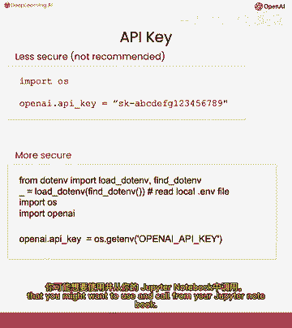

例如，在传统的餐厅评论情感分类项目中，从收集数据、训练模型到部署上线，可能需要团队数月的工作。

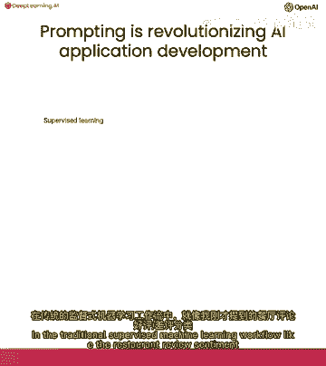

相比之下，基于提示的机器学习，当你有一个文本应用时，你可以指定一个提示，在几小时到几天内就可以开始调用模型并运行推断。

这正在改变AI应用可以快速构建的方式。一个重要的警告是，这目前主要适用于许多非结构化数据应用，如文本应用。

## 总结

本节课中我们一起学习了：
1.  **大语言模型的工作原理**：基于监督学习，通过预测下一个标记进行训练。
2.  **模型类型**：区分了基础语言模型和指令微调模型。
3.  **Token（标记）**：理解了模型处理文本的基本单位及其影响。
4.  **API聊天格式**：学会了如何使用系统、用户和助手消息来有效地与模型交互。
5.  **实践与安全**：了解了如何计数令牌以及安全管理API密钥的最佳实践。
6.  **提示工程的价值**：认识到提示如何极大地加速AI应用的开发流程。

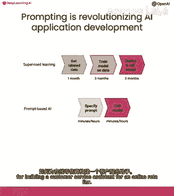

这些基础知识将为你后续学习更高级的主题，如微调提示词、构建RAG模型和应用智能体（agent）打下坚实的基础。