# 043：分类 📊

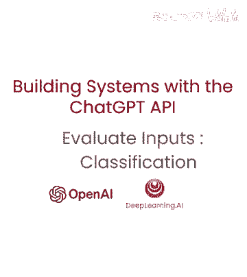

在本节课中，我们将学习如何评估用户输入，并将其分类到预定义的类别中。这是构建可靠AI系统的重要一步，它可以帮助我们根据查询类型，动态选择最合适的后续处理指令。

## 概述

许多AI应用需要处理多种类型的用户查询。直接对所有查询使用同一套指令可能效率低下或效果不佳。本节介绍的方法，是先将用户查询进行分类，再根据分类结果调用不同的专用指令集。这种方法能提升系统响应的准确性和针对性。

## 核心概念与流程

整个流程可以概括为以下步骤：
1.  **定义分类体系**：预先设定好查询的主要类别和次要类别。
2.  **构建系统指令**：要求模型根据用户查询，输出结构化的分类结果。
3.  **处理用户查询**：将格式化的用户查询发送给模型。
4.  **解析分类结果**：获得结构化的分类信息，用于指导后续操作。

其核心逻辑可以用以下伪代码表示：
```python
# 1. 定义分类类别
categories = {
    “主要类别”: [“账单”， “技术支持”， “账户管理”， “一般查询”],
    “次要类别”: [“取消订阅”， “升级”， “关闭账户”， ...]
}

# 2. 构建包含分类指令的系统消息
system_message = f“”"
你将被提供客户服务查询。
将每个查询分类为主要类别和次要类别。
以JSON格式提供输出，键为“主要”和“次要”。
“”"

# 3. 组合消息并调用模型
messages = [
    {“role”: “system”， “content”: system_message},
    {“role”: “user”， “content”: user_query}
]
response = chat_model(messages)

# 4. 解析结果
classification_result = json.loads(response)
# 根据 classification_result[“主要”] 和 classification_result[“次要”] 决定后续步骤
```

## 实战示例

为了让概念更清晰，我们来看两个具体的例子。我们将使用 `###` 作为分隔符，来区分指令和查询内容。

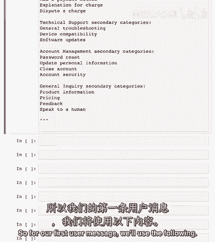

以下是完整的系统消息示例：
```
你将被提供客户服务查询。
客户服务查询将用 ### 这些标签字符分隔。
将每个查询分类为主要类别和次要类别。
然后以JSON格式提供输出，键为“主要”和“次要”。

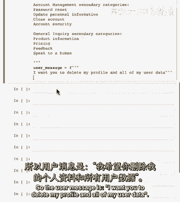

主要类别列表：
- 账单
- 技术支持
- 账户管理
- 一般查询

次要类别列表：
- 取消订阅
- 升级
- 关闭账户
- ...
```

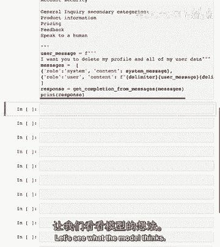

### 示例一：账户管理查询

现在，我们输入第一个用户查询。

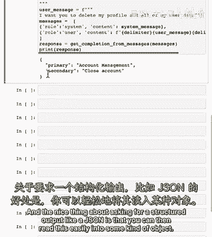

用户消息是：
```
### 我想删除我的个人资料和所有用户数据。 ###
```

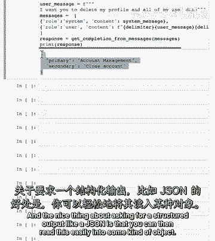

我们将系统消息和用户消息组合后发送给模型。模型分析后，认为这属于“账户管理”主要类别，以及“关闭账户”次要类别。

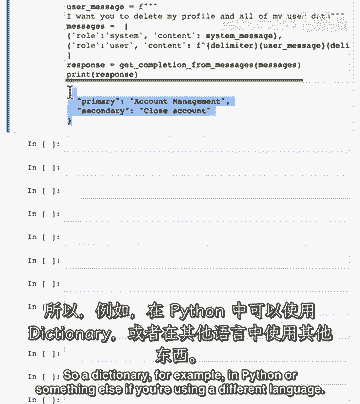

因此，模型返回的结构化输出是：
```json
{
  “主要”: “账户管理”，
  “次要”: “关闭账户”
}
```
请求结构化输出（如JSON）的一个主要好处，是后续程序可以轻松地将这个结果解析成字典或对象，从而自动化地决定下一步该执行什么指令，例如提供一个账户关闭链接。

### 示例二：产品咨询查询

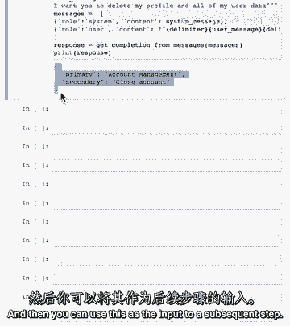

理解了第一个例子后，我们来看另一种类型的查询。你可以暂停视频，尝试输入自己的问题，观察模型的分类结果。

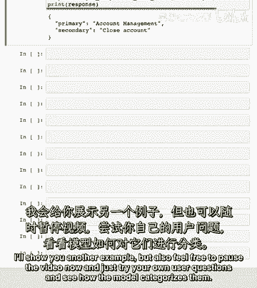

第二个用户消息是：
```
### 告诉我更多关于你们的平板电视。 ###
```

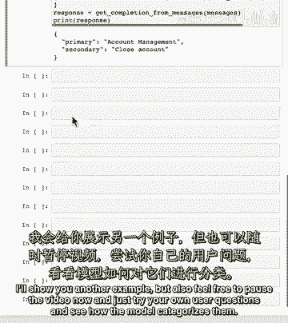

模型对这条消息的分析结果如下：
```json
{
  “主要”: “一般查询”，
  “次要”: “产品信息”
}
```
可以看到，模型成功地将一个产品咨询归类到了“一般查询”下的“产品信息”。

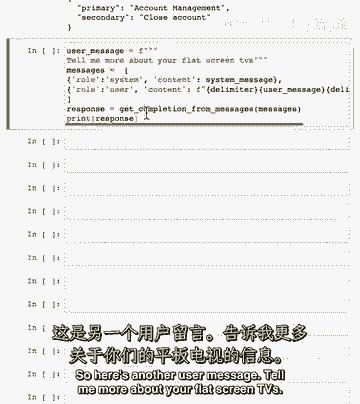

## 分类结果的应用

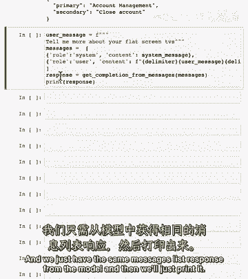

通过以上示例，我们看到了如何对用户输入进行分类。基于这个分类结果，系统就可以提供一套更具体、更有针对性的指令来处理下一步。

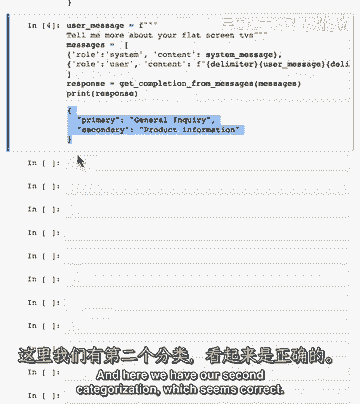

例如：
*   对于“关闭账户”的查询，系统后续可以添加关于如何关闭账户的具体步骤或链接。
*   对于“产品信息”的查询，系统则可以添加该平板电视的详细介绍、规格参数等额外信息。

这样，系统就能根据不同的用户意图，提供差异化和精准的服务。

## 总结

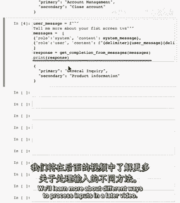

本节课我们一起学习了输入评估中的分类方法。我们掌握了如何通过预定义类别和结构化指令，让大型语言模型对用户查询进行自动分类，并输出机器可读的JSON结果。这为构建能够智能路由和处理多种请求的AI系统奠定了重要基础。

在接下来的课程中，我们将探讨更多评估和处理用户输入的方法。