# 045：思考链推理 🧠

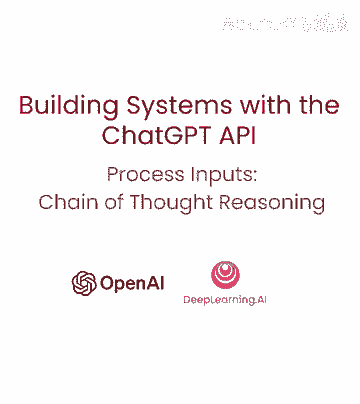

在本节课中，我们将学习一种名为“思考链推理”的策略，用于处理需要模型进行多步推理的复杂输入任务。我们将探讨如何通过引导模型进行系统性思考来减少错误，并学习如何向用户隐藏模型的内部推理过程。

---

上一节我们介绍了输入处理的基本概念，本节中我们来看看如何通过“思考链推理”来优化模型的推理过程。

## 什么是思考链推理？ 🤔

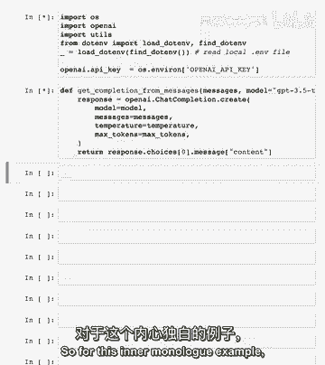

处理输入并生成有用输出的任务，通常需要经过一系列步骤。在回答特定问题前，详细推理问题有时很重要。模型有时会因仓促得出错误结论而犯推理错误。因此，我们可以重新构建查询，要求模型在提供最终答案之前进行一系列相关推理。这样它就可以更长时间、更系统地思考问题。

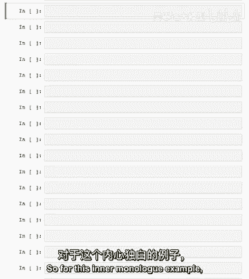

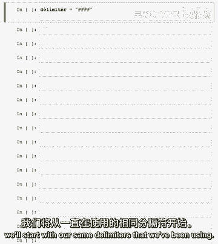

我们通常将这种让模型逐步推理问题的策略，称为链式思维推理。它适用于某些应用，其中模型用于得出最终答案的推理过程，不适合与用户分享。例如，在辅导应用中，我们可能希望鼓励学生自己解决问题。但模型关于学生解决方案的推理，可能会以独白的形式向学生透露答案。

## 隐藏推理：使用“独白”策略 🎭

这是一种可以缓解上述情况的策略。这只是一个花哨的说法，意思是向用户隐藏模型的推理。具体做法是，指示模型将输出中打算隐藏给用户的部分放入结构化格式中，以便轻松传递。然后在向用户呈现输出之前，输出被传递，只有输出的一部分可见。

请记住上一个视频中关于分类问题的讨论。我们要求模型将客户查询分类为主次类别。基于该分类，我们可能想要采取不同的指令。想象客户查询已被分类为产品信息类别。在接下来的指令中，我们将想要包含有关我们可用产品的信息。因此在这种情况下，分类将是主要：一般查询，次要：产品信息。

## 实践示例：构建一个思考链提示 💡

让我们从一个具体的例子开始。我们将设置一个系统消息，要求模型按照步骤推理答案。

以下是构建提示的步骤：

1.  **第一步**：决定用户是否在询问特定产品或产品类别。
2.  **第二步**：如果用户在询问特定产品，确定产品是否在可用产品列表中。
3.  **第三步**：如果消息包含列表中的产品，列出用户在消息中做出的任何假设。
4.  **第四步**：根据产品信息判断用户的假设是否正确。
5.  **第五步**：先礼貌纠正客户的错误假设（如适用），仅提及或参考可用产品，并以友好语气回答客户。

我们要求模型使用特定格式输出，例如 `####第一步分隔符其推理####`，以便后续处理。

让我们尝试一个示例用户消息：“蓝色波浪Chromebook比Tech Pro台式机贵多少？”

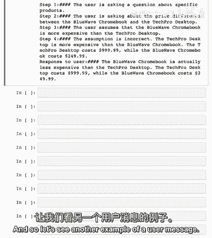

```python
# 示例代码：构建消息数组并获取模型响应
messages = [
    {"role": "system", "content": system_message},
    {"role": "user", "content": f"####{user_message}####"}
]
response = get_completion_from_messages(messages)
print(response)
```

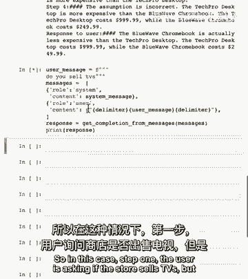

模型会逐步推理：
*   步骤一：用户正在询问关于特定产品的信息。
*   步骤二：确定两款产品均在列表中。
*   步骤三：用户假设蓝色波浪Chromebook比Tech Pro台式机更贵。
*   步骤四：这个假设不正确。
*   步骤五：最终响应是礼貌地纠正用户，并提供正确的价格信息。

## 处理模型输出：向用户隐藏推理过程 🔧

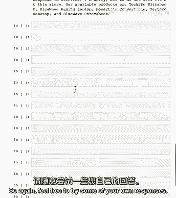

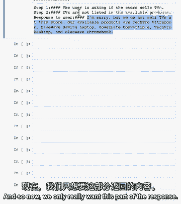

现在我们只需要最终响应的一部分，不想向用户显示早期推理部分。

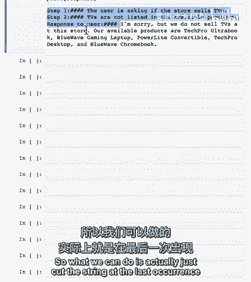

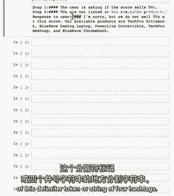

我们可以通过切割字符串，在最后一个分隔符标记（如`####`）处截断，只保留最后一部分作为给用户的响应。

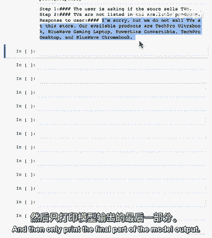

以下是处理输出的代码示例：

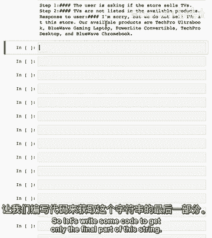


```python
try:
    # 按分隔符分割字符串，并获取最后一项
    final_response = response.split("####")[-1].strip()
except Exception as e:
    # 优雅地处理错误，例如模型输出未按预期格式
    final_response = "抱歉，我正在遇到麻烦，请尝试问另一个问题。"

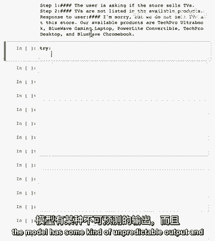

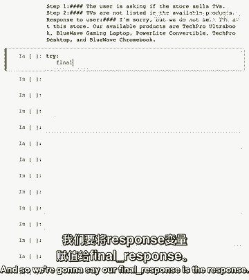

print(final_response)
```

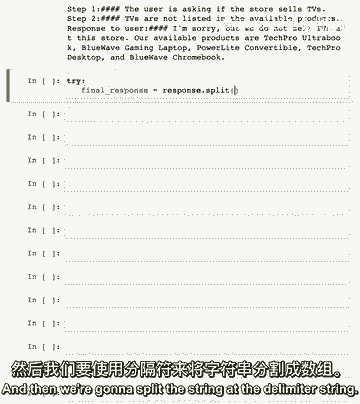

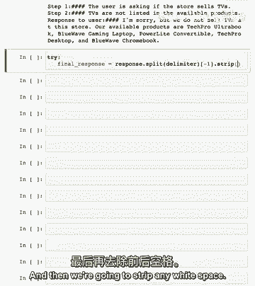

这样，我们就只向用户展示了模型的最终结论，隐藏了中间的推理步骤。

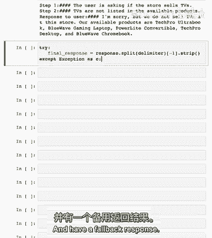

## 提示设计的权衡与实验 🧪

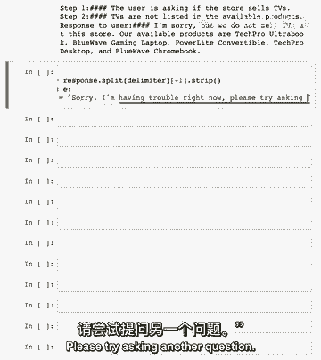

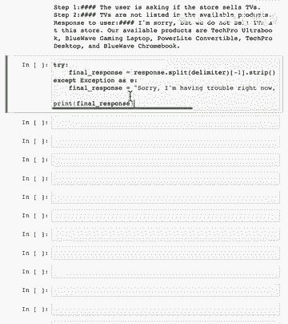

总体上，我想指出此提示可能稍微复杂。您可能实际上不需要所有这些中间步骤。那么为什么不试试看，您是否可以找到更简单的方法来完成相同的任务？通常，在提示复杂性中找到最佳权衡需要一些实验。所以绝对好，尝试多个不同的提示，然后再决定使用哪一个。

---

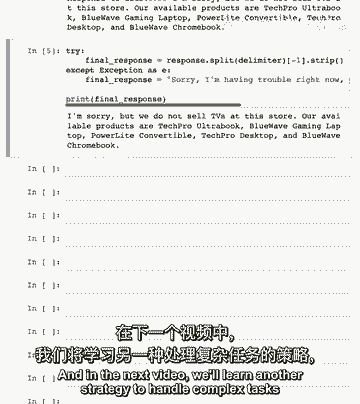

本节课中我们一起学习了“思考链推理”策略。我们了解了如何通过引导模型进行多步思考来提升答案的准确性，并学会了使用“独白”策略向用户隐藏内部推理过程。我们还通过代码示例实践了如何构建提示和处理输出。记住，在实际应用中，不断实验和优化提示是获得最佳效果的关键。

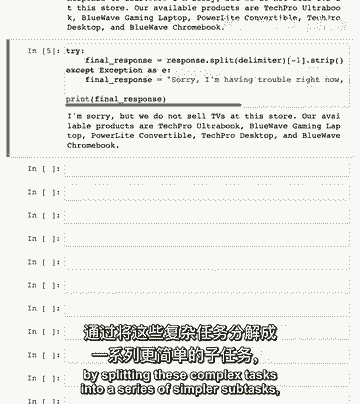

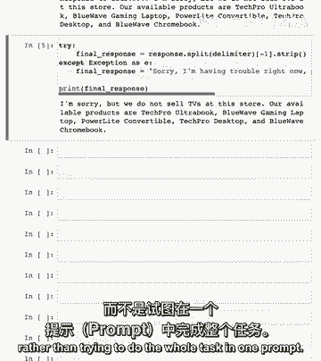

在下一个视频中，我们将学习另一种策略来处理复杂任务，通过将这些复杂任务拆分为一系列简单的子任务。