# 046：链式提示 📚

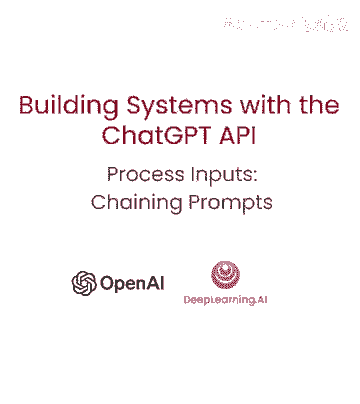

在本节课中，我们将学习如何将复杂的任务拆分为一系列简单的子任务，并通过串联多个提示来完成。我们将探讨这种“链式提示”方法的优势、适用场景，并通过一个具体的客户服务问答示例来演示其实现过程。


---

## 概述

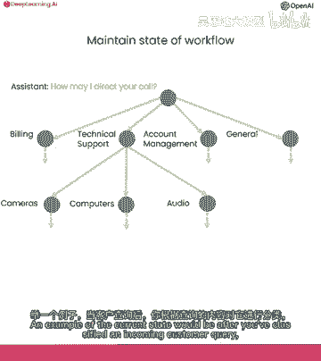

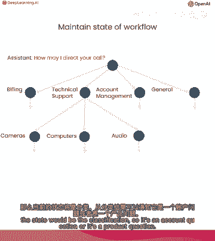

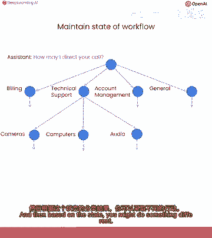

上一节我们介绍了思维链推理。本节中，我们来看看另一种处理复杂任务的方法：链式提示。链式提示的核心思想是将一个复杂的任务分解为多个独立的步骤，每个步骤由一个专门的提示来处理，并将前一步骤的输出作为下一步骤的输入或状态。这种方法类似于模块化编程，可以降低任务复杂度，提高系统的可管理性和可靠性。

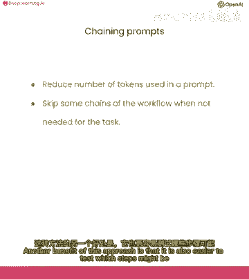

---

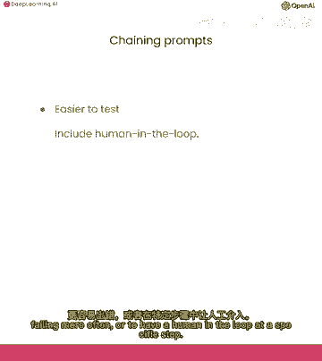


## 为何使用链式提示？🤔

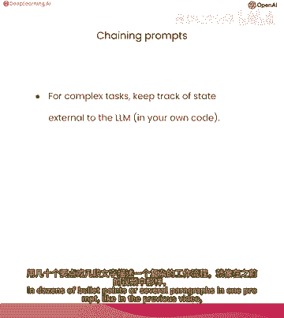


你可能会问，既然高级语言模型擅长遵循复杂指令，为何还要将任务拆分为多个提示？我们可以通过两个类比来理解。


**类比一：烹饪复杂餐点**
*   使用一条冗长复杂的指令，就像试图一次性完成复杂餐点的所有烹饪步骤。你需要同时管理多种食材、烹饪技巧和时间，这很容易出错。
*   链式提示则像分阶段烹饪。你一次只专注于一个部分，确保每个部分都烹饪完美后再进行下一步。这种方法分解了任务的复杂性，使其更易于管理。

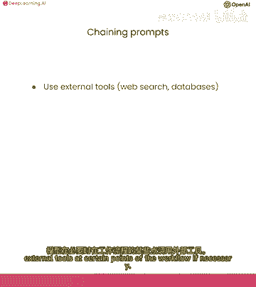

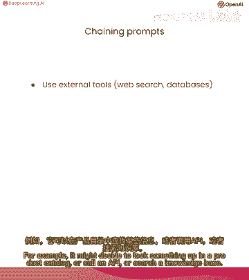

**类比二：代码结构**
*   将所有逻辑写在一个冗长的文件中（“意大利面代码”）会使程序难以理解和调试，因为各部分逻辑之间存在模糊和复杂的依赖关系。
*   将一个复杂的单步任务提交给语言模型也存在类似问题。链式提示则像一个结构良好的模块化程序，每个模块（提示）职责清晰，降低了整体系统的复杂性。

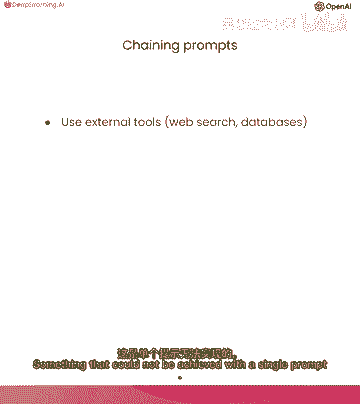

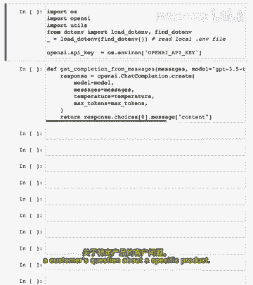

链式提示是一种强大的工作流程策略，它允许系统在任意点维持一个“状态”，并根据当前状态采取不同的行动。

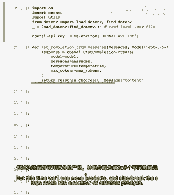

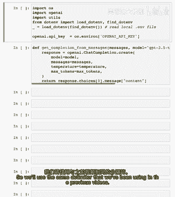

以下是链式提示的主要优势：
*   **降低复杂性**：每个子任务仅包含完成单一任务所需的指令，使系统更易于管理和调试。
*   **减少错误**：确保模型在执行每个步骤时都拥有所需的全部信息。
*   **控制成本**：更长的提示包含更多标记（Token），运行成本更高。拆分提示可以避免不必要的长上下文。
*   **便于测试与干预**：更容易定位哪个步骤更容易失败，并可以在特定步骤中方便地引入人工审核或外部工具调用。
*   **支持外部工具集成**：可以在流程的特定节点调用API、查询数据库或使用其他外部工具，这是单一提示难以实现的。

总的来说，当一个任务包含许多可能适用于任何给定情况的不同指令，使得模型难以推理该做什么时，链式提示策略就非常有用。

---

## 实战示例：客户服务问答系统 🛠️

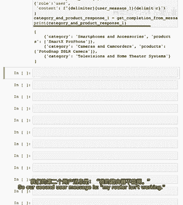

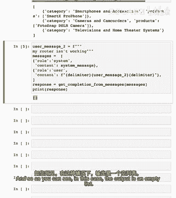

我们将构建一个系统，用于回答客户关于特定产品的疑问。工作流程分为两步：
1.  **识别与分类**：从用户查询中提取提到的产品类别和具体产品。
2.  **信息检索与回答**：根据识别出的信息，从产品目录中查找详细信息，并生成最终回答。

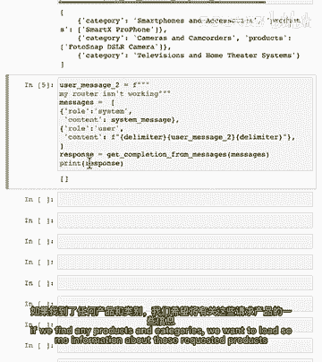

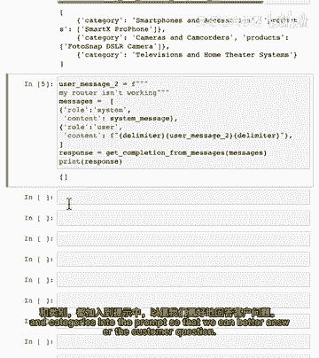

### 第一步：识别查询中的产品与类别

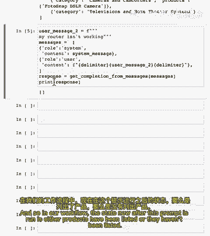

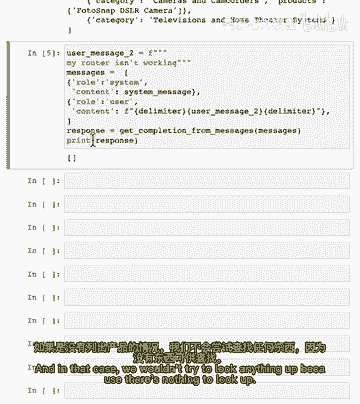

首先，我们定义一个系统提示，要求模型从用户查询中提取结构化的产品信息。

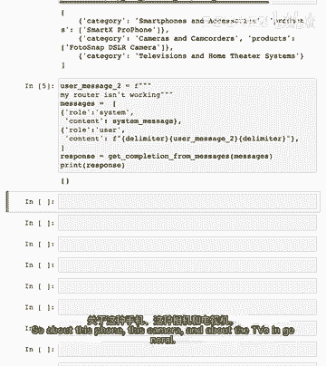

**系统提示内容：**
```
您将收到客户服务查询。
客户服务查询将由井号字符（#）分隔。
输出一个Python列表的对象，其中每个对象具有以下格式：`{‘category’: ‘<类别>’, ‘products’: [‘<产品1>’, ‘<产品2>’]}`。
‘category’必须是预定义类别列表中的一个。
‘products’必须是‘allowed_products’下对应类别中的产品列表。
‘category’和‘products’都必须在客户服务查询中被提及。
如果提到产品，它必须在允许产品列表的正确类别中。
如果没有找到产品或类别，则输出空列表。
只输出对象列表，其他什么都不输出。
```

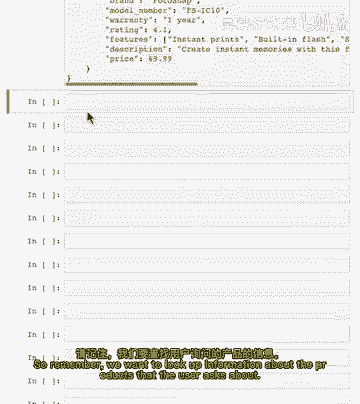

**预定义数据：**
```python
allowed_products = {
    "电脑和笔记本电脑": ["TechPro Ultrabook", "BlueWave Gaming Laptop", "PowerLite Convertible", "TechPro Desktop", "BlueWave Chromebook"],
    "智能手机": ["SmartX ProPhone", "MobiTech PowerCase", "SmartX MiniPhone", "MobiTech Wireless Charger", "SmartX EarBuds"],
    "电视": ["CineView 4K TV", "SoundMax Home Theater", "CineView 8K TV", "SoundMax Soundbar", "CineView OLED TV"],
    "相机": ["FotoSnap DSLR Camera", "ActionCam 4K", "FotoSnap Mirrorless Camera", "ZoomMaster Camcorder", "FotoSnap Instant Camera"]
}
```


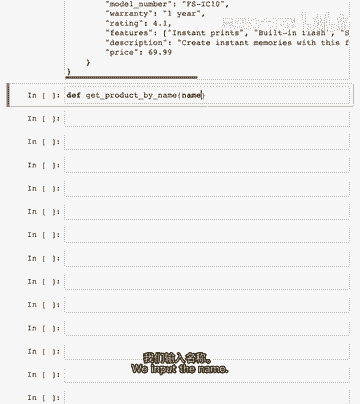

**用户查询示例1：**
`#告诉我关于SmartX ProPhone和FotoSnap DSLR相机，也告诉我关于你们的电视。#`

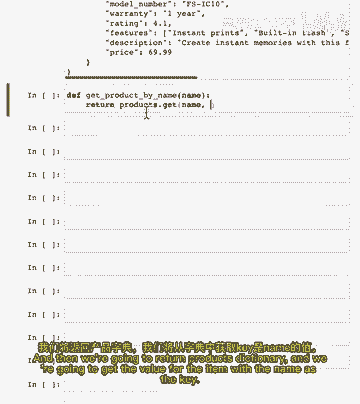

**模型输出：**
```python
[{'category': '智能手机', 'products': ['SmartX ProPhone']}, {'category': '相机', 'products': ['FotoSnap DSLR Camera']}, {'category': '电视', 'products': []}]
```
模型成功识别了具体的手机、相机，并识别出用户询问了“电视”类别，但没有指定具体产品。

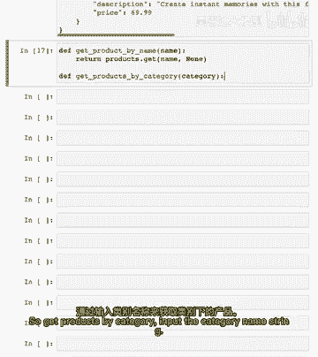

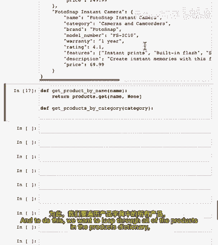

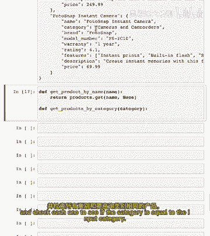

**用户查询示例2：**
`#我的路由器不工作了。#`
由于“路由器”不在预定义列表中，模型输出空列表 `[]`。

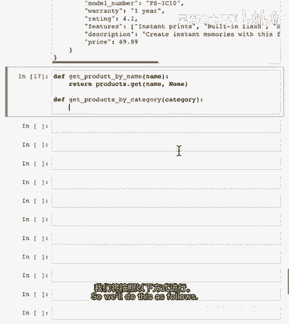

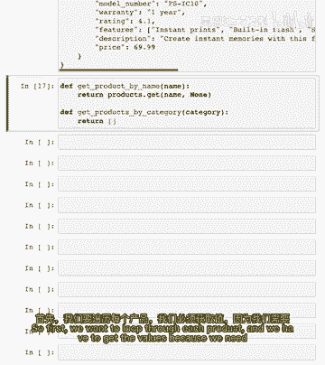

### 第二步：获取产品信息并生成回答

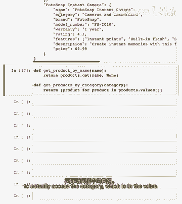

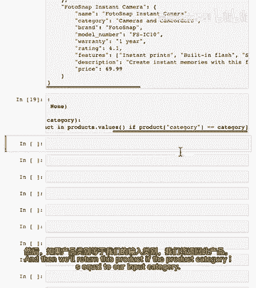

第一步完成后，我们得到了一个结构化的列表。接下来，我们需要根据这个列表中的信息，从产品数据库中查找详细信息。

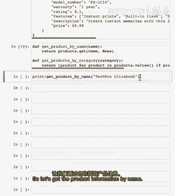

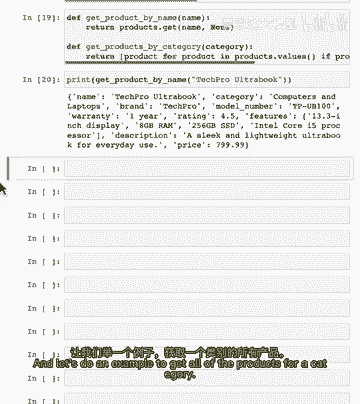

**1. 准备产品数据库**
我们有一个包含详细信息的假想产品目录（由GPT生成）。
```python
product_db = {
    “SmartX ProPhone”: {“name”: “SmartX ProPhone”, “category”: “智能手机”, “brand”: “SmartX”, …},
    “FotoSnap DSLR Camera”: {“name”: “FotoSnap DSLR Camera”, “category”: “相机”, “brand”: “FotoSnap”, …},
    # … 更多产品
}
```

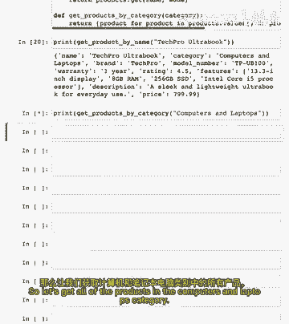


**2. 创建辅助函数**
我们需要辅助函数来按名称查找单个产品，或按类别查找所有产品。
```python
def get_product_by_name(name):
    return product_db.get(name, None)


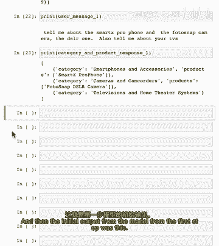

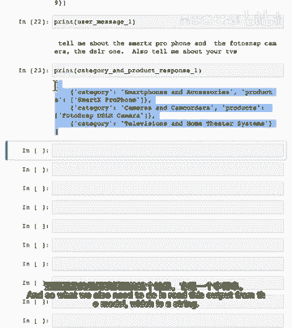

def get_products_by_category(category):
    return [product for product in product_db.values() if product[“category”] == category]
```

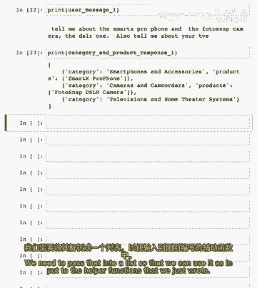

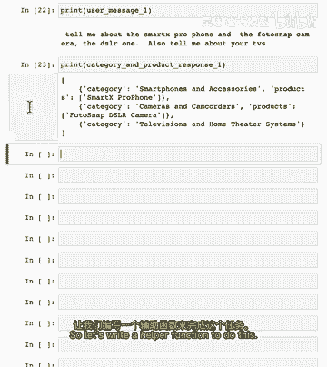

**3. 将模型输出解析为列表**
我们需要将第一步模型输出的字符串解析为Python列表。
```python
import json
def read_string_to_list(input_string):
    if not input_string:
        return []
    try:
        input_string = input_string.replace(“‘”, ‘“‘) # 确保JSON格式
        data = json.loads(input_string)
        return data
    except json.JSONDecodeError:
        print(“解码错误”)
        return []
```

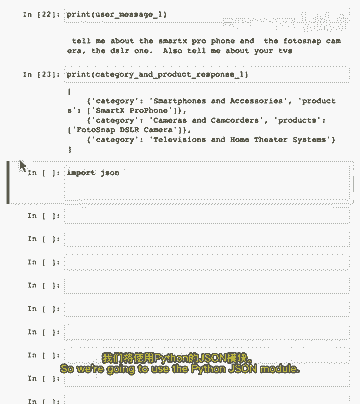

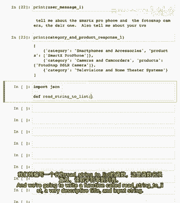

**4. 生成信息摘要字符串**
根据解析出的列表，生成一个包含所有相关产品信息的字符串，用于注入到下一个提示中。
```python
def generate_output_string(data_list):
    output = “”
    for item in data_list:
        category = item.get(“category”)
        products = item.get(“products”)
        if products:
            for product_name in products:
                product = get_product_by_name(product_name)
                if product:
                    output += f“{json.dumps(product, indent=2)}\n”
        elif category:
            category_products = get_products_by_category(category)
            for product in category_products:
                output += f“{json.dumps(product, indent=2)}\n”
    return output
```
对于示例1，这个函数会返回`SmartX ProPhone`、`FotoSnap DSLR Camera`以及所有`电视`类别产品的详细信息字符串。

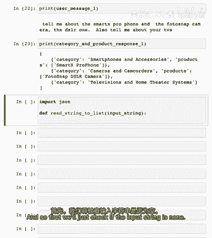

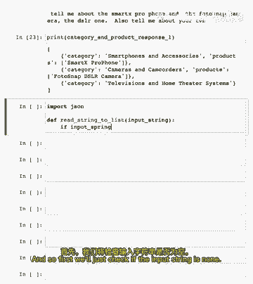

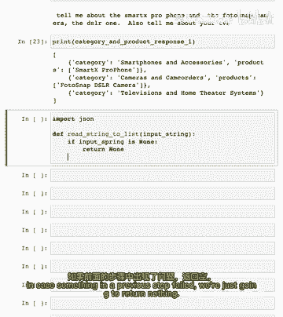

**5. 构建最终回答提示**
现在，我们将初始用户查询、第一步提取的结构化信息以及检索到的产品详情，一起交给模型来生成友好、有帮助的最终回答。

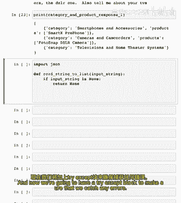

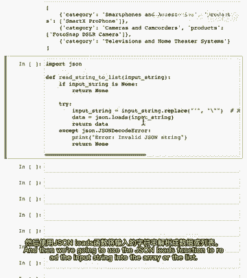

**最终系统提示：**
```
您是大型电子产品店的客服助理。
以友好和有帮助的语气回复。
尽量使用简洁的答案。
确保询问用户相关后续问题。
```

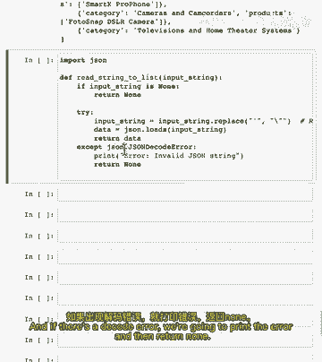

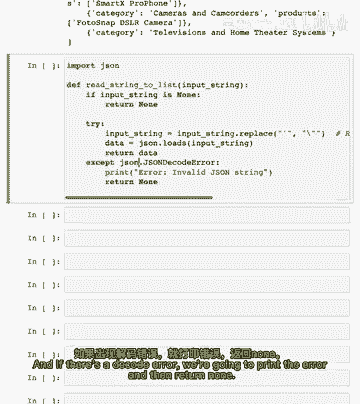

**构建消息序列：**
```python
messages = [
    {“role”: “system”, “content”: final_system_prompt},
    {“role”: “user”, “content”: user_message},
    {“role”: “assistant”, “content”: f“相关产品信息：\n{product_info_string}”} # 注入检索到的信息
]
```

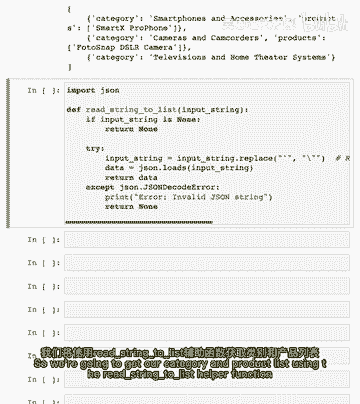

**模型最终回答示例：**
```
当然！我很乐意为您介绍。

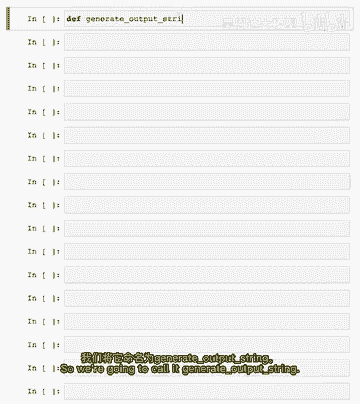

关于 SmartX ProPhone：这是一款高端智能手机，拥有6.1英寸显示屏、128GB存储空间和12MP双摄像头。它支持5G网络，并配备快速充电技术。

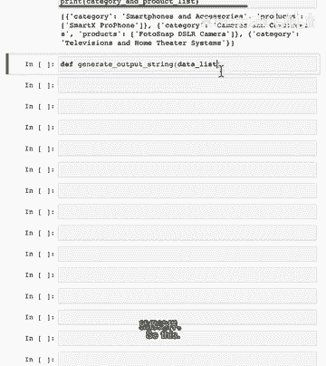

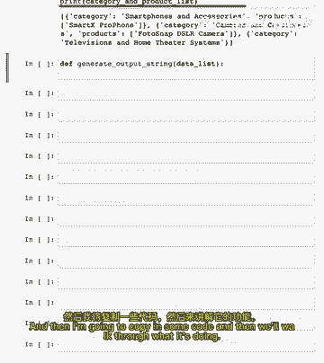

关于 FotoSnap DSLR Camera：这款数码单反相机具有24.2MP传感器、1080p视频录制功能，并附带一个18-55mm镜头套件。非常适合摄影爱好者。

关于我们的电视：我们提供多种电视，例如 CineView 4K TV（55英寸4K显示屏）、CineView 8K TV（高端8K分辨率）以及 CineView OLED TV（色彩鲜艳的OLED屏）。您对哪种特性更感兴趣，比如屏幕尺寸、分辨率或智能功能？


有什么其他问题我可以帮您解答吗？
```
模型利用了提供的产品信息，给出了具体、相关的回答，并提出了后续问题。


---


## 为何要动态检索信息？💡


你可能会想，为什么不把所有产品信息都放在最初的提示里，让模型自己筛选？原因如下：

1.  **降低干扰**：过多的无关信息可能干扰模型的判断。虽然GPT-4等先进模型处理能力很强，但保持上下文简洁总是有益的。
2.  **突破上下文长度限制**：语言模型有固定的上下文窗口（Token数量限制）。如果产品目录非常庞大，可能无法全部放入。
3.  **控制成本**：使用模型的成本与输入输出的Token数量相关。选择性加载所需信息可以显著降低成本。


**核心思想**：将语言模型视为一个推理代理（Agent），它需要必要的上下文来得出结论和执行任务。我们的工作就是动态地为它提供这些上下文。


---


## 扩展：更智能的检索工具 🧠


在我们的例子中，我们通过精确的产品名和类别名进行查找。但在实际应用中，用户可能不会说出确切的产品名。


更先进的方法是使用**文本嵌入（Embeddings）**进行语义搜索：
*   **优势**：允许模糊或语义匹配。即使用户查询是“拍照好的手机”，也能找到`SmartX ProPhone`的相关信息。
*   **原理**：将产品描述和用户查询都转换为向量（嵌入），然后通过计算向量之间的相似度来找到最相关的产品信息。


我们将在后续课程中详细介绍嵌入技术的应用。


---


## 总结


本节课中我们一起学习了链式提示技术。
*   **核心概念**：将复杂任务分解为多个简单、顺序执行的子任务（提示），通过传递状态和信息来串联整个流程。
*   **关键优势**：提升了复杂工作流的可管理性、可靠性和成本效益，并允许集成外部工具。
*   **实战演练**：我们构建了一个两阶段的客户服务系统，演示了如何从用户查询中**识别产品**，然后**动态检索信息**，最后**生成友好回答**。
*   **未来方向**：指出了使用**文本嵌入**进行更智能、更灵活的语义信息检索是增强模型能力的重要方向。


链式提示是构建复杂、可靠AI应用工作流的基石之一。