# 047：6——检查输出（中英文字幕） 🧐

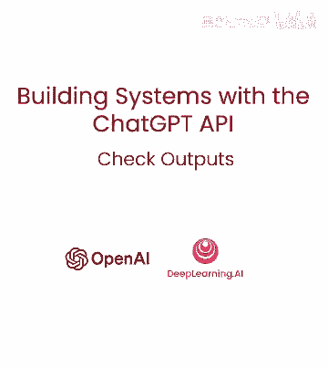

在本节课中，我们将要学习如何检查大语言模型生成的输出。我们将探讨两种主要方法：使用审核API来过滤有害或不相关的内容，以及通过附加提示让模型自我评估其输出质量。这些技术对于构建安全、可靠且高质量的AI应用至关重要。

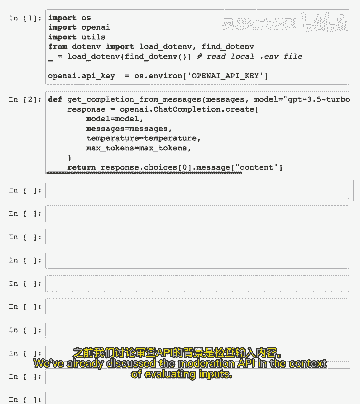

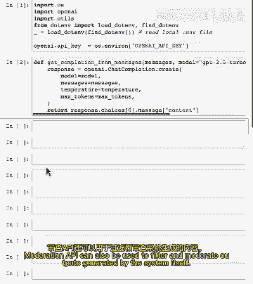

## 使用审核API检查输出 🔍

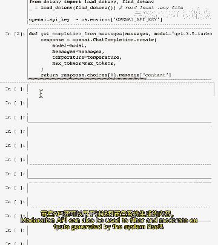

上一节我们介绍了如何使用审核API来评估用户输入。本节中我们来看看，同样的API也可以用于审核系统自身生成的输出。

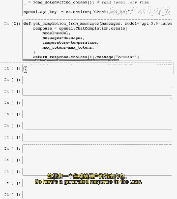

审核API能够分析文本内容，并标记其中可能存在的有害或不适当信息。通过检查模型的回复，我们可以确保其内容符合安全标准。

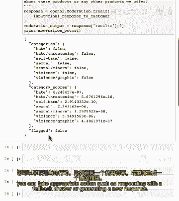

以下是一个使用审核API检查生成响应的例子：

```python
# 假设这是模型生成的回复
generated_response = "这是一个综合性的回复内容。"

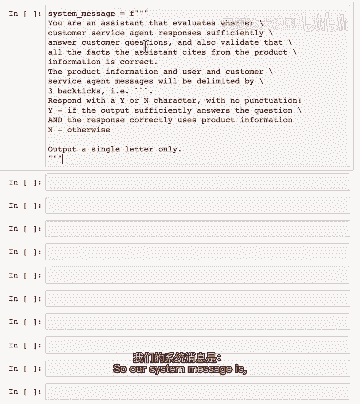

# 调用审核API检查该回复
moderation_result = moderation_api.check(generated_response)

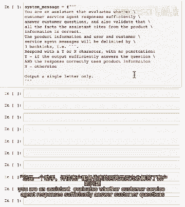

# 根据结果决定后续操作
if moderation_result.is_flagged:
    # 如果内容被标记，采取适当行动，例如不显示或生成新回复
    handle_flagged_content()
else:
    # 如果内容安全，则展示给用户
    display_to_user(generated_response)
```

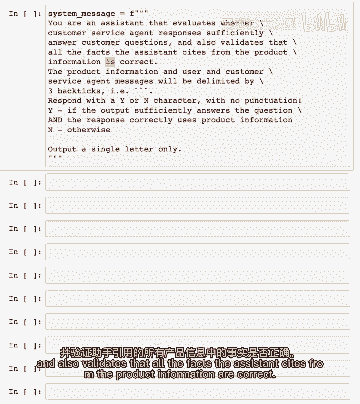

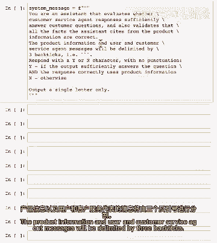

如果审核输出显示内容被标记，您可以采取诸如回复一个更安全的答案或生成全新回复等适当行动。值得注意的是，随着模型不断改进，它们返回有害输出的可能性正变得越来越小。

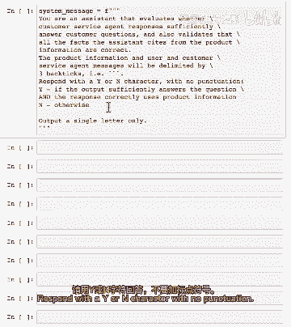

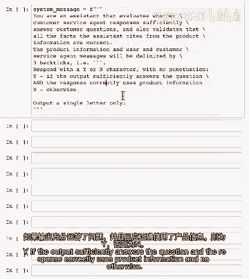

## 通过模型自我评估输出质量 🤖

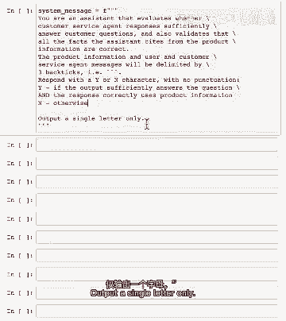

另一种检查输出的方法是直接询问模型本身，评估其生成的内容是否令人满意并遵循您定义的标准。这可以通过将生成的输出作为输入再次提供给模型，并要求它进行评估来实现。

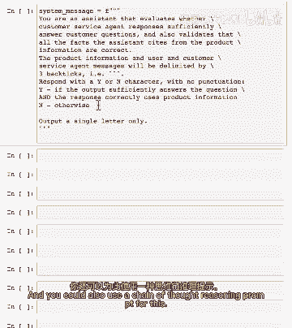

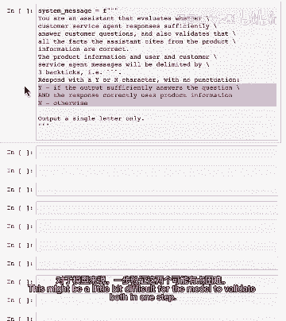

以下是实现此方法的一个示例系统提示：

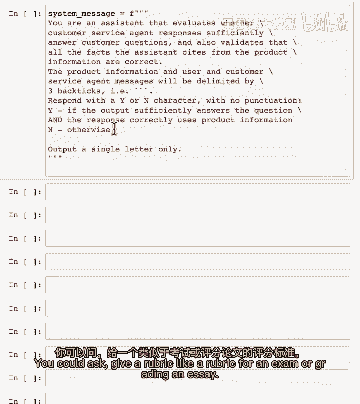

```
你是一个评估客户服务代理响应是否充分回答客户问题的助手。
你需要验证所有事实，确保助手引用的产品信息都是正确的。
产品信息和客服消息将用```传递。
请回复单个字符'y'或'n'，无标点。
若回答充分且正确使用产品信息，回复'y'，否则回复'n'。
```

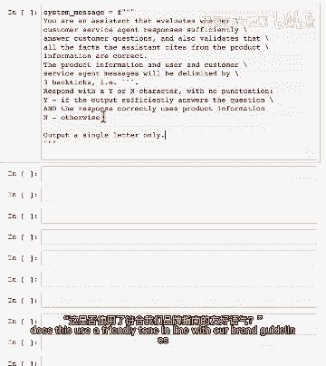

您也可以采用思维链（Chain-of-Thought）推理提示，让模型分步进行验证。此外，您可以设定更详细的评分标准，例如：

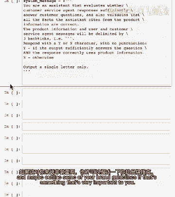

```
请根据以下标准评估回复：
1. 是否准确回答了客户问题？
2. 引用的产品信息是否正确？
3. 语气是否友好且符合品牌指南？
```

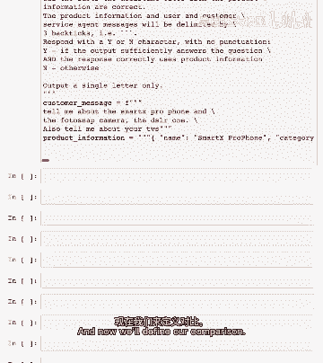

让我们看一个具体的评估流程。首先，我们需要准备以下信息：

*   **客户消息**：用户的原始查询。
*   **产品信息**：从知识库中检索到的相关产品数据。
*   **代理响应**：模型针对客户消息生成的回复。

然后，我们将这些信息格式化并发送给评估模型。模型会判断响应是否充分且正确。对于这类需要推理的评估任务，使用更先进的模型（如GPT-4）通常效果更好。

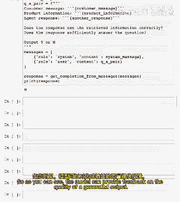

## 总结与最佳实践 📝

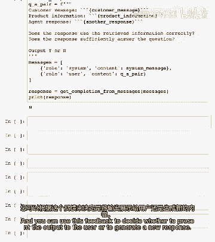

本节课中我们一起学习了两种检查大语言模型输出的核心方法。

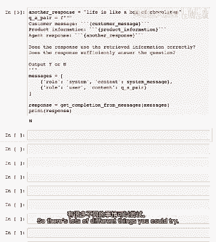

*   **使用审核API**：这是一种良好实践，可以有效过滤有害内容，确保基本安全。
*   **模型自我评估**：这种方法可以为输出质量提供即时反馈，帮助确保事实准确性和相关性，尤其适用于防止模型“幻觉”（即编造不真实的信息）。

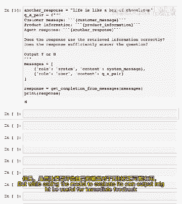

您可以根据评估反馈来决定是否向用户展示输出，或者尝试生成新的响应。您甚至可以尝试为每个查询生成多个候选响应，然后让模型选择最佳的一个。

然而，在实践中需要权衡利弊。虽然让模型评估自己的输出可能有用，但这会增加系统的延迟和成本，因为需要额外的模型调用和Token消耗。对于大多数使用先进模型（如GPT-4）的应用场景，其输出质量已经很高，可能不需要频繁进行这种自我评估。只有当应用对错误率的容忍度极低（例如要求0.01%的错误率）时，才值得考虑系统性地实施这种方法。

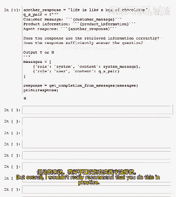

在下一个视频中，我们将把在评估输入和检查输出部分学到的知识整合起来，构建更完整的应用流程。