# 048：7——构建一个端到端的系统 🏗️

在本节课中，我们将整合前面视频所学的知识，创建一个客户服务助手的端到端示例。我们将按照一个清晰的流程来构建这个系统，涵盖从输入审核到最终响应的完整步骤。

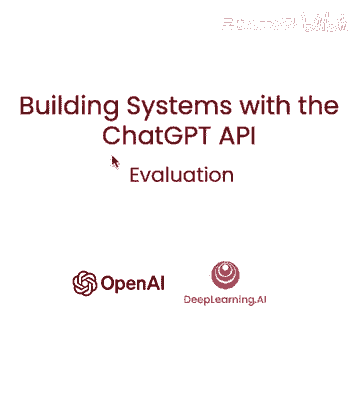

---

## 概述 📋

我们将构建一个客户服务助手，其核心流程包含以下步骤：
1.  检查用户输入是否触发内容审核。
2.  从输入中提取产品列表。
3.  根据提取的产品进行信息检索。
4.  使用大语言模型生成回答。
5.  对生成的回答进行最终审核。

接下来，我们将详细讲解每个步骤的实现。

---

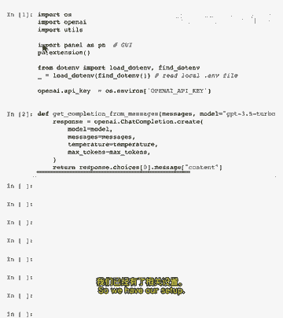

## 系统流程与实现

上一节我们概述了系统的整体流程，本节中我们来看看具体的代码实现和每一步的作用。

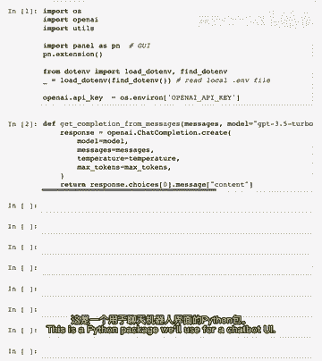

首先，我们需要进行一些环境设置和包导入。


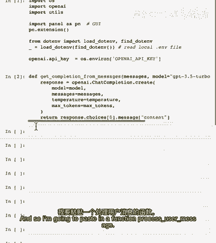

以下是必要的导入，其中包括一个用于构建聊天机器人用户界面的Python包。

```python
# 示例导入（根据实际包名调整）
import streamlit as st
from langchain.chains import LLMChain
from langchain.llms import OpenAI
# ... 其他必要的导入
```

---

### 核心处理函数

我们将定义一个核心函数 `process_user_message` 来处理用户输入。在深入分析代码之前，我们先运行一个示例来观察其效果。

我们使用一个示例用户输入：“告诉我关于智能手机，相机也告诉我关于电视”。

运行函数后，我们可以看到系统按步骤处理问题：
1.  **审核步骤**：检查输入是否合规。
2.  **提取产品列表**：识别出“智能手机”、“相机”、“电视”。
3.  **查看产品信息**：检索这些产品的相关信息。
4.  **生成回答**：模型基于检索到的信息尝试回答问题。
5.  **最终审核**：对生成的响应进行安全审核，确保可以安全地展示给用户。

最终，我们得到了一个熟悉的响应结果。

---

### 函数逻辑详解

现在，让我们详细讨论 `process_user_message` 函数内部发生的事。该函数接收两个参数：`user_input`（当前用户消息）和 `all_messages`（所有消息的数组，用于构建聊天上下文）。

以下是该函数的主要逻辑步骤：

1.  **输入审核**：
    *   首先检查用户输入是否触发内容审核API。这一步我们在前面的课程中已经覆盖。
    *   如果输入被标记为不合规，则直接告知用户无法处理该请求。

2.  **产品提取**：
    *   如果输入通过审核，则尝试从中提取产品列表。我们使用之前视频中学习的技术来实现。


3.  **信息检索**：
    *   尝试查找提取到的产品信息。如果未找到任何产品，则返回一个空字符串。

4.  **生成回答**：
    *   结合对话历史和相关检索到的信息，构造新的提示消息给大语言模型，并获取响应。

5.  **输出审核**：
    *   将模型生成的响应再次通过审核API进行检查。
    *   如果响应被标记，则告知用户“无法提供此信息，让我为您转接人工客服”等后续步骤。
    *   如果通过审核，则将响应返回给用户。

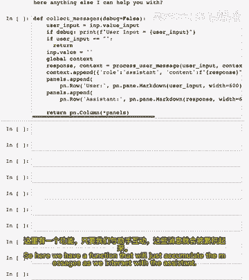

---

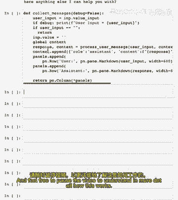

## 整合用户界面

接下来，我们将上述逻辑与一个美观的用户界面进行整合，以实现完整的对话体验。

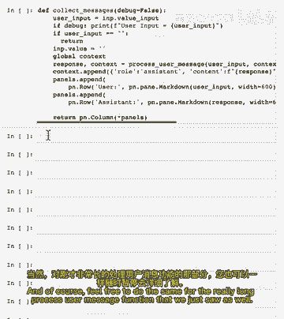


我们需要一个函数来累积和管理对话过程中的所有消息。您可以暂停视频，仔细查看以下代码片段以了解其工作原理。


同样，也建议您回顾之前那个较长的 `process_user_message` 函数，以理解整个处理流程。

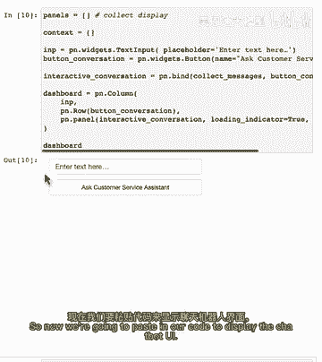


现在，我们粘贴用于展示聊天机器人界面的代码。

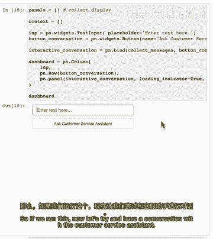


```python
# 示例UI代码框架
st.title("客户服务助手")
if "messages" not in st.session_state:
    st.session_state.messages = []

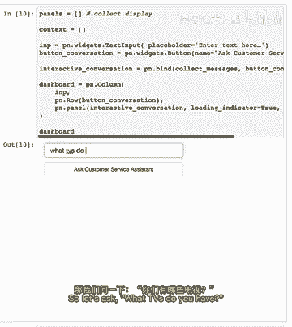

for message in st.session_state.messages:
    with st.chat_message(message["role"]):
        st.markdown(message["content"])

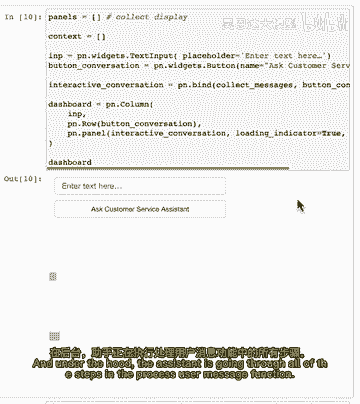

if prompt := st.chat_input("请问有什么可以帮您？"):
    st.session_state.messages.append({"role": "user", "content": prompt})
    with st.chat_message("user"):
        st.markdown(prompt)

    # 调用处理函数
    response = process_user_message(prompt, st.session_state.messages)
    st.session_state.messages.append({"role": "assistant", "content": response})
    with st.chat_message("assistant"):
        st.markdown(response)
```

运行此代码后，让我们尝试与客户服务助手进行对话。

---

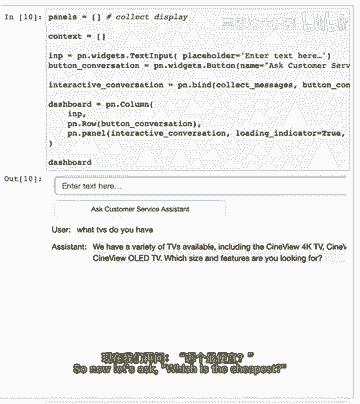

### 对话示例

*   **用户提问**：“你们有哪些电视？”
    
    *   **助手响应**：在后台，助手通过 `process_user_message` 函数执行所有处理步骤，然后列出各种不同的电视型号。

*   **用户追问**：“哪个最便宜？”
    
    *   **助手响应**：系统再次执行所有步骤，但此次会将对话历史也作为上下文传递给模型。它回答：“扬声器是最便宜的电视相关产品”。（注：此处响应可能基于特定数据集）

*   **用户继续问**：“最贵的呢？”
    
    *   **助手响应**：“最昂贵的电视是Synerview 8K电视。”

*   **用户要求**：“告诉我更多关于它。”
    
    *   **助手响应**：提供关于这台电视的更详细信息。

---

## 总结 🎯

本节课中，我们一起学习了如何构建一个端到端的客户服务助手系统。我们整合了本课程中学到的多项关键技术：
*   使用**审核API**确保输入输出的安全性。
*   运用**提示工程**从用户输入中提取结构化信息（产品列表）。
*   利用**检索增强生成（RAG）** 模型查找产品信息。
*   通过**大语言模型**结合上下文生成自然、准确的回答。
*   将所有步骤串联成一个**自动化流程**，并配备了**交互式用户界面**。

通过这个示例，您可以看到如何通过组合不同的模块（评估、处理、检索、生成、检查）来创建一个功能全面的AI系统。您可以通过优化每个步骤的提示、调整检索方法或精简流程来持续提升系统的整体性能。